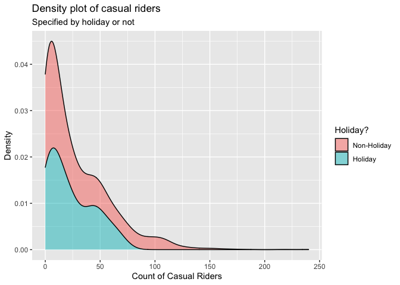

ST558 - Project 2
================
Group 5: Tyler Pollard & Lucy Yin

-   [Required Packages](#required-packages)
-   [Introduction](#introduction)
-   [Data](#data)
-   [Summarization](#summarization)
    -   [Contingency Tables](#contingency-tables)
        -   [Weather Situation](#weather-situation)
        -   [Year, Season and Count of
            Riders](#year-season-and-count-of-riders)
        -   [Working Day and Count of Casual
            Riders](#working-day-and-count-of-casual-riders)
    -   [Summary Tables](#summary-tables)
        -   [Feeling Temperature](#feeling-temperature)
        -   [Humidity](#humidity)
        -   [Wind Speed](#wind-speed)
    -   [Histograms](#histograms)
        -   [Humidity and Windspeed
            Distributions](#humidity-and-windspeed-distributions)
    -   [Density Plot](#density-plot)
        -   [Casual Riders and Weather
            Situation](#casual-riders-and-weather-situation)
        -   [Registered Riders and Weather
            Situation](#registered-riders-and-weather-situation)
        -   [Total Riders and Weather
            Situation](#total-riders-and-weather-situation)
        -   [Casual Riders and Holiday](#casual-riders-and-holiday)
        -   [Registered Riders and
            Holiday](#registered-riders-and-holiday)
        -   [Total Riders and Holiday](#total-riders-and-holiday)
    -   [Boxplots](#boxplots)
        -   [Feeling Temperature Over the
            Year](#feeling-temperature-over-the-year)
        -   [Riders of Every Hour and Weather
            Situation](#riders-of-every-hour-and-weather-situation)
    -   [Scatter Plots](#scatter-plots)
        -   [Count vs Casual by Season](#count-vs-casual-by-season)
        -   [Riders vs Temperature](#riders-vs-temperature)
        -   [Riders vs. Hour vs. Month vs. Working
            Day](#riders-vs-hour-vs-month-vs-working-day)
    -   [Correlation Plot](#correlation-plot)
        -   [Correlation between temp, atemp, hum,
            windspeed](#correlation-between-temp-atemp-hum-windspeed)
    -   [Plots with GGally](#plots-with-ggally)
        -   [Using Day Data](#using-day-data)
        -   [Using Hour Data](#using-hour-data)
-   [Modeling](#modeling)
    -   [Linear Regression Model](#linear-regression-model)
        -   [What is Linear Regression
            Model](#what-is-linear-regression-model)
        -   [Picking predictors using
            AIC](#picking-predictors-using-aic)
        -   [Modeling using AIC picked
            predictor](#modeling-using-aic-picked-predictor)
    -   [Ensemble Tree Model](#ensemble-tree-model)
        -   [Random Forest Model](#random-forest-model)
        -   [Boosted Tree Model](#boosted-tree-model)
-   [Comparison](#comparison)

# Required Packages

# Introduction

For this report we will be using 6 models (4 linear regression, 1 random
forest model, 1 boosted tree model) to make predictions on the total
count of bike riders using data from the Bike Sharing Dataset (dataset
can be found
[here](https://archive.ics.uci.edu/ml/datasets/Bike+Sharing+Dataset)).
This dataset contains hourly and daily count of registered, casual, and
total sum of riders in the Capital bikeshare system, contributing
variables include:

-   season (winter, spring, summer, fall)  
-   year (2011, 2012)  
-   month of the year
-   hour of the day  
-   holiday (yes, no)  
-   day of the week  
-   working day (yes or no)  
-   weather situation (mostly clear, mist, light precipitation, heavy
    precipitation)  
-   temperature  
-   feeling temperature  
-   humidity  
-   wind speed

There are 3 different types of response variables in the dataset:

-   registered: registered riders who uses this bikeshare service
    regularly  
-   casual: un-registered riders who use this service casually or on
    occasions  
-   total: combined count of registered and casual riders

For our analysis, we will be working with almost all of the variables as
predictors, and our response variable will be the total count of bike
riders.

We will be selecting predictors using the `step()` function which
chooses a model by AIC in a stepwise algorithm. As a result, which
predictors we incorporate in our linear regression models and ensemble
tree (specifically random forest and boosted tree) models may differ
depending on which day of the week we look at. We’ll randomly split the
data into training and test sets and fit the 6 models on the training
set. Ultimately we will fit the 6 models on the test set and decide on
which model produced the best prediction, which we judge by the smallest
root mean squared error value.

# Data

First we will read in both the `hours.csv` and `day.csv` data.

``` r
# read in data
hour.data <- read_csv("data/hour.csv") %>% as_tibble()
day.data <- read_csv("data/day.csv") %>% as_tibble()
```

We will make corrections on variable types, specifically we’re making
sure categorical variables will be appropriately classified as factors
with clear levels.

``` r
# correct the variable types
hour.data$season <- factor(hour.data$season)
levels(hour.data$season) <- list(winter = 1, spring = 2, summer = 3, fall = 4)

hour.data$yr <- factor(hour.data$yr)
levels(hour.data$yr) <- list("2011" = 0, "2012" = 1)

hour.data$weekday <- factor(hour.data$weekday)
levels(hour.data$weekday) <- list(monday = 1, tuesday = 2, wednesday = 3, thursday = 4, friday = 5, saturday = 6, sunday = 0)

hour.data$mnth <- factor(hour.data$mnth)
hour.data$hr <- factor(hour.data$hr)
hour.data$holiday <- factor(hour.data$holiday)
hour.data$workingday <- factor(hour.data$workingday)
hour.data$weathersit <- factor(hour.data$weathersit)

day.data$season <- factor(day.data$season)
levels(day.data$season) <- list(winter = 1, spring = 2, summer = 3, fall = 4)

day.data$yr <- factor(day.data$yr)
levels(day.data$yr) <- list("2011" = 0, "2012" = 1)

day.data$weekday <- factor(day.data$weekday)
levels(day.data$weekday) <- list(monday = 1, tuesday = 2, wednesday = 3, thursday = 4, friday = 5, saturday = 6, sunday = 0)

day.data$mnth <- factor(day.data$mnth)
day.data$holiday <- factor(day.data$holiday)
day.data$workingday <- factor(day.data$workingday)
day.data$weathersit <- factor(day.data$weathersit)
```

Because the variables temperature, feeling temperature, humidity and
windspeed are normalized according to different measures, we will
un-normalize them and save the raw values as separate columns in the
dataset.

``` r
# Temp Unnormal
temp.tmin = -8
temp.tmax = 39
hour.data$temp.unnormal <- hour.data$temp*(temp.tmax - temp.tmin) + temp.tmin # Unnormalize temp
hour.data$temp.F <- hour.data$temp.unnormal*(9/5) + 32 # Convert to Fahrenheit
day.data$temp.unnormal <- hour.data %>% group_by(dteday) %>% summarise(mean = mean(temp.unnormal)) %>% select(mean)
day.data$temp.unnormal <- day.data$temp.unnormal[[1]]
day.data$temp.F <- hour.data %>% group_by(dteday) %>% summarise(mean = mean(temp.F)) %>% select(mean)
day.data$temp.F <- day.data$temp.F[[1]]

# Atemp Unnormal
atemp.tmin = -16
atemp.tmax = 50
hour.data$atemp.unnormal <- hour.data$atemp*(atemp.tmax - atemp.tmin) + atemp.tmin # Unnormalize atemps
hour.data$atemp.F <- hour.data$atemp.unnormal*(9/5) + 32 # Convert to Fahrenheit
day.data$atemp.unnormal <- hour.data %>% group_by(dteday) %>% summarise(mean = mean(atemp.unnormal)) %>% select(mean)
day.data$atemp.unnormal <- day.data$atemp.unnormal[[1]]
day.data$atemp.F <- hour.data %>% group_by(dteday) %>% summarise(mean = mean(atemp.F)) %>% select(mean)
day.data$atemp.F <- day.data$atemp.F[[1]]

# Humidity Unnormal
day.data$hum.unnormal <- day.data$hum * 100
hour.data$hum.unnormal <- hour.data$hum * 100

# Windspeed Unnormal
day.data$windspeed.unnormal <- day.data$windspeed * 67
hour.data$windspeed.unnormal <- hour.data$windspeed * 67
```

Because hour and day data are stored separately, we create a
`total.data` table with all the information combined just in case we
need to access this in later steps.

``` r
# add in a new variable before merging
hour.data <- mutate(hour.data, type = "hour")
day.data <- mutate(day.data, type = "day", hr = NA) %>% select(instant, dteday, season, yr, mnth, hr, everything())

# merge to create complete list of hour/day data
total.data <- rbind(hour.data, day.data)
```

We will filter to only include data from one specific day of the week at
a time.

``` r
# filter out to one specific day of the week
hour.data <- hour.data %>% filter(weekday == params$weekday)
day.data <- day.data %>% filter(weekday == params$weekday)
total.data <- total.data %>% filter(weekday == params$weekday)
```

We randomly sample from the filtered data to form a training set (with
70% of data) and test set (with the remaining 30% of data). Here we
randomly sampled from the day dataset and split it into training and
test sets, then we split the corresponding data from the hours dataset
according to which days are in the training set and which days are in
the test set. We will be using the hours dataset for our modeling, but
we wanted to make sure our day and hour datasets had matching training
and test splits.

``` r
# splitting data into training & test sets
set.seed(7)
train <- sample(1:nrow(day.data), size = nrow(day.data)*0.7)
test <- dplyr::setdiff(1:nrow(day.data), train)
day.training.data <- day.data[train, ]
day.test.data <- day.data[test, ]

hour.training.data <- hour.data[hour.data$dteday %in% day.training.data$dteday,]
hour.test.data <- hour.data[hour.data$dteday %in% day.test.data$dteday,]
```

# Summarization

We have some basic summary statistics and plots about our training data.

## Contingency Tables

### Weather Situation

Below is a contingency table that shows the count of days that fall into
the different categories of weather situation. This table will help
justify the total count of riders because it can be expected that the
number of casual riders, which influences the total count of riders,
will be higher on nicer days that fall into the first two categories of
Mostly clear and Mist.

``` r
levels(day.training.data$weathersit) <- list(
  "Mostly clear" = "1",
  "Mist" = "2",
  "Light precipitation" = "3",
  "Heavy precipitation" = "4")
kable(t(table(day.training.data$weathersit)))
```

| Mostly clear | Mist | Light precipitation | Heavy precipitation |
|-------------:|-----:|--------------------:|--------------------:|
|           49 |   23 |                   0 |                   0 |

### Year, Season and Count of Riders

These contingency tables show what count range of riders utilized the
bikeshare service for a given season or for a given year. This table can
help us see if the number of riders increased/decreased from 2011 to
2012, or if season has an effect on how many riders used the bikeshare
service.

``` r
kable(table(day.training.data$season, cut(day.training.data$cnt, breaks = 2, dig.lab = 10)), caption = "Occurrences of # Range of Riders of a given Season")
```

|        | (1160,4667\] | (4667,8174\] |
|:-------|-------------:|-------------:|
| winter |           15 |            0 |
| spring |            6 |           12 |
| summer |            4 |           16 |
| fall   |            9 |           10 |

Occurrences of # Range of Riders of a given Season

``` r
kable(table(day.training.data$yr, cut(day.training.data$cnt, breaks = 2, dig.lab = 10)), caption = "Occurrences of # Range of Riders of a given Year")
```

|      | (1160,4667\] | (4667,8174\] |
|:-----|-------------:|-------------:|
| 2011 |           27 |            9 |
| 2012 |            7 |           29 |

Occurrences of # Range of Riders of a given Year

### Working Day and Count of Casual Riders

This contingency table show what count range of casual riders utilized
the bikeshare service on working day versus non-working day. Intuitively
we’d suspect that there would more casual riders on non-working day than
working day, this table can show us whether it’s true or not.

``` r
levels(day.training.data$workingday) <- list("workday" = 1, "non-workday" = 0)
kable(table(day.training.data$workingday, cut(day.training.data$casual, breaks = 2, dig.lab = 10)), caption = "Occurrences of # Range of Casual Riders of Workday vs. non-Workday")
```

|             | (36.231,922.5\] | (922.5,1808.769\] |
|:------------|----------------:|------------------:|
| workday     |              44 |                26 |
| non-workday |               2 |                 0 |

Occurrences of # Range of Casual Riders of Workday vs. non-Workday

## Summary Tables

### Feeling Temperature

The summary tables of feeling temperature show the 5 number summary
along with the mean and standard deviation of what the temperature
actually felt like over the different years. The summary table for both
the normalized and raw feeling temperatures are provided. These tables
give insight to the range of feeling temperatures felt by the riders for
the different years.

``` r
# Normalized feeling temperature
atemp.summary <- hour.training.data %>% group_by(yr) %>% summarise(Min. = min(atemp), `1st Qu.` = quantile(atemp,0.25), Median = median(atemp), Mean = mean(atemp), `3rd Qu.` = quantile(atemp, 0.75), Max. = max(atemp), `St. Dev.` = sd(atemp))
kable(atemp.summary, digits = 2, caption = "Summary of feeling temperatures by year")
```

| yr   | Min. | 1st Qu. | Median | Mean | 3rd Qu. | Max. | St. Dev. |
|:-----|-----:|--------:|-------:|-----:|--------:|-----:|---------:|
| 2011 | 0.03 |    0.30 |   0.45 | 0.46 |    0.62 | 1.00 |     0.19 |
| 2012 | 0.18 |    0.35 |   0.52 | 0.50 |    0.64 | 0.92 |     0.17 |

Summary of feeling temperatures by year

``` r
# Raw feeling temperature in Fahrenheit
atemp.summary.unnormal <- hour.training.data %>% group_by(yr) %>% summarise(Min. = min(atemp.F), `1st Qu.` = quantile(atemp.F,0.25), Median = median(atemp.F), Mean = mean(atemp.F), `3rd Qu.` = quantile(atemp.F, 0.75), Max. = max(atemp.F), `St. Dev.` = sd(atemp.F))
kable(atemp.summary.unnormal, digits = 2, caption = "Summary of raw feeling temperatures by year")
```

| yr   | Min. | 1st Qu. | Median |  Mean | 3rd Qu. |   Max. | St. Dev. |
|:-----|-----:|--------:|-------:|------:|--------:|-------:|---------:|
| 2011 |  6.8 |    39.2 |  57.19 | 57.93 |    77.0 | 122.00 |    22.21 |
| 2012 | 24.8 |    44.6 |  64.41 | 62.72 |    78.8 | 112.99 |    19.68 |

Summary of raw feeling temperatures by year

### Humidity

These summary tables show the spread of normalized and raw humidity
values. The table includes the 5 number summary along with mean and
standard deviation, which gives insight to the range of humidity levels
riders experienced.

``` r
kable(t(c(summary(day.training.data$hum), St.Dev. = sd(day.training.data$hum))), digits = 2, caption = "Summary of Normalized Humidity")
```

| Min. | 1st Qu. | Median | Mean | 3rd Qu. | Max. | St.Dev. |
|-----:|--------:|-------:|-----:|--------:|-----:|--------:|
| 0.35 |    0.52 |   0.61 | 0.61 |     0.7 | 0.97 |    0.13 |

Summary of Normalized Humidity

``` r
kable(t(c(summary(day.training.data$hum.unnormal), St.Dev. = sd(day.training.data$hum.unnormal))), digits = 2, caption = "Summary of Raw Humidity")  
```

|  Min. | 1st Qu. | Median |  Mean | 3rd Qu. |  Max. | St.Dev. |
|------:|--------:|-------:|------:|--------:|------:|--------:|
| 35.42 |   52.43 |     61 | 60.93 |    69.9 | 97.25 |   12.88 |

Summary of Raw Humidity

### Wind Speed

These summary tables show the spread of normalized and raw wind speeds.
The table includes the 5 number summary along with mean and standard
deviation, which gives insight to the range of wind speeds riders
experienced.

``` r
kable(t(c(summary(day.training.data$windspeed), St.Dev. = sd(day.training.data$windspeed))), digits = 2, caption = "Summary of Normalized Wind Speed")
```

| Min. | 1st Qu. | Median | Mean | 3rd Qu. | Max. | St.Dev. |
|-----:|--------:|-------:|-----:|--------:|-----:|--------:|
| 0.02 |    0.13 |   0.17 | 0.19 |    0.23 | 0.41 |    0.08 |

Summary of Normalized Wind Speed

``` r
kable(t(c(summary(day.training.data$windspeed.unnormal), St.Dev. = sd(day.training.data$windspeed.unnormal))), digits = 2, caption = "Summary of Raw Wind Speed ")
```

| Min. | 1st Qu. | Median |  Mean | 3rd Qu. |  Max. | St.Dev. |
|-----:|--------:|-------:|------:|--------:|------:|--------:|
|  1.5 |     8.7 |  11.27 | 12.57 |   15.48 | 27.79 |    5.57 |

Summary of Raw Wind Speed

## Histograms

### Humidity and Windspeed Distributions

The following density plots show the distribution of the weather effects
for raw humidity and raw wind speed over the span of the biker data.
These distributions provide insight on what values for each weather
effect can be expected and how the combination of each effect may drive
the different weather situations and in turn the expected count of
riders.

``` r
hum.histogram <- ggplot(data = day.training.data, aes(x = hum.unnormal)) + 
  geom_histogram(aes(y = ..density..), bins = 30) + 
  geom_density(color = "red", size = 2) + 
  labs(title = "Humidity Distribution", x = "Raw Humidity", y = "Density")
windspeed.histogram <- ggplot(data = day.training.data, aes(x = windspeed.unnormal)) + 
  geom_histogram(aes(y = ..density..), bins = 30) + 
  geom_density(color = "red", size = 2) + 
  labs(title = "Windspeed Distribution", x = "Raw Windspeed", y = "Density")
grid.arrange(hum.histogram, windspeed.histogram, ncol = 2, top = "Density Distribution of Weather Effects")
```

<!-- -->

## Density Plot

### Casual Riders and Weather Situation

This density plot shows the amount of casual riders in a given weather
situation. Intuitively we suspect that there would more casual riders in
better weather conditions. This density plot can show us whether or not
this is true.

``` r
ggplot(hour.training.data, aes(x = casual)) + 
  geom_density(alpha = 0.5, position = "stack", aes(fill = weathersit)) + 
  labs(title = "Density plot of casual riders",
       subtitle = "Specified by weather situation",
       x = "Count of Casual Riders",
       y = "Density") + 
  scale_fill_discrete(name = "Weather Situation", labels = c("Mostly Clear", "Mist", "Light Precip.", "Heavy Precip."))  
```

<!-- -->

### Registered Riders and Weather Situation

This density plot shows the amount of registered riders in a given
weather situation. We suspect that the amount of registered riders
wouldn’t be as affected by weather situation as the amount of casual
riders would. This density plot can show us whether or not this is true.

``` r
ggplot(hour.training.data, aes(x = registered)) + 
  geom_density(alpha = 0.5, position = "stack", aes(fill = weathersit)) + 
  labs(title = "Density plot of casual riders",
       subtitle = "Specified by weather situation",
       x = "Count of Registered Riders",
       y = "Density") + 
  scale_fill_discrete(name = "Weather Situation", labels = c("Mostly Clear", "Mist", "Light Precip.", "Heavy Precip."))  
```

<!-- -->

### Total Riders and Weather Situation

This density plot shows the total count of riders in a given weather
situation. We may see a relationship between how many riders there are
and what type of weather condition it is.

``` r
ggplot(hour.training.data, aes(x = cnt)) + 
  geom_density(alpha = 0.5, position = "stack", aes(fill = weathersit)) + 
  labs(title = "Density plot of casual riders",
       subtitle = "Specified by weather situation",
       x = "Total Count of Riders",
       y = "Density") + 
  scale_fill_discrete(name = "Weather Situation", labels = c("Mostly Clear", "Mist", "Light Precip.", "Heavy Precip."))  
```

<!-- -->

### Casual Riders and Holiday

This density plot shows the amount of casual riders depending on whether
it is a holiday or non-holiday. We suspect there would be more casual
riders on holidays, especially at larger counts. This density plot can
show us whether that is true.

``` r
ggplot(hour.training.data, aes(x = casual)) + 
  geom_density(alpha = 0.5, position = "stack", aes(fill = holiday)) +
  labs(title = "Density plot of casual riders",
       subtitle = "Specified by holiday or not",
       x = "Count of Casual Riders",
       y = "Density") +
  scale_fill_discrete(name = "Holiday?", labels = c("Non-Holiday", "Holiday"))    
```

<!-- -->

### Registered Riders and Holiday

This density plot shows the amount of registered riders depending on
whether it is a holiday or non-holiday. We suspect there would be more
registered riders on non-holidays, especially at larger counts. This
density plot can show us whether that is true.

``` r
ggplot(hour.training.data, aes(x = registered)) + 
  geom_density(alpha = 0.5, position = "stack", aes(fill = holiday)) +
  labs(title = "Density plot of casual riders",
       subtitle = "Specified by holiday or not",
       x = "Count of Registered Riders",
       y = "Density") +
  scale_fill_discrete(name = "Holiday?", labels = c("Non-Holiday", "Holiday"))    
```

<!-- -->

### Total Riders and Holiday

This density plot shows the total count of riders depending on whether
it is a holiday or non-holiday. This plot could show a relationship
between the amount of riders versus whether it’s a holiday or
non-holiday.

``` r
ggplot(hour.training.data, aes(x = cnt)) + 
  geom_density(alpha = 0.5, position = "stack", aes(fill = holiday)) +
  labs(title = "Density plot of casual riders",
       subtitle = "Specified by holiday or not",
       x = "Total Count of Riders",
       y = "Density") +
  scale_fill_discrete(name = "Holiday?", labels = c("Non-Holiday", "Holiday"))    
```

<!-- -->

## Boxplots

### Feeling Temperature Over the Year

To get a better understanding of the feeling temperature spreads over
the year, boxplots of the feeling temperature are plotted by month with
the data points for each day used to create them plotted overtop.
Intuitively, it can be expected that the feeling temperature rises from
the beginning of the year into the middle of summer and then drops back
down over the fall and winter months. These boxplots provide insight
into the possible number of rider fluctuation over the different months
of the year.

``` r
atemp.boxplot.df <- day.training.data
levels(atemp.boxplot.df$mnth) <- list(January = 1, February = 2, March = 3, April = 4, May = 5, June = 6, July = 7, August = 8, September = 9, October = 10, November = 11, December = 12)
ggplot(data = atemp.boxplot.df, aes(x = mnth, y = atemp.F)) + 
  geom_boxplot() + 
  geom_point(position = "jitter", color = "blue") + 
  labs(title = "Feeling temperature distribution per month", x = "Month", y = "Feeling Temperature (F)")
```

<!-- -->

### Riders of Every Hour and Weather Situation

This boxplot shows the 5 number summary (in boxplot form with occasional
outliers) of the amount of riders for each hour of the day. The colored
lines should the mean number of riders for each given weather situation.
We expect that the highest amount of riders should appear around the
morning and afternoon commute time given it’s not on a holiday or on the
weekends. This boxplot can show if that’s true.

``` r
ggplot(hour.training.data, aes(x = hr, y = cnt)) + 
  geom_boxplot() + 
  stat_summary(fun = mean, geom = "line", lwd = 0.8, aes(group = weathersit, col = weathersit)) + 
  labs(title = "Count of riders for every hr",
       subtitle = "Mean values based on weather situation",
       x = "Hour of the Day",
       y = "Count of Riders") + 
  scale_color_discrete(name = "Weather Situation", labels = c("Mostly Clear", "Mist", "Light Precip.", "Heavy Precip."))
```

<!-- -->

## Scatter Plots

### Count vs Casual by Season

These four scatter plots show the relation between the total number of
riders and casual riders by day with linear models plotted overtop
parsed by season. These plots show how the number of casual riders
contribute to the total count of riders for each season. The greater the
slope of the linear model correlates to a greater number of causal
riders contributing to the total count of riders.

``` r
ggplot(data = day.training.data, aes(x = cnt, y = casual)) +
  geom_point() +
  geom_smooth(method = "lm") +
  facet_grid(cols = vars(season)) + 
  labs(title = "Casual Riders Influence on Total Count", x = "Count", y = "Casual Riders")
```

<!-- -->

### Riders vs Temperature

Below is a scattered plot of the number of causal riders vs the raw
temperature for each day in the span of the data parsed by workingday
with a local polynomial regression line fit overtop. This plot provides
insight on how many people spontaneous chose to ride based on the raw
temperature of that day.

``` r
day.training.data$temp.indicator <- ifelse(day.training.data$temp < mean(day.training.data$temp), 0, 1)
day.training.data$temp.indicator <- as_factor(day.training.data$temp.indicator)
levels(day.training.data$temp.indicator) <- list("Low Temperature" = 0, "High Temperature" = 1)
ggplot(data = day.training.data, aes(x = temp.F, y = casual, color = workingday)) + 
  geom_point() + 
  geom_smooth() + 
  labs(title = "Casual Riders Based on Temperature", x = "Raw Temperature", y = "Number of Casual Riders")
```

<!-- -->

### Riders vs. Hour vs. Month vs. Working Day

This boxplot below shows the count of riders for every month and every
hour of the day. The color of the points indicate whether it was on a
working day (1) or non-working day (0). We suspect for working days,
there would be an obvious uptick around the morning and afternoon
commute time. But for non-working days, the amount of riders shouldn’t
have an obvious pattern around those time frames. This plot shows us
whether that’s true or not.

``` r
count.df <- hour.training.data
levels(count.df$mnth) <- list(January = 1, February = 2, March = 3, April = 4, May = 5, June = 6, July = 7, August = 8, September = 9, October = 10, November = 11, December = 12)
ggplot(count.df, aes(x = hr, y = cnt)) +
  geom_point(aes(col = workingday)) +
  facet_wrap(vars(mnth)) + 
  labs(title = "Count of riders for every hour of every month",
       subtitle = "Specified by workday or non-workday",
       x = "Hour of the Day",
       y = "Count of Riders") +
  scale_color_discrete(name = "Working Day")
```

<!-- -->

## Correlation Plot

### Correlation between temp, atemp, hum, windspeed

This correlation plots show the correlation (positive or negative)
between the 4 quantitative variables temperature, feeling temperature,
humidity and wind speed. We suspect that there likely would be a high
correlation between temperature and feeling temperature, and humidity
might be inverse correlated with wind speed. This correlation can show
us whether this is true.

``` r
cor.variables <- hour.training.data %>% select(temp, atemp, hum, windspeed)
correlation <- cor(cor.variables, method = "spearman")
corrplot(correlation)
```

<!-- -->

## Plots with GGally

The two GGally plots below will show whether there’s any relationship
between each of the variables. We run this plot on both the day and hour
data.

### Using Day Data

``` r
subset.data.day <- data_frame(weathersit=day.training.data$weathersit, temp=day.training.data$temp, atemp=day.training.data$atemp,humidity=day.training.data$hum, windspeed=day.training.data$windspeed, casual=day.training.data$casual, registered=day.training.data$registered, total=day.training.data$cnt)
GGally::ggpairs(subset.data.day)
```

<!-- -->

### Using Hour Data

``` r
subset.data.hr <- data_frame(weathersit=hour.training.data$weathersit, temp=hour.training.data$temp, atemp=hour.training.data$atemp,humidity=hour.training.data$hum, windspeed=hour.training.data$windspeed, casual=hour.training.data$casual, registered=hour.training.data$registered, total=hour.training.data$cnt)
GGally::ggpairs(subset.data.hr)
```

<!-- -->

# Modeling

## Linear Regression Model

### What is Linear Regression Model

Linear regression is a type of modeling used to predict a response based
on explanatory variables by fitting a linear equation to observed data.
For simple linear regression using a single explanatory variable to
predict a response variable the equation is
*Y*<sub>*i*</sub> = *β*<sub>0</sub> + *β*<sub>1</sub>*x*<sub>*i*</sub> + *E*<sub>*i*</sub>
where *Y*<sub>*i*</sub> is the response for the *i*<sup>*t**h*</sup>
observation, *x*<sub>*i*</sub> is the value of the explanatory variable
for the *i*<sup>*t**h*</sup> observation, *β*<sub>0</sub> is the
y-intercept, *β*<sub>1</sub> is the slope, and *E*<sub>*i*</sub> is the
error for the *i*<sup>*t**h*</sup> observation. Fitting a linear model
to the observed dataset requires estimating the coefficients *β* such
that the error term
*E*<sub>*i*</sub> = *Y*<sub>*i*</sub> − *β*<sub>0</sub> − *β*<sub>1</sub>*x*<sub>*i*</sub>
is minimized. The most common way to minimize this term is through
least-squares where we minimize the sum of squared residuals through
$min\_{\\beta\_{0},\\beta\_{1}}\\sum\_{i=1}^n ({y}\_{i} - \\beta\_{0} - \\beta\_{1}{x}\_{i})$.
Simple linear regression can be extended in many ways to include:

-   higher order terms:
    *Y*<sub>*i*</sub> = *β*<sub>0</sub> + *β*<sub>1</sub>*x*<sub>*i*</sub> + *β*<sub>2</sub>*x*<sub>*i*</sub><sup>2</sup> + *E*<sub>*i*</sub>  
-   more explanatory variables:
    *Y*<sub>*i*</sub> = *β*<sub>0</sub> + *β*<sub>1</sub>*x*<sub>1*i*</sub> + *β*<sub>2</sub>*x*<sub>2*i*</sub> + *β*<sub>3</sub>*x*<sub>1*i*</sub>*x*<sub>2*i*</sub> + *E*<sub>*i*</sub>  
-   more explanatory variables and higher order terms:
    *Y*<sub>*i*</sub> = *β*<sub>0</sub> + *β*<sub>1</sub>*x*<sub>1*i*</sub> + *β*<sub>2</sub>*x*<sub>2*i*</sub> + *β*<sub>3</sub>*x*<sub>1*i*</sub>*x*<sub>2*i*</sub> + *β*<sub>4</sub>*x*<sub>1*i*</sub><sup>2</sup> + *β*<sub>5</sub>*x*<sub>2*i*</sub><sup>2</sup> + *E*<sub>*i*</sub>

In each of these linear regressions the model is still fit by minimizing
the sum of squared errors. As the number of explanatory variables
increase these regression models can become quite large, so it is best
to compare different candidate models to see which provides the best fit
of the data. Usually you would have some sort of subject matter
knowledge to help select these candidate models by understanding which
variables are related and which variables scientifically should be put
in the model. Without subject matter knowledge you might select multiple
candidate models and compare them using fit criteria such as AIC, BIC,
AICc, Adjusted R-squared or Variance Inflation Factor (VIF).
Alternatively, you may compare prediction error by splitting the data
into a training and test set with a 80/20 split and fit the candidate
models on the training set to predict the response of the test set. The
model with the lowest RMSE should be considered to be the best fit as it
minimized the error the best.

### Picking predictors using AIC

First we want to select only the variables that we will use in our
models, as variables such as record index, date are not useful to us. We
will be using the un-normalized versions of temperature, feeling
temperature, humidity and wind speed (instead of the normalized
versions) because we want to standardize all numerical variables when
running our models.  
Because on some days of the week holiday and working day both become 1
leveled factor variables and can cause issues in our modeling, so we
will omit these 2 variables for those days of the week.

``` r
# keep only variables that are relevant to modeling
if.weekday <- hour.training.data %>% filter(weekday == params$weekday) %>% select(workingday) %>% unique() %>% nrow()
if.holiday <- hour.training.data %>% filter(weekday == params$weekday) %>% select(holiday) %>% unique() %>% nrow()

# use function to decide if a weekday has 1 factored levels
# if so we will not use these factors in the model 
get.data <- function(weekday, ...){
  if (if.weekday == 1 & if.holiday == 1) {
    hour.training.data2 <- hour.training.data %>% select(season, yr, mnth, hr, weathersit, temp.F, atemp.F, hum.unnormal, windspeed.unnormal, cnt)
  }
  else {
    hour.training.data2 <- hour.training.data %>% select(season, yr, mnth, hr, holiday, workingday, weathersit, temp.F, atemp.F, hum.unnormal, windspeed.unnormal, cnt)
  }
  hour.training.data2
}
hour.training.data2 <- get.data(params$weekday)
```

We will let the `step()` function to pick our models using the stepwise
algorithm. We provide the `step()` function with 3 different linear
models, first with just first order variables, second with squared terms
and interactions, and third with first ordered variables and
interactions.

``` r
# aic using only 1st ordered terms
fit.aic <- step((lm(cnt ~ ., data = hour.training.data2, verbose = FALSE)), direction = "both")

# aic including squared terms and interactions
fit.aic2 <- step((lm(cnt ~ .^2 + I(temp.F^2) + I(atemp.F^2) + I(hum.unnormal^2) + I(windspeed.unnormal^2), data = hour.training.data2, verbose = FALSE)), direction = "both")

# aic using 1st order and interactions
fit.aic3 <- step((lm(cnt ~.^2, data = hour.training.data2, verbose = FALSE)), direction = "both")
```

### Modeling using AIC picked predictor

For the first linear regression model we run, we will pick predictors
based on our intuition. We expect the feeling temperature would be
highly correlated with the actual temperature, and because wind speed
and humidity could also be correlated with feeling temperature, so we
only kept temperature as a predictor in the model and will not include
feeling temperature. We also did not include holiday in the model
because it has some redundant information to the working day variable.

``` r
# use all predictors except atemp and holiday
set.seed(7)
fit.mlr0 <- train(cnt ~ season + yr + mnth + hr + workingday + weathersit + temp.F + hum.unnormal + windspeed.unnormal,
                  data = hour.training.data,
                  method = "lm",
                  preProcess = c("center", "scale"),
                  trControl = trainControl(method = "cv", number = 10))
fit.mlr0
```

    ## Linear Regression 
    ## 
    ## 1720 samples
    ##    9 predictor
    ## 
    ## Pre-processing: centered (45), scaled (45) 
    ## Resampling: Cross-Validated (10 fold) 
    ## Summary of sample sizes: 1549, 1548, 1548, 1548, 1546, 1548, ... 
    ## Resampling results:
    ## 
    ##   RMSE      Rsquared   MAE     
    ##   75.24008  0.8200084  55.12059
    ## 
    ## Tuning parameter 'intercept' was held constant at a value of TRUE

``` r
# Examine performance of this multiple linear regression model on the test data after prediction
predict.mlr0 <- postResample(predict(fit.mlr0, newdata = hour.test.data), obs = hour.test.data$cnt)
```

The next three linear regression models are fit using the predictors
picked by the three step functions. These models include different
number of predictors in different complexity, so we will see which
models will produce the best prediction in the end.

``` r
# use aic predictors (1st ordered terms)
set.seed(7)
fit.mlr1 <- train(fit.aic$terms,
                  data = hour.training.data2,
                  method = "lm",
                  preProcess = c("center", "scale"),
                  trControl = trainControl(method = "cv", number = 10))
fit.mlr1
```

    ## Linear Regression 
    ## 
    ## 1720 samples
    ##    8 predictor
    ## 
    ## Pre-processing: centered (44), scaled (44) 
    ## Resampling: Cross-Validated (10 fold) 
    ## Summary of sample sizes: 1549, 1548, 1548, 1548, 1546, 1548, ... 
    ## Resampling results:
    ## 
    ##   RMSE      Rsquared   MAE     
    ##   75.20467  0.8201598  55.17325
    ## 
    ## Tuning parameter 'intercept' was held constant at a value of TRUE

``` r
# variables used in fit
fit.aic
```

    ## 
    ## Call:
    ## lm(formula = cnt ~ season + yr + mnth + hr + weathersit + temp.F + 
    ##     atemp.F + hum.unnormal, data = hour.training.data2, verbose = FALSE)
    ## 
    ## Coefficients:
    ##  (Intercept)  seasonspring  seasonsummer    seasonfall        yr2012         mnth2         mnth3         mnth4  
    ##     -91.7483       59.9772       27.5347       32.3838       94.9508       10.3932        4.5056       10.2316  
    ##        mnth5         mnth6         mnth7         mnth8         mnth9        mnth10        mnth11        mnth12  
    ##      32.7696       -5.3491       22.9307       49.1974       73.7514       66.0749       32.9349       34.4083  
    ##          hr1           hr2           hr3           hr4           hr5           hr6           hr7           hr8  
    ##     -24.9549      -34.7945      -43.0131      -51.0250      -22.7584       48.3570      211.9932      418.1395  
    ##          hr9          hr10          hr11          hr12          hr13          hr14          hr15          hr16  
    ##     200.0245       92.3005      114.9685      157.3892      157.9117      143.0778      166.4019      254.6003  
    ##         hr17          hr18          hr19          hr20          hr21          hr22          hr23   weathersit2  
    ##     422.6765      353.5880      239.1130      151.5779      107.9966       88.7540       61.1580        3.7283  
    ##  weathersit3        temp.F       atemp.F  hum.unnormal  
    ##     -60.2717        1.2349        0.4344       -0.8061

``` r
# Examine performance of this multiple linear regression model on the test data after prediction
predict.mlr1 <- postResample(predict(fit.mlr1, newdata = hour.test.data), obs = hour.test.data$cnt)
```

``` r
# use aic predictors (2nd ordered terms and interactions)
set.seed(7)
fit.mlr2 <- train(fit.aic2$terms,
                  data = hour.training.data2,
                  method = "lm",
                  preProcess = c("center", "scale"),
                  trControl = trainControl(method = "cv", number = 10))
fit.mlr2
```

    ## Linear Regression 
    ## 
    ## 1720 samples
    ##   10 predictor
    ## 
    ## Pre-processing: centered (411), scaled (411) 
    ## Resampling: Cross-Validated (10 fold) 
    ## Summary of sample sizes: 1549, 1548, 1548, 1548, 1546, 1548, ... 
    ## Resampling results:
    ## 
    ##   RMSE      Rsquared   MAE     
    ##   48.53631  0.9229803  32.17887
    ## 
    ## Tuning parameter 'intercept' was held constant at a value of TRUE

``` r
# variables used in fit
fit.aic2
```

    ## 
    ## Call:
    ## lm(formula = cnt ~ season + yr + mnth + hr + holiday + weathersit + 
    ##     temp.F + atemp.F + hum.unnormal + windspeed.unnormal + I(temp.F^2) + 
    ##     I(atemp.F^2) + I(hum.unnormal^2) + I(windspeed.unnormal^2) + 
    ##     season:mnth + season:hr + season:holiday + season:temp.F + 
    ##     season:atemp.F + season:hum.unnormal + yr:mnth + yr:hr + 
    ##     yr:weathersit + yr:temp.F + yr:atemp.F + mnth:weathersit + 
    ##     mnth:temp.F + mnth:atemp.F + mnth:hum.unnormal + mnth:windspeed.unnormal + 
    ##     hr:weathersit + hr:atemp.F + hr:hum.unnormal + holiday:atemp.F + 
    ##     holiday:hum.unnormal + weathersit:temp.F + weathersit:atemp.F + 
    ##     weathersit:hum.unnormal + weathersit:windspeed.unnormal + 
    ##     temp.F:hum.unnormal + atemp.F:hum.unnormal, data = hour.training.data2, 
    ##     verbose = FALSE)
    ## 
    ## Coefficients:
    ##                    (Intercept)                    seasonspring                    seasonsummer  
    ##                     -362.42482                       -83.40542                       770.66321  
    ##                     seasonfall                          yr2012                           mnth2  
    ##                      442.13599                        22.32915                        60.36235  
    ##                          mnth3                           mnth4                           mnth5  
    ##                     -242.83743                      -104.76385                        33.24799  
    ##                          mnth6                           mnth7                           mnth8  
    ##                      129.41005                      -646.79217                      -755.52700  
    ##                          mnth9                          mnth10                          mnth11  
    ##                     -707.70251                      -491.00057                      -351.99035  
    ##                         mnth12                             hr1                             hr2  
    ##                     -345.58103                       -32.75156                       -38.74708  
    ##                            hr3                             hr4                             hr5  
    ##                      -47.98558                       -26.37383                       -31.86876  
    ##                            hr6                             hr7                             hr8  
    ##                      -22.23238                       -26.11635                       169.82655  
    ##                            hr9                            hr10                            hr11  
    ##                      146.68331                        79.84030                        88.12523  
    ##                           hr12                            hr13                            hr14  
    ##                      158.84622                       157.58834                       148.44592  
    ##                           hr15                            hr16                            hr17  
    ##                      156.20719                       126.84321                       240.91687  
    ##                           hr18                            hr19                            hr20  
    ##                      200.71239                       142.00499                        58.27419  
    ##                           hr21                            hr22                            hr23  
    ##                       49.83538                        58.25753                        12.04812  
    ##                       holiday1                     weathersit2                     weathersit3  
    ##                     -266.18251                        65.27267                       139.35581  
    ##                         temp.F                         atemp.F                    hum.unnormal  
    ##                       18.45523                        -9.18635                         4.44327  
    ##             windspeed.unnormal                     I(temp.F^2)                    I(atemp.F^2)  
    ##                        0.17912                        -0.16097                         0.06668  
    ##              I(hum.unnormal^2)         I(windspeed.unnormal^2)              seasonspring:mnth2  
    ##                       -0.02610                        -0.01931                              NA  
    ##             seasonsummer:mnth2                seasonfall:mnth2              seasonspring:mnth3  
    ##                             NA                              NA                       129.18161  
    ##             seasonsummer:mnth3                seasonfall:mnth3              seasonspring:mnth4  
    ##                             NA                              NA                              NA  
    ##             seasonsummer:mnth4                seasonfall:mnth4              seasonspring:mnth5  
    ##                             NA                              NA                              NA  
    ##             seasonsummer:mnth5                seasonfall:mnth5              seasonspring:mnth6  
    ##                             NA                              NA                              NA  
    ##             seasonsummer:mnth6                seasonfall:mnth6              seasonspring:mnth7  
    ##                             NA                              NA                              NA  
    ##             seasonsummer:mnth7                seasonfall:mnth7              seasonspring:mnth8  
    ##                             NA                              NA                              NA  
    ##             seasonsummer:mnth8                seasonfall:mnth8              seasonspring:mnth9  
    ##                             NA                              NA                              NA  
    ##             seasonsummer:mnth9                seasonfall:mnth9             seasonspring:mnth10  
    ##                             NA                              NA                              NA  
    ##            seasonsummer:mnth10               seasonfall:mnth10             seasonspring:mnth11  
    ##                             NA                              NA                              NA  
    ##            seasonsummer:mnth11               seasonfall:mnth11             seasonspring:mnth12  
    ##                             NA                              NA                              NA  
    ##            seasonsummer:mnth12               seasonfall:mnth12                seasonspring:hr1  
    ##                             NA                              NA                         0.02993  
    ##               seasonsummer:hr1                  seasonfall:hr1                seasonspring:hr2  
    ##                      -16.18506                        -5.99186                        -9.38240  
    ##               seasonsummer:hr2                  seasonfall:hr2                seasonspring:hr3  
    ##                      -24.81703                       -15.59577                        -2.79978  
    ##               seasonsummer:hr3                  seasonfall:hr3                seasonspring:hr4  
    ##                      -10.06634                       -11.60212                       -10.69978  
    ##               seasonsummer:hr4                  seasonfall:hr4                seasonspring:hr5  
    ##                      -14.72933                       -12.32780                        -1.62257  
    ##               seasonsummer:hr5                  seasonfall:hr5                seasonspring:hr6  
    ##                       -0.54415                        -0.44736                        32.15958  
    ##               seasonsummer:hr6                  seasonfall:hr6                seasonspring:hr7  
    ##                       28.18931                        32.39188                        87.09750  
    ##               seasonsummer:hr7                  seasonfall:hr7                seasonspring:hr8  
    ##                       99.13193                        98.47676                       115.68873  
    ##               seasonsummer:hr8                  seasonfall:hr8                seasonspring:hr9  
    ##                      125.01340                       116.54599                        41.75480  
    ##               seasonsummer:hr9                  seasonfall:hr9               seasonspring:hr10  
    ##                       48.23129                        49.27734                        32.35497  
    ##              seasonsummer:hr10                 seasonfall:hr10               seasonspring:hr11  
    ##                       45.55814                        30.00309                        38.20474  
    ##              seasonsummer:hr11                 seasonfall:hr11               seasonspring:hr12  
    ##                       62.79211                        35.49934                        64.26679  
    ##              seasonsummer:hr12                 seasonfall:hr12               seasonspring:hr13  
    ##                       73.51358                        44.29104                        58.51378  
    ##              seasonsummer:hr13                 seasonfall:hr13               seasonspring:hr14  
    ##                       68.79256                        40.73939                        75.33950  
    ##              seasonsummer:hr14                 seasonfall:hr14               seasonspring:hr15  
    ##                       82.37093                        41.67369                        77.07327  
    ##              seasonsummer:hr15                 seasonfall:hr15               seasonspring:hr16  
    ##                       58.34082                        46.89199                       109.72229  
    ##              seasonsummer:hr16                 seasonfall:hr16               seasonspring:hr17  
    ##                       98.94518                        89.66518                       173.43666  
    ##              seasonsummer:hr17                 seasonfall:hr17               seasonspring:hr18  
    ##                      208.79171                       144.34947                       140.35369  
    ##              seasonsummer:hr18                 seasonfall:hr18               seasonspring:hr19  
    ##                      171.61678                        94.68931                       106.12209  
    ##              seasonsummer:hr19                 seasonfall:hr19               seasonspring:hr20  
    ##                      170.04877                        76.86735                        47.69296  
    ##              seasonsummer:hr20                 seasonfall:hr20               seasonspring:hr21  
    ##                      105.25237                        27.91046                        47.21633  
    ##              seasonsummer:hr21                 seasonfall:hr21               seasonspring:hr22  
    ##                       78.86058                        15.01237                        33.23411  
    ##              seasonsummer:hr22                 seasonfall:hr22               seasonspring:hr23  
    ##                       65.29615                        11.17568                        23.02260  
    ##              seasonsummer:hr23                 seasonfall:hr23           seasonspring:holiday1  
    ##                       20.34964                        -2.50206                      -136.37795  
    ##          seasonsummer:holiday1             seasonfall:holiday1             seasonspring:temp.F  
    ##                             NA                              NA                        -5.92215  
    ##            seasonsummer:temp.F               seasonfall:temp.F            seasonspring:atemp.F  
    ##                       -8.81257                       -18.22872                         2.78597  
    ##           seasonsummer:atemp.F              seasonfall:atemp.F       seasonspring:hum.unnormal  
    ##                       -2.39045                         9.55682                         1.49153  
    ##      seasonsummer:hum.unnormal         seasonfall:hum.unnormal                    yr2012:mnth2  
    ##                       -1.19275                         0.93960                        18.42872  
    ##                   yr2012:mnth3                    yr2012:mnth4                    yr2012:mnth5  
    ##                       25.54604                         6.62167                        -3.46777  
    ##                   yr2012:mnth6                    yr2012:mnth7                    yr2012:mnth8  
    ##                      -54.19458                        -0.72441                        -0.61767  
    ##                   yr2012:mnth9                   yr2012:mnth10                   yr2012:mnth11  
    ##                       16.24565                        23.57326                        20.77870  
    ##                  yr2012:mnth12                      yr2012:hr1                      yr2012:hr2  
    ##                        8.51935                       -12.13391                       -17.46900  
    ##                     yr2012:hr3                      yr2012:hr4                      yr2012:hr5  
    ##                      -20.64344                        -9.04873                        -5.87324  
    ##                     yr2012:hr6                      yr2012:hr7                      yr2012:hr8  
    ##                       38.60894                       125.11680                       235.72126  
    ##                     yr2012:hr9                     yr2012:hr10                     yr2012:hr11  
    ##                      106.12220                        68.32942                        68.43259  
    ##                    yr2012:hr12                     yr2012:hr13                     yr2012:hr14  
    ##                       82.61295                        97.42777                        91.78263  
    ##                    yr2012:hr15                     yr2012:hr16                     yr2012:hr17  
    ##                      101.96976                       153.13456                       221.90173  
    ##                    yr2012:hr18                     yr2012:hr19                     yr2012:hr20  
    ##                      178.34906                       125.04705                        82.14051  
    ##                    yr2012:hr21                     yr2012:hr22                     yr2012:hr23  
    ##                       50.44478                        35.56699                        28.33234  
    ##             yr2012:weathersit2              yr2012:weathersit3                   yr2012:temp.F  
    ##                        8.72183                       -67.91377                        -3.03077  
    ##                 yr2012:atemp.F               mnth2:weathersit2               mnth3:weathersit2  
    ##                        2.81170                         1.31575                         1.80162  
    ##              mnth4:weathersit2               mnth5:weathersit2               mnth6:weathersit2  
    ##                        6.30202                        15.74522                        68.60284  
    ##              mnth7:weathersit2               mnth8:weathersit2               mnth9:weathersit2  
    ##                       18.92891                        39.76366                         9.32329  
    ##             mnth10:weathersit2              mnth11:weathersit2              mnth12:weathersit2  
    ##                        8.46461                        15.24732                         1.67798  
    ##              mnth2:weathersit3               mnth3:weathersit3               mnth4:weathersit3  
    ##                        8.63172                       -41.93533                       -44.31454  
    ##              mnth5:weathersit3               mnth6:weathersit3               mnth7:weathersit3  
    ##                      -28.51327                       -81.26151                       -77.29401  
    ##              mnth8:weathersit3               mnth9:weathersit3              mnth10:weathersit3  
    ##                      -89.51139                       -76.35189                       -31.03388  
    ##             mnth11:weathersit3              mnth12:weathersit3                    mnth2:temp.F  
    ##                             NA                        16.83289                        -1.99128  
    ##                   mnth3:temp.F                    mnth4:temp.F                    mnth5:temp.F  
    ##                        9.93174                        16.00179                        16.83353  
    ##                   mnth6:temp.F                    mnth7:temp.F                    mnth8:temp.F  
    ##                       12.58451                        20.52353                        17.37969  
    ##                   mnth9:temp.F                   mnth10:temp.F                   mnth11:temp.F  
    ##                       27.12284                        26.90997                        14.42486  
    ##                  mnth12:temp.F                   mnth2:atemp.F                   mnth3:atemp.F  
    ##                        7.71147                         0.53530                        -5.04451  
    ##                  mnth4:atemp.F                   mnth5:atemp.F                   mnth6:atemp.F  
    ##                       -7.77987                        -9.85307                        -7.16471  
    ##                  mnth7:atemp.F                   mnth8:atemp.F                   mnth9:atemp.F  
    ##                       -8.11885                        -3.63452                       -12.69780  
    ##                 mnth10:atemp.F                  mnth11:atemp.F                  mnth12:atemp.F  
    ##                      -13.57062                        -7.09881                        -0.28542  
    ##             mnth2:hum.unnormal              mnth3:hum.unnormal              mnth4:hum.unnormal  
    ##                       -0.10071                         0.03743                        -2.42624  
    ##             mnth5:hum.unnormal              mnth6:hum.unnormal              mnth7:hum.unnormal  
    ##                       -3.29386                        -3.22551                         0.02893  
    ##             mnth8:hum.unnormal              mnth9:hum.unnormal             mnth10:hum.unnormal  
    ##                       -0.46678                        -1.63627                        -3.56632  
    ##            mnth11:hum.unnormal             mnth12:hum.unnormal        mnth2:windspeed.unnormal  
    ##                       -1.81482                        -1.33042                         0.38223  
    ##       mnth3:windspeed.unnormal        mnth4:windspeed.unnormal        mnth5:windspeed.unnormal  
    ##                        0.18496                         0.05366                        -0.20908  
    ##       mnth6:windspeed.unnormal        mnth7:windspeed.unnormal        mnth8:windspeed.unnormal  
    ##                        0.12459                        -0.11528                         0.14343  
    ##       mnth9:windspeed.unnormal       mnth10:windspeed.unnormal       mnth11:windspeed.unnormal  
    ##                        3.38447                        -0.01723                         3.46946  
    ##      mnth12:windspeed.unnormal                 hr1:weathersit2                 hr2:weathersit2  
    ##                        3.52437                         8.54914                        -2.42812  
    ##                hr3:weathersit2                 hr4:weathersit2                 hr5:weathersit2  
    ##                        3.11045                        -6.46215                         6.15616  
    ##                hr6:weathersit2                 hr7:weathersit2                 hr8:weathersit2  
    ##                       -9.11993                        -7.95003                       -17.59520  
    ##                hr9:weathersit2                hr10:weathersit2                hr11:weathersit2  
    ##                       13.31512                        -6.56547                       -15.99849  
    ##               hr12:weathersit2                hr13:weathersit2                hr14:weathersit2  
    ##                        3.82588                       -19.47912                        -7.39760  
    ##               hr15:weathersit2                hr16:weathersit2                hr17:weathersit2  
    ##                      -15.95608                        -1.56670                        -4.29823  
    ##               hr18:weathersit2                hr19:weathersit2                hr20:weathersit2  
    ##                       18.32236                       -19.73801                        -2.32641  
    ##               hr21:weathersit2                hr22:weathersit2                hr23:weathersit2  
    ##                       -0.56048                       -15.13970                        -4.25558  
    ##                hr1:weathersit3                 hr2:weathersit3                 hr3:weathersit3  
    ##                       14.32119                        19.11733                        17.57821  
    ##                hr4:weathersit3                 hr5:weathersit3                 hr6:weathersit3  
    ##                       57.52902                        89.11276                        57.69442  
    ##                hr7:weathersit3                 hr8:weathersit3                 hr9:weathersit3  
    ##                     -102.40387                      -193.65077                       -36.11308  
    ##               hr10:weathersit3                hr11:weathersit3                hr12:weathersit3  
    ##                       36.70901                        -7.44367                       -17.73959  
    ##               hr13:weathersit3                hr14:weathersit3                hr15:weathersit3  
    ##                      -28.22027                        15.53408                       -12.13521  
    ##               hr16:weathersit3                hr17:weathersit3                hr18:weathersit3  
    ##                      -71.23806                      -178.32541                       -87.09809  
    ##               hr19:weathersit3                hr20:weathersit3                hr21:weathersit3  
    ##                      -12.59960                        -7.57520                       -22.90905  
    ##               hr22:weathersit3                hr23:weathersit3                     hr1:atemp.F  
    ##                       39.55332                        30.55710                        -0.33893  
    ##                    hr2:atemp.F                     hr3:atemp.F                     hr4:atemp.F  
    ##                       -0.51283                        -0.90171                        -0.86044  
    ##                    hr5:atemp.F                     hr6:atemp.F                     hr7:atemp.F  
    ##                       -0.95610                        -0.32477                         0.80317  
    ##                    hr8:atemp.F                     hr9:atemp.F                    hr10:atemp.F  
    ##                        0.89371                        -0.20220                         0.18122  
    ##                   hr11:atemp.F                    hr12:atemp.F                    hr13:atemp.F  
    ##                        0.28125                         0.35242                         0.44013  
    ##                   hr14:atemp.F                    hr15:atemp.F                    hr16:atemp.F  
    ##                        0.54942                         0.76440                         1.36544  
    ##                   hr17:atemp.F                    hr18:atemp.F                    hr19:atemp.F  
    ##                        1.34057                         1.67179                         0.53650  
    ##                   hr20:atemp.F                    hr21:atemp.F                    hr22:atemp.F  
    ##                        1.00093                         0.37835                         0.30506  
    ##                   hr23:atemp.F                hr1:hum.unnormal                hr2:hum.unnormal  
    ##                        0.18842                         0.50293                         0.69792  
    ##               hr3:hum.unnormal                hr4:hum.unnormal                hr5:hum.unnormal  
    ##                        0.93674                         0.62608                         0.88304  
    ##               hr6:hum.unnormal                hr7:hum.unnormal                hr8:hum.unnormal  
    ##                        0.65317                         1.02631                         0.13999  
    ##               hr9:hum.unnormal               hr10:hum.unnormal               hr11:hum.unnormal  
    ##                       -0.24116                        -0.71230                        -0.55819  
    ##              hr12:hum.unnormal               hr13:hum.unnormal               hr14:hum.unnormal  
    ##                       -1.60699                        -1.67267                        -2.12202  
    ##              hr15:hum.unnormal               hr16:hum.unnormal               hr17:hum.unnormal  
    ##                       -1.93068                        -1.50479                        -2.14513  
    ##              hr18:hum.unnormal               hr19:hum.unnormal               hr20:hum.unnormal  
    ##                       -2.28744                        -1.14989                        -0.60987  
    ##              hr21:hum.unnormal               hr22:hum.unnormal               hr23:hum.unnormal  
    ##                       -0.14300                        -0.30462                         0.39188  
    ##               holiday1:atemp.F           holiday1:hum.unnormal              weathersit2:temp.F  
    ##                        2.90000                         2.99419                        -0.57280  
    ##             weathersit3:temp.F             weathersit2:atemp.F             weathersit3:atemp.F  
    ##                        4.22077                        -0.04573                        -2.35225  
    ##       weathersit2:hum.unnormal        weathersit3:hum.unnormal  weathersit2:windspeed.unnormal  
    ##                       -0.69646                        -2.44826                        -0.30704  
    ## weathersit3:windspeed.unnormal             temp.F:hum.unnormal            atemp.F:hum.unnormal  
    ##                       -1.70171                        -0.08301                         0.08028

``` r
# Examine performance of this multiple linear regression model on the test data after prediction
predict.mlr2 <- postResample(predict(fit.mlr2, newdata = hour.test.data), obs = hour.test.data$cnt)
```

``` r
# use aic predictors (1st order and interactions)
set.seed(7)
fit.mlr3 <- train(fit.aic3$terms,
                  data = hour.training.data2,
                  method = "lm",
                  preProcess = c("center", "scale"),
                  trControl = trainControl(method = "cv", number = 10))
fit.mlr3
```

    ## Linear Regression 
    ## 
    ## 1720 samples
    ##   10 predictor
    ## 
    ## Pre-processing: centered (405), scaled (405) 
    ## Resampling: Cross-Validated (10 fold) 
    ## Summary of sample sizes: 1549, 1548, 1548, 1548, 1546, 1548, ... 
    ## Resampling results:
    ## 
    ##   RMSE      Rsquared   MAE     
    ##   51.53148  0.9136573  33.38732
    ## 
    ## Tuning parameter 'intercept' was held constant at a value of TRUE

``` r
# variables used in fit
fit.aic3
```

    ## 
    ## Call:
    ## lm(formula = cnt ~ season + yr + mnth + hr + holiday + weathersit + 
    ##     temp.F + atemp.F + hum.unnormal + windspeed.unnormal + season:yr + 
    ##     season:hr + season:holiday + season:weathersit + season:atemp.F + 
    ##     season:hum.unnormal + season:windspeed.unnormal + yr:mnth + 
    ##     yr:hr + yr:weathersit + yr:temp.F + yr:atemp.F + mnth:weathersit + 
    ##     mnth:temp.F + mnth:atemp.F + mnth:hum.unnormal + mnth:windspeed.unnormal + 
    ##     hr:weathersit + hr:temp.F + hr:atemp.F + hr:hum.unnormal + 
    ##     holiday:atemp.F + holiday:hum.unnormal + weathersit:hum.unnormal + 
    ##     weathersit:windspeed.unnormal + temp.F:atemp.F + temp.F:hum.unnormal + 
    ##     atemp.F:hum.unnormal + hum.unnormal:windspeed.unnormal, data = hour.training.data2, 
    ##     verbose = FALSE)
    ## 
    ## Coefficients:
    ##                     (Intercept)                     seasonspring                     seasonsummer  
    ##                      -120.37918                         58.70181                        704.51534  
    ##                      seasonfall                           yr2012                            mnth2  
    ##                       107.92108                         23.75797                         57.57831  
    ##                           mnth3                            mnth4                            mnth5  
    ##                      -107.27765                       -151.66353                         38.75354  
    ##                           mnth6                            mnth7                            mnth8  
    ##                       142.36704                       -353.73050                       -500.23793  
    ##                           mnth9                           mnth10                           mnth11  
    ##                      -442.86508                        -28.17439                        -41.18098  
    ##                          mnth12                              hr1                              hr2  
    ##                       -51.58557                        -38.22740                        -27.87996  
    ##                             hr3                              hr4                              hr5  
    ##                       -33.45418                        -28.99204                        -43.51579  
    ##                             hr6                              hr7                              hr8  
    ##                       -59.18449                        -70.27126                        143.50738  
    ##                             hr9                             hr10                             hr11  
    ##                       133.34847                         78.81292                         91.72711  
    ##                            hr12                             hr13                             hr14  
    ##                       157.98571                        176.01341                        169.08326  
    ##                            hr15                             hr16                             hr17  
    ##                       176.47618                        162.02184                        239.53834  
    ##                            hr18                             hr19                             hr20  
    ##                       229.21767                        117.75874                         21.48912  
    ##                            hr21                             hr22                             hr23  
    ##                         1.53455                        -67.44166                        -96.79924  
    ##                        holiday1                      weathersit2                      weathersit3  
    ##                      -248.60506                         92.24796                        261.46908  
    ##                          temp.F                          atemp.F                     hum.unnormal  
    ##                        10.40100                         -7.17768                          1.16254  
    ##              windspeed.unnormal              seasonspring:yr2012              seasonsummer:yr2012  
    ##                        -1.59874                         87.39897                         35.00162  
    ##               seasonfall:yr2012                 seasonspring:hr1                 seasonsummer:hr1  
    ##                        13.56402                         -4.19138                        -25.01589  
    ##                  seasonfall:hr1                 seasonspring:hr2                 seasonsummer:hr2  
    ##                       -11.67662                         -9.96829                        -27.86640  
    ##                  seasonfall:hr2                 seasonspring:hr3                 seasonsummer:hr3  
    ##                       -15.95487                         -3.34097                        -12.46253  
    ##                  seasonfall:hr3                 seasonspring:hr4                 seasonsummer:hr4  
    ##                       -12.92922                        -15.65870                        -24.02063  
    ##                  seasonfall:hr4                 seasonspring:hr5                 seasonsummer:hr5  
    ##                       -16.18472                        -10.57899                        -15.56618  
    ##                  seasonfall:hr5                 seasonspring:hr6                 seasonsummer:hr6  
    ##                        -5.52651                         25.42276                          9.94551  
    ##                  seasonfall:hr6                 seasonspring:hr7                 seasonsummer:hr7  
    ##                        27.89285                         78.26407                         78.53362  
    ##                  seasonfall:hr7                 seasonspring:hr8                 seasonsummer:hr8  
    ##                        94.56891                        102.92268                        105.97858  
    ##                  seasonfall:hr8                 seasonspring:hr9                 seasonsummer:hr9  
    ##                       110.71293                         33.10571                         32.53077  
    ##                  seasonfall:hr9                seasonspring:hr10                seasonsummer:hr10  
    ##                        41.27153                         27.42662                         36.30135  
    ##                 seasonfall:hr10                seasonspring:hr11                seasonsummer:hr11  
    ##                        21.46612                         44.17560                         72.63050  
    ##                 seasonfall:hr11                seasonspring:hr12                seasonsummer:hr12  
    ##                        36.49850                         65.28989                         73.61338  
    ##                 seasonfall:hr12                seasonspring:hr13                seasonsummer:hr13  
    ##                        42.89162                         59.06669                         73.45220  
    ##                 seasonfall:hr13                seasonspring:hr14                seasonsummer:hr14  
    ##                        39.63006                         78.84288                         88.96995  
    ##                 seasonfall:hr14                seasonspring:hr15                seasonsummer:hr15  
    ##                        43.74430                         84.82297                         68.14574  
    ##                 seasonfall:hr15                seasonspring:hr16                seasonsummer:hr16  
    ##                        55.03578                        114.26789                        110.39197  
    ##                 seasonfall:hr16                seasonspring:hr17                seasonsummer:hr17  
    ##                        90.84497                        172.03259                        200.39594  
    ##                 seasonfall:hr17                seasonspring:hr18                seasonsummer:hr18  
    ##                       141.26202                        140.50464                        180.33158  
    ##                 seasonfall:hr18                seasonspring:hr19                seasonsummer:hr19  
    ##                        93.28484                         99.32841                        158.15429  
    ##                 seasonfall:hr19                seasonspring:hr20                seasonsummer:hr20  
    ##                        67.31262                         39.11504                         87.91313  
    ##                 seasonfall:hr20                seasonspring:hr21                seasonsummer:hr21  
    ##                        19.61398                         32.76768                         55.75569  
    ##                 seasonfall:hr21                seasonspring:hr22                seasonsummer:hr22  
    ##                         4.24329                         23.63029                         38.81775  
    ##                 seasonfall:hr22                seasonspring:hr23                seasonsummer:hr23  
    ##                         9.18591                         14.08831                         -3.26149  
    ##                 seasonfall:hr23            seasonspring:holiday1            seasonsummer:holiday1  
    ##                        -5.11633                       -137.38915                               NA  
    ##             seasonfall:holiday1         seasonspring:weathersit2         seasonsummer:weathersit2  
    ##                              NA                        -22.18455                        -81.33135  
    ##          seasonfall:weathersit2         seasonspring:weathersit3         seasonsummer:weathersit3  
    ##                       -66.85745                         -6.68831                         12.21818  
    ##          seasonfall:weathersit3             seasonspring:atemp.F             seasonsummer:atemp.F  
    ##                        16.96599                         -3.78387                        -10.06137  
    ##              seasonfall:atemp.F        seasonspring:hum.unnormal        seasonsummer:hum.unnormal  
    ##                        -2.37618                          1.10013                          0.08693  
    ##         seasonfall:hum.unnormal  seasonspring:windspeed.unnormal  seasonsummer:windspeed.unnormal  
    ##                         1.33898                         -1.17871                          2.65544  
    ##   seasonfall:windspeed.unnormal                     yr2012:mnth2                     yr2012:mnth3  
    ##                        -0.63451                         19.67162                        -18.66942  
    ##                    yr2012:mnth4                     yr2012:mnth5                     yr2012:mnth6  
    ##                       -94.39374                        -97.42095                       -154.09860  
    ##                    yr2012:mnth7                     yr2012:mnth8                     yr2012:mnth9  
    ##                       -43.01642                        -42.10603                         -8.10581  
    ##                   yr2012:mnth10                    yr2012:mnth11                    yr2012:mnth12  
    ##                         3.04911                          4.22886                         -9.97543  
    ##                      yr2012:hr1                       yr2012:hr2                       yr2012:hr3  
    ##                       -14.39311                        -19.35080                        -22.10508  
    ##                      yr2012:hr4                       yr2012:hr5                       yr2012:hr6  
    ##                       -14.07112                         -9.53186                         32.03218  
    ##                      yr2012:hr7                       yr2012:hr8                       yr2012:hr9  
    ##                       116.42899                        235.25849                         99.91968  
    ##                     yr2012:hr10                      yr2012:hr11                      yr2012:hr12  
    ##                        60.81742                         60.38815                         76.81566  
    ##                     yr2012:hr13                      yr2012:hr14                      yr2012:hr15  
    ##                        90.83787                         83.29247                         96.32902  
    ##                     yr2012:hr16                      yr2012:hr17                      yr2012:hr18  
    ##                       144.42731                        217.49251                        172.88999  
    ##                     yr2012:hr19                      yr2012:hr20                      yr2012:hr21  
    ##                       119.95962                         74.91626                         43.48325  
    ##                     yr2012:hr22                      yr2012:hr23               yr2012:weathersit2  
    ##                        28.91619                         21.36275                          4.35667  
    ##              yr2012:weathersit3                    yr2012:temp.F                   yr2012:atemp.F  
    ##                       -60.10168                         -2.53413                          2.49419  
    ##               mnth2:weathersit2                mnth3:weathersit2                mnth4:weathersit2  
    ##                        -6.45844                         -4.31833                         10.46329  
    ##               mnth5:weathersit2                mnth6:weathersit2                mnth7:weathersit2  
    ##                        14.75223                         85.73505                         65.63832  
    ##               mnth8:weathersit2                mnth9:weathersit2               mnth10:weathersit2  
    ##                        95.17800                         75.17859                         52.61994  
    ##              mnth11:weathersit2               mnth12:weathersit2                mnth2:weathersit3  
    ##                        68.45670                         44.13522                         34.14772  
    ##               mnth3:weathersit3                mnth4:weathersit3                mnth5:weathersit3  
    ##                       -20.18848                        -19.84763                         16.17918  
    ##               mnth6:weathersit3                mnth7:weathersit3                mnth8:weathersit3  
    ##                        -6.29228                        -45.62907                        -65.02084  
    ##               mnth9:weathersit3               mnth10:weathersit3               mnth11:weathersit3  
    ##                        -0.39209                         -8.09686                               NA  
    ##              mnth12:weathersit3                     mnth2:temp.F                     mnth3:temp.F  
    ##                        32.65483                         -2.66676                          2.10024  
    ##                    mnth4:temp.F                     mnth5:temp.F                     mnth6:temp.F  
    ##                         3.91712                          4.17116                         -3.38496  
    ##                    mnth7:temp.F                     mnth8:temp.F                     mnth9:temp.F  
    ##                        -1.95790                          1.03978                          8.33428  
    ##                   mnth10:temp.F                    mnth11:temp.F                    mnth12:temp.F  
    ##                         2.38944                         -4.79624                         -7.29881  
    ##                   mnth2:atemp.F                    mnth3:atemp.F                    mnth4:atemp.F  
    ##                         0.85693                          0.54931                          3.26245  
    ##                   mnth5:atemp.F                    mnth6:atemp.F                    mnth7:atemp.F  
    ##                         1.33039                          6.94731                          9.41555  
    ##                   mnth8:atemp.F                    mnth9:atemp.F                   mnth10:atemp.F  
    ##                         8.47397                          1.50759                          2.69025  
    ##                  mnth11:atemp.F                   mnth12:atemp.F               mnth2:hum.unnormal  
    ##                         5.89975                          9.03686                          0.10607  
    ##              mnth3:hum.unnormal               mnth4:hum.unnormal               mnth5:hum.unnormal  
    ##                        -0.19871                         -1.85598                         -3.17845  
    ##              mnth6:hum.unnormal               mnth7:hum.unnormal               mnth8:hum.unnormal  
    ##                        -2.94997                         -1.11387                         -1.59673  
    ##              mnth9:hum.unnormal              mnth10:hum.unnormal              mnth11:hum.unnormal  
    ##                        -2.89922                         -4.11004                         -1.70152  
    ##             mnth12:hum.unnormal         mnth2:windspeed.unnormal         mnth3:windspeed.unnormal  
    ##                        -1.36531                          0.93885                          1.28755  
    ##        mnth4:windspeed.unnormal         mnth5:windspeed.unnormal         mnth6:windspeed.unnormal  
    ##                         1.57543                          1.23653                          1.25644  
    ##        mnth7:windspeed.unnormal         mnth8:windspeed.unnormal         mnth9:windspeed.unnormal  
    ##                        -1.87533                         -1.38783                          1.62326  
    ##       mnth10:windspeed.unnormal        mnth11:windspeed.unnormal        mnth12:windspeed.unnormal  
    ##                         0.83921                          4.39768                          3.96361  
    ##                 hr1:weathersit2                  hr2:weathersit2                  hr3:weathersit2  
    ##                        10.05201                          8.06914                          8.85610  
    ##                 hr4:weathersit2                  hr5:weathersit2                  hr6:weathersit2  
    ##                        -2.73271                          7.31421                         -5.33213  
    ##                 hr7:weathersit2                  hr8:weathersit2                  hr9:weathersit2  
    ##                        -9.73235                        -21.77032                          8.95779  
    ##                hr10:weathersit2                 hr11:weathersit2                 hr12:weathersit2  
    ##                       -10.42286                        -28.79745                        -12.08861  
    ##                hr13:weathersit2                 hr14:weathersit2                 hr15:weathersit2  
    ##                       -35.39629                        -23.11344                        -29.83803  
    ##                hr16:weathersit2                 hr17:weathersit2                 hr18:weathersit2  
    ##                       -11.14007                         -7.82971                         12.91889  
    ##                hr19:weathersit2                 hr20:weathersit2                 hr21:weathersit2  
    ##                       -22.00553                         -6.66748                         -4.21307  
    ##                hr22:weathersit2                 hr23:weathersit2                  hr1:weathersit3  
    ##                       -15.10329                         -4.46141                          8.51301  
    ##                 hr2:weathersit3                  hr3:weathersit3                  hr4:weathersit3  
    ##                        31.16420                         31.34627                         51.73681  
    ##                 hr5:weathersit3                  hr6:weathersit3                  hr7:weathersit3  
    ##                        85.04534                         48.81594                       -116.94039  
    ##                 hr8:weathersit3                  hr9:weathersit3                 hr10:weathersit3  
    ##                      -200.24053                        -43.35550                         14.35029  
    ##                hr11:weathersit3                 hr12:weathersit3                 hr13:weathersit3  
    ##                       -25.92285                        -42.93107                        -58.73479  
    ##                hr14:weathersit3                 hr15:weathersit3                 hr16:weathersit3  
    ##                       -20.23021                        -35.70244                        -86.94682  
    ##                hr17:weathersit3                 hr18:weathersit3                 hr19:weathersit3  
    ##                      -204.60188                       -108.81074                        -36.04316  
    ##                hr20:weathersit3                 hr21:weathersit3                 hr22:weathersit3  
    ##                       -33.24795                        -51.77064                          5.06720  
    ##                hr23:weathersit3                       hr1:temp.F                       hr2:temp.F  
    ##                         2.35414                          1.63080                          0.54295  
    ##                      hr3:temp.F                       hr4:temp.F                       hr5:temp.F  
    ##                         0.53083                          1.86880                          2.39575  
    ##                      hr6:temp.F                       hr7:temp.F                       hr8:temp.F  
    ##                         3.60385                          3.51916                          1.66688  
    ##                      hr9:temp.F                      hr10:temp.F                      hr11:temp.F  
    ##                         0.43807                         -0.77205                         -1.30777  
    ##                     hr12:temp.F                      hr13:temp.F                      hr14:temp.F  
    ##                        -2.24068                         -3.67811                         -4.03638  
    ##                     hr15:temp.F                      hr16:temp.F                      hr17:temp.F  
    ##                        -3.98588                         -4.47281                         -2.62089  
    ##                     hr18:temp.F                      hr19:temp.F                      hr20:temp.F  
    ##                        -3.98582                         -0.49693                          0.84255  
    ##                     hr21:temp.F                      hr22:temp.F                      hr23:temp.F  
    ##                         1.96001                          7.31683                          6.93518  
    ##                     hr1:atemp.F                      hr2:atemp.F                      hr3:atemp.F  
    ##                        -1.55544                         -0.87718                         -1.34970  
    ##                     hr4:atemp.F                      hr5:atemp.F                      hr6:atemp.F  
    ##                        -2.26024                         -2.66842                         -2.88345  
    ##                     hr7:atemp.F                      hr8:atemp.F                      hr9:atemp.F  
    ##                        -1.56072                         -0.12694                         -0.34325  
    ##                    hr10:atemp.F                     hr11:atemp.F                     hr12:atemp.F  
    ##                         0.77012                          1.12208                          2.11150  
    ##                    hr13:atemp.F                     hr14:atemp.F                     hr15:atemp.F  
    ##                         3.22417                          3.56723                          3.88138  
    ##                    hr16:atemp.F                     hr17:atemp.F                     hr18:atemp.F  
    ##                         4.85837                          3.48371                          4.72042  
    ##                    hr19:atemp.F                     hr20:atemp.F                     hr21:atemp.F  
    ##                         1.08322                          0.58535                         -0.75117  
    ##                    hr22:atemp.F                     hr23:atemp.F                 hr1:hum.unnormal  
    ##                        -4.90957                         -4.80670                          0.32900  
    ##                hr2:hum.unnormal                 hr3:hum.unnormal                 hr4:hum.unnormal  
    ##                         0.40518                          0.67542                          0.35692  
    ##                hr5:hum.unnormal                 hr6:hum.unnormal                 hr7:hum.unnormal  
    ##                         0.62867                          0.46376                          0.89510  
    ##                hr8:hum.unnormal                 hr9:hum.unnormal                hr10:hum.unnormal  
    ##                         0.13723                         -0.09943                         -0.31744  
    ##               hr11:hum.unnormal                hr12:hum.unnormal                hr13:hum.unnormal  
    ##                        -0.10299                         -0.96677                         -0.90156  
    ##               hr14:hum.unnormal                hr15:hum.unnormal                hr16:hum.unnormal  
    ##                        -1.23879                         -1.40148                         -1.11137  
    ##               hr17:hum.unnormal                hr18:hum.unnormal                hr19:hum.unnormal  
    ##                        -1.50367                         -1.73871                         -0.59278  
    ##               hr20:hum.unnormal                hr21:hum.unnormal                hr22:hum.unnormal  
    ##                        -0.17205                          0.15138                         -0.03511  
    ##               hr23:hum.unnormal                 holiday1:atemp.F            holiday1:hum.unnormal  
    ##                         0.54057                          2.74866                          2.81445  
    ##        weathersit2:hum.unnormal         weathersit3:hum.unnormal   weathersit2:windspeed.unnormal  
    ##                        -1.21799                         -3.09223                         -0.70029  
    ##  weathersit3:windspeed.unnormal                   temp.F:atemp.F              temp.F:hum.unnormal  
    ##                        -1.00639                         -0.02936                         -0.15339  
    ##            atemp.F:hum.unnormal  hum.unnormal:windspeed.unnormal  
    ##                         0.14558                          0.01595

``` r
# Examine performance of this multiple linear regression model on the test data after prediction
predict.mlr3 <- postResample(predict(fit.mlr3, newdata = hour.test.data), obs = hour.test.data$cnt)
```

## Ensemble Tree Model

### Random Forest Model

#### What is Random Forest Model?

The random forest model is a type of tree based method where we create
multiple trees from bootstrap samples of the data and then average the
results. This process is done by first creating a bootstrap sample of
the data and then training a tree on this sample where we call the
prediction for a given set of *x* values *ŷ*<sup>\*1</sup>(*x*). This
process is then repeated a *B* number of times to obtain
*ŷ*<sup>\**j*</sup>(*x*), *j* = 1, ..., *B*. The final prediction is the
average of these predictions
$\\hat{y}(x) = \\frac{1}{B}\\sum\_{j=1}^{B}\\hat{y}^{\*j}(x)$. For each
of these bootstrap sample/tree fits a random subset of predictors is
chosen becasue if a really strong predictor exists, every bootstrap tree
will probably use it as the first split. By selecting a subset of
predictors, a good predictor or two won’t dominate the tree fits. The
number of predictors for a random forest regression tree is usually
*m* = *p*/3 where *m* is the random predictors chosen and *p* is the
full set of possible predictors. Cross-validation can also be used to
select these random predictors as we did in our random forest model.

We first fit a random forest model using default tuning parameters,
which produced a result with very large mtry values.

``` r
# Fit random forest model
set.seed(7)
fit.random.forest.trial <- train(fit.aic$terms,
                           data = hour.training.data2,
                           method = "rf",
                           preProcess = c("center", "scale"),
                           trControl = trainControl(method = "cv", number = 10),
                           verbose = FALSE)
fit.random.forest.trial
```

    ## Random Forest 
    ## 
    ## 1720 samples
    ##    8 predictor
    ## 
    ## Pre-processing: centered (44), scaled (44) 
    ## Resampling: Cross-Validated (10 fold) 
    ## Summary of sample sizes: 1549, 1548, 1548, 1548, 1546, 1548, ... 
    ## Resampling results across tuning parameters:
    ## 
    ##   mtry  RMSE       Rsquared   MAE     
    ##    2    111.45647  0.8053612  84.59334
    ##   23     62.06791  0.8775709  42.34741
    ##   44     62.16539  0.8752776  41.18581
    ## 
    ## RMSE was used to select the optimal model using the smallest value.
    ## The final value used for the model was mtry = 23.

We can manually tune our parameters to only include 1 to the number of
predictors. We will use the result from this model to do predictions.

``` r
set.seed(7)
fit.random.forest <- train(fit.aic$terms,
                           data = hour.training.data2,
                           method = "rf",
                           preProcess = c("center", "scale"),
                           trControl = trainControl(method = "cv", number = 10),
                           tuneGrid = data.frame(mtry = 1:(ncol(hour.training.data2) -1)))
fit.random.forest
```

    ## Random Forest 
    ## 
    ## 1720 samples
    ##    8 predictor
    ## 
    ## Pre-processing: centered (44), scaled (44) 
    ## Resampling: Cross-Validated (10 fold) 
    ## Summary of sample sizes: 1549, 1548, 1548, 1548, 1546, 1548, ... 
    ## Resampling results across tuning parameters:
    ## 
    ##   mtry  RMSE       Rsquared   MAE      
    ##    1    149.16926  0.7226299  115.92137
    ##    2    111.99931  0.8027719   85.09467
    ##    3     90.18994  0.8414680   67.23204
    ##    4     79.23990  0.8586500   57.89939
    ##    5     73.54543  0.8661471   53.38266
    ##    6     69.59148  0.8729681   50.03568
    ##    7     67.14581  0.8769590   48.08389
    ##    8     65.97041  0.8771526   47.00114
    ##    9     64.68055  0.8788439   45.87575
    ##   10     64.52001  0.8769808   45.50192
    ##   11     63.88169  0.8780602   44.84474
    ## 
    ## RMSE was used to select the optimal model using the smallest value.
    ## The final value used for the model was mtry = 11.

``` r
# Examine performance of random forest model on the test data after prediction
predict.rf <- postResample(predict(fit.random.forest, newdata = hour.test.data), obs = hour.test.data$cnt)
```

### Boosted Tree Model

#### What is Boosted Tree Model?

The boosted tree model is a type of tree based method where we grow our
trees in a sequential manner, each tree we create will be based off the
previous tree so we can update our prediction as we go. For example,
we’d fit our model and get a prediction, then create a new model based
off the previous, update the prediction on this new model, and we’d
repeat this process until we decide to stop. Boosted tree model slowly
trains the trees to ensure we don’t overfit to our training data. How
this is actually done is we create new residuals based off
`observed - new predictions`, fit a tree to those residuals to get new
predictions *ŷ*, then update our predictions again by a scaled down
version of the new predictions *λ**ŷ*<sup>*b*</sup> (here *λ* is the
growth rate tuning parameter, which keeps us from growing our
predictions too quickly). We repeat this process a total of `B` times.
We can use cross validation to select what *λ*, `d` and `B` should be.
Formula used to update predictions is *ŷ* = *ŷ* + *λ**ŷ*<sup>*b*</sup>.

For the boosted tree model, we first let the model pick default tuning
parameters, from the result we will further fine tune the parameters to
see if we can get even better results.

``` r
set.seed(7)
fit.boosted.trial <- train(fit.aic$terms,
                     data = hour.training.data2,
                     method = "gbm",
                     preProcess = c("center", "scale"),
                     trControl = trainControl(method = "cv", number = 10),
                     verbose = FALSE)
fit.boosted.trial
```

    ## Stochastic Gradient Boosting 
    ## 
    ## 1720 samples
    ##    8 predictor
    ## 
    ## Pre-processing: centered (44), scaled (44) 
    ## Resampling: Cross-Validated (10 fold) 
    ## Summary of sample sizes: 1549, 1548, 1548, 1548, 1546, 1548, ... 
    ## Resampling results across tuning parameters:
    ## 
    ##   interaction.depth  n.trees  RMSE       Rsquared   MAE     
    ##   1                   50      123.85317  0.6138405  98.59941
    ##   1                  100      102.91699  0.7150556  79.75150
    ##   1                  150       92.62500  0.7518916  70.94386
    ##   2                   50      101.05932  0.7377420  79.95057
    ##   2                  100       81.90605  0.8060823  62.69023
    ##   2                  150       73.36096  0.8354182  55.55425
    ##   3                   50       88.52484  0.7882747  69.11261
    ##   3                  100       71.83365  0.8420157  54.07585
    ##   3                  150       65.65946  0.8630539  49.30890
    ## 
    ## Tuning parameter 'shrinkage' was held constant at a value of 0.1
    ## Tuning parameter 'n.minobsinnode' was held constant at
    ##  a value of 10
    ## RMSE was used to select the optimal model using the smallest value.
    ## The final values used for the model were n.trees = 150, interaction.depth = 3, shrinkage = 0.1 and n.minobsinnode = 10.

``` r
set.seed(7)
fit.boosted <- train(fit.aic$terms,
                     data = hour.training.data2,
                     method = "gbm",
                     preProcess = c("center", "scale"),
                     trControl = trainControl(method = "cv", number = 10),
                     verbose = FALSE,
                     tuneGrid = expand.grid(interaction.depth = c(3:10),
                                            n.trees = (3:10)*50,
                                            shrinkage = 0.1,
                                            n.minobsinnode = 10))
fit.boosted
```

    ## Stochastic Gradient Boosting 
    ## 
    ## 1720 samples
    ##    8 predictor
    ## 
    ## Pre-processing: centered (44), scaled (44) 
    ## Resampling: Cross-Validated (10 fold) 
    ## Summary of sample sizes: 1549, 1548, 1548, 1548, 1546, 1548, ... 
    ## Resampling results across tuning parameters:
    ## 
    ##   interaction.depth  n.trees  RMSE      Rsquared   MAE     
    ##    3                 150      65.31964  0.8653330  49.09803
    ##    3                 200      62.25897  0.8760404  46.31740
    ##    3                 250      60.09834  0.8843705  44.37419
    ##    3                 300      58.69312  0.8894349  42.98116
    ##    3                 350      57.68297  0.8931478  41.90263
    ##    3                 400      57.02248  0.8956797  41.19613
    ##    3                 450      56.43966  0.8977447  40.59905
    ##    3                 500      55.90701  0.8994794  40.02525
    ##    4                 150      61.25903  0.8793372  44.86540
    ##    4                 200      58.71969  0.8884050  42.47258
    ##    4                 250      57.02330  0.8946099  40.87013
    ##    4                 300      55.81479  0.8989057  39.76330
    ##    4                 350      55.09974  0.9014338  39.09049
    ##    4                 400      54.39948  0.9038564  38.44155
    ##    4                 450      54.03989  0.9054138  38.11192
    ##    4                 500      53.71173  0.9066689  37.71192
    ##    5                 150      58.17523  0.8907472  42.22658
    ##    5                 200      56.21521  0.8977424  40.21693
    ##    5                 250      54.90267  0.9022826  38.95246
    ##    5                 300      54.16786  0.9048188  38.24173
    ##    5                 350      53.70936  0.9066763  37.72735
    ##    5                 400      53.36099  0.9077226  37.45963
    ##    5                 450      52.93595  0.9092552  37.09103
    ##    5                 500      52.73560  0.9098198  36.78739
    ##    6                 150      56.24139  0.8979552  40.07430
    ##    6                 200      54.45886  0.9041131  38.31807
    ##    6                 250      53.39619  0.9078490  37.28971
    ##    6                 300      52.77805  0.9097815  36.73303
    ##    6                 350      52.33862  0.9114286  36.41235
    ##    6                 400      51.94571  0.9129849  36.07289
    ##    6                 450      51.59423  0.9139193  35.75727
    ##    6                 500      51.41506  0.9143310  35.63191
    ##    7                 150      54.81949  0.9029238  38.30913
    ##    7                 200      53.54904  0.9071080  37.09280
    ##    7                 250      52.96852  0.9091841  36.46659
    ##    7                 300      52.43643  0.9109584  36.10237
    ##    7                 350      52.07866  0.9119453  35.74845
    ##    7                 400      51.42612  0.9142219  35.38298
    ##    7                 450      51.21389  0.9147298  35.11142
    ##    7                 500      51.12094  0.9153575  35.01643
    ##    8                 150      54.70193  0.9035570  38.06477
    ##    8                 200      53.57042  0.9074346  36.90673
    ##    8                 250      52.64928  0.9104062  36.21612
    ##    8                 300      52.29883  0.9115869  35.82117
    ##    8                 350      52.29537  0.9115156  35.66710
    ##    8                 400      51.75391  0.9134822  35.43839
    ##    8                 450      51.43920  0.9144432  35.20815
    ##    8                 500      51.33869  0.9148177  34.98184
    ##    9                 150      52.97859  0.9096307  36.78737
    ##    9                 200      51.92964  0.9130656  35.85646
    ##    9                 250      51.24348  0.9153369  35.27184
    ##    9                 300      50.79135  0.9165292  34.99823
    ##    9                 350      50.69079  0.9168156  34.85078
    ##    9                 400      50.47263  0.9176864  34.69311
    ##    9                 450      50.12258  0.9185562  34.42323
    ##    9                 500      49.94789  0.9190432  34.25605
    ##   10                 150      53.05213  0.9086078  36.60691
    ##   10                 200      51.97791  0.9121742  35.80778
    ##   10                 250      51.34327  0.9143149  35.44279
    ##   10                 300      51.06879  0.9150248  35.19100
    ##   10                 350      50.80333  0.9159540  34.96511
    ##   10                 400      50.70606  0.9162475  34.82279
    ##   10                 450      50.50921  0.9169082  34.56649
    ##   10                 500      50.29084  0.9174729  34.40402
    ## 
    ## Tuning parameter 'shrinkage' was held constant at a value of 0.1
    ## Tuning parameter 'n.minobsinnode' was held constant at
    ##  a value of 10
    ## RMSE was used to select the optimal model using the smallest value.
    ## The final values used for the model were n.trees = 500, interaction.depth = 9, shrinkage = 0.1 and n.minobsinnode = 10.

``` r
# Examine performance of boosted tree model on the test data after prediction
predict.boosted <- postResample(predict(fit.boosted, newdata = hour.test.data), obs = hour.test.data$cnt)
```

# Comparison

We compare all 6 models on the test set and see which model produced the
lowest root mean squared error value, which indicate that model out of
the 6 had the best prediction.

``` r
compare.rmse <- data.frame(predict.mlr0, 
                           predict.mlr1,
                           predict.mlr2,
                           predict.mlr3,
                           predict.rf,
                           predict.boosted)
colnames(compare.rmse) <- c("mlr manual", "mlr aic1", "mlr aic2", "mlr aic3", "random forest", "boosted tree")
compare.rmse
```

    ##          mlr manual   mlr aic1   mlr aic2  mlr aic3 random forest boosted tree
    ## RMSE     74.0706343 74.1322397 72.6467558 77.826837    73.6920393   61.7575585
    ## Rsquared  0.8053249  0.8052784  0.8198484  0.794891     0.8157555    0.8657789
    ## MAE      52.9902393 53.0864485 49.0520326 52.514638    49.4365014   41.6858210

``` r
min.compare.rmse <- min(compare.rmse["RMSE",])
min.test <- compare.rmse["RMSE",] == min.compare.rmse
paste0("After comparing all models on the test set, the model with the best prediction (lowest root MSE value) is the ", colnames(compare.rmse)[min.test], " model.")
```

    ## [1] "After comparing all models on the test set, the model with the best prediction (lowest root MSE value) is the boosted tree model."
