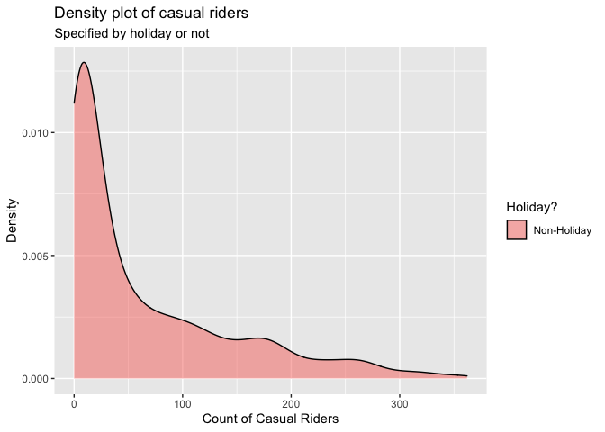

ST558 - Project 2
================
Group 5: Tyler Pollard & Lucy Yin

-   [Required Packages](#required-packages)
-   [Introduction](#introduction)
-   [Data](#data)
-   [Summarization](#summarization)
    -   [Contingency Tables](#contingency-tables)
        -   [Weather Situation](#weather-situation)
        -   [Year, Season and Count of
            Riders](#year-season-and-count-of-riders)
        -   [Working Day and Count of Casual
            Riders](#working-day-and-count-of-casual-riders)
    -   [Summary Tables](#summary-tables)
        -   [Feeling Temperature](#feeling-temperature)
        -   [Humidity](#humidity)
        -   [Wind Speed](#wind-speed)
    -   [Histograms](#histograms)
        -   [Humidity and Windspeed
            Distributions](#humidity-and-windspeed-distributions)
    -   [Density Plot](#density-plot)
        -   [Casual Riders and Weather
            Situation](#casual-riders-and-weather-situation)
        -   [Registered Riders and Weather
            Situation](#registered-riders-and-weather-situation)
        -   [Total Riders and Weather
            Situation](#total-riders-and-weather-situation)
        -   [Casual Riders and Holiday](#casual-riders-and-holiday)
        -   [Registered Riders and
            Holiday](#registered-riders-and-holiday)
        -   [Total Riders and Holiday](#total-riders-and-holiday)
    -   [Boxplots](#boxplots)
        -   [Feeling Temperature Over the
            Year](#feeling-temperature-over-the-year)
        -   [Riders of Every Hour and Weather
            Situation](#riders-of-every-hour-and-weather-situation)
    -   [Scatter Plots](#scatter-plots)
        -   [Count vs Casual by Season](#count-vs-casual-by-season)
        -   [Riders vs Temperature](#riders-vs-temperature)
        -   [Riders vs. Hour vs. Month vs. Working
            Day](#riders-vs-hour-vs-month-vs-working-day)
    -   [Correlation Plot](#correlation-plot)
        -   [Correlation between temp, atemp, hum,
            windspeed](#correlation-between-temp-atemp-hum-windspeed)
    -   [Plots with GGally](#plots-with-ggally)
        -   [Using Day Data](#using-day-data)
        -   [Using Hour Data](#using-hour-data)
-   [Modeling](#modeling)
    -   [Linear Regression Model](#linear-regression-model)
        -   [What is Linear Regression
            Model](#what-is-linear-regression-model)
        -   [Picking predictors using
            AIC](#picking-predictors-using-aic)
        -   [Modeling using AIC picked
            predictor](#modeling-using-aic-picked-predictor)
    -   [Ensemble Tree Model](#ensemble-tree-model)
        -   [Random Forest Model](#random-forest-model)
        -   [Boosted Tree Model](#boosted-tree-model)
-   [Comparison](#comparison)

# Required Packages

# Introduction

For this report we will be using 6 models (4 linear regression, 1 random
forest model, 1 boosted tree model) to make predictions on the total
count of bike riders using data from the Bike Sharing Dataset (dataset
can be found
[here](https://archive.ics.uci.edu/ml/datasets/Bike+Sharing+Dataset)).
This dataset contains hourly and daily count of registered, casual, and
total sum of riders in the Capital bikeshare system, contributing
variables include:

-   season (winter, spring, summer, fall)  
-   year (2011, 2012)  
-   month of the year
-   hour of the day  
-   holiday (yes, no)  
-   day of the week  
-   working day (yes or no)  
-   weather situation (mostly clear, mist, light precipitation, heavy
    precipitation)  
-   temperature  
-   feeling temperature  
-   humidity  
-   wind speed

There are 3 different types of response variables in the dataset:

-   registered: registered riders who uses this bikeshare service
    regularly  
-   casual: un-registered riders who use this service casually or on
    occasions  
-   total: combined count of registered and casual riders

For our analysis, we will be working with almost all of the variables as
predictors, and our response variable will be the total count of bike
riders.

We will be selecting predictors using the `step()` function which
chooses a model by AIC in a stepwise algorithm. As a result, which
predictors we incorporate in our linear regression models and ensemble
tree (specifically random forest and boosted tree) models may differ
depending on which day of the week we look at. We’ll randomly split the
data into training and test sets and fit the 6 models on the training
set. Ultimately we will fit the 6 models on the test set and decide on
which model produced the best prediction, which we judge by the smallest
root mean squared error value.

# Data

First we will read in both the `hours.csv` and `day.csv` data.

``` r
# read in data
hour.data <- read_csv("data/hour.csv") %>% as_tibble()
day.data <- read_csv("data/day.csv") %>% as_tibble()
```

We will make corrections on variable types, specifically we’re making
sure categorical variables will be appropriately classified as factors
with clear levels.

``` r
# correct the variable types
hour.data$season <- factor(hour.data$season)
levels(hour.data$season) <- list(winter = 1, spring = 2, summer = 3, fall = 4)

hour.data$yr <- factor(hour.data$yr)
levels(hour.data$yr) <- list("2011" = 0, "2012" = 1)

hour.data$weekday <- factor(hour.data$weekday)
levels(hour.data$weekday) <- list(monday = 1, tuesday = 2, wednesday = 3, thursday = 4, friday = 5, saturday = 6, sunday = 0)

hour.data$mnth <- factor(hour.data$mnth)
hour.data$hr <- factor(hour.data$hr)
hour.data$holiday <- factor(hour.data$holiday)
hour.data$workingday <- factor(hour.data$workingday)
hour.data$weathersit <- factor(hour.data$weathersit)

day.data$season <- factor(day.data$season)
levels(day.data$season) <- list(winter = 1, spring = 2, summer = 3, fall = 4)

day.data$yr <- factor(day.data$yr)
levels(day.data$yr) <- list("2011" = 0, "2012" = 1)

day.data$weekday <- factor(day.data$weekday)
levels(day.data$weekday) <- list(monday = 1, tuesday = 2, wednesday = 3, thursday = 4, friday = 5, saturday = 6, sunday = 0)

day.data$mnth <- factor(day.data$mnth)
day.data$holiday <- factor(day.data$holiday)
day.data$workingday <- factor(day.data$workingday)
day.data$weathersit <- factor(day.data$weathersit)
```

Because the variables temperature, feeling temperature, humidity and
windspeed are normalized according to different measures, we will
un-normalize them and save the raw values as separate columns in the
dataset.

``` r
# Temp Unnormal
temp.tmin = -8
temp.tmax = 39
hour.data$temp.unnormal <- hour.data$temp*(temp.tmax - temp.tmin) + temp.tmin # Unnormalize temp
hour.data$temp.F <- hour.data$temp.unnormal*(9/5) + 32 # Convert to Fahrenheit
day.data$temp.unnormal <- hour.data %>% group_by(dteday) %>% summarise(mean = mean(temp.unnormal)) %>% select(mean)
day.data$temp.unnormal <- day.data$temp.unnormal[[1]]
day.data$temp.F <- hour.data %>% group_by(dteday) %>% summarise(mean = mean(temp.F)) %>% select(mean)
day.data$temp.F <- day.data$temp.F[[1]]

# Atemp Unnormal
atemp.tmin = -16
atemp.tmax = 50
hour.data$atemp.unnormal <- hour.data$atemp*(atemp.tmax - atemp.tmin) + atemp.tmin # Unnormalize atemps
hour.data$atemp.F <- hour.data$atemp.unnormal*(9/5) + 32 # Convert to Fahrenheit
day.data$atemp.unnormal <- hour.data %>% group_by(dteday) %>% summarise(mean = mean(atemp.unnormal)) %>% select(mean)
day.data$atemp.unnormal <- day.data$atemp.unnormal[[1]]
day.data$atemp.F <- hour.data %>% group_by(dteday) %>% summarise(mean = mean(atemp.F)) %>% select(mean)
day.data$atemp.F <- day.data$atemp.F[[1]]

# Humidity Unnormal
day.data$hum.unnormal <- day.data$hum * 100
hour.data$hum.unnormal <- hour.data$hum * 100

# Windspeed Unnormal
day.data$windspeed.unnormal <- day.data$windspeed * 67
hour.data$windspeed.unnormal <- hour.data$windspeed * 67
```

Because hour and day data are stored separately, we create a
`total.data` table with all the information combined just in case we
need to access this in later steps.

``` r
# add in a new variable before merging
hour.data <- mutate(hour.data, type = "hour")
day.data <- mutate(day.data, type = "day", hr = NA) %>% select(instant, dteday, season, yr, mnth, hr, everything())

# merge to create complete list of hour/day data
total.data <- rbind(hour.data, day.data)
```

We will filter to only include data from one specific day of the week at
a time.

``` r
# filter out to one specific day of the week
hour.data <- hour.data %>% filter(weekday == params$weekday)
day.data <- day.data %>% filter(weekday == params$weekday)
total.data <- total.data %>% filter(weekday == params$weekday)
```

We randomly sample from the filtered data to form a training set (with
70% of data) and test set (with the remaining 30% of data). Here we
randomly sampled from the day dataset and split it into training and
test sets, then we split the corresponding data from the hours dataset
according to which days are in the training set and which days are in
the test set. We will be using the hours dataset for our modeling, but
we wanted to make sure our day and hour datasets had matching training
and test splits.

``` r
# splitting data into training & test sets
set.seed(7)
train <- sample(1:nrow(day.data), size = nrow(day.data)*0.7)
test <- dplyr::setdiff(1:nrow(day.data), train)
day.training.data <- day.data[train, ]
day.test.data <- day.data[test, ]

hour.training.data <- hour.data[hour.data$dteday %in% day.training.data$dteday,]
hour.test.data <- hour.data[hour.data$dteday %in% day.test.data$dteday,]
```

# Summarization

We have some basic summary statistics and plots about our training data.

## Contingency Tables

### Weather Situation

Below is a contingency table that shows the count of days that fall into
the different categories of weather situation. This table will help
justify the total count of riders because it can be expected that the
number of casual riders, which influences the total count of riders,
will be higher on nicer days that fall into the first two categories of
Mostly clear and Mist.

``` r
levels(day.training.data$weathersit) <- list(
  "Mostly clear" = "1",
  "Mist" = "2",
  "Light precipitation" = "3",
  "Heavy precipitation" = "4")
kable(t(table(day.training.data$weathersit)))
```

| Mostly clear | Mist | Light precipitation | Heavy precipitation |
|-------------:|-----:|--------------------:|--------------------:|
|           49 |   21 |                   3 |                   0 |

### Year, Season and Count of Riders

These contingency tables show what count range of riders utilized the
bikeshare service for a given season or for a given year. This table can
help us see if the number of riders increased/decreased from 2011 to
2012, or if season has an effect on how many riders used the bikeshare
service.

``` r
kable(table(day.training.data$season, cut(day.training.data$cnt, breaks = 2, dig.lab = 10)), caption = "Occurrences of # Range of Riders of a given Season")
```

|        | (787.081,4754.5\] | (4754.5,8721.919\] |
|:-------|------------------:|-------------------:|
| winter |                15 |                  0 |
| spring |                 5 |                 12 |
| summer |                 6 |                 16 |
| fall   |                 8 |                 11 |

Occurrences of # Range of Riders of a given Season

``` r
kable(table(day.training.data$yr, cut(day.training.data$cnt, breaks = 2, dig.lab = 10)), caption = "Occurrences of # Range of Riders of a given Year")
```

|      | (787.081,4754.5\] | (4754.5,8721.919\] |
|:-----|------------------:|-------------------:|
| 2011 |                26 |                 11 |
| 2012 |                 8 |                 28 |

Occurrences of # Range of Riders of a given Year

### Working Day and Count of Casual Riders

This contingency table show what count range of casual riders utilized
the bikeshare service on working day versus non-working day. Intuitively
we’d suspect that there would more casual riders on non-working day than
working day, this table can show us whether it’s true or not.

``` r
levels(day.training.data$workingday) <- list("workday" = 1, "non-workday" = 0)
kable(table(day.training.data$workingday, cut(day.training.data$casual, breaks = 2, dig.lab = 10)), caption = "Occurrences of # Range of Casual Riders of Workday vs. non-Workday")
```

|             | (63.657,1738.5\] | (1738.5,3413.343\] |
|:------------|-----------------:|-------------------:|
| workday     |                0 |                  0 |
| non-workday |               41 |                 32 |

Occurrences of # Range of Casual Riders of Workday vs. non-Workday

## Summary Tables

### Feeling Temperature

The summary tables of feeling temperature show the 5 number summary
along with the mean and standard deviation of what the temperature
actually felt like over the different years. The summary table for both
the normalized and raw feeling temperatures are provided. These tables
give insight to the range of feeling temperatures felt by the riders for
the different years.

``` r
# Normalized feeling temperature
atemp.summary <- hour.training.data %>% group_by(yr) %>% summarise(Min. = min(atemp), `1st Qu.` = quantile(atemp,0.25), Median = median(atemp), Mean = mean(atemp), `3rd Qu.` = quantile(atemp, 0.75), Max. = max(atemp), `St. Dev.` = sd(atemp))
kable(atemp.summary, digits = 2, caption = "Summary of feeling temperatures by year")
```

| yr   | Min. | 1st Qu. | Median | Mean | 3rd Qu. | Max. | St. Dev. |
|:-----|-----:|--------:|-------:|-----:|--------:|-----:|---------:|
| 2011 | 0.00 |    0.30 |   0.44 | 0.45 |    0.62 | 0.89 |     0.18 |
| 2012 | 0.08 |    0.39 |   0.52 | 0.51 |    0.62 | 0.88 |     0.17 |

Summary of feeling temperatures by year

``` r
# Raw feeling temperature in Fahrenheit
atemp.summary.unnormal <- hour.training.data %>% group_by(yr) %>% summarise(Min. = min(atemp.F), `1st Qu.` = quantile(atemp.F,0.25), Median = median(atemp.F), Mean = mean(atemp.F), `3rd Qu.` = quantile(atemp.F, 0.75), Max. = max(atemp.F), `St. Dev.` = sd(atemp.F))
kable(atemp.summary.unnormal, digits = 2, caption = "Summary of raw feeling temperatures by year")
```

| yr   |  Min. | 1st Qu. | Median |  Mean | 3rd Qu. |  Max. | St. Dev. |
|:-----|------:|--------:|-------:|------:|--------:|------:|---------:|
| 2011 |  3.20 |    39.2 |  55.40 | 57.17 |      77 | 109.4 |    21.33 |
| 2012 | 12.21 |    50.0 |  64.41 | 63.25 |      77 | 107.6 |    19.65 |

Summary of raw feeling temperatures by year

### Humidity

These summary tables show the spread of normalized and raw humidity
values. The table includes the 5 number summary along with mean and
standard deviation, which gives insight to the range of humidity levels
riders experienced.

``` r
kable(t(c(summary(day.training.data$hum), St.Dev. = sd(day.training.data$hum))), digits = 2, caption = "Summary of Normalized Humidity")
```

| Min. | 1st Qu. | Median | Mean | 3rd Qu. | Max. | St.Dev. |
|-----:|--------:|-------:|-----:|--------:|-----:|--------:|
| 0.19 |     0.5 |   0.61 | 0.62 |    0.72 | 0.93 |    0.15 |

Summary of Normalized Humidity

``` r
kable(t(c(summary(day.training.data$hum.unnormal), St.Dev. = sd(day.training.data$hum.unnormal))), digits = 2, caption = "Summary of Raw Humidity")  
```

|  Min. | 1st Qu. | Median |  Mean | 3rd Qu. |  Max. | St.Dev. |
|------:|--------:|-------:|------:|--------:|------:|--------:|
| 18.79 |   50.29 |  61.33 | 61.91 |   71.83 | 92.92 |   15.03 |

Summary of Raw Humidity

### Wind Speed

These summary tables show the spread of normalized and raw wind speeds.
The table includes the 5 number summary along with mean and standard
deviation, which gives insight to the range of wind speeds riders
experienced.

``` r
kable(t(c(summary(day.training.data$windspeed), St.Dev. = sd(day.training.data$windspeed))), digits = 2, caption = "Summary of Normalized Wind Speed")
```

| Min. | 1st Qu. | Median | Mean | 3rd Qu. | Max. | St.Dev. |
|-----:|--------:|-------:|-----:|--------:|-----:|--------:|
| 0.05 |    0.14 |   0.19 | 0.19 |    0.24 | 0.51 |    0.08 |

Summary of Normalized Wind Speed

``` r
kable(t(c(summary(day.training.data$windspeed.unnormal), St.Dev. = sd(day.training.data$windspeed.unnormal))), digits = 2, caption = "Summary of Raw Wind Speed ")
```

| Min. | 1st Qu. | Median |  Mean | 3rd Qu. | Max. | St.Dev. |
|-----:|--------:|-------:|------:|--------:|-----:|--------:|
| 3.04 |    9.63 |  12.67 | 13.06 |   15.75 |   34 |    5.41 |

Summary of Raw Wind Speed

## Histograms

### Humidity and Windspeed Distributions

The following density plots show the distribution of the weather effects
for raw humidity and raw wind speed over the span of the biker data.
These distributions provide insight on what values for each weather
effect can be expected and how the combination of each effect may drive
the different weather situations and in turn the expected count of
riders.

``` r
hum.histogram <- ggplot(data = day.training.data, aes(x = hum.unnormal)) + 
  geom_histogram(aes(y = ..density..), bins = 30) + 
  geom_density(color = "red", size = 2) + 
  labs(title = "Humidity Distribution", x = "Raw Humidity", y = "Density")
windspeed.histogram <- ggplot(data = day.training.data, aes(x = windspeed.unnormal)) + 
  geom_histogram(aes(y = ..density..), bins = 30) + 
  geom_density(color = "red", size = 2) + 
  labs(title = "Windspeed Distribution", x = "Raw Windspeed", y = "Density")
grid.arrange(hum.histogram, windspeed.histogram, ncol = 2, top = "Density Distribution of Weather Effects")
```

<!-- -->

## Density Plot

### Casual Riders and Weather Situation

This density plot shows the amount of casual riders in a given weather
situation. Intuitively we suspect that there would more casual riders in
better weather conditions. This density plot can show us whether or not
this is true.

``` r
ggplot(hour.training.data, aes(x = casual)) + 
  geom_density(alpha = 0.5, position = "stack", aes(fill = weathersit)) + 
  labs(title = "Density plot of casual riders",
       subtitle = "Specified by weather situation",
       x = "Count of Casual Riders",
       y = "Density") + 
  scale_fill_discrete(name = "Weather Situation", labels = c("Mostly Clear", "Mist", "Light Precip.", "Heavy Precip."))  
```

<!-- -->

### Registered Riders and Weather Situation

This density plot shows the amount of registered riders in a given
weather situation. We suspect that the amount of registered riders
wouldn’t be as affected by weather situation as the amount of casual
riders would. This density plot can show us whether or not this is true.

``` r
ggplot(hour.training.data, aes(x = registered)) + 
  geom_density(alpha = 0.5, position = "stack", aes(fill = weathersit)) + 
  labs(title = "Density plot of casual riders",
       subtitle = "Specified by weather situation",
       x = "Count of Registered Riders",
       y = "Density") + 
  scale_fill_discrete(name = "Weather Situation", labels = c("Mostly Clear", "Mist", "Light Precip.", "Heavy Precip."))  
```

<!-- -->

### Total Riders and Weather Situation

This density plot shows the total count of riders in a given weather
situation. We may see a relationship between how many riders there are
and what type of weather condition it is.

``` r
ggplot(hour.training.data, aes(x = cnt)) + 
  geom_density(alpha = 0.5, position = "stack", aes(fill = weathersit)) + 
  labs(title = "Density plot of casual riders",
       subtitle = "Specified by weather situation",
       x = "Total Count of Riders",
       y = "Density") + 
  scale_fill_discrete(name = "Weather Situation", labels = c("Mostly Clear", "Mist", "Light Precip.", "Heavy Precip."))  
```

<!-- -->

### Casual Riders and Holiday

This density plot shows the amount of casual riders depending on whether
it is a holiday or non-holiday. We suspect there would be more casual
riders on holidays, especially at larger counts. This density plot can
show us whether that is true.

``` r
ggplot(hour.training.data, aes(x = casual)) + 
  geom_density(alpha = 0.5, position = "stack", aes(fill = holiday)) +
  labs(title = "Density plot of casual riders",
       subtitle = "Specified by holiday or not",
       x = "Count of Casual Riders",
       y = "Density") +
  scale_fill_discrete(name = "Holiday?", labels = c("Non-Holiday", "Holiday"))    
```

<!-- -->

### Registered Riders and Holiday

This density plot shows the amount of registered riders depending on
whether it is a holiday or non-holiday. We suspect there would be more
registered riders on non-holidays, especially at larger counts. This
density plot can show us whether that is true.

``` r
ggplot(hour.training.data, aes(x = registered)) + 
  geom_density(alpha = 0.5, position = "stack", aes(fill = holiday)) +
  labs(title = "Density plot of casual riders",
       subtitle = "Specified by holiday or not",
       x = "Count of Registered Riders",
       y = "Density") +
  scale_fill_discrete(name = "Holiday?", labels = c("Non-Holiday", "Holiday"))    
```

<!-- -->

### Total Riders and Holiday

This density plot shows the total count of riders depending on whether
it is a holiday or non-holiday. This plot could show a relationship
between the amount of riders versus whether it’s a holiday or
non-holiday.

``` r
ggplot(hour.training.data, aes(x = cnt)) + 
  geom_density(alpha = 0.5, position = "stack", aes(fill = holiday)) +
  labs(title = "Density plot of casual riders",
       subtitle = "Specified by holiday or not",
       x = "Total Count of Riders",
       y = "Density") +
  scale_fill_discrete(name = "Holiday?", labels = c("Non-Holiday", "Holiday"))    
```

<!-- -->

## Boxplots

### Feeling Temperature Over the Year

To get a better understanding of the feeling temperature spreads over
the year, boxplots of the feeling temperature are plotted by month with
the data points for each day used to create them plotted overtop.
Intuitively, it can be expected that the feeling temperature rises from
the beginning of the year into the middle of summer and then drops back
down over the fall and winter months. These boxplots provide insight
into the possible number of rider fluctuation over the different months
of the year.

``` r
atemp.boxplot.df <- day.training.data
levels(atemp.boxplot.df$mnth) <- list(January = 1, February = 2, March = 3, April = 4, May = 5, June = 6, July = 7, August = 8, September = 9, October = 10, November = 11, December = 12)
ggplot(data = atemp.boxplot.df, aes(x = mnth, y = atemp.F)) + 
  geom_boxplot() + 
  geom_point(position = "jitter", color = "blue") + 
  labs(title = "Feeling temperature distribution per month", x = "Month", y = "Feeling Temperature (F)")
```

<!-- -->

### Riders of Every Hour and Weather Situation

This boxplot shows the 5 number summary (in boxplot form with occasional
outliers) of the amount of riders for each hour of the day. The colored
lines should the mean number of riders for each given weather situation.
We expect that the highest amount of riders should appear around the
morning and afternoon commute time given it’s not on a holiday or on the
weekends. This boxplot can show if that’s true.

``` r
ggplot(hour.training.data, aes(x = hr, y = cnt)) + 
  geom_boxplot() + 
  stat_summary(fun = mean, geom = "line", lwd = 0.8, aes(group = weathersit, col = weathersit)) + 
  labs(title = "Count of riders for every hr",
       subtitle = "Mean values based on weather situation",
       x = "Hour of the Day",
       y = "Count of Riders") + 
  scale_color_discrete(name = "Weather Situation", labels = c("Mostly Clear", "Mist", "Light Precip.", "Heavy Precip."))
```

<!-- -->

## Scatter Plots

### Count vs Casual by Season

These four scatter plots show the relation between the total number of
riders and casual riders by day with linear models plotted overtop
parsed by season. These plots show how the number of casual riders
contribute to the total count of riders for each season. The greater the
slope of the linear model correlates to a greater number of causal
riders contributing to the total count of riders.

``` r
ggplot(data = day.training.data, aes(x = cnt, y = casual)) +
  geom_point() +
  geom_smooth(method = "lm") +
  facet_grid(cols = vars(season)) + 
  labs(title = "Casual Riders Influence on Total Count", x = "Count", y = "Casual Riders")
```

<!-- -->

### Riders vs Temperature

Below is a scattered plot of the number of causal riders vs the raw
temperature for each day in the span of the data parsed by workingday
with a local polynomial regression line fit overtop. This plot provides
insight on how many people spontaneous chose to ride based on the raw
temperature of that day.

``` r
day.training.data$temp.indicator <- ifelse(day.training.data$temp < mean(day.training.data$temp), 0, 1)
day.training.data$temp.indicator <- as_factor(day.training.data$temp.indicator)
levels(day.training.data$temp.indicator) <- list("Low Temperature" = 0, "High Temperature" = 1)
ggplot(data = day.training.data, aes(x = temp.F, y = casual, color = workingday)) + 
  geom_point() + 
  geom_smooth() + 
  labs(title = "Casual Riders Based on Temperature", x = "Raw Temperature", y = "Number of Casual Riders")
```

<!-- -->

### Riders vs. Hour vs. Month vs. Working Day

This boxplot below shows the count of riders for every month and every
hour of the day. The color of the points indicate whether it was on a
working day (1) or non-working day (0). We suspect for working days,
there would be an obvious uptick around the morning and afternoon
commute time. But for non-working days, the amount of riders shouldn’t
have an obvious pattern around those time frames. This plot shows us
whether that’s true or not.

``` r
count.df <- hour.training.data
levels(count.df$mnth) <- list(January = 1, February = 2, March = 3, April = 4, May = 5, June = 6, July = 7, August = 8, September = 9, October = 10, November = 11, December = 12)
ggplot(count.df, aes(x = hr, y = cnt)) +
  geom_point(aes(col = workingday)) +
  facet_wrap(vars(mnth)) + 
  labs(title = "Count of riders for every hour of every month",
       subtitle = "Specified by workday or non-workday",
       x = "Hour of the Day",
       y = "Count of Riders") +
  scale_color_discrete(name = "Working Day")
```

<!-- -->

## Correlation Plot

### Correlation between temp, atemp, hum, windspeed

This correlation plots show the correlation (positive or negative)
between the 4 quantitative variables temperature, feeling temperature,
humidity and wind speed. We suspect that there likely would be a high
correlation between temperature and feeling temperature, and humidity
might be inverse correlated with wind speed. This correlation can show
us whether this is true.

``` r
cor.variables <- hour.training.data %>% select(temp, atemp, hum, windspeed)
correlation <- cor(cor.variables, method = "spearman")
corrplot(correlation)
```

<!-- -->

## Plots with GGally

The two GGally plots below will show whether there’s any relationship
between each of the variables. We run this plot on both the day and hour
data.

### Using Day Data

``` r
subset.data.day <- data_frame(weathersit=day.training.data$weathersit, temp=day.training.data$temp, atemp=day.training.data$atemp,humidity=day.training.data$hum, windspeed=day.training.data$windspeed, casual=day.training.data$casual, registered=day.training.data$registered, total=day.training.data$cnt)
GGally::ggpairs(subset.data.day)
```

<!-- -->

### Using Hour Data

``` r
subset.data.hr <- data_frame(weathersit=hour.training.data$weathersit, temp=hour.training.data$temp, atemp=hour.training.data$atemp,humidity=hour.training.data$hum, windspeed=hour.training.data$windspeed, casual=hour.training.data$casual, registered=hour.training.data$registered, total=hour.training.data$cnt)
GGally::ggpairs(subset.data.hr)
```

<!-- -->

# Modeling

## Linear Regression Model

### What is Linear Regression Model

Linear regression is a type of modeling used to predict a response based
on explanatory variables by fitting a linear equation to observed data.
For simple linear regression using a single explanatory variable to
predict a response variable the equation is
*Y*<sub>*i*</sub> = *β*<sub>0</sub> + *β*<sub>1</sub>*x*<sub>*i*</sub> + *E*<sub>*i*</sub>
where *Y*<sub>*i*</sub> is the response for the *i*<sup>*t**h*</sup>
observation, *x*<sub>*i*</sub> is the value of the explanatory variable
for the *i*<sup>*t**h*</sup> observation, *β*<sub>0</sub> is the
y-intercept, *β*<sub>1</sub> is the slope, and *E*<sub>*i*</sub> is the
error for the *i*<sup>*t**h*</sup> observation. Fitting a linear model
to the observed dataset requires estimating the coefficients *β* such
that the error term
*E*<sub>*i*</sub> = *Y*<sub>*i*</sub> − *β*<sub>0</sub> − *β*<sub>1</sub>*x*<sub>*i*</sub>
is minimized. The most common way to minimize this term is through
least-squares where we minimize the sum of squared residuals through
$min\_{\\beta\_{0},\\beta\_{1}}\\sum\_{i=1}^n ({y}\_{i} - \\beta\_{0} - \\beta\_{1}{x}\_{i})$.
Simple linear regression can be extended in many ways to include:

-   higher order terms:
    *Y*<sub>*i*</sub> = *β*<sub>0</sub> + *β*<sub>1</sub>*x*<sub>*i*</sub> + *β*<sub>2</sub>*x*<sub>*i*</sub><sup>2</sup> + *E*<sub>*i*</sub>  
-   more explanatory variables:
    *Y*<sub>*i*</sub> = *β*<sub>0</sub> + *β*<sub>1</sub>*x*<sub>1*i*</sub> + *β*<sub>2</sub>*x*<sub>2*i*</sub> + *β*<sub>3</sub>*x*<sub>1*i*</sub>*x*<sub>2*i*</sub> + *E*<sub>*i*</sub>  
-   more explanatory variables and higher order terms:
    *Y*<sub>*i*</sub> = *β*<sub>0</sub> + *β*<sub>1</sub>*x*<sub>1*i*</sub> + *β*<sub>2</sub>*x*<sub>2*i*</sub> + *β*<sub>3</sub>*x*<sub>1*i*</sub>*x*<sub>2*i*</sub> + *β*<sub>4</sub>*x*<sub>1*i*</sub><sup>2</sup> + *β*<sub>5</sub>*x*<sub>2*i*</sub><sup>2</sup> + *E*<sub>*i*</sub>

In each of these linear regressions the model is still fit by minimizing
the sum of squared errors. As the number of explanatory variables
increase these regression models can become quite large, so it is best
to compare different candidate models to see which provides the best fit
of the data. Usually you would have some sort of subject matter
knowledge to help select these candidate models by understanding which
variables are related and which variables scientifically should be put
in the model. Without subject matter knowledge you might select multiple
candidate models and compare them using fit criteria such as AIC, BIC,
AICc, Adjusted R-squared or Variance Inflation Factor (VIF).
Alternatively, you may compare prediction error by splitting the data
into a training and test set with a 80/20 split and fit the candidate
models on the training set to predict the response of the test set. The
model with the lowest RMSE should be considered to be the best fit as it
minimized the error the best.

### Picking predictors using AIC

First we want to select only the variables that we will use in our
models, as variables such as record index, date are not useful to us. We
will be using the un-normalized versions of temperature, feeling
temperature, humidity and wind speed (instead of the normalized
versions) because we want to standardize all numerical variables when
running our models.  
Because on some days of the week holiday and working day both become 1
leveled factor variables and can cause issues in our modeling, so we
will omit these 2 variables for those days of the week.

``` r
# keep only variables that are relevant to modeling
if.weekday <- hour.training.data %>% filter(weekday == params$weekday) %>% select(workingday) %>% unique() %>% nrow()
if.holiday <- hour.training.data %>% filter(weekday == params$weekday) %>% select(holiday) %>% unique() %>% nrow()

# use function to decide if a weekday has 1 factored levels
# if so we will not use these factors in the model 
get.data <- function(weekday, ...){
  if (if.weekday == 1 & if.holiday == 1) {
    hour.training.data2 <- hour.training.data %>% select(season, yr, mnth, hr, weathersit, temp.F, atemp.F, hum.unnormal, windspeed.unnormal, cnt)
  }
  else {
    hour.training.data2 <- hour.training.data %>% select(season, yr, mnth, hr, holiday, workingday, weathersit, temp.F, atemp.F, hum.unnormal, windspeed.unnormal, cnt)
  }
  hour.training.data2
}
hour.training.data2 <- get.data(params$weekday)
```

We will let the `step()` function to pick our models using the stepwise
algorithm. We provide the `step()` function with 3 different linear
models, first with just first order variables, second with squared terms
and interactions, and third with first ordered variables and
interactions.

``` r
# aic using only 1st ordered terms
fit.aic <- step((lm(cnt ~ ., data = hour.training.data2, verbose = FALSE)), direction = "both")

# aic including squared terms and interactions
fit.aic2 <- step((lm(cnt ~ .^2 + I(temp.F^2) + I(atemp.F^2) + I(hum.unnormal^2) + I(windspeed.unnormal^2), data = hour.training.data2, verbose = FALSE)), direction = "both")

# aic using 1st order and interactions
fit.aic3 <- step((lm(cnt ~.^2, data = hour.training.data2, verbose = FALSE)), direction = "both")
```

### Modeling using AIC picked predictor

For the first linear regression model we run, we will pick predictors
based on our intuition. We expect the feeling temperature would be
highly correlated with the actual temperature, and because wind speed
and humidity could also be correlated with feeling temperature, so we
only kept temperature as a predictor in the model and will not include
feeling temperature. We also did not include holiday in the model
because it has some redundant information to the working day variable.

``` r
# use all predictors except atemp and holiday
set.seed(7)
fit.mlr0 <- train(cnt ~ season + yr + mnth + hr + workingday + weathersit + temp.F + hum.unnormal + windspeed.unnormal,
                  data = hour.training.data,
                  method = "lm",
                  preProcess = c("center", "scale"),
                  trControl = trainControl(method = "cv", number = 10))
fit.mlr0
```

    ## Linear Regression 
    ## 
    ## 1750 samples
    ##    9 predictor
    ## 
    ## Pre-processing: centered (45), scaled (45) 
    ## Resampling: Cross-Validated (10 fold) 
    ## Summary of sample sizes: 1574, 1575, 1574, 1574, 1577, 1575, ... 
    ## Resampling results:
    ## 
    ##   RMSE      Rsquared   MAE     
    ##   78.75772  0.8168085  59.51412
    ## 
    ## Tuning parameter 'intercept' was held constant at a value of TRUE

``` r
# Examine performance of this multiple linear regression model on the test data after prediction
predict.mlr0 <- postResample(predict(fit.mlr0, newdata = hour.test.data), obs = hour.test.data$cnt)
```

The next three linear regression models are fit using the predictors
picked by the three step functions. These models include different
number of predictors in different complexity, so we will see which
models will produce the best prediction in the end.

``` r
# use aic predictors (1st ordered terms)
set.seed(7)
fit.mlr1 <- train(fit.aic$terms,
                  data = hour.training.data2,
                  method = "lm",
                  preProcess = c("center", "scale"),
                  trControl = trainControl(method = "cv", number = 10))
fit.mlr1
```

    ## Linear Regression 
    ## 
    ## 1750 samples
    ##    8 predictor
    ## 
    ## Pre-processing: centered (44), scaled (44) 
    ## Resampling: Cross-Validated (10 fold) 
    ## Summary of sample sizes: 1574, 1575, 1574, 1574, 1577, 1575, ... 
    ## Resampling results:
    ## 
    ##   RMSE      Rsquared   MAE     
    ##   78.73824  0.8169673  59.66379
    ## 
    ## Tuning parameter 'intercept' was held constant at a value of TRUE

``` r
# variables used in fit
fit.aic
```

    ## 
    ## Call:
    ## lm(formula = cnt ~ season + yr + mnth + hr + weathersit + atemp.F + 
    ##     hum.unnormal + windspeed.unnormal, data = hour.training.data2, 
    ##     verbose = FALSE)
    ## 
    ## Coefficients:
    ##        (Intercept)        seasonspring        seasonsummer          seasonfall              yr2012               mnth2  
    ##             -3.654              45.031              29.296              95.400              84.796               8.047  
    ##              mnth3               mnth4               mnth5               mnth6               mnth7               mnth8  
    ##             17.216              19.911              42.904              12.244              -9.500              37.097  
    ##              mnth9              mnth10              mnth11              mnth12                 hr1                 hr2  
    ##             57.698               9.192             -18.979             -20.362             -26.516             -40.509  
    ##                hr3                 hr4                 hr5                 hr6                 hr7                 hr8  
    ##            -64.585             -75.959             -79.127             -58.912             -34.234              26.512  
    ##                hr9                hr10                hr11                hr12                hr13                hr14  
    ##             93.647             163.656             219.349             259.523             268.928             260.862  
    ##               hr15                hr16                hr17                hr18                hr19                hr20  
    ##            257.882             242.729             213.875             170.908             128.840              71.583  
    ##               hr21                hr22                hr23         weathersit2         weathersit3         weathersit4  
    ##             52.226              37.936              16.837              -5.992             -43.109              65.505  
    ##            atemp.F        hum.unnormal  windspeed.unnormal  
    ##              2.045              -1.421              -1.124

``` r
# Examine performance of this multiple linear regression model on the test data after prediction
predict.mlr1 <- postResample(predict(fit.mlr1, newdata = hour.test.data), obs = hour.test.data$cnt)
```

``` r
# use aic predictors (2nd ordered terms and interactions)
set.seed(7)
fit.mlr2 <- train(fit.aic2$terms,
                  data = hour.training.data2,
                  method = "lm",
                  preProcess = c("center", "scale"),
                  trControl = trainControl(method = "cv", number = 10))
fit.mlr2
```

    ## Linear Regression 
    ## 
    ## 1750 samples
    ##    9 predictor
    ## 
    ## Pre-processing: centered (345), scaled (345) 
    ## Resampling: Cross-Validated (10 fold) 
    ## Summary of sample sizes: 1574, 1575, 1574, 1574, 1577, 1575, ... 
    ## Resampling results:
    ## 
    ##   RMSE      Rsquared  MAE     
    ##   45.41225  0.938611  34.05198
    ## 
    ## Tuning parameter 'intercept' was held constant at a value of TRUE

``` r
# variables used in fit
fit.aic2
```

    ## 
    ## Call:
    ## lm(formula = cnt ~ season + yr + mnth + hr + weathersit + temp.F + 
    ##     atemp.F + hum.unnormal + windspeed.unnormal + I(atemp.F^2) + 
    ##     I(windspeed.unnormal^2) + season:yr + season:hr + season:atemp.F + 
    ##     season:hum.unnormal + season:windspeed.unnormal + yr:mnth + 
    ##     yr:hr + yr:temp.F + yr:atemp.F + mnth:weathersit + mnth:temp.F + 
    ##     mnth:atemp.F + mnth:hum.unnormal + mnth:windspeed.unnormal + 
    ##     hr:weathersit + hr:atemp.F + weathersit:temp.F + weathersit:atemp.F + 
    ##     weathersit:hum.unnormal + temp.F:atemp.F + temp.F:hum.unnormal + 
    ##     temp.F:windspeed.unnormal, data = hour.training.data2, verbose = FALSE)
    ## 
    ## Coefficients:
    ##                     (Intercept)                     seasonspring                     seasonsummer  
    ##                      -3.600e+02                        1.566e+02                        8.425e+02  
    ##                      seasonfall                           yr2012                            mnth2  
    ##                       4.480e+02                       -7.814e+00                       -1.888e+02  
    ##                           mnth3                            mnth4                            mnth5  
    ##                      -5.166e+02                       -8.348e+02                       -8.517e+02  
    ##                           mnth6                            mnth7                            mnth8  
    ##                      -1.036e+03                       -1.184e+03                       -9.699e+02  
    ##                           mnth9                           mnth10                           mnth11  
    ##                      -1.528e+03                       -1.138e+03                       -8.238e+02  
    ##                          mnth12                              hr1                              hr2  
    ##                      -7.718e+02                       -6.793e+00                        1.362e+01  
    ##                             hr3                              hr4                              hr5  
    ##                       9.565e+00                        2.037e+01                        1.780e+01  
    ##                             hr6                              hr7                              hr8  
    ##                       1.174e+01                        1.513e+01                        1.625e+01  
    ##                             hr9                             hr10                             hr11  
    ##                       6.888e+00                       -2.401e+01                       -2.510e+00  
    ##                            hr12                             hr13                             hr14  
    ##                       4.063e+01                       -2.758e+01                       -1.688e+00  
    ##                            hr15                             hr16                             hr17  
    ##                       1.213e+01                       -3.368e+01                       -3.032e+01  
    ##                            hr18                             hr19                             hr20  
    ##                      -3.953e+01                       -2.989e+01                       -3.816e+00  
    ##                            hr21                             hr22                             hr23  
    ##                       3.156e+00                        7.209e+00                        1.201e+01  
    ##                     weathersit2                      weathersit3                      weathersit4  
    ##                       1.374e+02                        2.485e+02                        2.927e+01  
    ##                          temp.F                          atemp.F                     hum.unnormal  
    ##                       2.407e+01                       -1.798e+00                       -3.856e-02  
    ##              windspeed.unnormal                     I(atemp.F^2)          I(windspeed.unnormal^2)  
    ##                      -2.582e+00                        4.360e-01                       -8.181e-02  
    ##             seasonspring:yr2012              seasonsummer:yr2012                seasonfall:yr2012  
    ##                       2.147e+02                       -1.219e+02                       -6.174e+01  
    ##                seasonspring:hr1                 seasonsummer:hr1                   seasonfall:hr1  
    ##                      -2.547e-01                       -1.191e+01                       -3.269e+00  
    ##                seasonspring:hr2                 seasonsummer:hr2                   seasonfall:hr2  
    ##                       2.759e+00                       -1.353e+01                       -1.125e+01  
    ##                seasonspring:hr3                 seasonsummer:hr3                   seasonfall:hr3  
    ##                      -1.231e+00                       -2.017e+01                       -2.377e+01  
    ##                seasonspring:hr4                 seasonsummer:hr4                   seasonfall:hr4  
    ##                       1.362e+00                       -2.882e+01                       -2.880e+01  
    ##                seasonspring:hr5                 seasonsummer:hr5                   seasonfall:hr5  
    ##                      -2.450e+00                       -4.096e+01                       -3.333e+01  
    ##                seasonspring:hr6                 seasonsummer:hr6                   seasonfall:hr6  
    ##                       9.734e+00                       -3.489e+01                       -2.771e+01  
    ##                seasonspring:hr7                 seasonsummer:hr7                   seasonfall:hr7  
    ##                       1.717e+01                       -4.430e+01                       -1.747e+01  
    ##                seasonspring:hr8                 seasonsummer:hr8                   seasonfall:hr8  
    ##                       3.938e+01                        8.757e+00                        2.241e+01  
    ##                seasonspring:hr9                 seasonsummer:hr9                   seasonfall:hr9  
    ##                       5.565e+01                        2.027e+01                        4.329e+01  
    ##               seasonspring:hr10                seasonsummer:hr10                  seasonfall:hr10  
    ##                       6.762e+01                        3.500e+01                        7.021e+01  
    ##               seasonspring:hr11                seasonsummer:hr11                  seasonfall:hr11  
    ##                       9.030e+01                        5.016e+01                        1.144e+02  
    ##               seasonspring:hr12                seasonsummer:hr12                  seasonfall:hr12  
    ##                       1.086e+02                        8.124e+01                        1.452e+02  
    ##               seasonspring:hr13                seasonsummer:hr13                  seasonfall:hr13  
    ##                       9.449e+01                        3.536e+01                        1.440e+02  
    ##               seasonspring:hr14                seasonsummer:hr14                  seasonfall:hr14  
    ##                       4.857e+01                       -1.496e+01                        1.209e+02  
    ##               seasonspring:hr15                seasonsummer:hr15                  seasonfall:hr15  
    ##                       1.042e+02                        6.525e+01                        1.451e+02  
    ##               seasonspring:hr16                seasonsummer:hr16                  seasonfall:hr16  
    ##                       4.865e+01                        8.040e+00                        1.121e+02  
    ##               seasonspring:hr17                seasonsummer:hr17                  seasonfall:hr17  
    ##                       6.855e+01                        4.190e+01                        9.073e+01  
    ##               seasonspring:hr18                seasonsummer:hr18                  seasonfall:hr18  
    ##                       7.394e+01                        2.532e+01                        6.616e+01  
    ##               seasonspring:hr19                seasonsummer:hr19                  seasonfall:hr19  
    ##                       5.690e+01                        6.277e+01                        4.986e+01  
    ##               seasonspring:hr20                seasonsummer:hr20                  seasonfall:hr20  
    ##                       4.810e+01                        6.281e+01                        3.122e+01  
    ##               seasonspring:hr21                seasonsummer:hr21                  seasonfall:hr21  
    ##                       3.652e+01                        3.988e+01                        2.912e+01  
    ##               seasonspring:hr22                seasonsummer:hr22                  seasonfall:hr22  
    ##                       4.158e+01                        3.989e+01                        2.483e+01  
    ##               seasonspring:hr23                seasonsummer:hr23                  seasonfall:hr23  
    ##                       1.113e+01                        1.773e+01                        1.029e+01  
    ##            seasonspring:atemp.F             seasonsummer:atemp.F               seasonfall:atemp.F  
    ##                      -1.226e+00                       -8.549e+00                       -4.814e+00  
    ##       seasonspring:hum.unnormal        seasonsummer:hum.unnormal          seasonfall:hum.unnormal  
    ##                      -3.276e+00                       -4.745e+00                       -2.746e+00  
    ## seasonspring:windspeed.unnormal  seasonsummer:windspeed.unnormal    seasonfall:windspeed.unnormal  
    ##                      -1.460e+00                       -2.782e+00                       -3.922e+00  
    ##                    yr2012:mnth2                     yr2012:mnth3                     yr2012:mnth4  
    ##                      -2.673e+01                       -7.098e+01                       -3.294e+02  
    ##                    yr2012:mnth5                     yr2012:mnth6                     yr2012:mnth7  
    ##                      -3.518e+02                        2.154e+01                       -4.871e+01  
    ##                    yr2012:mnth8                     yr2012:mnth9                    yr2012:mnth10  
    ##                      -2.391e+01                               NA                        9.029e+00  
    ##                   yr2012:mnth11                    yr2012:mnth12                       yr2012:hr1  
    ##                       3.344e+01                        2.182e+01                       -7.112e+00  
    ##                      yr2012:hr2                       yr2012:hr3                       yr2012:hr4  
    ##                      -2.092e+01                       -3.174e+01                       -2.889e+01  
    ##                      yr2012:hr5                       yr2012:hr6                       yr2012:hr7  
    ##                      -2.977e+01                       -2.437e+01                       -1.273e+01  
    ##                      yr2012:hr8                       yr2012:hr9                      yr2012:hr10  
    ##                       1.131e+01                        4.673e+01                        7.138e+01  
    ##                     yr2012:hr11                      yr2012:hr12                      yr2012:hr13  
    ##                       1.061e+02                        1.225e+02                        1.193e+02  
    ##                     yr2012:hr14                      yr2012:hr15                      yr2012:hr16  
    ##                       1.129e+02                        9.880e+01                        9.438e+01  
    ##                     yr2012:hr17                      yr2012:hr18                      yr2012:hr19  
    ##                       9.225e+01                        5.176e+01                        4.112e+01  
    ##                     yr2012:hr20                      yr2012:hr21                      yr2012:hr22  
    ##                       2.993e+00                        1.181e+01                       -1.063e+00  
    ##                     yr2012:hr23                    yr2012:temp.F                   yr2012:atemp.F  
    ##                      -6.536e+00                       -3.346e+00                        5.599e+00  
    ##               mnth2:weathersit2                mnth3:weathersit2                mnth4:weathersit2  
    ##                       2.797e+01                        1.971e+01                       -1.171e+01  
    ##               mnth5:weathersit2                mnth6:weathersit2                mnth7:weathersit2  
    ##                       4.962e+01                        4.257e+01                        2.172e+01  
    ##               mnth8:weathersit2                mnth9:weathersit2               mnth10:weathersit2  
    ##                       5.488e+01                        3.567e+01                       -3.030e+01  
    ##              mnth11:weathersit2               mnth12:weathersit2                mnth2:weathersit3  
    ##                       6.642e-02                        2.397e+01                        5.553e+01  
    ##               mnth3:weathersit3                mnth4:weathersit3                mnth5:weathersit3  
    ##                       1.924e+01                        5.663e+00                        1.269e+02  
    ##               mnth6:weathersit3                mnth7:weathersit3                mnth8:weathersit3  
    ##                       8.923e+01                        1.415e+02                        1.824e+02  
    ##               mnth9:weathersit3               mnth10:weathersit3               mnth11:weathersit3  
    ##                       1.018e+02                        7.834e+01                               NA  
    ##              mnth12:weathersit3                mnth2:weathersit4                mnth3:weathersit4  
    ##                       5.409e+01                               NA                               NA  
    ##               mnth4:weathersit4                mnth5:weathersit4                mnth6:weathersit4  
    ##                              NA                               NA                               NA  
    ##               mnth7:weathersit4                mnth8:weathersit4                mnth9:weathersit4  
    ##                              NA                               NA                               NA  
    ##              mnth10:weathersit4               mnth11:weathersit4               mnth12:weathersit4  
    ##                              NA                               NA                               NA  
    ##                    mnth2:temp.F                     mnth3:temp.F                     mnth4:temp.F  
    ##                       5.730e+00                        2.141e+01                        3.577e+01  
    ##                    mnth5:temp.F                     mnth6:temp.F                     mnth7:temp.F  
    ##                       3.762e+01                        3.045e+01                        2.799e+01  
    ##                    mnth8:temp.F                     mnth9:temp.F                    mnth10:temp.F  
    ##                       2.412e+01                        4.440e+01                        3.797e+01  
    ##                   mnth11:temp.F                    mnth12:temp.F                    mnth2:atemp.F  
    ##                       2.005e+01                        1.537e+01                       -4.439e+00  
    ##                   mnth3:atemp.F                    mnth4:atemp.F                    mnth5:atemp.F  
    ##                      -1.103e+01                       -1.857e+01                       -1.947e+01  
    ##                   mnth6:atemp.F                    mnth7:atemp.F                    mnth8:atemp.F  
    ##                      -1.213e+01                       -7.277e+00                       -5.167e+00  
    ##                   mnth9:atemp.F                   mnth10:atemp.F                   mnth11:atemp.F  
    ##                      -1.795e+01                       -1.753e+01                       -7.285e+00  
    ##                  mnth12:atemp.F               mnth2:hum.unnormal               mnth3:hum.unnormal  
    ##                      -5.663e+00                        1.246e+00                        1.014e+00  
    ##              mnth4:hum.unnormal               mnth5:hum.unnormal               mnth6:hum.unnormal  
    ##                       3.266e+00                        2.735e+00                        4.389e+00  
    ##              mnth7:hum.unnormal               mnth8:hum.unnormal               mnth9:hum.unnormal  
    ##                       4.868e+00                        3.108e+00                        3.129e+00  
    ##             mnth10:hum.unnormal              mnth11:hum.unnormal              mnth12:hum.unnormal  
    ##                       2.984e+00                        3.841e+00                        4.879e+00  
    ##        mnth2:windspeed.unnormal         mnth3:windspeed.unnormal         mnth4:windspeed.unnormal  
    ##                       1.644e+00                       -2.085e+00                       -3.125e+00  
    ##        mnth5:windspeed.unnormal         mnth6:windspeed.unnormal         mnth7:windspeed.unnormal  
    ##                      -6.080e+00                       -2.614e+00                       -4.588e+00  
    ##        mnth8:windspeed.unnormal         mnth9:windspeed.unnormal        mnth10:windspeed.unnormal  
    ##                      -2.986e+00                       -4.324e-01                       -4.245e-01  
    ##       mnth11:windspeed.unnormal        mnth12:windspeed.unnormal                  hr1:weathersit2  
    ##                       2.131e-01                        9.190e-01                        8.193e+00  
    ##                 hr2:weathersit2                  hr3:weathersit2                  hr4:weathersit2  
    ##                      -5.265e+00                        8.361e-01                        1.426e+00  
    ##                 hr5:weathersit2                  hr6:weathersit2                  hr7:weathersit2  
    ##                       8.671e+00                       -7.076e-01                        4.105e-02  
    ##                 hr8:weathersit2                  hr9:weathersit2                 hr10:weathersit2  
    ##                       6.403e-01                       -3.769e+01                       -7.376e+00  
    ##                hr11:weathersit2                 hr12:weathersit2                 hr13:weathersit2  
    ##                      -4.016e+01                       -6.569e+01                       -2.323e+01  
    ##                hr14:weathersit2                 hr15:weathersit2                 hr16:weathersit2  
    ##                      -4.145e+01                       -3.628e+01                       -7.093e+00  
    ##                hr17:weathersit2                 hr18:weathersit2                 hr19:weathersit2  
    ##                      -3.145e+01                       -4.463e+01                       -8.457e+00  
    ##                hr20:weathersit2                 hr21:weathersit2                 hr22:weathersit2  
    ##                      -2.919e-01                       -3.388e+01                       -8.771e+00  
    ##                hr23:weathersit2                  hr1:weathersit3                  hr2:weathersit3  
    ##                       9.425e+00                        4.060e+01                        1.163e+01  
    ##                 hr3:weathersit3                  hr4:weathersit3                  hr5:weathersit3  
    ##                       1.852e+01                        5.299e+00                        5.519e+00  
    ##                 hr6:weathersit3                  hr7:weathersit3                  hr8:weathersit3  
    ##                       1.893e+01                       -9.679e+00                        4.269e+00  
    ##                 hr9:weathersit3                 hr10:weathersit3                 hr11:weathersit3  
    ##                      -1.883e+01                       -3.902e+01                       -8.855e+01  
    ##                hr12:weathersit3                 hr13:weathersit3                 hr14:weathersit3  
    ##                      -8.502e+01                       -1.009e+02                       -1.097e+02  
    ##                hr15:weathersit3                 hr16:weathersit3                 hr17:weathersit3  
    ##                      -4.209e+01                       -1.009e+02                       -1.114e+02  
    ##                hr18:weathersit3                 hr19:weathersit3                 hr20:weathersit3  
    ##                      -1.406e+02                       -2.597e+01                       -3.226e+01  
    ##                hr21:weathersit3                 hr22:weathersit3                 hr23:weathersit3  
    ##                      -1.414e+01                       -2.251e+01                       -1.154e+01  
    ##                 hr1:weathersit4                  hr2:weathersit4                  hr3:weathersit4  
    ##                              NA                               NA                               NA  
    ##                 hr4:weathersit4                  hr5:weathersit4                  hr6:weathersit4  
    ##                              NA                               NA                               NA  
    ##                 hr7:weathersit4                  hr8:weathersit4                  hr9:weathersit4  
    ##                              NA                               NA                               NA  
    ##                hr10:weathersit4                 hr11:weathersit4                 hr12:weathersit4  
    ##                              NA                               NA                               NA  
    ##                hr13:weathersit4                 hr14:weathersit4                 hr15:weathersit4  
    ##                              NA                               NA                               NA  
    ##                hr16:weathersit4                 hr17:weathersit4                 hr18:weathersit4  
    ##                              NA                               NA                               NA  
    ##                hr19:weathersit4                 hr20:weathersit4                 hr21:weathersit4  
    ##                              NA                               NA                               NA  
    ##                hr22:weathersit4                 hr23:weathersit4                      hr1:atemp.F  
    ##                              NA                               NA                       -3.812e-01  
    ##                     hr2:atemp.F                      hr3:atemp.F                      hr4:atemp.F  
    ##                      -8.152e-01                       -1.063e+00                       -1.426e+00  
    ##                     hr5:atemp.F                      hr6:atemp.F                      hr7:atemp.F  
    ##                      -1.239e+00                       -9.767e-01                       -6.791e-01  
    ##                     hr8:atemp.F                      hr9:atemp.F                     hr10:atemp.F  
    ##                      -3.408e-01                        7.000e-01                        1.956e+00  
    ##                    hr11:atemp.F                     hr12:atemp.F                     hr13:atemp.F  
    ##                       2.148e+00                        1.743e+00                        3.135e+00  
    ##                    hr14:atemp.F                     hr15:atemp.F                     hr16:atemp.F  
    ##                       3.261e+00                        2.417e+00                        3.446e+00  
    ##                    hr17:atemp.F                     hr18:atemp.F                     hr19:atemp.F  
    ##                       2.989e+00                        2.946e+00                        1.833e+00  
    ##                    hr20:atemp.F                     hr21:atemp.F                     hr22:atemp.F  
    ##                       8.772e-01                        5.993e-01                        2.688e-01  
    ##                    hr23:atemp.F               weathersit2:temp.F               weathersit3:temp.F  
    ##                       2.609e-02                       -4.853e+00                       -1.181e+01  
    ##              weathersit4:temp.F              weathersit2:atemp.F              weathersit3:atemp.F  
    ##                              NA                        2.917e+00                        6.174e+00  
    ##             weathersit4:atemp.F         weathersit2:hum.unnormal         weathersit3:hum.unnormal  
    ##                              NA                       -8.396e-01                       -4.490e-01  
    ##        weathersit4:hum.unnormal                   temp.F:atemp.F              temp.F:hum.unnormal  
    ##                              NA                       -7.187e-01                       -2.210e-02  
    ##       temp.F:windspeed.unnormal  
    ##                       1.356e-01

``` r
# Examine performance of this multiple linear regression model on the test data after prediction
predict.mlr2 <- postResample(predict(fit.mlr2, newdata = hour.test.data), obs = hour.test.data$cnt)
```

``` r
# use aic predictors (1st order and interactions)
set.seed(7)
fit.mlr3 <- train(fit.aic3$terms,
                  data = hour.training.data2,
                  method = "lm",
                  preProcess = c("center", "scale"),
                  trControl = trainControl(method = "cv", number = 10))
fit.mlr3
```

    ## Linear Regression 
    ## 
    ## 1750 samples
    ##    9 predictor
    ## 
    ## Pre-processing: centered (338), scaled (338) 
    ## Resampling: Cross-Validated (10 fold) 
    ## Summary of sample sizes: 1574, 1575, 1574, 1574, 1577, 1575, ... 
    ## Resampling results:
    ## 
    ##   RMSE      Rsquared   MAE     
    ##   46.08107  0.9368181  34.61951
    ## 
    ## Tuning parameter 'intercept' was held constant at a value of TRUE

``` r
# variables used in fit
fit.aic3
```

    ## 
    ## Call:
    ## lm(formula = cnt ~ season + yr + mnth + hr + weathersit + temp.F + 
    ##     atemp.F + hum.unnormal + windspeed.unnormal + season:yr + 
    ##     season:hr + season:temp.F + season:hum.unnormal + season:windspeed.unnormal + 
    ##     yr:mnth + yr:hr + yr:weathersit + yr:temp.F + yr:atemp.F + 
    ##     yr:hum.unnormal + yr:windspeed.unnormal + mnth:weathersit + 
    ##     mnth:temp.F + mnth:atemp.F + mnth:hum.unnormal + hr:weathersit + 
    ##     hr:atemp.F + weathersit:temp.F + weathersit:atemp.F + weathersit:hum.unnormal + 
    ##     temp.F:atemp.F + temp.F:hum.unnormal + atemp.F:hum.unnormal + 
    ##     atemp.F:windspeed.unnormal, data = hour.training.data2, verbose = FALSE)
    ## 
    ## Coefficients:
    ##                     (Intercept)                     seasonspring                     seasonsummer  
    ##                      -1.185e+02                        3.210e+01                        1.108e+03  
    ##                      seasonfall                           yr2012                            mnth2  
    ##                       5.964e+02                       -9.222e+00                       -1.151e+02  
    ##                           mnth3                            mnth4                            mnth5  
    ##                      -2.973e+02                       -4.610e+02                       -3.025e+02  
    ##                           mnth6                            mnth7                            mnth8  
    ##                      -5.984e+02                       -9.272e+02                       -7.390e+02  
    ##                           mnth9                           mnth10                           mnth11  
    ##                      -1.382e+03                       -9.749e+02                       -8.145e+02  
    ##                          mnth12                              hr1                              hr2  
    ##                      -7.930e+02                        1.401e+01                        2.838e+01  
    ##                             hr3                              hr4                              hr5  
    ##                       2.678e+01                        3.449e+01                        3.416e+01  
    ##                             hr6                              hr7                              hr8  
    ##                       2.430e+01                        2.982e+01                        2.143e+01  
    ##                             hr9                             hr10                             hr11  
    ##                       1.118e+01                       -1.306e+01                       -1.673e+00  
    ##                            hr12                             hr13                             hr14  
    ##                       4.014e+01                       -2.649e+01                       -2.505e-02  
    ##                            hr15                             hr16                             hr17  
    ##                       1.107e+01                       -2.142e+01                       -2.046e+01  
    ##                            hr18                             hr19                             hr20  
    ##                      -2.933e+01                       -2.197e+01                        2.623e+00  
    ##                            hr21                             hr22                             hr23  
    ##                       7.273e+00                        1.201e+01                        2.194e+01  
    ##                     weathersit2                      weathersit3                      weathersit4  
    ##                       1.446e+02                        3.562e+02                        1.123e+01  
    ##                          temp.F                          atemp.F                     hum.unnormal  
    ##                       6.104e+00                        4.963e+00                       -1.701e+00  
    ##              windspeed.unnormal              seasonspring:yr2012              seasonsummer:yr2012  
    ##                      -1.417e+00                        3.054e+02                       -1.303e+02  
    ##               seasonfall:yr2012                 seasonspring:hr1                 seasonsummer:hr1  
    ##                      -7.093e+01                        1.043e+01                        4.379e+00  
    ##                  seasonfall:hr1                 seasonspring:hr2                 seasonsummer:hr2  
    ##                      -2.644e+00                        1.451e+01                        5.435e+00  
    ##                  seasonfall:hr2                 seasonspring:hr3                 seasonsummer:hr3  
    ##                      -1.066e+01                        1.365e+01                        4.090e+00  
    ##                  seasonfall:hr3                 seasonspring:hr4                 seasonsummer:hr4  
    ##                      -2.013e+01                        1.191e+01                       -1.184e+01  
    ##                  seasonfall:hr4                 seasonspring:hr5                 seasonsummer:hr5  
    ##                      -2.555e+01                        1.039e+01                       -2.258e+01  
    ##                  seasonfall:hr5                 seasonspring:hr6                 seasonsummer:hr6  
    ##                      -2.701e+01                        2.289e+01                       -1.554e+01  
    ##                  seasonfall:hr6                 seasonspring:hr7                 seasonsummer:hr7  
    ##                      -2.217e+01                        2.581e+01                       -2.964e+01  
    ##                  seasonfall:hr7                 seasonspring:hr8                 seasonsummer:hr8  
    ##                      -1.334e+01                        5.690e+01                        2.323e+01  
    ##                  seasonfall:hr8                 seasonspring:hr9                 seasonsummer:hr9  
    ##                       2.947e+01                        7.103e+01                        3.658e+01  
    ##                  seasonfall:hr9                seasonspring:hr10                seasonsummer:hr10  
    ##                       5.343e+01                        7.730e+01                        4.473e+01  
    ##                 seasonfall:hr10                seasonspring:hr11                seasonsummer:hr11  
    ##                       7.210e+01                        9.985e+01                        5.944e+01  
    ##                 seasonfall:hr11                seasonspring:hr12                seasonsummer:hr12  
    ##                       1.184e+02                        1.234e+02                        1.002e+02  
    ##                 seasonfall:hr12                seasonspring:hr13                seasonsummer:hr13  
    ##                       1.551e+02                        1.074e+02                        4.945e+01  
    ##                 seasonfall:hr13                seasonspring:hr14                seasonsummer:hr14  
    ##                       1.515e+02                        6.638e+01                        7.174e+00  
    ##                 seasonfall:hr14                seasonspring:hr15                seasonsummer:hr15  
    ##                       1.383e+02                        1.223e+02                        8.837e+01  
    ##                 seasonfall:hr15                seasonspring:hr16                seasonsummer:hr16  
    ##                       1.597e+02                        6.547e+01                        2.966e+01  
    ##                 seasonfall:hr16                seasonspring:hr17                seasonsummer:hr17  
    ##                       1.229e+02                        8.448e+01                        6.403e+01  
    ##                 seasonfall:hr17                seasonspring:hr18                seasonsummer:hr18  
    ##                       1.031e+02                        9.604e+01                        4.880e+01  
    ##                 seasonfall:hr18                seasonspring:hr19                seasonsummer:hr19  
    ##                       8.045e+01                        7.339e+01                        8.463e+01  
    ##                 seasonfall:hr19                seasonspring:hr20                seasonsummer:hr20  
    ##                       5.958e+01                        6.015e+01                        7.528e+01  
    ##                 seasonfall:hr20                seasonspring:hr21                seasonsummer:hr21  
    ##                       3.678e+01                        5.333e+01                        5.637e+01  
    ##                 seasonfall:hr21                seasonspring:hr22                seasonsummer:hr22  
    ##                       3.643e+01                        5.240e+01                        4.767e+01  
    ##                 seasonfall:hr22                seasonspring:hr23                seasonsummer:hr23  
    ##                       2.809e+01                        2.180e+01                        3.494e+01  
    ##                 seasonfall:hr23              seasonspring:temp.F              seasonsummer:temp.F  
    ##                       1.454e+01                       -1.239e+00                       -1.391e+01  
    ##               seasonfall:temp.F        seasonspring:hum.unnormal        seasonsummer:hum.unnormal  
    ##                      -8.468e+00                       -2.794e+00                       -5.063e+00  
    ##         seasonfall:hum.unnormal  seasonspring:windspeed.unnormal  seasonsummer:windspeed.unnormal  
    ##                      -2.765e+00                       -2.910e+00                       -1.580e+00  
    ##   seasonfall:windspeed.unnormal                     yr2012:mnth2                     yr2012:mnth3  
    ##                      -1.880e+00                       -1.639e+01                       -7.152e+01  
    ##                    yr2012:mnth4                     yr2012:mnth5                     yr2012:mnth6  
    ##                      -4.189e+02                       -4.437e+02                        5.054e+01  
    ##                    yr2012:mnth7                     yr2012:mnth8                     yr2012:mnth9  
    ##                      -4.466e+01                       -1.763e+01                               NA  
    ##                   yr2012:mnth10                    yr2012:mnth11                    yr2012:mnth12  
    ##                       1.561e+01                        3.853e+01                        3.022e+01  
    ##                      yr2012:hr1                       yr2012:hr2                       yr2012:hr3  
    ##                      -3.491e+00                       -1.615e+01                       -2.311e+01  
    ##                      yr2012:hr4                       yr2012:hr5                       yr2012:hr6  
    ##                      -2.479e+01                       -2.764e+01                       -1.956e+01  
    ##                      yr2012:hr7                       yr2012:hr8                       yr2012:hr9  
    ##                      -1.186e+01                        1.326e+01                        4.965e+01  
    ##                     yr2012:hr10                      yr2012:hr11                      yr2012:hr12  
    ##                       7.637e+01                        1.117e+02                        1.258e+02  
    ##                     yr2012:hr13                      yr2012:hr14                      yr2012:hr15  
    ##                       1.247e+02                        1.173e+02                        1.039e+02  
    ##                     yr2012:hr16                      yr2012:hr17                      yr2012:hr18  
    ##                       9.711e+01                        9.407e+01                        5.053e+01  
    ##                     yr2012:hr19                      yr2012:hr20                      yr2012:hr21  
    ##                       4.436e+01                        7.590e+00                        1.795e+01  
    ##                     yr2012:hr22                      yr2012:hr23               yr2012:weathersit2  
    ##                       4.583e+00                       -9.948e-01                       -9.012e+00  
    ##              yr2012:weathersit3               yr2012:weathersit4                    yr2012:temp.F  
    ##                      -3.042e+01                               NA                       -5.830e+00  
    ##                  yr2012:atemp.F              yr2012:hum.unnormal        yr2012:windspeed.unnormal  
    ##                       7.580e+00                        3.093e-01                        1.148e+00  
    ##               mnth2:weathersit2                mnth3:weathersit2                mnth4:weathersit2  
    ##                       1.804e+01                        3.850e+01                        4.578e-01  
    ##               mnth5:weathersit2                mnth6:weathersit2                mnth7:weathersit2  
    ##                       6.024e+01                        4.172e+01                        3.684e+01  
    ##               mnth8:weathersit2                mnth9:weathersit2               mnth10:weathersit2  
    ##                       6.560e+01                        4.506e+01                       -3.134e+01  
    ##              mnth11:weathersit2               mnth12:weathersit2                mnth2:weathersit3  
    ##                       4.868e+00                        3.282e+01                        5.144e+01  
    ##               mnth3:weathersit3                mnth4:weathersit3                mnth5:weathersit3  
    ##                       7.759e+01                        3.654e+01                        1.750e+02  
    ##               mnth6:weathersit3                mnth7:weathersit3                mnth8:weathersit3  
    ##                       1.763e+02                        2.130e+02                        2.592e+02  
    ##               mnth9:weathersit3               mnth10:weathersit3               mnth11:weathersit3  
    ##                       1.793e+02                        8.738e+01                               NA  
    ##              mnth12:weathersit3                mnth2:weathersit4                mnth3:weathersit4  
    ##                       4.008e+01                               NA                               NA  
    ##               mnth4:weathersit4                mnth5:weathersit4                mnth6:weathersit4  
    ##                              NA                               NA                               NA  
    ##               mnth7:weathersit4                mnth8:weathersit4                mnth9:weathersit4  
    ##                              NA                               NA                               NA  
    ##              mnth10:weathersit4               mnth11:weathersit4               mnth12:weathersit4  
    ##                              NA                               NA                               NA  
    ##                    mnth2:temp.F                     mnth3:temp.F                     mnth4:temp.F  
    ##                       3.629e+00                        6.098e+00                        1.768e+01  
    ##                    mnth5:temp.F                     mnth6:temp.F                     mnth7:temp.F  
    ##                       1.078e+01                        8.586e+00                        3.921e+00  
    ##                    mnth8:temp.F                     mnth9:temp.F                    mnth10:temp.F  
    ##                       5.541e+00                        2.997e+01                        2.251e+01  
    ##                   mnth11:temp.F                    mnth12:temp.F                    mnth2:atemp.F  
    ##                       1.604e+01                        1.339e+01                       -2.308e+00  
    ##                   mnth3:atemp.F                    mnth4:atemp.F                    mnth5:atemp.F  
    ##                       5.517e-02                       -5.370e+00                       -5.338e-01  
    ##                   mnth6:atemp.F                    mnth7:atemp.F                    mnth8:atemp.F  
    ##                       3.694e+00                        1.216e+01                        9.726e+00  
    ##                   mnth9:atemp.F                   mnth10:atemp.F                   mnth11:atemp.F  
    ##                      -5.427e+00                       -4.481e+00                       -2.933e+00  
    ##                  mnth12:atemp.F               mnth2:hum.unnormal               mnth3:hum.unnormal  
    ##                      -2.564e+00                        8.053e-01                        6.840e-01  
    ##              mnth4:hum.unnormal               mnth5:hum.unnormal               mnth6:hum.unnormal  
    ##                       2.535e+00                        1.755e+00                        3.709e+00  
    ##              mnth7:hum.unnormal               mnth8:hum.unnormal               mnth9:hum.unnormal  
    ##                       4.913e+00                        2.999e+00                        2.900e+00  
    ##             mnth10:hum.unnormal              mnth11:hum.unnormal              mnth12:hum.unnormal  
    ##                       2.796e+00                        3.803e+00                        4.775e+00  
    ##                 hr1:weathersit2                  hr2:weathersit2                  hr3:weathersit2  
    ##                       1.776e+00                       -9.256e+00                       -4.248e+00  
    ##                 hr4:weathersit2                  hr5:weathersit2                  hr6:weathersit2  
    ##                      -1.191e+00                        6.163e+00                       -3.299e+00  
    ##                 hr7:weathersit2                  hr8:weathersit2                  hr9:weathersit2  
    ##                      -8.924e+00                       -5.984e+00                       -4.476e+01  
    ##                hr10:weathersit2                 hr11:weathersit2                 hr12:weathersit2  
    ##                      -1.423e+01                       -4.598e+01                       -7.256e+01  
    ##                hr13:weathersit2                 hr14:weathersit2                 hr15:weathersit2  
    ##                      -3.288e+01                       -4.980e+01                       -3.491e+01  
    ##                hr16:weathersit2                 hr17:weathersit2                 hr18:weathersit2  
    ##                      -1.865e+01                       -4.223e+01                       -5.788e+01  
    ##                hr19:weathersit2                 hr20:weathersit2                 hr21:weathersit2  
    ##                      -1.314e+01                       -1.022e+01                       -4.095e+01  
    ##                hr22:weathersit2                 hr23:weathersit2                  hr1:weathersit3  
    ##                      -1.062e+01                        5.736e+00                        4.111e+01  
    ##                 hr2:weathersit3                  hr3:weathersit3                  hr4:weathersit3  
    ##                       1.301e+01                        1.060e+01                        1.720e+00  
    ##                 hr5:weathersit3                  hr6:weathersit3                  hr7:weathersit3  
    ##                       8.526e-01                        1.476e+01                       -9.950e+00  
    ##                 hr8:weathersit3                  hr9:weathersit3                 hr10:weathersit3  
    ##                       1.064e+00                       -2.015e+01                       -4.804e+01  
    ##                hr11:weathersit3                 hr12:weathersit3                 hr13:weathersit3  
    ##                      -9.334e+01                       -7.850e+01                       -9.529e+01  
    ##                hr14:weathersit3                 hr15:weathersit3                 hr16:weathersit3  
    ##                      -1.032e+02                       -3.542e+01                       -9.451e+01  
    ##                hr17:weathersit3                 hr18:weathersit3                 hr19:weathersit3  
    ##                      -1.050e+02                       -1.401e+02                       -1.961e+01  
    ##                hr20:weathersit3                 hr21:weathersit3                 hr22:weathersit3  
    ##                      -2.238e+01                       -1.350e+01                       -2.363e+01  
    ##                hr23:weathersit3                  hr1:weathersit4                  hr2:weathersit4  
    ##                      -2.965e+00                               NA                               NA  
    ##                 hr3:weathersit4                  hr4:weathersit4                  hr5:weathersit4  
    ##                              NA                               NA                               NA  
    ##                 hr6:weathersit4                  hr7:weathersit4                  hr8:weathersit4  
    ##                              NA                               NA                               NA  
    ##                 hr9:weathersit4                 hr10:weathersit4                 hr11:weathersit4  
    ##                              NA                               NA                               NA  
    ##                hr12:weathersit4                 hr13:weathersit4                 hr14:weathersit4  
    ##                              NA                               NA                               NA  
    ##                hr15:weathersit4                 hr16:weathersit4                 hr17:weathersit4  
    ##                              NA                               NA                               NA  
    ##                hr18:weathersit4                 hr19:weathersit4                 hr20:weathersit4  
    ##                              NA                               NA                               NA  
    ##                hr21:weathersit4                 hr22:weathersit4                 hr23:weathersit4  
    ##                              NA                               NA                               NA  
    ##                     hr1:atemp.F                      hr2:atemp.F                      hr3:atemp.F  
    ##                      -8.476e-01                       -1.214e+00                       -1.577e+00  
    ##                     hr4:atemp.F                      hr5:atemp.F                      hr6:atemp.F  
    ##                      -1.856e+00                       -1.738e+00                       -1.447e+00  
    ##                     hr7:atemp.F                      hr8:atemp.F                      hr9:atemp.F  
    ##                      -1.059e+00                       -6.174e-01                        4.252e-01  
    ##                    hr10:atemp.F                     hr11:atemp.F                     hr12:atemp.F  
    ##                       1.686e+00                        1.996e+00                        1.533e+00  
    ##                    hr13:atemp.F                     hr14:atemp.F                     hr15:atemp.F  
    ##                       2.942e+00                        2.968e+00                        2.112e+00  
    ##                    hr16:atemp.F                     hr17:atemp.F                     hr18:atemp.F  
    ##                       3.048e+00                        2.641e+00                        2.584e+00  
    ##                    hr19:atemp.F                     hr20:atemp.F                     hr21:atemp.F  
    ##                       1.513e+00                        6.588e-01                        3.584e-01  
    ##                    hr22:atemp.F                     hr23:atemp.F               weathersit2:temp.F  
    ##                       9.033e-02                       -3.099e-01                       -4.708e+00  
    ##              weathersit3:temp.F               weathersit4:temp.F              weathersit2:atemp.F  
    ##                      -1.429e+01                               NA                        2.748e+00  
    ##             weathersit3:atemp.F              weathersit4:atemp.F         weathersit2:hum.unnormal  
    ##                       6.603e+00                               NA                       -8.885e-01  
    ##        weathersit3:hum.unnormal         weathersit4:hum.unnormal                   temp.F:atemp.F  
    ##                      -6.911e-01                               NA                       -1.447e-01  
    ##             temp.F:hum.unnormal             atemp.F:hum.unnormal       atemp.F:windspeed.unnormal  
    ##                       8.919e-02                       -8.103e-02                        3.671e-02

``` r
# Examine performance of this multiple linear regression model on the test data after prediction
predict.mlr3 <- postResample(predict(fit.mlr3, newdata = hour.test.data), obs = hour.test.data$cnt)
```

## Ensemble Tree Model

### Random Forest Model

#### What is Random Forest Model?

The random forest model is a type of tree based method where we create
multiple trees from bootstrap samples of the data and then average the
results. This process is done by first creating a bootstrap sample of
the data and then training a tree on this sample where we call the
prediction for a given set of *x* values *ŷ*<sup>\*1</sup>(*x*). This
process is then repeated a *B* number of times to obtain
*ŷ*<sup>\**j*</sup>(*x*), *j* = 1, ..., *B*. The final prediction is the
average of these predictions
$\\hat{y}(x) = \\frac{1}{B}\\sum\_{j=1}^{B}\\hat{y}^{\*j}(x)$. For each
of these bootstrap sample/tree fits a random subset of predictors is
chosen becasue if a really strong predictor exists, every bootstrap tree
will probably use it as the first split. By selecting a subset of
predictors, a good predictor or two won’t dominate the tree fits. The
number of predictors for a random forest regression tree is usually
*m* = *p*/3 where *m* is the random predictors chosen and *p* is the
full set of possible predictors. Cross-validation can also be used to
select these random predictors as we did in our random forest model.

We first fit a random forest model using default tuning parameters,
which produced a result with very large mtry values.

``` r
# Fit random forest model
set.seed(7)
fit.random.forest.trial <- train(fit.aic$terms,
                           data = hour.training.data2,
                           method = "rf",
                           preProcess = c("center", "scale"),
                           trControl = trainControl(method = "cv", number = 10),
                           verbose = FALSE)
fit.random.forest.trial
```

    ## Random Forest 
    ## 
    ## 1750 samples
    ##    8 predictor
    ## 
    ## Pre-processing: centered (44), scaled (44) 
    ## Resampling: Cross-Validated (10 fold) 
    ## Summary of sample sizes: 1574, 1575, 1574, 1574, 1577, 1575, ... 
    ## Resampling results across tuning parameters:
    ## 
    ##   mtry  RMSE       Rsquared   MAE     
    ##    2    107.68354  0.8440644  85.91917
    ##   23     68.00475  0.8666282  45.99580
    ##   44     68.91749  0.8598212  45.23415
    ## 
    ## RMSE was used to select the optimal model using the smallest value.
    ## The final value used for the model was mtry = 23.

We can manually tune our parameters to only include 1 to the number of
predictors. We will use the result from this model to do predictions.

``` r
set.seed(7)
fit.random.forest <- train(fit.aic$terms,
                           data = hour.training.data2,
                           method = "rf",
                           preProcess = c("center", "scale"),
                           trControl = trainControl(method = "cv", number = 10),
                           tuneGrid = data.frame(mtry = 1:(ncol(hour.training.data2) -1)))
fit.random.forest
```

    ## Random Forest 
    ## 
    ## 1750 samples
    ##    8 predictor
    ## 
    ## Pre-processing: centered (44), scaled (44) 
    ## Resampling: Cross-Validated (10 fold) 
    ## Summary of sample sizes: 1574, 1575, 1574, 1574, 1577, 1575, ... 
    ## Resampling results across tuning parameters:
    ## 
    ##   mtry  RMSE       Rsquared   MAE      
    ##   1     148.98579  0.7839605  121.56884
    ##   2     108.01440  0.8443574   86.15160
    ##   3      86.57519  0.8648759   66.87045
    ##   4      76.04165  0.8776989   57.53730
    ##   5      71.59757  0.8809732   53.13857
    ##   6      68.50608  0.8857823   50.40112
    ##   7      67.36197  0.8853763   49.06630
    ##   8      66.35708  0.8862675   48.05480
    ##   9      66.34679  0.8839343   47.55077
    ## 
    ## RMSE was used to select the optimal model using the smallest value.
    ## The final value used for the model was mtry = 9.

``` r
# Examine performance of random forest model on the test data after prediction
predict.rf <- postResample(predict(fit.random.forest, newdata = hour.test.data), obs = hour.test.data$cnt)
```

### Boosted Tree Model

#### What is Boosted Tree Model?

The boosted tree model is a type of tree based method where we grow our
trees in a sequential manner, each tree we create will be based off the
previous tree so we can update our prediction as we go. For example,
we’d fit our model and get a prediction, then create a new model based
off the previous, update the prediction on this new model, and we’d
repeat this process until we decide to stop. Boosted tree model slowly
trains the trees to ensure we don’t overfit to our training data. How
this is actually done is we create new residuals based off
`observed - new predictions`, fit a tree to those residuals to get new
predictions *ŷ*, then update our predictions again by a scaled down
version of the new predictions *λ**ŷ*<sup>*b*</sup> (here *λ* is the
growth rate tuning parameter, which keeps us from growing our
predictions too quickly). We repeat this process a total of `B` times.
We can use cross validation to select what *λ*, `d` and `B` should be.
Formula used to update predictions is *ŷ* = *ŷ* + *λ**ŷ*<sup>*b*</sup>.

For the boosted tree model, we first let the model pick default tuning
parameters, from the result we will further fine tune the parameters to
see if we can get even better results.

``` r
set.seed(7)
fit.boosted.trial <- train(fit.aic$terms,
                     data = hour.training.data2,
                     method = "gbm",
                     preProcess = c("center", "scale"),
                     trControl = trainControl(method = "cv", number = 10),
                     verbose = FALSE)
fit.boosted.trial
```

    ## Stochastic Gradient Boosting 
    ## 
    ## 1750 samples
    ##    8 predictor
    ## 
    ## Pre-processing: centered (44), scaled (44) 
    ## Resampling: Cross-Validated (10 fold) 
    ## Summary of sample sizes: 1574, 1575, 1574, 1574, 1577, 1575, ... 
    ## Resampling results across tuning parameters:
    ## 
    ##   interaction.depth  n.trees  RMSE       Rsquared   MAE     
    ##   1                   50      125.33457  0.5928915  98.97383
    ##   1                  100      107.38690  0.6926530  83.44239
    ##   1                  150       96.08198  0.7475271  74.39780
    ##   2                   50      104.08623  0.7137281  81.48007
    ##   2                  100       84.18324  0.8035298  63.16876
    ##   2                  150       74.73871  0.8411961  55.61380
    ##   3                   50       91.34896  0.7742257  70.24195
    ##   3                  100       73.22575  0.8464567  53.73164
    ##   3                  150       65.94421  0.8724593  48.58618
    ## 
    ## Tuning parameter 'shrinkage' was held constant at a value of 0.1
    ## Tuning parameter 'n.minobsinnode' was held constant at
    ##  a value of 10
    ## RMSE was used to select the optimal model using the smallest value.
    ## The final values used for the model were n.trees = 150, interaction.depth = 3, shrinkage = 0.1 and n.minobsinnode = 10.

``` r
set.seed(7)
fit.boosted <- train(fit.aic$terms,
                     data = hour.training.data2,
                     method = "gbm",
                     preProcess = c("center", "scale"),
                     trControl = trainControl(method = "cv", number = 10),
                     verbose = FALSE,
                     tuneGrid = expand.grid(interaction.depth = c(3:10),
                                            n.trees = (3:10)*50,
                                            shrinkage = 0.1,
                                            n.minobsinnode = 10))
fit.boosted
```

    ## Stochastic Gradient Boosting 
    ## 
    ## 1750 samples
    ##    8 predictor
    ## 
    ## Pre-processing: centered (44), scaled (44) 
    ## Resampling: Cross-Validated (10 fold) 
    ## Summary of sample sizes: 1574, 1575, 1574, 1574, 1577, 1575, ... 
    ## Resampling results across tuning parameters:
    ## 
    ##   interaction.depth  n.trees  RMSE      Rsquared   MAE     
    ##    3                 150      66.05289  0.8725867  48.65668
    ##    3                 200      61.86706  0.8867694  45.92484
    ##    3                 250      59.76647  0.8940196  44.47153
    ##    3                 300      57.90424  0.9002636  43.16138
    ##    3                 350      56.48804  0.9050385  42.12957
    ##    3                 400      55.61941  0.9078465  41.53840
    ##    3                 450      54.84212  0.9103814  40.94108
    ##    3                 500      54.34459  0.9121188  40.58308
    ##    4                 150      60.53885  0.8922922  44.85752
    ##    4                 200      57.40328  0.9026410  42.76937
    ##    4                 250      55.18544  0.9097932  41.18165
    ##    4                 300      53.92940  0.9137558  40.31379
    ##    4                 350      52.91344  0.9168823  39.47352
    ##    4                 400      52.16251  0.9191260  38.94258
    ##    4                 450      51.27154  0.9217911  38.44949
    ##    4                 500      50.60645  0.9238340  37.93353
    ##    5                 150      58.55954  0.8985590  43.11907
    ##    5                 200      55.38512  0.9090075  41.30448
    ##    5                 250      53.52753  0.9149248  40.01516
    ##    5                 300      52.49946  0.9181143  39.37332
    ##    5                 350      51.50990  0.9211462  38.61441
    ##    5                 400      50.84672  0.9231068  38.07221
    ##    5                 450      50.06684  0.9254514  37.37857
    ##    5                 500      49.41167  0.9273412  36.87905
    ##    6                 150      55.49555  0.9089150  40.92597
    ##    6                 200      53.21290  0.9159894  39.33200
    ##    6                 250      51.75527  0.9204511  38.22816
    ##    6                 300      50.64637  0.9238115  37.42852
    ##    6                 350      49.74501  0.9265012  36.81516
    ##    6                 400      48.98593  0.9286387  36.33120
    ##    6                 450      48.40016  0.9302945  35.93406
    ##    6                 500      47.89442  0.9317699  35.50214
    ##    7                 150      54.17402  0.9130552  40.08222
    ##    7                 200      51.75981  0.9203675  38.34119
    ##    7                 250      50.53266  0.9239523  37.43829
    ##    7                 300      49.76024  0.9262234  36.89583
    ##    7                 350      48.83416  0.9288172  36.13457
    ##    7                 400      48.08130  0.9310394  35.49499
    ##    7                 450      47.60925  0.9323124  35.14438
    ##    7                 500      46.99193  0.9340446  34.68771
    ##    8                 150      52.26580  0.9189795  38.54375
    ##    8                 200      50.34008  0.9246972  37.12056
    ##    8                 250      49.04870  0.9283555  36.12619
    ##    8                 300      48.15160  0.9308941  35.54814
    ##    8                 350      47.48000  0.9327616  34.98983
    ##    8                 400      46.83393  0.9345804  34.46570
    ##    8                 450      46.23337  0.9362549  34.00615
    ##    8                 500      45.73184  0.9375666  33.58229
    ##    9                 150      50.73866  0.9238679  37.64629
    ##    9                 200      49.09799  0.9284734  36.35526
    ##    9                 250      47.84721  0.9320679  35.52602
    ##    9                 300      47.12996  0.9339225  34.89306
    ##    9                 350      46.58206  0.9353916  34.38515
    ##    9                 400      46.16679  0.9364929  34.06255
    ##    9                 450      45.68290  0.9376922  33.64725
    ##    9                 500      45.22938  0.9388846  33.23237
    ##   10                 150      49.73562  0.9268012  36.75725
    ##   10                 200      47.99650  0.9316496  35.48501
    ##   10                 250      46.92262  0.9346670  34.68977
    ##   10                 300      46.00042  0.9370773  34.01653
    ##   10                 350      45.41632  0.9385848  33.62790
    ##   10                 400      44.84086  0.9400216  33.13068
    ##   10                 450      44.46879  0.9410188  32.84833
    ##   10                 500      44.21601  0.9416652  32.63964
    ## 
    ## Tuning parameter 'shrinkage' was held constant at a value of 0.1
    ## Tuning parameter 'n.minobsinnode' was held constant at
    ##  a value of 10
    ## RMSE was used to select the optimal model using the smallest value.
    ## The final values used for the model were n.trees = 500, interaction.depth = 10, shrinkage = 0.1 and n.minobsinnode = 10.

``` r
# Examine performance of boosted tree model on the test data after prediction
predict.boosted <- postResample(predict(fit.boosted, newdata = hour.test.data), obs = hour.test.data$cnt)
```

# Comparison

We compare all 6 models on the test set and see which model produced the
lowest root mean squared error value, which indicate that model out of
the 6 had the best prediction.

``` r
compare.rmse <- data.frame(predict.mlr0, 
                           predict.mlr1,
                           predict.mlr2,
                           predict.mlr3,
                           predict.rf,
                           predict.boosted)
colnames(compare.rmse) <- c("mlr manual", "mlr aic1", "mlr aic2", "mlr aic3", "random forest", "boosted tree")
compare.rmse
```

    ##          mlr manual   mlr aic1    mlr aic2   mlr aic3 random forest boosted tree
    ## RMSE     83.0873523 82.1504668 122.6170705 156.850297    77.1968521     58.60713
    ## Rsquared  0.7646554  0.7693786   0.7032867   0.622955     0.8135422      0.88276
    ## MAE      62.4771668 61.7845331  75.2336561  90.217244    56.1568694     43.16590

``` r
min.compare.rmse <- min(compare.rmse["RMSE",])
min.test <- compare.rmse["RMSE",] == min.compare.rmse
paste0("After comparing all models on the test set, the model with the best prediction (lowest root MSE value) is the ", colnames(compare.rmse)[min.test], " model.")
```

    ## [1] "After comparing all models on the test set, the model with the best prediction (lowest root MSE value) is the boosted tree model."
