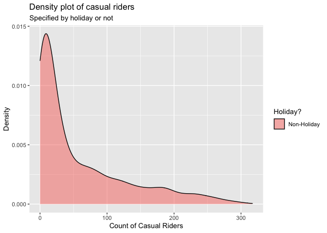

ST558 - Project 2
================
Group 5: Tyler Pollard & Lucy Yin

-   [Required Packages](#required-packages)
-   [Introduction](#introduction)
-   [Data](#data)
-   [Summarization](#summarization)
    -   [Contingency Tables](#contingency-tables)
        -   [Weather Situation](#weather-situation)
        -   [Year, Season and Count of
            Riders](#year-season-and-count-of-riders)
        -   [Working Day and Count of Casual
            Riders](#working-day-and-count-of-casual-riders)
    -   [Summary Tables](#summary-tables)
        -   [Feeling Temperature](#feeling-temperature)
        -   [Humidity](#humidity)
        -   [Wind Speed](#wind-speed)
    -   [Histograms](#histograms)
        -   [Humidity and Windspeed
            Distributions](#humidity-and-windspeed-distributions)
    -   [Density Plot](#density-plot)
        -   [Casual Riders and Weather
            Situation](#casual-riders-and-weather-situation)
        -   [Registered Riders and Weather
            Situation](#registered-riders-and-weather-situation)
        -   [Total Riders and Weather
            Situation](#total-riders-and-weather-situation)
        -   [Casual Riders and Holiday](#casual-riders-and-holiday)
        -   [Registered Riders and
            Holiday](#registered-riders-and-holiday)
        -   [Total Riders and Holiday](#total-riders-and-holiday)
    -   [Boxplots](#boxplots)
        -   [Feeling Temperature Over the
            Year](#feeling-temperature-over-the-year)
        -   [Riders of Every Hour and Weather
            Situation](#riders-of-every-hour-and-weather-situation)
    -   [Scatter Plots](#scatter-plots)
        -   [Count vs Casual by Season](#count-vs-casual-by-season)
        -   [Riders vs Temperature](#riders-vs-temperature)
        -   [Riders vs. Hour vs. Month vs. Working
            Day](#riders-vs-hour-vs-month-vs-working-day)
    -   [Correlation Plot](#correlation-plot)
        -   [Correlation between temp, atemp, hum,
            windspeed](#correlation-between-temp-atemp-hum-windspeed)
    -   [Plots with GGally](#plots-with-ggally)
        -   [Using Day Data](#using-day-data)
        -   [Using Hour Data](#using-hour-data)
-   [Modeling](#modeling)
    -   [Linear Regression Model](#linear-regression-model)
        -   [What is Linear Regression
            Model](#what-is-linear-regression-model)
        -   [Picking predictors using
            AIC](#picking-predictors-using-aic)
        -   [Modeling using AIC picked
            predictor](#modeling-using-aic-picked-predictor)
    -   [Ensemble Tree Model](#ensemble-tree-model)
        -   [Random Forest Model](#random-forest-model)
        -   [Boosted Tree Model](#boosted-tree-model)
-   [Comparison](#comparison)

# Required Packages

# Introduction

For this report we will be using 6 models (4 linear regression, 1 random
forest model, 1 boosted tree model) to make predictions on the total
count of bike riders using data from the Bike Sharing Dataset (dataset
can be found
[here](https://archive.ics.uci.edu/ml/datasets/Bike+Sharing+Dataset)).
This dataset contains hourly and daily count of registered, casual, and
total sum of riders in the Capital bikeshare system, contributing
variables include:

-   season (winter, spring, summer, fall)  
-   year (2011, 2012)  
-   month of the year
-   hour of the day  
-   holiday (yes, no)  
-   day of the week  
-   working day (yes or no)  
-   weather situation (mostly clear, mist, light precipitation, heavy
    precipitation)  
-   temperature  
-   feeling temperature  
-   humidity  
-   wind speed

There are 3 different types of response variables in the dataset:

-   registered: registered riders who uses this bikeshare service
    regularly  
-   casual: un-registered riders who use this service casually or on
    occasions  
-   total: combined count of registered and casual riders

For our analysis, we will be working with almost all of the variables as
predictors, and our response variable will be the total count of bike
riders.

We will be selecting predictors using the `step()` function which
chooses a model by AIC in a stepwise algorithm. As a result, which
predictors we incorporate in our linear regression models and ensemble
tree (specifically random forest and boosted tree) models may differ
depending on which day of the week we look at. We’ll randomly split the
data into training and test sets and fit the 6 models on the training
set. Ultimately we will fit the 6 models on the test set and decide on
which model produced the best prediction, which we judge by the smallest
root mean squared error value.

# Data

First we will read in both the `hours.csv` and `day.csv` data.

``` r
# read in data
hour.data <- read_csv("data/hour.csv") %>% as_tibble()
day.data <- read_csv("data/day.csv") %>% as_tibble()
```

We will make corrections on variable types, specifically we’re making
sure categorical variables will be appropriately classified as factors
with clear levels.

``` r
# correct the variable types
hour.data$season <- factor(hour.data$season)
levels(hour.data$season) <- list(winter = 1, spring = 2, summer = 3, fall = 4)

hour.data$yr <- factor(hour.data$yr)
levels(hour.data$yr) <- list("2011" = 0, "2012" = 1)

hour.data$weekday <- factor(hour.data$weekday)
levels(hour.data$weekday) <- list(monday = 1, tuesday = 2, wednesday = 3, thursday = 4, friday = 5, saturday = 6, sunday = 0)

hour.data$mnth <- factor(hour.data$mnth)
hour.data$hr <- factor(hour.data$hr)
hour.data$holiday <- factor(hour.data$holiday)
hour.data$workingday <- factor(hour.data$workingday)
hour.data$weathersit <- factor(hour.data$weathersit)

day.data$season <- factor(day.data$season)
levels(day.data$season) <- list(winter = 1, spring = 2, summer = 3, fall = 4)

day.data$yr <- factor(day.data$yr)
levels(day.data$yr) <- list("2011" = 0, "2012" = 1)

day.data$weekday <- factor(day.data$weekday)
levels(day.data$weekday) <- list(monday = 1, tuesday = 2, wednesday = 3, thursday = 4, friday = 5, saturday = 6, sunday = 0)

day.data$mnth <- factor(day.data$mnth)
day.data$holiday <- factor(day.data$holiday)
day.data$workingday <- factor(day.data$workingday)
day.data$weathersit <- factor(day.data$weathersit)
```

Because the variables temperature, feeling temperature, humidity and
windspeed are normalized according to different measures, we will
un-normalize them and save the raw values as separate columns in the
dataset.

``` r
# Temp Unnormal
temp.tmin = -8
temp.tmax = 39
hour.data$temp.unnormal <- hour.data$temp*(temp.tmax - temp.tmin) + temp.tmin # Unnormalize temp
hour.data$temp.F <- hour.data$temp.unnormal*(9/5) + 32 # Convert to Fahrenheit
day.data$temp.unnormal <- hour.data %>% group_by(dteday) %>% summarise(mean = mean(temp.unnormal)) %>% select(mean)
day.data$temp.unnormal <- day.data$temp.unnormal[[1]]
day.data$temp.F <- hour.data %>% group_by(dteday) %>% summarise(mean = mean(temp.F)) %>% select(mean)
day.data$temp.F <- day.data$temp.F[[1]]

# Atemp Unnormal
atemp.tmin = -16
atemp.tmax = 50
hour.data$atemp.unnormal <- hour.data$atemp*(atemp.tmax - atemp.tmin) + atemp.tmin # Unnormalize atemps
hour.data$atemp.F <- hour.data$atemp.unnormal*(9/5) + 32 # Convert to Fahrenheit
day.data$atemp.unnormal <- hour.data %>% group_by(dteday) %>% summarise(mean = mean(atemp.unnormal)) %>% select(mean)
day.data$atemp.unnormal <- day.data$atemp.unnormal[[1]]
day.data$atemp.F <- hour.data %>% group_by(dteday) %>% summarise(mean = mean(atemp.F)) %>% select(mean)
day.data$atemp.F <- day.data$atemp.F[[1]]

# Humidity Unnormal
day.data$hum.unnormal <- day.data$hum * 100
hour.data$hum.unnormal <- hour.data$hum * 100

# Windspeed Unnormal
day.data$windspeed.unnormal <- day.data$windspeed * 67
hour.data$windspeed.unnormal <- hour.data$windspeed * 67
```

Because hour and day data are stored separately, we create a
`total.data` table with all the information combined just in case we
need to access this in later steps.

``` r
# add in a new variable before merging
hour.data <- mutate(hour.data, type = "hour")
day.data <- mutate(day.data, type = "day", hr = NA) %>% select(instant, dteday, season, yr, mnth, hr, everything())

# merge to create complete list of hour/day data
total.data <- rbind(hour.data, day.data)
```

We will filter to only include data from one specific day of the week at
a time.

``` r
# filter out to one specific day of the week
hour.data <- hour.data %>% filter(weekday == params$weekday)
day.data <- day.data %>% filter(weekday == params$weekday)
total.data <- total.data %>% filter(weekday == params$weekday)
```

We randomly sample from the filtered data to form a training set (with
70% of data) and test set (with the remaining 30% of data). Here we
randomly sampled from the day dataset and split it into training and
test sets, then we split the corresponding data from the hours dataset
according to which days are in the training set and which days are in
the test set. We will be using the hours dataset for our modeling, but
we wanted to make sure our day and hour datasets had matching training
and test splits.

``` r
# splitting data into training & test sets
set.seed(7)
train <- sample(1:nrow(day.data), size = nrow(day.data)*0.7)
test <- dplyr::setdiff(1:nrow(day.data), train)
day.training.data <- day.data[train, ]
day.test.data <- day.data[test, ]

hour.training.data <- hour.data[hour.data$dteday %in% day.training.data$dteday,]
hour.test.data <- hour.data[hour.data$dteday %in% day.test.data$dteday,]
```

# Summarization

We have some basic summary statistics and plots about our training data.

## Contingency Tables

### Weather Situation

Below is a contingency table that shows the count of days that fall into
the different categories of weather situation. This table will help
justify the total count of riders because it can be expected that the
number of casual riders, which influences the total count of riders,
will be higher on nicer days that fall into the first two categories of
Mostly clear and Mist.

``` r
levels(day.training.data$weathersit) <- list(
  "Mostly clear" = "1",
  "Mist" = "2",
  "Light precipitation" = "3",
  "Heavy precipitation" = "4")
kable(t(table(day.training.data$weathersit)))
```

| Mostly clear | Mist | Light precipitation | Heavy precipitation |
|-------------:|-----:|--------------------:|--------------------:|
|           55 |   17 |                   1 |                   0 |

### Year, Season and Count of Riders

These contingency tables show what count range of riders utilized the
bikeshare service for a given season or for a given year. This table can
help us see if the number of riders increased/decreased from 2011 to
2012, or if season has an effect on how many riders used the bikeshare
service.

``` r
kable(table(day.training.data$season, cut(day.training.data$cnt, breaks = 2, dig.lab = 10)), caption = "Occurrences of # Range of Riders of a given Season")
```

|        | (597.378,4416\] | (4416,8234.622\] |
|:-------|----------------:|-----------------:|
| winter |              15 |                0 |
| spring |               4 |               13 |
| summer |               5 |               16 |
| fall   |              11 |                9 |

Occurrences of # Range of Riders of a given Season

``` r
kable(table(day.training.data$yr, cut(day.training.data$cnt, breaks = 2, dig.lab = 10)), caption = "Occurrences of # Range of Riders of a given Year")
```

|      | (597.378,4416\] | (4416,8234.622\] |
|:-----|----------------:|-----------------:|
| 2011 |              25 |               11 |
| 2012 |              10 |               27 |

Occurrences of # Range of Riders of a given Year

### Working Day and Count of Casual Riders

This contingency table show what count range of casual riders utilized
the bikeshare service on working day versus non-working day. Intuitively
we’d suspect that there would more casual riders on non-working day than
working day, this table can show us whether it’s true or not.

``` r
levels(day.training.data$workingday) <- list("workday" = 1, "non-workday" = 0)
kable(table(day.training.data$workingday, cut(day.training.data$casual, breaks = 2, dig.lab = 10)), caption = "Occurrences of # Range of Casual Riders of Workday vs. non-Workday")
```

|             | (50.771,1668.5\] | (1668.5,3286.229\] |
|:------------|-----------------:|-------------------:|
| workday     |                0 |                  0 |
| non-workday |               44 |                 29 |

Occurrences of # Range of Casual Riders of Workday vs. non-Workday

## Summary Tables

### Feeling Temperature

The summary tables of feeling temperature show the 5 number summary
along with the mean and standard deviation of what the temperature
actually felt like over the different years. The summary table for both
the normalized and raw feeling temperatures are provided. These tables
give insight to the range of feeling temperatures felt by the riders for
the different years.

``` r
# Normalized feeling temperature
atemp.summary <- hour.training.data %>% group_by(yr) %>% summarise(Min. = min(atemp), `1st Qu.` = quantile(atemp,0.25), Median = median(atemp), Mean = mean(atemp), `3rd Qu.` = quantile(atemp, 0.75), Max. = max(atemp), `St. Dev.` = sd(atemp))
kable(atemp.summary, digits = 2, caption = "Summary of feeling temperatures by year")
```

| yr   | Min. | 1st Qu. | Median | Mean | 3rd Qu. | Max. | St. Dev. |
|:-----|-----:|--------:|-------:|-----:|--------:|-----:|---------:|
| 2011 | 0.06 |    0.33 |   0.45 | 0.47 |    0.62 | 0.86 |     0.18 |
| 2012 | 0.05 |    0.39 |   0.50 | 0.50 |    0.62 | 0.91 |     0.17 |

Summary of feeling temperatures by year

``` r
# Raw feeling temperature in Fahrenheit
atemp.summary.unnormal <- hour.training.data %>% group_by(yr) %>% summarise(Min. = min(atemp.F), `1st Qu.` = quantile(atemp.F,0.25), Median = median(atemp.F), Mean = mean(atemp.F), `3rd Qu.` = quantile(atemp.F, 0.75), Max. = max(atemp.F), `St. Dev.` = sd(atemp.F))
kable(atemp.summary.unnormal, digits = 2, caption = "Summary of raw feeling temperatures by year")
```

| yr   |  Min. | 1st Qu. | Median |  Mean | 3rd Qu. |  Max. | St. Dev. |
|:-----|------:|--------:|-------:|------:|--------:|------:|---------:|
| 2011 | 10.40 |    42.8 |  57.19 | 58.49 |      77 | 105.8 |    21.97 |
| 2012 |  8.61 |    50.0 |  62.60 | 62.26 |      77 | 111.2 |    20.11 |

Summary of raw feeling temperatures by year

### Humidity

These summary tables show the spread of normalized and raw humidity
values. The table includes the 5 number summary along with mean and
standard deviation, which gives insight to the range of humidity levels
riders experienced.

``` r
kable(t(c(summary(day.training.data$hum), St.Dev. = sd(day.training.data$hum))), digits = 2, caption = "Summary of Normalized Humidity")
```

| Min. | 1st Qu. | Median | Mean | 3rd Qu. | Max. | St.Dev. |
|-----:|--------:|-------:|-----:|--------:|-----:|--------:|
| 0.28 |    0.51 |   0.64 | 0.63 |    0.74 | 0.95 |    0.14 |

Summary of Normalized Humidity

``` r
kable(t(c(summary(day.training.data$hum.unnormal), St.Dev. = sd(day.training.data$hum.unnormal))), digits = 2, caption = "Summary of Raw Humidity")  
```

|  Min. | 1st Qu. | Median |  Mean | 3rd Qu. |  Max. | St.Dev. |
|------:|--------:|-------:|------:|--------:|------:|--------:|
| 27.58 |   51.33 |  64.04 | 63.37 |   74.21 | 94.83 |   14.41 |

Summary of Raw Humidity

### Wind Speed

These summary tables show the spread of normalized and raw wind speeds.
The table includes the 5 number summary along with mean and standard
deviation, which gives insight to the range of wind speeds riders
experienced.

``` r
kable(t(c(summary(day.training.data$windspeed), St.Dev. = sd(day.training.data$windspeed))), digits = 2, caption = "Summary of Normalized Wind Speed")
```

| Min. | 1st Qu. | Median | Mean | 3rd Qu. | Max. | St.Dev. |
|-----:|--------:|-------:|-----:|--------:|-----:|--------:|
| 0.06 |    0.13 |   0.18 | 0.19 |    0.23 | 0.41 |    0.08 |

Summary of Normalized Wind Speed

``` r
kable(t(c(summary(day.training.data$windspeed.unnormal), St.Dev. = sd(day.training.data$windspeed.unnormal))), digits = 2, caption = "Summary of Raw Wind Speed ")
```

| Min. | 1st Qu. | Median |  Mean | 3rd Qu. |  Max. | St.Dev. |
|-----:|--------:|-------:|------:|--------:|------:|--------:|
| 4.25 |    9.04 |  11.96 | 12.57 |   15.08 | 27.42 |    5.04 |

Summary of Raw Wind Speed

## Histograms

### Humidity and Windspeed Distributions

The following density plots show the distribution of the weather effects
for raw humidity and raw wind speed over the span of the biker data.
These distributions provide insight on what values for each weather
effect can be expected and how the combination of each effect may drive
the different weather situations and in turn the expected count of
riders.

``` r
hum.histogram <- ggplot(data = day.training.data, aes(x = hum.unnormal)) + 
  geom_histogram(aes(y = ..density..), bins = 30) + 
  geom_density(color = "red", size = 2) + 
  labs(title = "Humidity Distribution", x = "Raw Humidity", y = "Density")
windspeed.histogram <- ggplot(data = day.training.data, aes(x = windspeed.unnormal)) + 
  geom_histogram(aes(y = ..density..), bins = 30) + 
  geom_density(color = "red", size = 2) + 
  labs(title = "Windspeed Distribution", x = "Raw Windspeed", y = "Density")
grid.arrange(hum.histogram, windspeed.histogram, ncol = 2, top = "Density Distribution of Weather Effects")
```

<!-- -->

## Density Plot

### Casual Riders and Weather Situation

This density plot shows the amount of casual riders in a given weather
situation. Intuitively we suspect that there would more casual riders in
better weather conditions. This density plot can show us whether or not
this is true.

``` r
ggplot(hour.training.data, aes(x = casual)) + 
  geom_density(alpha = 0.5, position = "stack", aes(fill = weathersit)) + 
  labs(title = "Density plot of casual riders",
       subtitle = "Specified by weather situation",
       x = "Count of Casual Riders",
       y = "Density") + 
  scale_fill_discrete(name = "Weather Situation", labels = c("Mostly Clear", "Mist", "Light Precip.", "Heavy Precip."))  
```

<!-- -->

### Registered Riders and Weather Situation

This density plot shows the amount of registered riders in a given
weather situation. We suspect that the amount of registered riders
wouldn’t be as affected by weather situation as the amount of casual
riders would. This density plot can show us whether or not this is true.

``` r
ggplot(hour.training.data, aes(x = registered)) + 
  geom_density(alpha = 0.5, position = "stack", aes(fill = weathersit)) + 
  labs(title = "Density plot of casual riders",
       subtitle = "Specified by weather situation",
       x = "Count of Registered Riders",
       y = "Density") + 
  scale_fill_discrete(name = "Weather Situation", labels = c("Mostly Clear", "Mist", "Light Precip.", "Heavy Precip."))  
```

<!-- -->

### Total Riders and Weather Situation

This density plot shows the total count of riders in a given weather
situation. We may see a relationship between how many riders there are
and what type of weather condition it is.

``` r
ggplot(hour.training.data, aes(x = cnt)) + 
  geom_density(alpha = 0.5, position = "stack", aes(fill = weathersit)) + 
  labs(title = "Density plot of casual riders",
       subtitle = "Specified by weather situation",
       x = "Total Count of Riders",
       y = "Density") + 
  scale_fill_discrete(name = "Weather Situation", labels = c("Mostly Clear", "Mist", "Light Precip.", "Heavy Precip."))  
```

<!-- -->

### Casual Riders and Holiday

This density plot shows the amount of casual riders depending on whether
it is a holiday or non-holiday. We suspect there would be more casual
riders on holidays, especially at larger counts. This density plot can
show us whether that is true.

``` r
ggplot(hour.training.data, aes(x = casual)) + 
  geom_density(alpha = 0.5, position = "stack", aes(fill = holiday)) +
  labs(title = "Density plot of casual riders",
       subtitle = "Specified by holiday or not",
       x = "Count of Casual Riders",
       y = "Density") +
  scale_fill_discrete(name = "Holiday?", labels = c("Non-Holiday", "Holiday"))    
```

<!-- -->

### Registered Riders and Holiday

This density plot shows the amount of registered riders depending on
whether it is a holiday or non-holiday. We suspect there would be more
registered riders on non-holidays, especially at larger counts. This
density plot can show us whether that is true.

``` r
ggplot(hour.training.data, aes(x = registered)) + 
  geom_density(alpha = 0.5, position = "stack", aes(fill = holiday)) +
  labs(title = "Density plot of casual riders",
       subtitle = "Specified by holiday or not",
       x = "Count of Registered Riders",
       y = "Density") +
  scale_fill_discrete(name = "Holiday?", labels = c("Non-Holiday", "Holiday"))    
```

<!-- -->

### Total Riders and Holiday

This density plot shows the total count of riders depending on whether
it is a holiday or non-holiday. This plot could show a relationship
between the amount of riders versus whether it’s a holiday or
non-holiday.

``` r
ggplot(hour.training.data, aes(x = cnt)) + 
  geom_density(alpha = 0.5, position = "stack", aes(fill = holiday)) +
  labs(title = "Density plot of casual riders",
       subtitle = "Specified by holiday or not",
       x = "Total Count of Riders",
       y = "Density") +
  scale_fill_discrete(name = "Holiday?", labels = c("Non-Holiday", "Holiday"))    
```

<!-- -->

## Boxplots

### Feeling Temperature Over the Year

To get a better understanding of the feeling temperature spreads over
the year, boxplots of the feeling temperature are plotted by month with
the data points for each day used to create them plotted overtop.
Intuitively, it can be expected that the feeling temperature rises from
the beginning of the year into the middle of summer and then drops back
down over the fall and winter months. These boxplots provide insight
into the possible number of rider fluctuation over the different months
of the year.

``` r
atemp.boxplot.df <- day.training.data
levels(atemp.boxplot.df$mnth) <- list(January = 1, February = 2, March = 3, April = 4, May = 5, June = 6, July = 7, August = 8, September = 9, October = 10, November = 11, December = 12)
ggplot(data = atemp.boxplot.df, aes(x = mnth, y = atemp.F)) + 
  geom_boxplot() + 
  geom_point(position = "jitter", color = "blue") + 
  labs(title = "Feeling temperature distribution per month", x = "Month", y = "Feeling Temperature (F)")
```

<!-- -->

### Riders of Every Hour and Weather Situation

This boxplot shows the 5 number summary (in boxplot form with occasional
outliers) of the amount of riders for each hour of the day. The colored
lines should the mean number of riders for each given weather situation.
We expect that the highest amount of riders should appear around the
morning and afternoon commute time given it’s not on a holiday or on the
weekends. This boxplot can show if that’s true.

``` r
ggplot(hour.training.data, aes(x = hr, y = cnt)) + 
  geom_boxplot() + 
  stat_summary(fun = mean, geom = "line", lwd = 0.8, aes(group = weathersit, col = weathersit)) + 
  labs(title = "Count of riders for every hr",
       subtitle = "Mean values based on weather situation",
       x = "Hour of the Day",
       y = "Count of Riders") + 
  scale_color_discrete(name = "Weather Situation", labels = c("Mostly Clear", "Mist", "Light Precip.", "Heavy Precip."))
```

<!-- -->

## Scatter Plots

### Count vs Casual by Season

These four scatter plots show the relation between the total number of
riders and casual riders by day with linear models plotted overtop
parsed by season. These plots show how the number of casual riders
contribute to the total count of riders for each season. The greater the
slope of the linear model correlates to a greater number of causal
riders contributing to the total count of riders.

``` r
ggplot(data = day.training.data, aes(x = cnt, y = casual)) +
  geom_point() +
  geom_smooth(method = "lm") +
  facet_grid(cols = vars(season)) + 
  labs(title = "Casual Riders Influence on Total Count", x = "Count", y = "Casual Riders")
```

<!-- -->

### Riders vs Temperature

Below is a scattered plot of the number of causal riders vs the raw
temperature for each day in the span of the data parsed by workingday
with a local polynomial regression line fit overtop. This plot provides
insight on how many people spontaneous chose to ride based on the raw
temperature of that day.

``` r
day.training.data$temp.indicator <- ifelse(day.training.data$temp < mean(day.training.data$temp), 0, 1)
day.training.data$temp.indicator <- as_factor(day.training.data$temp.indicator)
levels(day.training.data$temp.indicator) <- list("Low Temperature" = 0, "High Temperature" = 1)
ggplot(data = day.training.data, aes(x = temp.F, y = casual, color = workingday)) + 
  geom_point() + 
  geom_smooth() + 
  labs(title = "Casual Riders Based on Temperature", x = "Raw Temperature", y = "Number of Casual Riders")
```

<!-- -->

### Riders vs. Hour vs. Month vs. Working Day

This boxplot below shows the count of riders for every month and every
hour of the day. The color of the points indicate whether it was on a
working day (1) or non-working day (0). We suspect for working days,
there would be an obvious uptick around the morning and afternoon
commute time. But for non-working days, the amount of riders shouldn’t
have an obvious pattern around those time frames. This plot shows us
whether that’s true or not.

``` r
count.df <- hour.training.data
levels(count.df$mnth) <- list(January = 1, February = 2, March = 3, April = 4, May = 5, June = 6, July = 7, August = 8, September = 9, October = 10, November = 11, December = 12)
ggplot(count.df, aes(x = hr, y = cnt)) +
  geom_point(aes(col = workingday)) +
  facet_wrap(vars(mnth)) + 
  labs(title = "Count of riders for every hour of every month",
       subtitle = "Specified by workday or non-workday",
       x = "Hour of the Day",
       y = "Count of Riders") +
  scale_color_discrete(name = "Working Day")
```

<!-- -->

## Correlation Plot

### Correlation between temp, atemp, hum, windspeed

This correlation plots show the correlation (positive or negative)
between the 4 quantitative variables temperature, feeling temperature,
humidity and wind speed. We suspect that there likely would be a high
correlation between temperature and feeling temperature, and humidity
might be inverse correlated with wind speed. This correlation can show
us whether this is true.

``` r
cor.variables <- hour.training.data %>% select(temp, atemp, hum, windspeed)
correlation <- cor(cor.variables, method = "spearman")
corrplot(correlation)
```

<!-- -->

## Plots with GGally

The two GGally plots below will show whether there’s any relationship
between each of the variables. We run this plot on both the day and hour
data.

### Using Day Data

``` r
subset.data.day <- data_frame(weathersit=day.training.data$weathersit, temp=day.training.data$temp, atemp=day.training.data$atemp,humidity=day.training.data$hum, windspeed=day.training.data$windspeed, casual=day.training.data$casual, registered=day.training.data$registered, total=day.training.data$cnt)
GGally::ggpairs(subset.data.day)
```

<!-- -->

### Using Hour Data

``` r
subset.data.hr <- data_frame(weathersit=hour.training.data$weathersit, temp=hour.training.data$temp, atemp=hour.training.data$atemp,humidity=hour.training.data$hum, windspeed=hour.training.data$windspeed, casual=hour.training.data$casual, registered=hour.training.data$registered, total=hour.training.data$cnt)
GGally::ggpairs(subset.data.hr)
```

<!-- -->

# Modeling

## Linear Regression Model

### What is Linear Regression Model

Linear regression is a type of modeling used to predict a response based
on explanatory variables by fitting a linear equation to observed data.
For simple linear regression using a single explanatory variable to
predict a response variable the equation is
*Y*<sub>*i*</sub> = *β*<sub>0</sub> + *β*<sub>1</sub>*x*<sub>*i*</sub> + *E*<sub>*i*</sub>
where *Y*<sub>*i*</sub> is the response for the *i*<sup>*t**h*</sup>
observation, *x*<sub>*i*</sub> is the value of the explanatory variable
for the *i*<sup>*t**h*</sup> observation, *β*<sub>0</sub> is the
y-intercept, *β*<sub>1</sub> is the slope, and *E*<sub>*i*</sub> is the
error for the *i*<sup>*t**h*</sup> observation. Fitting a linear model
to the observed dataset requires estimating the coefficients *β* such
that the error term
*E*<sub>*i*</sub> = *Y*<sub>*i*</sub> − *β*<sub>0</sub> − *β*<sub>1</sub>*x*<sub>*i*</sub>
is minimized. The most common way to minimize this term is through
least-squares where we minimize the sum of squared residuals through
$min\_{\\beta\_{0},\\beta\_{1}}\\sum\_{i=1}^n ({y}\_{i} - \\beta\_{0} - \\beta\_{1}{x}\_{i})$.
Simple linear regression can be extended in many ways to include:

-   higher order terms:
    *Y*<sub>*i*</sub> = *β*<sub>0</sub> + *β*<sub>1</sub>*x*<sub>*i*</sub> + *β*<sub>2</sub>*x*<sub>*i*</sub><sup>2</sup> + *E*<sub>*i*</sub>  
-   more explanatory variables:
    *Y*<sub>*i*</sub> = *β*<sub>0</sub> + *β*<sub>1</sub>*x*<sub>1*i*</sub> + *β*<sub>2</sub>*x*<sub>2*i*</sub> + *β*<sub>3</sub>*x*<sub>1*i*</sub>*x*<sub>2*i*</sub> + *E*<sub>*i*</sub>  
-   more explanatory variables and higher order terms:
    *Y*<sub>*i*</sub> = *β*<sub>0</sub> + *β*<sub>1</sub>*x*<sub>1*i*</sub> + *β*<sub>2</sub>*x*<sub>2*i*</sub> + *β*<sub>3</sub>*x*<sub>1*i*</sub>*x*<sub>2*i*</sub> + *β*<sub>4</sub>*x*<sub>1*i*</sub><sup>2</sup> + *β*<sub>5</sub>*x*<sub>2*i*</sub><sup>2</sup> + *E*<sub>*i*</sub>

In each of these linear regressions the model is still fit by minimizing
the sum of squared errors. As the number of explanatory variables
increase these regression models can become quite large, so it is best
to compare different candidate models to see which provides the best fit
of the data. Usually you would have some sort of subject matter
knowledge to help select these candidate models by understanding which
variables are related and which variables scientifically should be put
in the model. Without subject matter knowledge you might select multiple
candidate models and compare them using fit criteria such as AIC, BIC,
AICc, Adjusted R-squared or Variance Inflation Factor (VIF).
Alternatively, you may compare prediction error by splitting the data
into a training and test set with a 80/20 split and fit the candidate
models on the training set to predict the response of the test set. The
model with the lowest RMSE should be considered to be the best fit as it
minimized the error the best.

### Picking predictors using AIC

First we want to select only the variables that we will use in our
models, as variables such as record index, date are not useful to us. We
will be using the un-normalized versions of temperature, feeling
temperature, humidity and wind speed (instead of the normalized
versions) because we want to standardize all numerical variables when
running our models.  
Because on some days of the week holiday and working day both become 1
leveled factor variables and can cause issues in our modeling, so we
will omit these 2 variables for those days of the week.

``` r
# keep only variables that are relevant to modeling
if.weekday <- hour.training.data %>% filter(weekday == params$weekday) %>% select(workingday) %>% unique() %>% nrow()
if.holiday <- hour.training.data %>% filter(weekday == params$weekday) %>% select(holiday) %>% unique() %>% nrow()

# use function to decide if a weekday has 1 factored levels
# if so we will not use these factors in the model 
get.data <- function(weekday, ...){
  if (if.weekday == 1 & if.holiday == 1) {
    hour.training.data2 <- hour.training.data %>% select(season, yr, mnth, hr, weathersit, temp.F, atemp.F, hum.unnormal, windspeed.unnormal, cnt)
  }
  else {
    hour.training.data2 <- hour.training.data %>% select(season, yr, mnth, hr, holiday, workingday, weathersit, temp.F, atemp.F, hum.unnormal, windspeed.unnormal, cnt)
  }
  hour.training.data2
}
hour.training.data2 <- get.data(params$weekday)
```

We will let the `step()` function to pick our models using the stepwise
algorithm. We provide the `step()` function with 3 different linear
models, first with just first order variables, second with squared terms
and interactions, and third with first ordered variables and
interactions.

``` r
# aic using only 1st ordered terms
fit.aic <- step((lm(cnt ~ ., data = hour.training.data2, verbose = FALSE)), direction = "both")

# aic including squared terms and interactions
fit.aic2 <- step((lm(cnt ~ .^2 + I(temp.F^2) + I(atemp.F^2) + I(hum.unnormal^2) + I(windspeed.unnormal^2), data = hour.training.data2, verbose = FALSE)), direction = "both")

# aic using 1st order and interactions
fit.aic3 <- step((lm(cnt ~.^2, data = hour.training.data2, verbose = FALSE)), direction = "both")
```

### Modeling using AIC picked predictor

For the first linear regression model we run, we will pick predictors
based on our intuition. We expect the feeling temperature would be
highly correlated with the actual temperature, and because wind speed
and humidity could also be correlated with feeling temperature, so we
only kept temperature as a predictor in the model and will not include
feeling temperature. We also did not include holiday in the model
because it has some redundant information to the working day variable.

``` r
# use all predictors except atemp and holiday
set.seed(7)
fit.mlr0 <- train(cnt ~ season + yr + mnth + hr + workingday + weathersit + temp.F + hum.unnormal + windspeed.unnormal,
                  data = hour.training.data,
                  method = "lm",
                  preProcess = c("center", "scale"),
                  trControl = trainControl(method = "cv", number = 10))
fit.mlr0
```

    ## Linear Regression 
    ## 
    ## 1747 samples
    ##    9 predictor
    ## 
    ## Pre-processing: centered (45), scaled (45) 
    ## Resampling: Cross-Validated (10 fold) 
    ## Summary of sample sizes: 1571, 1572, 1572, 1572, 1572, 1573, ... 
    ## Resampling results:
    ## 
    ##   RMSE      Rsquared  MAE     
    ##   72.93823  0.820672  56.01413
    ## 
    ## Tuning parameter 'intercept' was held constant at a value of TRUE

``` r
# Examine performance of this multiple linear regression model on the test data after prediction
predict.mlr0 <- postResample(predict(fit.mlr0, newdata = hour.test.data), obs = hour.test.data$cnt)
```

The next three linear regression models are fit using the predictors
picked by the three step functions. These models include different
number of predictors in different complexity, so we will see which
models will produce the best prediction in the end.

``` r
# use aic predictors (1st ordered terms)
set.seed(7)
fit.mlr1 <- train(fit.aic$terms,
                  data = hour.training.data2,
                  method = "lm",
                  preProcess = c("center", "scale"),
                  trControl = trainControl(method = "cv", number = 10))
fit.mlr1
```

    ## Linear Regression 
    ## 
    ## 1747 samples
    ##    8 predictor
    ## 
    ## Pre-processing: centered (44), scaled (44) 
    ## Resampling: Cross-Validated (10 fold) 
    ## Summary of sample sizes: 1571, 1572, 1572, 1572, 1572, 1573, ... 
    ## Resampling results:
    ## 
    ##   RMSE      Rsquared  MAE     
    ##   72.93823  0.820672  56.01413
    ## 
    ## Tuning parameter 'intercept' was held constant at a value of TRUE

``` r
# variables used in fit
fit.aic
```

    ## 
    ## Call:
    ## lm(formula = cnt ~ season + yr + mnth + hr + weathersit + temp.F + 
    ##     hum.unnormal + windspeed.unnormal, data = hour.training.data2, 
    ##     verbose = FALSE)
    ## 
    ## Coefficients:
    ##        (Intercept)        seasonspring        seasonsummer          seasonfall              yr2012               mnth2  
    ##           -59.0331             83.3094             77.3751            110.3828             68.2246             -8.5171  
    ##              mnth3               mnth4               mnth5               mnth6               mnth7               mnth8  
    ##            11.9731            -25.2961             -2.3836            -19.9356            -55.4572            -53.5593  
    ##              mnth9              mnth10              mnth11              mnth12                 hr1                 hr2  
    ##            14.1262            -15.7714            -34.0028            -49.7389            -13.7644            -30.4206  
    ##                hr3                 hr4                 hr5                 hr6                 hr7                 hr8  
    ##           -55.9355            -80.5225            -81.2983            -73.2473            -50.4397             -4.7191  
    ##                hr9                hr10                hr11                hr12                hr13                hr14  
    ##            58.7880            156.1203            205.8770            253.7367            247.7367            238.5494  
    ##               hr15                hr16                hr17                hr18                hr19                hr20  
    ##           228.2793            229.7275            197.9590            161.8022            118.4737             66.4636  
    ##               hr21                hr22                hr23         weathersit2         weathersit3              temp.F  
    ##            29.4636             -1.3842            -27.0319            -13.7682            -77.3844              2.6553  
    ##       hum.unnormal  windspeed.unnormal  
    ##            -1.0289             -0.3896

``` r
# Examine performance of this multiple linear regression model on the test data after prediction
predict.mlr1 <- postResample(predict(fit.mlr1, newdata = hour.test.data), obs = hour.test.data$cnt)
```

``` r
# use aic predictors (2nd ordered terms and interactions)
set.seed(7)
fit.mlr2 <- train(fit.aic2$terms,
                  data = hour.training.data2,
                  method = "lm",
                  preProcess = c("center", "scale"),
                  trControl = trainControl(method = "cv", number = 10))
fit.mlr2
```

    ## Linear Regression 
    ## 
    ## 1747 samples
    ##    9 predictor
    ## 
    ## Pre-processing: centered (373), scaled (373) 
    ## Resampling: Cross-Validated (10 fold) 
    ## Summary of sample sizes: 1571, 1572, 1572, 1572, 1572, 1573, ... 
    ## Resampling results:
    ## 
    ##   RMSE      Rsquared   MAE     
    ##   43.22603  0.9373258  31.12371
    ## 
    ## Tuning parameter 'intercept' was held constant at a value of TRUE

``` r
# variables used in fit
fit.aic2
```

    ## 
    ## Call:
    ## lm(formula = cnt ~ season + yr + mnth + hr + weathersit + temp.F + 
    ##     atemp.F + hum.unnormal + windspeed.unnormal + I(atemp.F^2) + 
    ##     I(hum.unnormal^2) + I(windspeed.unnormal^2) + season:yr + 
    ##     season:hr + season:weathersit + season:temp.F + yr:mnth + 
    ##     yr:hr + yr:weathersit + yr:temp.F + yr:atemp.F + yr:hum.unnormal + 
    ##     yr:windspeed.unnormal + mnth:weathersit + mnth:temp.F + mnth:atemp.F + 
    ##     mnth:hum.unnormal + mnth:windspeed.unnormal + hr:weathersit + 
    ##     hr:temp.F + hr:hum.unnormal + weathersit:hum.unnormal + weathersit:windspeed.unnormal + 
    ##     temp.F:atemp.F + atemp.F:windspeed.unnormal, data = hour.training.data2, 
    ##     verbose = FALSE)
    ## 
    ## Coefficients:
    ##                    (Intercept)                    seasonspring                    seasonsummer  
    ##                     -1.300e+02                      -4.110e+02                      -1.761e+02  
    ##                     seasonfall                          yr2012                           mnth2  
    ##                     -2.120e+02                       2.012e+01                       6.323e+00  
    ##                          mnth3                           mnth4                           mnth5  
    ##                     -2.952e+02                      -1.963e+02                      -1.499e+02  
    ##                          mnth6                           mnth7                           mnth8  
    ##                     -4.069e+01                      -2.690e+02                      -4.355e+02  
    ##                          mnth9                          mnth10                          mnth11  
    ##                     -3.085e+02                      -3.759e+02                       3.744e+01  
    ##                         mnth12                             hr1                             hr2  
    ##                      5.534e+01                      -6.798e+00                       2.076e+01  
    ##                            hr3                             hr4                             hr5  
    ##                      7.821e+00                       5.399e+00                       4.788e+00  
    ##                            hr6                             hr7                             hr8  
    ##                     -1.381e+01                      -6.208e+00                      -3.836e+01  
    ##                            hr9                            hr10                            hr11  
    ##                     -1.366e+01                       2.410e+01                       3.080e+01  
    ##                           hr12                            hr13                            hr14  
    ##                      8.920e+01                       8.012e+01                       7.107e+01  
    ##                           hr15                            hr16                            hr17  
    ##                      8.903e+01                       5.896e+01                       6.811e-01  
    ##                           hr18                            hr19                            hr20  
    ##                     -1.916e+01                      -3.254e+01                      -4.943e+01  
    ##                           hr21                            hr22                            hr23  
    ##                     -9.767e+01                      -6.254e+01                      -7.157e+01  
    ##                    weathersit2                     weathersit3                          temp.F  
    ##                     -4.239e+01                       1.828e+02                      -6.209e-01  
    ##                        atemp.F                    hum.unnormal              windspeed.unnormal  
    ##                      7.278e+00                       4.126e+00                       2.102e+00  
    ##                   I(atemp.F^2)               I(hum.unnormal^2)         I(windspeed.unnormal^2)  
    ##                      1.082e-01                      -3.525e-02                      -2.501e-02  
    ##            seasonspring:yr2012             seasonsummer:yr2012               seasonfall:yr2012  
    ##                     -3.041e+02                      -9.436e+01                       2.792e+01  
    ##               seasonspring:hr1                seasonsummer:hr1                  seasonfall:hr1  
    ##                     -2.177e+01                      -2.614e+01                      -1.476e+01  
    ##               seasonspring:hr2                seasonsummer:hr2                  seasonfall:hr2  
    ##                     -1.475e+01                      -8.078e+00                      -1.682e+01  
    ##               seasonspring:hr3                seasonsummer:hr3                  seasonfall:hr3  
    ##                     -1.706e+01                      -2.762e+01                      -2.226e+01  
    ##               seasonspring:hr4                seasonsummer:hr4                  seasonfall:hr4  
    ##                     -2.660e+01                      -4.187e+01                      -3.794e+01  
    ##               seasonspring:hr5                seasonsummer:hr5                  seasonfall:hr5  
    ##                     -1.653e+01                      -2.325e+01                      -2.303e+01  
    ##               seasonspring:hr6                seasonsummer:hr6                  seasonfall:hr6  
    ##                     -1.074e+01                      -2.572e+01                      -1.736e+01  
    ##               seasonspring:hr7                seasonsummer:hr7                  seasonfall:hr7  
    ##                      1.504e+01                      -1.358e+00                       4.257e-01  
    ##               seasonspring:hr8                seasonsummer:hr8                  seasonfall:hr8  
    ##                      1.645e+01                      -7.881e+00                       1.470e+01  
    ##               seasonspring:hr9                seasonsummer:hr9                  seasonfall:hr9  
    ##                      4.076e+01                       2.064e+01                       3.973e+01  
    ##              seasonspring:hr10               seasonsummer:hr10                 seasonfall:hr10  
    ##                      9.644e+01                       8.041e+01                       1.022e+02  
    ##              seasonspring:hr11               seasonsummer:hr11                 seasonfall:hr11  
    ##                      9.475e+01                       3.335e+01                       9.640e+01  
    ##              seasonspring:hr12               seasonsummer:hr12                 seasonfall:hr12  
    ##                      1.292e+02                       7.537e+01                       1.401e+02  
    ##              seasonspring:hr13               seasonsummer:hr13                 seasonfall:hr13  
    ##                      1.202e+02                       5.214e+01                       1.169e+02  
    ##              seasonspring:hr14               seasonsummer:hr14                 seasonfall:hr14  
    ##                      8.830e+01                       1.092e+01                       1.061e+02  
    ##              seasonspring:hr15               seasonsummer:hr15                 seasonfall:hr15  
    ##                      9.902e+01                      -3.645e+00                       9.600e+01  
    ##              seasonspring:hr16               seasonsummer:hr16                 seasonfall:hr16  
    ##                      8.867e+01                       1.828e+01                       1.297e+02  
    ##              seasonspring:hr17               seasonsummer:hr17                 seasonfall:hr17  
    ##                      6.869e+01                       1.061e+01                       6.594e+01  
    ##              seasonspring:hr18               seasonsummer:hr18                 seasonfall:hr18  
    ##                      7.108e+01                       3.923e+01                       3.487e+01  
    ##              seasonspring:hr19               seasonsummer:hr19                 seasonfall:hr19  
    ##                      7.091e+01                       5.581e+01                       2.495e+01  
    ##              seasonspring:hr20               seasonsummer:hr20                 seasonfall:hr20  
    ##                      3.264e+01                       1.590e+01                      -1.274e+01  
    ##              seasonspring:hr21               seasonsummer:hr21                 seasonfall:hr21  
    ##                     -1.349e+01                      -1.834e+01                      -2.463e+01  
    ##              seasonspring:hr22               seasonsummer:hr22                 seasonfall:hr22  
    ##                     -2.610e+01                      -5.763e+01                      -3.749e+01  
    ##              seasonspring:hr23               seasonsummer:hr23                 seasonfall:hr23  
    ##                     -2.056e+01                      -6.414e+01                      -3.847e+01  
    ##       seasonspring:weathersit2        seasonsummer:weathersit2          seasonfall:weathersit2  
    ##                      9.802e+01                       1.320e+02                       1.397e+02  
    ##       seasonspring:weathersit3        seasonsummer:weathersit3          seasonfall:weathersit3  
    ##                      2.083e+02                       6.378e+00                      -6.060e+01  
    ##            seasonspring:temp.F             seasonsummer:temp.F               seasonfall:temp.F  
    ##                      1.273e+01                       9.913e+00                       8.297e+00  
    ##                   yr2012:mnth2                    yr2012:mnth3                    yr2012:mnth4  
    ##                     -1.093e+02                      -3.392e+01                       2.762e+02  
    ##                   yr2012:mnth5                    yr2012:mnth6                    yr2012:mnth7  
    ##                      2.156e+02                      -2.616e+01                      -2.418e+01  
    ##                   yr2012:mnth8                    yr2012:mnth9                   yr2012:mnth10  
    ##                     -2.855e+00                              NA                      -1.018e+02  
    ##                  yr2012:mnth11                   yr2012:mnth12                      yr2012:hr1  
    ##                     -4.519e+01                              NA                      -5.328e+00  
    ##                     yr2012:hr2                      yr2012:hr3                      yr2012:hr4  
    ##                     -1.513e+01                      -2.888e+01                      -3.369e+01  
    ##                     yr2012:hr5                      yr2012:hr6                      yr2012:hr7  
    ##                     -2.955e+01                      -2.592e+01                      -1.232e+01  
    ##                     yr2012:hr8                      yr2012:hr9                     yr2012:hr10  
    ##                     -6.644e-01                       2.755e+01                       5.372e+01  
    ##                    yr2012:hr11                     yr2012:hr12                     yr2012:hr13  
    ##                      8.576e+01                       1.104e+02                       9.969e+01  
    ##                    yr2012:hr14                     yr2012:hr15                     yr2012:hr16  
    ##                      9.460e+01                       9.363e+01                       1.042e+02  
    ##                    yr2012:hr17                     yr2012:hr18                     yr2012:hr19  
    ##                      7.655e+01                       6.309e+01                       2.153e+01  
    ##                    yr2012:hr20                     yr2012:hr21                     yr2012:hr22  
    ##                      7.365e+00                      -4.938e-01                      -1.528e+01  
    ##                    yr2012:hr23              yr2012:weathersit2              yr2012:weathersit3  
    ##                     -1.691e+01                      -2.323e+01                      -1.331e+02  
    ##                  yr2012:temp.F                  yr2012:atemp.F             yr2012:hum.unnormal  
    ##                      3.954e+00                      -1.629e+00                      -4.845e-01  
    ##      yr2012:windspeed.unnormal               mnth2:weathersit2               mnth3:weathersit2  
    ##                     -1.402e+00                       2.091e+01                      -1.758e+01  
    ##              mnth4:weathersit2               mnth5:weathersit2               mnth6:weathersit2  
    ##                     -9.744e+01                      -1.291e+02                      -1.205e+02  
    ##              mnth7:weathersit2               mnth8:weathersit2               mnth9:weathersit2  
    ##                     -1.385e+02                      -1.252e+02                      -1.446e+02  
    ##             mnth10:weathersit2              mnth11:weathersit2              mnth12:weathersit2  
    ##                     -1.839e+02                      -1.474e+02                      -1.677e+02  
    ##              mnth2:weathersit3               mnth3:weathersit3               mnth4:weathersit3  
    ##                      6.953e+01                      -7.538e+01                      -3.400e+02  
    ##              mnth5:weathersit3               mnth6:weathersit3               mnth7:weathersit3  
    ##                     -2.854e+02                      -2.872e+02                      -3.186e+01  
    ##              mnth8:weathersit3               mnth9:weathersit3              mnth10:weathersit3  
    ##                     -1.178e+02                       3.459e+01                      -5.273e+01  
    ##             mnth11:weathersit3              mnth12:weathersit3                    mnth2:temp.F  
    ##                     -1.067e+02                              NA                       1.080e+01  
    ##                   mnth3:temp.F                    mnth4:temp.F                    mnth5:temp.F  
    ##                      1.057e+01                       1.115e+01                       3.870e+00  
    ##                   mnth6:temp.F                    mnth7:temp.F                    mnth8:temp.F  
    ##                      1.487e+01                       1.011e+01                       9.738e+00  
    ##                   mnth9:temp.F                   mnth10:temp.F                   mnth11:temp.F  
    ##                      1.513e+01                       1.098e+01                       1.885e+00  
    ##                  mnth12:temp.F                   mnth2:atemp.F                   mnth3:atemp.F  
    ##                      2.530e+00                      -9.673e+00                      -2.160e+00  
    ##                  mnth4:atemp.F                   mnth5:atemp.F                   mnth6:atemp.F  
    ##                     -1.120e+01                      -4.428e+00                      -1.489e+01  
    ##                  mnth7:atemp.F                   mnth8:atemp.F                   mnth9:atemp.F  
    ##                     -8.985e+00                      -6.372e+00                      -9.772e+00  
    ##                 mnth10:atemp.F                  mnth11:atemp.F                  mnth12:atemp.F  
    ##                     -5.966e+00                      -3.087e+00                      -7.323e+00  
    ##             mnth2:hum.unnormal              mnth3:hum.unnormal              mnth4:hum.unnormal  
    ##                     -6.073e-01                      -2.627e-01                       6.733e-01  
    ##             mnth5:hum.unnormal              mnth6:hum.unnormal              mnth7:hum.unnormal  
    ##                      6.404e-01                      -1.065e+00                       1.176e+00  
    ##             mnth8:hum.unnormal              mnth9:hum.unnormal             mnth10:hum.unnormal  
    ##                      2.798e-01                      -2.741e+00                       6.548e-01  
    ##            mnth11:hum.unnormal             mnth12:hum.unnormal        mnth2:windspeed.unnormal  
    ##                     -6.392e-01                       7.894e-01                      -3.127e+00  
    ##       mnth3:windspeed.unnormal        mnth4:windspeed.unnormal        mnth5:windspeed.unnormal  
    ##                     -8.522e-01                       3.679e-01                       1.597e+00  
    ##       mnth6:windspeed.unnormal        mnth7:windspeed.unnormal        mnth8:windspeed.unnormal  
    ##                      1.596e+00                       1.711e+00                       1.603e+00  
    ##       mnth9:windspeed.unnormal       mnth10:windspeed.unnormal       mnth11:windspeed.unnormal  
    ##                      1.213e+00                       5.274e-01                      -2.128e+00  
    ##      mnth12:windspeed.unnormal                 hr1:weathersit2                 hr2:weathersit2  
    ##                     -2.782e+00                       1.718e+01                       3.067e+01  
    ##                hr3:weathersit2                 hr4:weathersit2                 hr5:weathersit2  
    ##                      2.225e+01                       2.764e+01                       2.593e+01  
    ##                hr6:weathersit2                 hr7:weathersit2                 hr8:weathersit2  
    ##                      3.122e+01                       1.250e+01                       2.142e+01  
    ##                hr9:weathersit2                hr10:weathersit2                hr11:weathersit2  
    ##                      3.331e+01                       2.094e+01                       3.933e+01  
    ##               hr12:weathersit2                hr13:weathersit2                hr14:weathersit2  
    ##                      2.070e+01                       2.405e+01                      -2.023e+01  
    ##               hr15:weathersit2                hr16:weathersit2                hr17:weathersit2  
    ##                     -4.279e+00                      -3.332e+01                      -2.655e+01  
    ##               hr18:weathersit2                hr19:weathersit2                hr20:weathersit2  
    ##                     -1.676e+01                       1.346e+01                      -4.357e+00  
    ##               hr21:weathersit2                hr22:weathersit2                hr23:weathersit2  
    ##                      9.566e+00                       1.461e+01                       2.047e+01  
    ##                hr1:weathersit3                 hr2:weathersit3                 hr3:weathersit3  
    ##                     -8.015e-01                      -1.888e+01                      -2.713e+01  
    ##                hr4:weathersit3                 hr5:weathersit3                 hr6:weathersit3  
    ##                      5.848e+00                      -2.502e+01                       5.029e+01  
    ##                hr7:weathersit3                 hr8:weathersit3                 hr9:weathersit3  
    ##                      7.956e+01                       5.398e+01                       2.551e+01  
    ##               hr10:weathersit3                hr11:weathersit3                hr12:weathersit3  
    ##                     -3.679e+01                      -1.555e+01                      -9.231e+01  
    ##               hr13:weathersit3                hr14:weathersit3                hr15:weathersit3  
    ##                     -9.510e+01                      -8.497e+01                      -6.537e+01  
    ##               hr16:weathersit3                hr17:weathersit3                hr18:weathersit3  
    ##                     -6.852e+01                      -1.798e+01                      -4.463e+01  
    ##               hr19:weathersit3                hr20:weathersit3                hr21:weathersit3  
    ##                      3.692e+01                       4.181e+01                       4.426e+01  
    ##               hr22:weathersit3                hr23:weathersit3                      hr1:temp.F  
    ##                      3.678e+00                       3.754e+01                      -1.494e-01  
    ##                     hr2:temp.F                      hr3:temp.F                      hr4:temp.F  
    ##                     -7.462e-01                      -8.007e-01                      -1.289e+00  
    ##                     hr5:temp.F                      hr6:temp.F                      hr7:temp.F  
    ##                     -1.587e+00                      -1.077e+00                      -1.133e+00  
    ##                     hr8:temp.F                      hr9:temp.F                     hr10:temp.F  
    ##                      3.968e-01                       1.391e+00                       1.884e+00  
    ##                    hr11:temp.F                     hr12:temp.F                     hr13:temp.F  
    ##                      3.191e+00                       2.644e+00                       3.029e+00  
    ##                    hr14:temp.F                     hr15:temp.F                     hr16:temp.F  
    ##                      3.496e+00                       3.196e+00                       2.859e+00  
    ##                    hr17:temp.F                     hr18:temp.F                     hr19:temp.F  
    ##                      4.037e+00                       3.328e+00                       3.075e+00  
    ##                    hr20:temp.F                     hr21:temp.F                     hr22:temp.F  
    ##                      2.426e+00                       2.072e+00                       1.104e+00  
    ##                    hr23:temp.F                hr1:hum.unnormal                hr2:hum.unnormal  
    ##                      2.947e-01                       1.767e-01                       2.307e-04  
    ##               hr3:hum.unnormal                hr4:hum.unnormal                hr5:hum.unnormal  
    ##                      5.947e-02                       3.224e-01                       3.495e-01  
    ##               hr6:hum.unnormal                hr7:hum.unnormal                hr8:hum.unnormal  
    ##                      2.171e-01                       1.864e-01                       5.443e-03  
    ##               hr9:hum.unnormal               hr10:hum.unnormal               hr11:hum.unnormal  
    ##                     -7.040e-01                      -1.101e+00                      -1.772e+00  
    ##              hr12:hum.unnormal               hr13:hum.unnormal               hr14:hum.unnormal  
    ##                     -2.036e+00                      -2.085e+00                      -2.040e+00  
    ##              hr15:hum.unnormal               hr16:hum.unnormal               hr17:hum.unnormal  
    ##                     -2.155e+00                      -1.409e+00                      -1.842e+00  
    ##              hr18:hum.unnormal               hr19:hum.unnormal               hr20:hum.unnormal  
    ##                     -1.100e+00                      -1.233e+00                      -4.988e-01  
    ##              hr21:hum.unnormal               hr22:hum.unnormal               hr23:hum.unnormal  
    ##                      3.650e-01                       5.650e-01                       8.361e-01  
    ##       weathersit2:hum.unnormal        weathersit3:hum.unnormal  weathersit2:windspeed.unnormal  
    ##                      3.791e-01                      -4.154e-01                       1.185e+00  
    ## weathersit3:windspeed.unnormal                  temp.F:atemp.F      atemp.F:windspeed.unnormal  
    ##                     -1.621e+00                      -2.488e-01                      -2.916e-02

``` r
# Examine performance of this multiple linear regression model on the test data after prediction
predict.mlr2 <- postResample(predict(fit.mlr2, newdata = hour.test.data), obs = hour.test.data$cnt)
```

``` r
# use aic predictors (1st order and interactions)
set.seed(7)
fit.mlr3 <- train(fit.aic3$terms,
                  data = hour.training.data2,
                  method = "lm",
                  preProcess = c("center", "scale"),
                  trControl = trainControl(method = "cv", number = 10))
fit.mlr3
```

    ## Linear Regression 
    ## 
    ## 1747 samples
    ##    9 predictor
    ## 
    ## Pre-processing: centered (375), scaled (375) 
    ## Resampling: Cross-Validated (10 fold) 
    ## Summary of sample sizes: 1571, 1572, 1572, 1572, 1572, 1573, ... 
    ## Resampling results:
    ## 
    ##   RMSE      Rsquared   MAE     
    ##   43.98031  0.9349957  31.53481
    ## 
    ## Tuning parameter 'intercept' was held constant at a value of TRUE

``` r
# variables used in fit
fit.aic3
```

    ## 
    ## Call:
    ## lm(formula = cnt ~ season + yr + mnth + hr + weathersit + temp.F + 
    ##     atemp.F + hum.unnormal + windspeed.unnormal + season:yr + 
    ##     season:hr + season:weathersit + season:temp.F + yr:mnth + 
    ##     yr:hr + yr:weathersit + yr:temp.F + yr:atemp.F + yr:hum.unnormal + 
    ##     yr:windspeed.unnormal + mnth:weathersit + mnth:temp.F + mnth:atemp.F + 
    ##     mnth:hum.unnormal + mnth:windspeed.unnormal + hr:weathersit + 
    ##     hr:temp.F + hr:hum.unnormal + weathersit:atemp.F + weathersit:hum.unnormal + 
    ##     weathersit:windspeed.unnormal + temp.F:atemp.F + temp.F:hum.unnormal + 
    ##     atemp.F:windspeed.unnormal + hum.unnormal:windspeed.unnormal, 
    ##     data = hour.training.data2, verbose = FALSE)
    ## 
    ## Coefficients:
    ##                     (Intercept)                     seasonspring                     seasonsummer  
    ##                       156.33282                       -496.30379                       -260.70898  
    ##                      seasonfall                           yr2012                            mnth2  
    ##                      -215.56597                          9.76079                        -39.77812  
    ##                           mnth3                            mnth4                            mnth5  
    ##                      -191.95806                        -25.79466                        245.53035  
    ##                           mnth6                            mnth7                            mnth8  
    ##                       391.54228                        318.41176                         48.01479  
    ##                           mnth9                           mnth10                           mnth11  
    ##                       118.65629                       -156.95029                        146.54551  
    ##                          mnth12                              hr1                              hr2  
    ##                       105.99426                         -0.58622                         30.54995  
    ##                             hr3                              hr4                              hr5  
    ##                        19.85889                         20.03214                         28.53631  
    ##                             hr6                              hr7                              hr8  
    ##                         5.86826                         15.05374                        -14.27687  
    ##                             hr9                             hr10                             hr11  
    ##                         1.09625                         23.49965                         12.24966  
    ##                            hr12                             hr13                             hr14  
    ##                        63.21392                         46.55082                         23.32091  
    ##                            hr15                             hr16                             hr17  
    ##                        42.12855                          8.93423                        -42.55897  
    ##                            hr18                             hr19                             hr20  
    ##                       -50.73067                        -50.18430                        -58.92051  
    ##                            hr21                             hr22                             hr23  
    ##                       -93.08959                        -61.85189                        -65.68562  
    ##                     weathersit2                      weathersit3                           temp.F  
    ##                        33.32561                        384.50177                         -7.74153  
    ##                         atemp.F                     hum.unnormal               windspeed.unnormal  
    ##                         8.46534                         -2.07121                          0.92035  
    ##             seasonspring:yr2012              seasonsummer:yr2012                seasonfall:yr2012  
    ##                      -276.25540                        -82.87425                         10.66454  
    ##                seasonspring:hr1                 seasonsummer:hr1                   seasonfall:hr1  
    ##                       -22.37179                        -21.96477                        -13.91502  
    ##                seasonspring:hr2                 seasonsummer:hr2                   seasonfall:hr2  
    ##                       -13.40502                         -3.32078                        -15.30752  
    ##                seasonspring:hr3                 seasonsummer:hr3                   seasonfall:hr3  
    ##                       -15.71448                        -22.48556                        -22.42726  
    ##                seasonspring:hr4                 seasonsummer:hr4                   seasonfall:hr4  
    ##                       -21.00245                        -34.53110                        -35.90378  
    ##                seasonspring:hr5                 seasonsummer:hr5                   seasonfall:hr5  
    ##                        -4.83022                        -11.51751                        -17.01015  
    ##                seasonspring:hr6                 seasonsummer:hr6                   seasonfall:hr6  
    ##                        -2.65394                        -18.19191                        -13.07045  
    ##                seasonspring:hr7                 seasonsummer:hr7                   seasonfall:hr7  
    ##                        20.49145                          4.10008                          1.34079  
    ##                seasonspring:hr8                 seasonsummer:hr8                   seasonfall:hr8  
    ##                        23.47662                         -0.23526                         17.22506  
    ##                seasonspring:hr9                 seasonsummer:hr9                   seasonfall:hr9  
    ##                        50.36875                         32.54516                         45.54087  
    ##               seasonspring:hr10                seasonsummer:hr10                  seasonfall:hr10  
    ##                       105.53603                         88.06419                        107.20835  
    ##               seasonspring:hr11                seasonsummer:hr11                  seasonfall:hr11  
    ##                       105.19967                         39.08524                        101.58247  
    ##               seasonspring:hr12                seasonsummer:hr12                  seasonfall:hr12  
    ##                       138.70830                         79.68556                        144.24106  
    ##               seasonspring:hr13                seasonsummer:hr13                  seasonfall:hr13  
    ##                       129.77282                         57.80701                        122.69060  
    ##               seasonspring:hr14                seasonsummer:hr14                  seasonfall:hr14  
    ##                        90.06707                          6.54861                        109.54117  
    ##               seasonspring:hr15                seasonsummer:hr15                  seasonfall:hr15  
    ##                        98.34604                        -11.72582                         97.54952  
    ##               seasonspring:hr16                seasonsummer:hr16                  seasonfall:hr16  
    ##                        89.64011                         12.41922                        131.80570  
    ##               seasonspring:hr17                seasonsummer:hr17                  seasonfall:hr17  
    ##                        69.52171                          2.54298                         67.68945  
    ##               seasonspring:hr18                seasonsummer:hr18                  seasonfall:hr18  
    ##                        73.51158                         36.55871                         38.16288  
    ##               seasonspring:hr19                seasonsummer:hr19                  seasonfall:hr19  
    ##                        74.92784                         53.32774                         25.92904  
    ##               seasonspring:hr20                seasonsummer:hr20                  seasonfall:hr20  
    ##                        35.11045                         13.54830                        -12.37169  
    ##               seasonspring:hr21                seasonsummer:hr21                  seasonfall:hr21  
    ##                        -7.95616                        -17.65437                        -23.74369  
    ##               seasonspring:hr22                seasonsummer:hr22                  seasonfall:hr22  
    ##                       -21.09271                        -52.01453                        -34.12123  
    ##               seasonspring:hr23                seasonsummer:hr23                  seasonfall:hr23  
    ##                        -9.84724                        -53.88578                        -31.71314  
    ##        seasonspring:weathersit2         seasonsummer:weathersit2           seasonfall:weathersit2  
    ##                       112.61985                        140.06613                        119.94040  
    ##        seasonspring:weathersit3         seasonsummer:weathersit3           seasonfall:weathersit3  
    ##                       259.74833                         51.65706                        -43.41735  
    ##             seasonspring:temp.F              seasonsummer:temp.F                seasonfall:temp.F  
    ##                        13.52675                         10.70364                          8.12206  
    ##                    yr2012:mnth2                     yr2012:mnth3                     yr2012:mnth4  
    ##                       -83.89905                        -35.55826                        260.77993  
    ##                    yr2012:mnth5                     yr2012:mnth6                     yr2012:mnth7  
    ##                       203.21364                        -23.25385                        -20.36481  
    ##                    yr2012:mnth8                     yr2012:mnth9                    yr2012:mnth10  
    ##                         0.78586                               NA                        -74.47160  
    ##                   yr2012:mnth11                    yr2012:mnth12                       yr2012:hr1  
    ##                       -16.57270                               NA                         -6.72889  
    ##                      yr2012:hr2                       yr2012:hr3                       yr2012:hr4  
    ##                       -18.28778                        -32.25088                        -35.88128  
    ##                      yr2012:hr5                       yr2012:hr6                       yr2012:hr7  
    ##                       -30.23608                        -28.07246                        -16.01554  
    ##                      yr2012:hr8                       yr2012:hr9                      yr2012:hr10  
    ##                        -1.57054                         26.59823                         55.12106  
    ##                     yr2012:hr11                      yr2012:hr12                      yr2012:hr13  
    ##                        90.02845                        116.16001                        107.07270  
    ##                     yr2012:hr14                      yr2012:hr15                      yr2012:hr16  
    ##                       101.97037                        100.22017                        110.87608  
    ##                     yr2012:hr17                      yr2012:hr18                      yr2012:hr19  
    ##                        83.54210                         68.29188                         23.01337  
    ##                     yr2012:hr20                      yr2012:hr21                      yr2012:hr22  
    ##                         9.72339                          0.32597                        -12.52581  
    ##                     yr2012:hr23               yr2012:weathersit2               yr2012:weathersit3  
    ##                       -15.36505                        -21.57704                       -144.01934  
    ##                   yr2012:temp.F                   yr2012:atemp.F              yr2012:hum.unnormal  
    ##                         3.99184                         -1.83773                         -0.31762  
    ##       yr2012:windspeed.unnormal                mnth2:weathersit2                mnth3:weathersit2  
    ##                        -1.55865                          4.80059                        -24.70335  
    ##               mnth4:weathersit2                mnth5:weathersit2                mnth6:weathersit2  
    ##                       -91.26146                       -113.37075                       -101.13549  
    ##               mnth7:weathersit2                mnth8:weathersit2                mnth9:weathersit2  
    ##                      -110.09493                        -97.66325                       -116.23135  
    ##              mnth10:weathersit2               mnth11:weathersit2               mnth12:weathersit2  
    ##                      -146.44416                       -112.98202                       -135.98631  
    ##               mnth2:weathersit3                mnth3:weathersit3                mnth4:weathersit3  
    ##                        25.48612                        -91.28944                       -368.47326  
    ##               mnth5:weathersit3                mnth6:weathersit3                mnth7:weathersit3  
    ##                      -275.46540                       -279.62461                         -7.88104  
    ##               mnth8:weathersit3                mnth9:weathersit3               mnth10:weathersit3  
    ##                       -93.92755                         64.23029                        -53.36949  
    ##              mnth11:weathersit3               mnth12:weathersit3                     mnth2:temp.F  
    ##                      -105.26968                               NA                         10.91853  
    ##                    mnth3:temp.F                     mnth4:temp.F                     mnth5:temp.F  
    ##                         7.99637                          6.21744                         -4.56345  
    ##                    mnth6:temp.F                     mnth7:temp.F                     mnth8:temp.F  
    ##                         5.08463                         -4.11739                         -1.84031  
    ##                    mnth9:temp.F                    mnth10:temp.F                    mnth11:temp.F  
    ##                         4.70989                          4.65484                         -0.72755  
    ##                   mnth12:temp.F                    mnth2:atemp.F                    mnth3:atemp.F  
    ##                         0.60493                         -9.31928                         -1.37107  
    ##                   mnth4:atemp.F                    mnth5:atemp.F                    mnth6:atemp.F  
    ##                        -8.75769                         -0.80794                        -10.43226  
    ##                   mnth7:atemp.F                    mnth8:atemp.F                    mnth9:atemp.F  
    ##                        -1.72544                         -0.61057                         -4.69169  
    ##                  mnth10:atemp.F                   mnth11:atemp.F                   mnth12:atemp.F  
    ##                        -2.66769                         -1.95410                         -6.41936  
    ##              mnth2:hum.unnormal               mnth3:hum.unnormal               mnth4:hum.unnormal  
    ##                        -0.03284                         -0.76206                          0.13197  
    ##              mnth5:hum.unnormal               mnth6:hum.unnormal               mnth7:hum.unnormal  
    ##                        -1.16513                         -2.91359                         -1.27263  
    ##              mnth8:hum.unnormal               mnth9:hum.unnormal              mnth10:hum.unnormal  
    ##                        -1.91050                         -4.54520                         -0.46642  
    ##             mnth11:hum.unnormal              mnth12:hum.unnormal         mnth2:windspeed.unnormal  
    ##                        -1.26048                          0.73469                         -3.38835  
    ##        mnth3:windspeed.unnormal         mnth4:windspeed.unnormal         mnth5:windspeed.unnormal  
    ##                        -0.81738                          0.36348                          1.31697  
    ##        mnth6:windspeed.unnormal         mnth7:windspeed.unnormal         mnth8:windspeed.unnormal  
    ##                         1.65497                          1.78338                          1.68165  
    ##        mnth9:windspeed.unnormal        mnth10:windspeed.unnormal        mnth11:windspeed.unnormal  
    ##                         1.19616                          0.62900                         -2.50964  
    ##       mnth12:windspeed.unnormal                  hr1:weathersit2                  hr2:weathersit2  
    ##                        -2.30255                         16.19275                         30.58009  
    ##                 hr3:weathersit2                  hr4:weathersit2                  hr5:weathersit2  
    ##                        23.10353                         24.99906                         21.14592  
    ##                 hr6:weathersit2                  hr7:weathersit2                  hr8:weathersit2  
    ##                        28.08552                         10.31995                         20.28625  
    ##                 hr9:weathersit2                 hr10:weathersit2                 hr11:weathersit2  
    ##                        28.40386                         13.56746                         28.67863  
    ##                hr12:weathersit2                 hr13:weathersit2                 hr14:weathersit2  
    ##                         9.13805                         14.82054                        -32.60622  
    ##                hr15:weathersit2                 hr16:weathersit2                 hr17:weathersit2  
    ##                       -10.35738                        -39.67164                        -32.36693  
    ##                hr18:weathersit2                 hr19:weathersit2                 hr20:weathersit2  
    ##                       -20.43298                         10.79463                         -6.21237  
    ##                hr21:weathersit2                 hr22:weathersit2                 hr23:weathersit2  
    ##                         5.91412                         16.39545                         19.12718  
    ##                 hr1:weathersit3                  hr2:weathersit3                  hr3:weathersit3  
    ##                         0.35312                        -23.78977                        -24.91096  
    ##                 hr4:weathersit3                  hr5:weathersit3                  hr6:weathersit3  
    ##                        -2.22007                        -35.44619                         56.27415  
    ##                 hr7:weathersit3                  hr8:weathersit3                  hr9:weathersit3  
    ##                        81.19380                         58.22665                         25.97154  
    ##                hr10:weathersit3                 hr11:weathersit3                 hr12:weathersit3  
    ##                       -42.35569                        -28.13994                       -114.66633  
    ##                hr13:weathersit3                 hr14:weathersit3                 hr15:weathersit3  
    ##                      -112.27210                       -103.71515                        -75.35215  
    ##                hr16:weathersit3                 hr17:weathersit3                 hr18:weathersit3  
    ##                       -86.86003                        -36.34260                        -54.42990  
    ##                hr19:weathersit3                 hr20:weathersit3                 hr21:weathersit3  
    ##                        29.82860                         29.45274                         38.94184  
    ##                hr22:weathersit3                 hr23:weathersit3                       hr1:temp.F  
    ##                         0.58883                         30.10036                         -0.23486  
    ##                      hr2:temp.F                       hr3:temp.F                       hr4:temp.F  
    ##                        -0.88715                         -0.88895                         -1.40640  
    ##                      hr5:temp.F                       hr6:temp.F                       hr7:temp.F  
    ##                        -1.80074                         -1.15661                         -1.24254  
    ##                      hr8:temp.F                       hr9:temp.F                      hr10:temp.F  
    ##                         0.21633                          1.13260                          1.72036  
    ##                     hr11:temp.F                      hr12:temp.F                      hr13:temp.F  
    ##                         3.19281                          2.63120                          3.04583  
    ##                     hr14:temp.F                      hr15:temp.F                      hr16:temp.F  
    ##                         3.70450                          3.47908                          3.11915  
    ##                     hr17:temp.F                      hr18:temp.F                      hr19:temp.F  
    ##                         4.23621                          3.48018                          3.21848  
    ##                     hr20:temp.F                      hr21:temp.F                      hr22:temp.F  
    ##                         2.45604                          2.11987                          1.13107  
    ##                     hr23:temp.F                 hr1:hum.unnormal                 hr2:hum.unnormal  
    ##                         0.23980                          0.15683                         -0.03687  
    ##                hr3:hum.unnormal                 hr4:hum.unnormal                 hr5:hum.unnormal  
    ##                        -0.06748                          0.16121                          0.08020  
    ##                hr6:hum.unnormal                 hr7:hum.unnormal                 hr8:hum.unnormal  
    ##                        -0.04913                         -0.04087                         -0.23354  
    ##                hr9:hum.unnormal                hr10:hum.unnormal                hr11:hum.unnormal  
    ##                        -0.78211                         -0.98809                         -1.55232  
    ##               hr12:hum.unnormal                hr13:hum.unnormal                hr14:hum.unnormal  
    ##                        -1.65392                         -1.65924                         -1.46649  
    ##               hr15:hum.unnormal                hr16:hum.unnormal                hr17:hum.unnormal  
    ##                        -1.67941                         -0.83934                         -1.33290  
    ##               hr18:hum.unnormal                hr19:hum.unnormal                hr20:hum.unnormal  
    ##                        -0.77498                         -1.12875                         -0.40205  
    ##               hr21:hum.unnormal                hr22:hum.unnormal                hr23:hum.unnormal  
    ##                         0.21801                          0.42369                          0.68502  
    ##             weathersit2:atemp.F              weathersit3:atemp.F         weathersit2:hum.unnormal  
    ##                        -0.77195                         -1.60764                         -0.26638  
    ##        weathersit3:hum.unnormal   weathersit2:windspeed.unnormal   weathersit3:windspeed.unnormal  
    ##                        -2.02589                          0.88923                         -2.17321  
    ##                  temp.F:atemp.F              temp.F:hum.unnormal       atemp.F:windspeed.unnormal  
    ##                        -0.08843                          0.04563                         -0.03109  
    ## hum.unnormal:windspeed.unnormal  
    ##                         0.01419

``` r
# Examine performance of this multiple linear regression model on the test data after prediction
predict.mlr3 <- postResample(predict(fit.mlr3, newdata = hour.test.data), obs = hour.test.data$cnt)
```

## Ensemble Tree Model

### Random Forest Model

#### What is Random Forest Model?

The random forest model is a type of tree based method where we create
multiple trees from bootstrap samples of the data and then average the
results. This process is done by first creating a bootstrap sample of
the data and then training a tree on this sample where we call the
prediction for a given set of *x* values *ŷ*<sup>\*1</sup>(*x*). This
process is then repeated a *B* number of times to obtain
*ŷ*<sup>\**j*</sup>(*x*), *j* = 1, ..., *B*. The final prediction is the
average of these predictions
$\\hat{y}(x) = \\frac{1}{B}\\sum\_{j=1}^{B}\\hat{y}^{\*j}(x)$. For each
of these bootstrap sample/tree fits a random subset of predictors is
chosen becasue if a really strong predictor exists, every bootstrap tree
will probably use it as the first split. By selecting a subset of
predictors, a good predictor or two won’t dominate the tree fits. The
number of predictors for a random forest regression tree is usually
*m* = *p*/3 where *m* is the random predictors chosen and *p* is the
full set of possible predictors. Cross-validation can also be used to
select these random predictors as we did in our random forest model.

We first fit a random forest model using default tuning parameters,
which produced a result with very large mtry values.

``` r
# Fit random forest model
set.seed(7)
fit.random.forest.trial <- train(fit.aic$terms,
                           data = hour.training.data2,
                           method = "rf",
                           preProcess = c("center", "scale"),
                           trControl = trainControl(method = "cv", number = 10),
                           verbose = FALSE)
fit.random.forest.trial
```

    ## Random Forest 
    ## 
    ## 1747 samples
    ##    8 predictor
    ## 
    ## Pre-processing: centered (44), scaled (44) 
    ## Resampling: Cross-Validated (10 fold) 
    ## Summary of sample sizes: 1571, 1572, 1572, 1572, 1572, 1573, ... 
    ## Resampling results across tuning parameters:
    ## 
    ##   mtry  RMSE       Rsquared   MAE     
    ##    2    102.68894  0.8376910  82.02029
    ##   23     61.77692  0.8734188  40.58353
    ##   44     62.03870  0.8709062  40.05351
    ## 
    ## RMSE was used to select the optimal model using the smallest value.
    ## The final value used for the model was mtry = 23.

We can manually tune our parameters to only include 1 to the number of
predictors. We will use the result from this model to do predictions.

``` r
set.seed(7)
fit.random.forest <- train(fit.aic$terms,
                           data = hour.training.data2,
                           method = "rf",
                           preProcess = c("center", "scale"),
                           trControl = trainControl(method = "cv", number = 10),
                           tuneGrid = data.frame(mtry = 1:(ncol(hour.training.data2) -1)))
fit.random.forest
```

    ## Random Forest 
    ## 
    ## 1747 samples
    ##    8 predictor
    ## 
    ## Pre-processing: centered (44), scaled (44) 
    ## Resampling: Cross-Validated (10 fold) 
    ## Summary of sample sizes: 1571, 1572, 1572, 1572, 1572, 1573, ... 
    ## Resampling results across tuning parameters:
    ## 
    ##   mtry  RMSE       Rsquared   MAE      
    ##   1     142.05105  0.7876594  116.61660
    ##   2     102.59338  0.8386758   81.74929
    ##   3      81.85573  0.8577172   62.92802
    ##   4      72.40001  0.8667588   53.91635
    ##   5      67.96326  0.8719561   49.17955
    ##   6      65.54836  0.8744831   46.57838
    ##   7      63.87029  0.8772659   44.80000
    ##   8      62.98430  0.8779101   43.69615
    ##   9      62.44914  0.8781454   42.94941
    ## 
    ## RMSE was used to select the optimal model using the smallest value.
    ## The final value used for the model was mtry = 9.

``` r
# Examine performance of random forest model on the test data after prediction
predict.rf <- postResample(predict(fit.random.forest, newdata = hour.test.data), obs = hour.test.data$cnt)
```

### Boosted Tree Model

#### What is Boosted Tree Model?

The boosted tree model is a type of tree based method where we grow our
trees in a sequential manner, each tree we create will be based off the
previous tree so we can update our prediction as we go. For example,
we’d fit our model and get a prediction, then create a new model based
off the previous, update the prediction on this new model, and we’d
repeat this process until we decide to stop. Boosted tree model slowly
trains the trees to ensure we don’t overfit to our training data. How
this is actually done is we create new residuals based off
`observed - new predictions`, fit a tree to those residuals to get new
predictions *ŷ*, then update our predictions again by a scaled down
version of the new predictions *λ**ŷ*<sup>*b*</sup> (here *λ* is the
growth rate tuning parameter, which keeps us from growing our
predictions too quickly). We repeat this process a total of `B` times.
We can use cross validation to select what *λ*, `d` and `B` should be.
Formula used to update predictions is *ŷ* = *ŷ* + *λ**ŷ*<sup>*b*</sup>.

For the boosted tree model, we first let the model pick default tuning
parameters, from the result we will further fine tune the parameters to
see if we can get even better results.

``` r
set.seed(7)
fit.boosted.trial <- train(fit.aic$terms,
                     data = hour.training.data2,
                     method = "gbm",
                     preProcess = c("center", "scale"),
                     trControl = trainControl(method = "cv", number = 10),
                     verbose = FALSE)
fit.boosted.trial
```

    ## Stochastic Gradient Boosting 
    ## 
    ## 1747 samples
    ##    8 predictor
    ## 
    ## Pre-processing: centered (44), scaled (44) 
    ## Resampling: Cross-Validated (10 fold) 
    ## Summary of sample sizes: 1571, 1572, 1572, 1572, 1572, 1573, ... 
    ## Resampling results across tuning parameters:
    ## 
    ##   interaction.depth  n.trees  RMSE       Rsquared   MAE     
    ##   1                   50      122.20752  0.5579022  97.20428
    ##   1                  100      104.45832  0.6732677  81.27532
    ##   1                  150       93.45095  0.7295358  72.62986
    ##   2                   50       98.79298  0.7046303  78.03285
    ##   2                  100       80.62298  0.7948265  60.38157
    ##   2                  150       72.13262  0.8312841  53.21884
    ##   3                   50       87.57308  0.7660563  67.66610
    ##   3                  100       70.89345  0.8376513  51.77155
    ##   3                  150       63.76657  0.8655957  46.61471
    ## 
    ## Tuning parameter 'shrinkage' was held constant at a value of 0.1
    ## Tuning parameter 'n.minobsinnode' was held constant at
    ##  a value of 10
    ## RMSE was used to select the optimal model using the smallest value.
    ## The final values used for the model were n.trees = 150, interaction.depth = 3, shrinkage = 0.1 and n.minobsinnode = 10.

``` r
set.seed(7)
fit.boosted <- train(fit.aic$terms,
                     data = hour.training.data2,
                     method = "gbm",
                     preProcess = c("center", "scale"),
                     trControl = trainControl(method = "cv", number = 10),
                     verbose = FALSE,
                     tuneGrid = expand.grid(interaction.depth = c(3:10),
                                            n.trees = (3:10)*50,
                                            shrinkage = 0.1,
                                            n.minobsinnode = 10))
fit.boosted
```

    ## Stochastic Gradient Boosting 
    ## 
    ## 1747 samples
    ##    8 predictor
    ## 
    ## Pre-processing: centered (44), scaled (44) 
    ## Resampling: Cross-Validated (10 fold) 
    ## Summary of sample sizes: 1571, 1572, 1572, 1572, 1572, 1573, ... 
    ## Resampling results across tuning parameters:
    ## 
    ##   interaction.depth  n.trees  RMSE      Rsquared   MAE     
    ##    3                 150      63.31430  0.8678234  46.20180
    ##    3                 200      59.45158  0.8822086  43.55250
    ##    3                 250      57.16966  0.8903654  41.76223
    ##    3                 300      55.76353  0.8955024  40.79047
    ##    3                 350      54.77695  0.8988851  40.00475
    ##    3                 400      53.80618  0.9024832  39.30237
    ##    3                 450      53.26276  0.9044892  38.93564
    ##    3                 500      52.91853  0.9057171  38.74944
    ##    4                 150      59.90582  0.8802228  43.59991
    ##    4                 200      56.95511  0.8911821  41.63471
    ##    4                 250      55.30541  0.8969971  40.27303
    ##    4                 300      53.81638  0.9025584  39.20476
    ##    4                 350      52.74162  0.9063705  38.51756
    ##    4                 400      51.92853  0.9091199  37.96323
    ##    4                 450      51.39020  0.9110985  37.64841
    ##    4                 500      50.92413  0.9127182  37.24090
    ##    5                 150      56.44903  0.8934389  41.05913
    ##    5                 200      54.14976  0.9015506  39.47962
    ##    5                 250      52.67181  0.9066858  38.59911
    ##    5                 300      52.02145  0.9090165  38.02075
    ##    5                 350      51.18556  0.9119400  37.38020
    ##    5                 400      50.68668  0.9136308  36.93291
    ##    5                 450      50.16400  0.9154776  36.56661
    ##    5                 500      49.76608  0.9168628  36.24879
    ##    6                 150      55.53887  0.8962162  40.43023
    ##    6                 200      53.40901  0.9038615  38.63794
    ##    6                 250      51.85060  0.9094083  37.47948
    ##    6                 300      50.89948  0.9127183  36.86500
    ##    6                 350      50.35739  0.9146113  36.53404
    ##    6                 400      49.76539  0.9165925  36.09848
    ##    6                 450      49.38292  0.9177904  35.82902
    ##    6                 500      48.96901  0.9191302  35.57908
    ##    7                 150      53.10811  0.9050548  38.00782
    ##    7                 200      51.45034  0.9109042  37.03030
    ##    7                 250      50.44895  0.9141254  36.29668
    ##    7                 300      49.53317  0.9172260  35.68432
    ##    7                 350      48.76361  0.9198916  35.22670
    ##    7                 400      48.46711  0.9208098  34.96004
    ##    7                 450      48.05795  0.9220977  34.65012
    ##    7                 500      47.72096  0.9232211  34.43887
    ##    8                 150      51.83264  0.9097152  37.16266
    ##    8                 200      50.22524  0.9150990  36.08882
    ##    8                 250      49.27769  0.9183638  35.43849
    ##    8                 300      48.58323  0.9207518  34.96135
    ##    8                 350      48.16994  0.9221442  34.63970
    ##    8                 400      47.67573  0.9236876  34.25103
    ##    8                 450      47.29101  0.9249073  34.02745
    ##    8                 500      47.03615  0.9257998  33.79890
    ##    9                 150      50.67378  0.9137109  36.65534
    ##    9                 200      49.21720  0.9184617  35.65109
    ##    9                 250      48.48129  0.9208932  34.93781
    ##    9                 300      47.65512  0.9236056  34.47366
    ##    9                 350      47.20126  0.9250771  34.19487
    ##    9                 400      47.10072  0.9254684  34.08868
    ##    9                 450      46.63366  0.9268958  33.72533
    ##    9                 500      46.54614  0.9272058  33.69938
    ##   10                 150      50.37412  0.9146890  36.03571
    ##   10                 200      49.02192  0.9191620  35.10551
    ##   10                 250      48.35013  0.9212764  34.71476
    ##   10                 300      47.80678  0.9231118  34.36534
    ##   10                 350      47.42004  0.9243495  34.15132
    ##   10                 400      47.17753  0.9250710  33.92974
    ##   10                 450      47.13203  0.9252246  33.86759
    ##   10                 500      47.09240  0.9253672  33.85661
    ## 
    ## Tuning parameter 'shrinkage' was held constant at a value of 0.1
    ## Tuning parameter 'n.minobsinnode' was held constant at
    ##  a value of 10
    ## RMSE was used to select the optimal model using the smallest value.
    ## The final values used for the model were n.trees = 500, interaction.depth = 9, shrinkage = 0.1 and n.minobsinnode = 10.

``` r
# Examine performance of boosted tree model on the test data after prediction
predict.boosted <- postResample(predict(fit.boosted, newdata = hour.test.data), obs = hour.test.data$cnt)
```

# Comparison

We compare all 6 models on the test set and see which model produced the
lowest root mean squared error value, which indicate that model out of
the 6 had the best prediction.

``` r
compare.rmse <- data.frame(predict.mlr0, 
                           predict.mlr1,
                           predict.mlr2,
                           predict.mlr3,
                           predict.rf,
                           predict.boosted)
colnames(compare.rmse) <- c("mlr manual", "mlr aic1", "mlr aic2", "mlr aic3", "random forest", "boosted tree")
compare.rmse
```

    ##          mlr manual   mlr aic1    mlr aic2    mlr aic3 random forest boosted tree
    ## RMSE     74.0394599 74.0394599 112.5265463 107.4463449    63.6720273    52.629182
    ## Rsquared  0.7922347  0.7922347   0.6107852   0.6295492     0.8674263     0.894991
    ## MAE      57.3910797 57.3910797  80.4519669  76.7544891    45.3765762    39.550957

``` r
min.compare.rmse <- min(compare.rmse["RMSE",])
min.test <- compare.rmse["RMSE",] == min.compare.rmse
paste0("After comparing all models on the test set, the model with the best prediction (lowest root MSE value) is the ", colnames(compare.rmse)[min.test], " model.")
```

    ## [1] "After comparing all models on the test set, the model with the best prediction (lowest root MSE value) is the boosted tree model."
