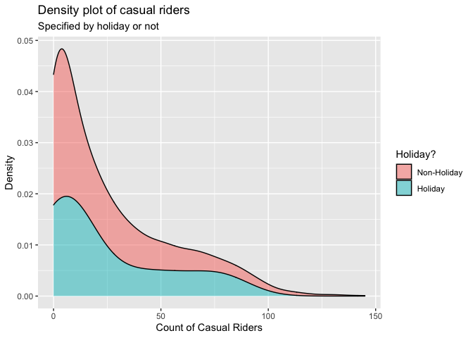

ST558 - Project 2
================
Group 5: Tyler Pollard & Lucy Yin

-   [Required Packages](#required-packages)
-   [Introduction](#introduction)
-   [Data](#data)
-   [Summarization](#summarization)
    -   [Contingency Tables](#contingency-tables)
        -   [Weather Situation](#weather-situation)
        -   [Year, Season and Count of
            Riders](#year-season-and-count-of-riders)
        -   [Working Day and Count of Casual
            Riders](#working-day-and-count-of-casual-riders)
    -   [Summary Tables](#summary-tables)
        -   [Feeling Temperature](#feeling-temperature)
        -   [Humidity](#humidity)
        -   [Wind Speed](#wind-speed)
    -   [Histograms](#histograms)
        -   [Humidity and Windspeed
            Distributions](#humidity-and-windspeed-distributions)
    -   [Density Plot](#density-plot)
        -   [Casual Riders and Weather
            Situation](#casual-riders-and-weather-situation)
        -   [Registered Riders and Weather
            Situation](#registered-riders-and-weather-situation)
        -   [Total Riders and Weather
            Situation](#total-riders-and-weather-situation)
        -   [Casual Riders and Holiday](#casual-riders-and-holiday)
        -   [Registered Riders and
            Holiday](#registered-riders-and-holiday)
        -   [Total Riders and Holiday](#total-riders-and-holiday)
    -   [Boxplots](#boxplots)
        -   [Feeling Temperature Over the
            Year](#feeling-temperature-over-the-year)
        -   [Riders of Every Hour and Weather
            Situation](#riders-of-every-hour-and-weather-situation)
    -   [Scatter Plots](#scatter-plots)
        -   [Count vs Casual by Season](#count-vs-casual-by-season)
        -   [Riders vs Temperature](#riders-vs-temperature)
        -   [Riders vs. Hour vs. Month vs. Working
            Day](#riders-vs-hour-vs-month-vs-working-day)
    -   [Correlation Plot](#correlation-plot)
        -   [Correlation between temp, atemp, hum,
            windspeed](#correlation-between-temp-atemp-hum-windspeed)
    -   [Plots with GGally](#plots-with-ggally)
        -   [Using Day Data](#using-day-data)
        -   [Using Hour Data](#using-hour-data)
-   [Modeling](#modeling)
    -   [Linear Regression Model](#linear-regression-model)
        -   [What is Linear Regression
            Model](#what-is-linear-regression-model)
        -   [Picking predictors using
            AIC](#picking-predictors-using-aic)
        -   [Modeling using AIC picked
            predictor](#modeling-using-aic-picked-predictor)
    -   [Ensemble Tree Model](#ensemble-tree-model)
        -   [Random Forest Model](#random-forest-model)
        -   [Boosted Tree Model](#boosted-tree-model)
-   [Comparison](#comparison)

# Required Packages

# Introduction

For this report we will be using 6 models (4 linear regression, 1 random
forest model, 1 boosted tree model) to make predictions on the total
count of bike riders using data from the Bike Sharing Dataset (dataset
can be found
[here](https://archive.ics.uci.edu/ml/datasets/Bike+Sharing+Dataset)).
This dataset contains hourly and daily count of registered, casual, and
total sum of riders in the Capital bikeshare system, contributing
variables include:

-   season (winter, spring, summer, fall)  
-   year (2011, 2012)  
-   month of the year
-   hour of the day  
-   holiday (yes, no)  
-   day of the week  
-   working day (yes or no)  
-   weather situation (mostly clear, mist, light precipitation, heavy
    precipitation)  
-   temperature  
-   feeling temperature  
-   humidity  
-   wind speed

There are 3 different types of response variables in the dataset:

-   registered: registered riders who uses this bikeshare service
    regularly  
-   casual: un-registered riders who use this service casually or on
    occasions  
-   total: combined count of registered and casual riders

For our analysis, we will be working with almost all of the variables as
predictors, and our response variable will be the total count of bike
riders.

We will be selecting predictors using the `step()` function which
chooses a model by AIC in a stepwise algorithm. As a result, which
predictors we incorporate in our linear regression models and ensemble
tree (specifically random forest and boosted tree) models may differ
depending on which day of the week we look at. We’ll randomly split the
data into training and test sets and fit the 6 models on the training
set. Ultimately we will fit the 6 models on the test set and decide on
which model produced the best prediction, which we judge by the smallest
root mean squared error value.

# Data

First we will read in both the `hours.csv` and `day.csv` data.

``` r
# read in data
hour.data <- read_csv("data/hour.csv") %>% as_tibble()
day.data <- read_csv("data/day.csv") %>% as_tibble()
```

We will make corrections on variable types, specifically we’re making
sure categorical variables will be appropriately classified as factors
with clear levels.

``` r
# correct the variable types
hour.data$season <- factor(hour.data$season)
levels(hour.data$season) <- list(winter = 1, spring = 2, summer = 3, fall = 4)

hour.data$yr <- factor(hour.data$yr)
levels(hour.data$yr) <- list("2011" = 0, "2012" = 1)

hour.data$weekday <- factor(hour.data$weekday)
levels(hour.data$weekday) <- list(monday = 1, tuesday = 2, wednesday = 3, thursday = 4, friday = 5, saturday = 6, sunday = 0)

hour.data$mnth <- factor(hour.data$mnth)
hour.data$hr <- factor(hour.data$hr)
hour.data$holiday <- factor(hour.data$holiday)
hour.data$workingday <- factor(hour.data$workingday)
hour.data$weathersit <- factor(hour.data$weathersit)

day.data$season <- factor(day.data$season)
levels(day.data$season) <- list(winter = 1, spring = 2, summer = 3, fall = 4)

day.data$yr <- factor(day.data$yr)
levels(day.data$yr) <- list("2011" = 0, "2012" = 1)

day.data$weekday <- factor(day.data$weekday)
levels(day.data$weekday) <- list(monday = 1, tuesday = 2, wednesday = 3, thursday = 4, friday = 5, saturday = 6, sunday = 0)

day.data$mnth <- factor(day.data$mnth)
day.data$holiday <- factor(day.data$holiday)
day.data$workingday <- factor(day.data$workingday)
day.data$weathersit <- factor(day.data$weathersit)
```

Because the variables temperature, feeling temperature, humidity and
windspeed are normalized according to different measures, we will
un-normalize them and save the raw values as separate columns in the
dataset.

``` r
# Temp Unnormal
temp.tmin = -8
temp.tmax = 39
hour.data$temp.unnormal <- hour.data$temp*(temp.tmax - temp.tmin) + temp.tmin # Unnormalize temp
hour.data$temp.F <- hour.data$temp.unnormal*(9/5) + 32 # Convert to Fahrenheit
day.data$temp.unnormal <- hour.data %>% group_by(dteday) %>% summarise(mean = mean(temp.unnormal)) %>% select(mean)
day.data$temp.unnormal <- day.data$temp.unnormal[[1]]
day.data$temp.F <- hour.data %>% group_by(dteday) %>% summarise(mean = mean(temp.F)) %>% select(mean)
day.data$temp.F <- day.data$temp.F[[1]]

# Atemp Unnormal
atemp.tmin = -16
atemp.tmax = 50
hour.data$atemp.unnormal <- hour.data$atemp*(atemp.tmax - atemp.tmin) + atemp.tmin # Unnormalize atemps
hour.data$atemp.F <- hour.data$atemp.unnormal*(9/5) + 32 # Convert to Fahrenheit
day.data$atemp.unnormal <- hour.data %>% group_by(dteday) %>% summarise(mean = mean(atemp.unnormal)) %>% select(mean)
day.data$atemp.unnormal <- day.data$atemp.unnormal[[1]]
day.data$atemp.F <- hour.data %>% group_by(dteday) %>% summarise(mean = mean(atemp.F)) %>% select(mean)
day.data$atemp.F <- day.data$atemp.F[[1]]

# Humidity Unnormal
day.data$hum.unnormal <- day.data$hum * 100
hour.data$hum.unnormal <- hour.data$hum * 100

# Windspeed Unnormal
day.data$windspeed.unnormal <- day.data$windspeed * 67
hour.data$windspeed.unnormal <- hour.data$windspeed * 67
```

Because hour and day data are stored separately, we create a
`total.data` table with all the information combined just in case we
need to access this in later steps.

``` r
# add in a new variable before merging
hour.data <- mutate(hour.data, type = "hour")
day.data <- mutate(day.data, type = "day", hr = NA) %>% select(instant, dteday, season, yr, mnth, hr, everything())

# merge to create complete list of hour/day data
total.data <- rbind(hour.data, day.data)
```

We will filter to only include data from one specific day of the week at
a time.

``` r
# filter out to one specific day of the week
hour.data <- hour.data %>% filter(weekday == params$weekday)
day.data <- day.data %>% filter(weekday == params$weekday)
total.data <- total.data %>% filter(weekday == params$weekday)
```

We randomly sample from the filtered data to form a training set (with
70% of data) and test set (with the remaining 30% of data). Here we
randomly sampled from the day dataset and split it into training and
test sets, then we split the corresponding data from the hours dataset
according to which days are in the training set and which days are in
the test set. We will be using the hours dataset for our modeling, but
we wanted to make sure our day and hour datasets had matching training
and test splits.

``` r
# splitting data into training & test sets
set.seed(7)
train <- sample(1:nrow(day.data), size = nrow(day.data)*0.7)
test <- dplyr::setdiff(1:nrow(day.data), train)
day.training.data <- day.data[train, ]
day.test.data <- day.data[test, ]

hour.training.data <- hour.data[hour.data$dteday %in% day.training.data$dteday,]
hour.test.data <- hour.data[hour.data$dteday %in% day.test.data$dteday,]
```

# Summarization

We have some basic summary statistics and plots about our training data.

## Contingency Tables

### Weather Situation

Below is a contingency table that shows the count of days that fall into
the different categories of weather situation. This table will help
justify the total count of riders because it can be expected that the
number of casual riders, which influences the total count of riders,
will be higher on nicer days that fall into the first two categories of
Mostly clear and Mist.

``` r
levels(day.training.data$weathersit) <- list(
  "Mostly clear" = "1",
  "Mist" = "2",
  "Light precipitation" = "3",
  "Heavy precipitation" = "4")
kable(t(table(day.training.data$weathersit)))
```

| Mostly clear | Mist | Light precipitation | Heavy precipitation |
|-------------:|-----:|--------------------:|--------------------:|
|           43 |   27 |                   2 |                   0 |

### Year, Season and Count of Riders

These contingency tables show what count range of riders utilized the
bikeshare service for a given season or for a given year. This table can
help us see if the number of riders increased/decreased from 2011 to
2012, or if season has an effect on how many riders used the bikeshare
service.

``` r
kable(table(day.training.data$season, cut(day.training.data$cnt, breaks = 2, dig.lab = 10)), caption = "Occurrences of # Range of Riders of a given Season")
```

|        | (423.627,4117.5\] | (4117.5,7811.373\] |
|:-------|------------------:|-------------------:|
| winter |                13 |                  1 |
| spring |                 4 |                 14 |
| summer |                 3 |                 18 |
| fall   |                 7 |                 12 |

Occurrences of # Range of Riders of a given Season

``` r
kable(table(day.training.data$yr, cut(day.training.data$cnt, breaks = 2, dig.lab = 10)), caption = "Occurrences of # Range of Riders of a given Year")
```

|      | (423.627,4117.5\] | (4117.5,7811.373\] |
|:-----|------------------:|-------------------:|
| 2011 |                23 |                 13 |
| 2012 |                 4 |                 32 |

Occurrences of # Range of Riders of a given Year

### Working Day and Count of Casual Riders

This contingency table show what count range of casual riders utilized
the bikeshare service on working day versus non-working day. Intuitively
we’d suspect that there would more casual riders on non-working day than
working day, this table can show us whether it’s true or not.

``` r
levels(day.training.data$workingday) <- list("workday" = 1, "non-workday" = 0)
kable(table(day.training.data$workingday, cut(day.training.data$casual, breaks = 2, dig.lab = 10)), caption = "Occurrences of # Range of Casual Riders of Workday vs. non-Workday")
```

|             | (13.61,710\] | (710,1406.39\] |
|:------------|-------------:|---------------:|
| workday     |           41 |             30 |
| non-workday |            1 |              0 |

Occurrences of # Range of Casual Riders of Workday vs. non-Workday

## Summary Tables

### Feeling Temperature

The summary tables of feeling temperature show the 5 number summary
along with the mean and standard deviation of what the temperature
actually felt like over the different years. The summary table for both
the normalized and raw feeling temperatures are provided. These tables
give insight to the range of feeling temperatures felt by the riders for
the different years.

``` r
# Normalized feeling temperature
atemp.summary <- hour.training.data %>% group_by(yr) %>% summarise(Min. = min(atemp), `1st Qu.` = quantile(atemp,0.25), Median = median(atemp), Mean = mean(atemp), `3rd Qu.` = quantile(atemp, 0.75), Max. = max(atemp), `St. Dev.` = sd(atemp))
kable(atemp.summary, digits = 2, caption = "Summary of feeling temperatures by year")
```

| yr   | Min. | 1st Qu. | Median | Mean | 3rd Qu. | Max. | St. Dev. |
|:-----|-----:|--------:|-------:|-----:|--------:|-----:|---------:|
| 2011 | 0.08 |    0.33 |   0.48 | 0.48 |    0.62 | 0.92 |     0.18 |
| 2012 | 0.21 |    0.36 |   0.52 | 0.51 |    0.64 | 0.89 |     0.16 |

Summary of feeling temperatures by year

``` r
# Raw feeling temperature in Fahrenheit
atemp.summary.unnormal <- hour.training.data %>% group_by(yr) %>% summarise(Min. = min(atemp.F), `1st Qu.` = quantile(atemp.F,0.25), Median = median(atemp.F), Mean = mean(atemp.F), `3rd Qu.` = quantile(atemp.F, 0.75), Max. = max(atemp.F), `St. Dev.` = sd(atemp.F))
kable(atemp.summary.unnormal, digits = 2, caption = "Summary of raw feeling temperatures by year")
```

| yr   |  Min. | 1st Qu. | Median |  Mean | 3rd Qu. |   Max. | St. Dev. |
|:-----|------:|--------:|-------:|------:|--------:|-------:|---------:|
| 2011 | 12.21 |    42.8 |  60.79 | 59.69 |    77.0 | 112.99 |    21.42 |
| 2012 | 28.40 |    46.4 |  64.41 | 64.37 |    78.8 | 109.40 |    18.82 |

Summary of raw feeling temperatures by year

### Humidity

These summary tables show the spread of normalized and raw humidity
values. The table includes the 5 number summary along with mean and
standard deviation, which gives insight to the range of humidity levels
riders experienced.

``` r
kable(t(c(summary(day.training.data$hum), St.Dev. = sd(day.training.data$hum))), digits = 2, caption = "Summary of Normalized Humidity")
```

| Min. | 1st Qu. | Median | Mean | 3rd Qu. | Max. | St.Dev. |
|-----:|--------:|-------:|-----:|--------:|-----:|--------:|
|    0 |    0.49 |   0.61 |  0.6 |    0.72 | 0.94 |    0.16 |

Summary of Normalized Humidity

``` r
kable(t(c(summary(day.training.data$hum.unnormal), St.Dev. = sd(day.training.data$hum.unnormal))), digits = 2, caption = "Summary of Raw Humidity")  
```

| Min. | 1st Qu. | Median |  Mean | 3rd Qu. |  Max. | St.Dev. |
|-----:|--------:|-------:|------:|--------:|------:|--------:|
|    0 |   49.11 |  60.77 | 60.26 |   71.82 | 93.96 |   16.02 |

Summary of Raw Humidity

### Wind Speed

These summary tables show the spread of normalized and raw wind speeds.
The table includes the 5 number summary along with mean and standard
deviation, which gives insight to the range of wind speeds riders
experienced.

``` r
kable(t(c(summary(day.training.data$windspeed), St.Dev. = sd(day.training.data$windspeed))), digits = 2, caption = "Summary of Normalized Wind Speed")
```

| Min. | 1st Qu. | Median | Mean | 3rd Qu. | Max. | St.Dev. |
|-----:|--------:|-------:|-----:|--------:|-----:|--------:|
| 0.05 |    0.13 |   0.18 | 0.19 |    0.23 | 0.44 |    0.08 |

Summary of Normalized Wind Speed

``` r
kable(t(c(summary(day.training.data$windspeed.unnormal), St.Dev. = sd(day.training.data$windspeed.unnormal))), digits = 2, caption = "Summary of Raw Wind Speed ")
```

| Min. | 1st Qu. | Median |  Mean | 3rd Qu. |  Max. | St.Dev. |
|-----:|--------:|-------:|------:|--------:|------:|--------:|
| 3.17 |    9.03 |  12.15 | 12.92 |    15.5 | 29.58 |    5.25 |

Summary of Raw Wind Speed

## Histograms

### Humidity and Windspeed Distributions

The following density plots show the distribution of the weather effects
for raw humidity and raw wind speed over the span of the biker data.
These distributions provide insight on what values for each weather
effect can be expected and how the combination of each effect may drive
the different weather situations and in turn the expected count of
riders.

``` r
hum.histogram <- ggplot(data = day.training.data, aes(x = hum.unnormal)) + 
  geom_histogram(aes(y = ..density..), bins = 30) + 
  geom_density(color = "red", size = 2) + 
  labs(title = "Humidity Distribution", x = "Raw Humidity", y = "Density")
windspeed.histogram <- ggplot(data = day.training.data, aes(x = windspeed.unnormal)) + 
  geom_histogram(aes(y = ..density..), bins = 30) + 
  geom_density(color = "red", size = 2) + 
  labs(title = "Windspeed Distribution", x = "Raw Windspeed", y = "Density")
grid.arrange(hum.histogram, windspeed.histogram, ncol = 2, top = "Density Distribution of Weather Effects")
```

<!-- -->

## Density Plot

### Casual Riders and Weather Situation

This density plot shows the amount of casual riders in a given weather
situation. Intuitively we suspect that there would more casual riders in
better weather conditions. This density plot can show us whether or not
this is true.

``` r
ggplot(hour.training.data, aes(x = casual)) + 
  geom_density(alpha = 0.5, position = "stack", aes(fill = weathersit)) + 
  labs(title = "Density plot of casual riders",
       subtitle = "Specified by weather situation",
       x = "Count of Casual Riders",
       y = "Density") + 
  scale_fill_discrete(name = "Weather Situation", labels = c("Mostly Clear", "Mist", "Light Precip.", "Heavy Precip."))  
```

<!-- -->

### Registered Riders and Weather Situation

This density plot shows the amount of registered riders in a given
weather situation. We suspect that the amount of registered riders
wouldn’t be as affected by weather situation as the amount of casual
riders would. This density plot can show us whether or not this is true.

``` r
ggplot(hour.training.data, aes(x = registered)) + 
  geom_density(alpha = 0.5, position = "stack", aes(fill = weathersit)) + 
  labs(title = "Density plot of casual riders",
       subtitle = "Specified by weather situation",
       x = "Count of Registered Riders",
       y = "Density") + 
  scale_fill_discrete(name = "Weather Situation", labels = c("Mostly Clear", "Mist", "Light Precip.", "Heavy Precip."))  
```

<!-- -->

### Total Riders and Weather Situation

This density plot shows the total count of riders in a given weather
situation. We may see a relationship between how many riders there are
and what type of weather condition it is.

``` r
ggplot(hour.training.data, aes(x = cnt)) + 
  geom_density(alpha = 0.5, position = "stack", aes(fill = weathersit)) + 
  labs(title = "Density plot of casual riders",
       subtitle = "Specified by weather situation",
       x = "Total Count of Riders",
       y = "Density") + 
  scale_fill_discrete(name = "Weather Situation", labels = c("Mostly Clear", "Mist", "Light Precip.", "Heavy Precip."))  
```

<!-- -->

### Casual Riders and Holiday

This density plot shows the amount of casual riders depending on whether
it is a holiday or non-holiday. We suspect there would be more casual
riders on holidays, especially at larger counts. This density plot can
show us whether that is true.

``` r
ggplot(hour.training.data, aes(x = casual)) + 
  geom_density(alpha = 0.5, position = "stack", aes(fill = holiday)) +
  labs(title = "Density plot of casual riders",
       subtitle = "Specified by holiday or not",
       x = "Count of Casual Riders",
       y = "Density") +
  scale_fill_discrete(name = "Holiday?", labels = c("Non-Holiday", "Holiday"))    
```

<!-- -->

### Registered Riders and Holiday

This density plot shows the amount of registered riders depending on
whether it is a holiday or non-holiday. We suspect there would be more
registered riders on non-holidays, especially at larger counts. This
density plot can show us whether that is true.

``` r
ggplot(hour.training.data, aes(x = registered)) + 
  geom_density(alpha = 0.5, position = "stack", aes(fill = holiday)) +
  labs(title = "Density plot of casual riders",
       subtitle = "Specified by holiday or not",
       x = "Count of Registered Riders",
       y = "Density") +
  scale_fill_discrete(name = "Holiday?", labels = c("Non-Holiday", "Holiday"))    
```

<!-- -->

### Total Riders and Holiday

This density plot shows the total count of riders depending on whether
it is a holiday or non-holiday. This plot could show a relationship
between the amount of riders versus whether it’s a holiday or
non-holiday.

``` r
ggplot(hour.training.data, aes(x = cnt)) + 
  geom_density(alpha = 0.5, position = "stack", aes(fill = holiday)) +
  labs(title = "Density plot of casual riders",
       subtitle = "Specified by holiday or not",
       x = "Total Count of Riders",
       y = "Density") +
  scale_fill_discrete(name = "Holiday?", labels = c("Non-Holiday", "Holiday"))    
```

<!-- -->

## Boxplots

### Feeling Temperature Over the Year

To get a better understanding of the feeling temperature spreads over
the year, boxplots of the feeling temperature are plotted by month with
the data points for each day used to create them plotted overtop.
Intuitively, it can be expected that the feeling temperature rises from
the beginning of the year into the middle of summer and then drops back
down over the fall and winter months. These boxplots provide insight
into the possible number of rider fluctuation over the different months
of the year.

``` r
atemp.boxplot.df <- day.training.data
levels(atemp.boxplot.df$mnth) <- list(January = 1, February = 2, March = 3, April = 4, May = 5, June = 6, July = 7, August = 8, September = 9, October = 10, November = 11, December = 12)
ggplot(data = atemp.boxplot.df, aes(x = mnth, y = atemp.F)) + 
  geom_boxplot() + 
  geom_point(position = "jitter", color = "blue") + 
  labs(title = "Feeling temperature distribution per month", x = "Month", y = "Feeling Temperature (F)")
```

<!-- -->

### Riders of Every Hour and Weather Situation

This boxplot shows the 5 number summary (in boxplot form with occasional
outliers) of the amount of riders for each hour of the day. The colored
lines should the mean number of riders for each given weather situation.
We expect that the highest amount of riders should appear around the
morning and afternoon commute time given it’s not on a holiday or on the
weekends. This boxplot can show if that’s true.

``` r
ggplot(hour.training.data, aes(x = hr, y = cnt)) + 
  geom_boxplot() + 
  stat_summary(fun = mean, geom = "line", lwd = 0.8, aes(group = weathersit, col = weathersit)) + 
  labs(title = "Count of riders for every hr",
       subtitle = "Mean values based on weather situation",
       x = "Hour of the Day",
       y = "Count of Riders") + 
  scale_color_discrete(name = "Weather Situation", labels = c("Mostly Clear", "Mist", "Light Precip.", "Heavy Precip."))
```

<!-- -->

## Scatter Plots

### Count vs Casual by Season

These four scatter plots show the relation between the total number of
riders and casual riders by day with linear models plotted overtop
parsed by season. These plots show how the number of casual riders
contribute to the total count of riders for each season. The greater the
slope of the linear model correlates to a greater number of causal
riders contributing to the total count of riders.

``` r
ggplot(data = day.training.data, aes(x = cnt, y = casual)) +
  geom_point() +
  geom_smooth(method = "lm") +
  facet_grid(cols = vars(season)) + 
  labs(title = "Casual Riders Influence on Total Count", x = "Count", y = "Casual Riders")
```

<!-- -->

### Riders vs Temperature

Below is a scattered plot of the number of causal riders vs the raw
temperature for each day in the span of the data parsed by workingday
with a local polynomial regression line fit overtop. This plot provides
insight on how many people spontaneous chose to ride based on the raw
temperature of that day.

``` r
day.training.data$temp.indicator <- ifelse(day.training.data$temp < mean(day.training.data$temp), 0, 1)
day.training.data$temp.indicator <- as_factor(day.training.data$temp.indicator)
levels(day.training.data$temp.indicator) <- list("Low Temperature" = 0, "High Temperature" = 1)
ggplot(data = day.training.data, aes(x = temp.F, y = casual, color = workingday)) + 
  geom_point() + 
  geom_smooth() + 
  labs(title = "Casual Riders Based on Temperature", x = "Raw Temperature", y = "Number of Casual Riders")
```

<!-- -->

### Riders vs. Hour vs. Month vs. Working Day

This boxplot below shows the count of riders for every month and every
hour of the day. The color of the points indicate whether it was on a
working day (1) or non-working day (0). We suspect for working days,
there would be an obvious uptick around the morning and afternoon
commute time. But for non-working days, the amount of riders shouldn’t
have an obvious pattern around those time frames. This plot shows us
whether that’s true or not.

``` r
count.df <- hour.training.data
levels(count.df$mnth) <- list(January = 1, February = 2, March = 3, April = 4, May = 5, June = 6, July = 7, August = 8, September = 9, October = 10, November = 11, December = 12)
ggplot(count.df, aes(x = hr, y = cnt)) +
  geom_point(aes(col = workingday)) +
  facet_wrap(vars(mnth)) + 
  labs(title = "Count of riders for every hour of every month",
       subtitle = "Specified by workday or non-workday",
       x = "Hour of the Day",
       y = "Count of Riders") +
  scale_color_discrete(name = "Working Day")
```

<!-- -->

## Correlation Plot

### Correlation between temp, atemp, hum, windspeed

This correlation plots show the correlation (positive or negative)
between the 4 quantitative variables temperature, feeling temperature,
humidity and wind speed. We suspect that there likely would be a high
correlation between temperature and feeling temperature, and humidity
might be inverse correlated with wind speed. This correlation can show
us whether this is true.

``` r
cor.variables <- hour.training.data %>% select(temp, atemp, hum, windspeed)
correlation <- cor(cor.variables, method = "spearman")
corrplot(correlation)
```

<!-- -->

## Plots with GGally

The two GGally plots below will show whether there’s any relationship
between each of the variables. We run this plot on both the day and hour
data.

### Using Day Data

``` r
subset.data.day <- data_frame(weathersit=day.training.data$weathersit, temp=day.training.data$temp, atemp=day.training.data$atemp,humidity=day.training.data$hum, windspeed=day.training.data$windspeed, casual=day.training.data$casual, registered=day.training.data$registered, total=day.training.data$cnt)
GGally::ggpairs(subset.data.day)
```

<!-- -->

### Using Hour Data

``` r
subset.data.hr <- data_frame(weathersit=hour.training.data$weathersit, temp=hour.training.data$temp, atemp=hour.training.data$atemp,humidity=hour.training.data$hum, windspeed=hour.training.data$windspeed, casual=hour.training.data$casual, registered=hour.training.data$registered, total=hour.training.data$cnt)
GGally::ggpairs(subset.data.hr)
```

<!-- -->

# Modeling

## Linear Regression Model

### What is Linear Regression Model

Linear regression is a type of modeling used to predict a response based
on explanatory variables by fitting a linear equation to observed data.
For simple linear regression using a single explanatory variable to
predict a response variable the equation is
*Y*<sub>*i*</sub> = *β*<sub>0</sub> + *β*<sub>1</sub>*x*<sub>*i*</sub> + *E*<sub>*i*</sub>
where *Y*<sub>*i*</sub> is the response for the *i*<sup>*t**h*</sup>
observation, *x*<sub>*i*</sub> is the value of the explanatory variable
for the *i*<sup>*t**h*</sup> observation, *β*<sub>0</sub> is the
y-intercept, *β*<sub>1</sub> is the slope, and *E*<sub>*i*</sub> is the
error for the *i*<sup>*t**h*</sup> observation. Fitting a linear model
to the observed dataset requires estimating the coefficients *β* such
that the error term
*E*<sub>*i*</sub> = *Y*<sub>*i*</sub> − *β*<sub>0</sub> − *β*<sub>1</sub>*x*<sub>*i*</sub>
is minimized. The most common way to minimize this term is through
least-squares where we minimize the sum of squared residuals through
$min\_{\\beta\_{0},\\beta\_{1}}\\sum\_{i=1}^n ({y}\_{i} - \\beta\_{0} - \\beta\_{1}{x}\_{i})$.
Simple linear regression can be extended in many ways to include:

-   higher order terms:
    *Y*<sub>*i*</sub> = *β*<sub>0</sub> + *β*<sub>1</sub>*x*<sub>*i*</sub> + *β*<sub>2</sub>*x*<sub>*i*</sub><sup>2</sup> + *E*<sub>*i*</sub>  
-   more explanatory variables:
    *Y*<sub>*i*</sub> = *β*<sub>0</sub> + *β*<sub>1</sub>*x*<sub>1*i*</sub> + *β*<sub>2</sub>*x*<sub>2*i*</sub> + *β*<sub>3</sub>*x*<sub>1*i*</sub>*x*<sub>2*i*</sub> + *E*<sub>*i*</sub>  
-   more explanatory variables and higher order terms:
    *Y*<sub>*i*</sub> = *β*<sub>0</sub> + *β*<sub>1</sub>*x*<sub>1*i*</sub> + *β*<sub>2</sub>*x*<sub>2*i*</sub> + *β*<sub>3</sub>*x*<sub>1*i*</sub>*x*<sub>2*i*</sub> + *β*<sub>4</sub>*x*<sub>1*i*</sub><sup>2</sup> + *β*<sub>5</sub>*x*<sub>2*i*</sub><sup>2</sup> + *E*<sub>*i*</sub>

In each of these linear regressions the model is still fit by minimizing
the sum of squared errors. As the number of explanatory variables
increase these regression models can become quite large, so it is best
to compare different candidate models to see which provides the best fit
of the data. Usually you would have some sort of subject matter
knowledge to help select these candidate models by understanding which
variables are related and which variables scientifically should be put
in the model. Without subject matter knowledge you might select multiple
candidate models and compare them using fit criteria such as AIC, BIC,
AICc, Adjusted R-squared or Variance Inflation Factor (VIF).
Alternatively, you may compare prediction error by splitting the data
into a training and test set with a 80/20 split and fit the candidate
models on the training set to predict the response of the test set. The
model with the lowest RMSE should be considered to be the best fit as it
minimized the error the best.

### Picking predictors using AIC

First we want to select only the variables that we will use in our
models, as variables such as record index, date are not useful to us. We
will be using the un-normalized versions of temperature, feeling
temperature, humidity and wind speed (instead of the normalized
versions) because we want to standardize all numerical variables when
running our models.  
Because on some days of the week holiday and working day both become 1
leveled factor variables and can cause issues in our modeling, so we
will omit these 2 variables for those days of the week.

``` r
# keep only variables that are relevant to modeling
if.weekday <- hour.training.data %>% filter(weekday == params$weekday) %>% select(workingday) %>% unique() %>% nrow()
if.holiday <- hour.training.data %>% filter(weekday == params$weekday) %>% select(holiday) %>% unique() %>% nrow()

# use function to decide if a weekday has 1 factored levels
# if so we will not use these factors in the model 
get.data <- function(weekday, ...){
  if (if.weekday == 1 & if.holiday == 1) {
    hour.training.data2 <- hour.training.data %>% select(season, yr, mnth, hr, weathersit, temp.F, atemp.F, hum.unnormal, windspeed.unnormal, cnt)
  }
  else {
    hour.training.data2 <- hour.training.data %>% select(season, yr, mnth, hr, holiday, workingday, weathersit, temp.F, atemp.F, hum.unnormal, windspeed.unnormal, cnt)
  }
  hour.training.data2
}
hour.training.data2 <- get.data(params$weekday)
```

We will let the `step()` function to pick our models using the stepwise
algorithm. We provide the `step()` function with 3 different linear
models, first with just first order variables, second with squared terms
and interactions, and third with first ordered variables and
interactions.

``` r
# aic using only 1st ordered terms
fit.aic <- step((lm(cnt ~ ., data = hour.training.data2, verbose = FALSE)), direction = "both")

# aic including squared terms and interactions
fit.aic2 <- step((lm(cnt ~ .^2 + I(temp.F^2) + I(atemp.F^2) + I(hum.unnormal^2) + I(windspeed.unnormal^2), data = hour.training.data2, verbose = FALSE)), direction = "both")

# aic using 1st order and interactions
fit.aic3 <- step((lm(cnt ~.^2, data = hour.training.data2, verbose = FALSE)), direction = "both")
```

### Modeling using AIC picked predictor

For the first linear regression model we run, we will pick predictors
based on our intuition. We expect the feeling temperature would be
highly correlated with the actual temperature, and because wind speed
and humidity could also be correlated with feeling temperature, so we
only kept temperature as a predictor in the model and will not include
feeling temperature. We also did not include holiday in the model
because it has some redundant information to the working day variable.

``` r
# use all predictors except atemp and holiday
set.seed(7)
fit.mlr0 <- train(cnt ~ season + yr + mnth + hr + workingday + weathersit + temp.F + hum.unnormal + windspeed.unnormal,
                  data = hour.training.data,
                  method = "lm",
                  preProcess = c("center", "scale"),
                  trControl = trainControl(method = "cv", number = 10))
fit.mlr0
```

    ## Linear Regression 
    ## 
    ## 1704 samples
    ##    9 predictor
    ## 
    ## Pre-processing: centered (45), scaled (45) 
    ## Resampling: Cross-Validated (10 fold) 
    ## Summary of sample sizes: 1533, 1533, 1533, 1532, 1534, 1534, ... 
    ## Resampling results:
    ## 
    ##   RMSE      Rsquared   MAE     
    ##   78.09623  0.8355253  56.10035
    ## 
    ## Tuning parameter 'intercept' was held constant at a value of TRUE

``` r
# Examine performance of this multiple linear regression model on the test data after prediction
predict.mlr0 <- postResample(predict(fit.mlr0, newdata = hour.test.data), obs = hour.test.data$cnt)
```

The next three linear regression models are fit using the predictors
picked by the three step functions. These models include different
number of predictors in different complexity, so we will see which
models will produce the best prediction in the end.

``` r
# use aic predictors (1st ordered terms)
set.seed(7)
fit.mlr1 <- train(fit.aic$terms,
                  data = hour.training.data2,
                  method = "lm",
                  preProcess = c("center", "scale"),
                  trControl = trainControl(method = "cv", number = 10))
fit.mlr1
```

    ## Linear Regression 
    ## 
    ## 1704 samples
    ##    8 predictor
    ## 
    ## Pre-processing: centered (42), scaled (42) 
    ## Resampling: Cross-Validated (10 fold) 
    ## Summary of sample sizes: 1533, 1533, 1533, 1532, 1534, 1534, ... 
    ## Resampling results:
    ## 
    ##   RMSE      Rsquared   MAE     
    ##   77.90029  0.8362969  55.94673
    ## 
    ## Tuning parameter 'intercept' was held constant at a value of TRUE

``` r
# variables used in fit
fit.aic
```

    ## 
    ## Call:
    ## lm(formula = cnt ~ yr + mnth + hr + holiday + weathersit + temp.F + 
    ##     hum.unnormal + windspeed.unnormal, data = hour.training.data2, 
    ##     verbose = FALSE)
    ## 
    ## Coefficients:
    ##        (Intercept)              yr2012               mnth2               mnth3               mnth4               mnth5  
    ##          -124.8060            104.0766             11.1514             18.6402             53.6769             82.7293  
    ##              mnth6               mnth7               mnth8               mnth9              mnth10              mnth11  
    ##            55.8671             43.0015             70.3239             89.4699             92.1018             59.6910  
    ##             mnth12                 hr1                 hr2                 hr3                 hr4                 hr5  
    ##            61.6442            -22.0708            -32.0366            -35.5738            -37.3568             -6.6292  
    ##                hr6                 hr7                 hr8                 hr9                hr10                hr11  
    ##            80.4953            280.2226            465.6793            196.4598             81.5013            104.1413  
    ##               hr12                hr13                hr14                hr15                hr16                hr17  
    ##           137.2787            128.0516            105.7715            126.6072            221.1814            469.9060  
    ##               hr18                hr19                hr20                hr21                hr22                hr23  
    ##           448.7733            308.5601            220.2118            158.3755            106.4656             58.4719  
    ##           holiday1         weathersit2         weathersit3              temp.F        hum.unnormal  windspeed.unnormal  
    ##           -78.6637             -9.2133            -82.6573              1.7862             -0.6277              0.3721

``` r
# Examine performance of this multiple linear regression model on the test data after prediction
predict.mlr1 <- postResample(predict(fit.mlr1, newdata = hour.test.data), obs = hour.test.data$cnt)
```

``` r
# use aic predictors (2nd ordered terms and interactions)
set.seed(7)
fit.mlr2 <- train(fit.aic2$terms,
                  data = hour.training.data2,
                  method = "lm",
                  preProcess = c("center", "scale"),
                  trControl = trainControl(method = "cv", number = 10))
fit.mlr2
```

    ## Linear Regression 
    ## 
    ## 1704 samples
    ##   10 predictor
    ## 
    ## Pre-processing: centered (597), scaled (597) 
    ## Resampling: Cross-Validated (10 fold) 
    ## Summary of sample sizes: 1533, 1533, 1533, 1532, 1534, 1534, ... 
    ## Resampling results:
    ## 
    ##   RMSE      Rsquared   MAE     
    ##   45.30538  0.9446004  31.07959
    ## 
    ## Tuning parameter 'intercept' was held constant at a value of TRUE

``` r
# variables used in fit
fit.aic2
```

    ## 
    ## Call:
    ## lm(formula = cnt ~ season + yr + mnth + hr + holiday + weathersit + 
    ##     temp.F + atemp.F + hum.unnormal + windspeed.unnormal + I(temp.F^2) + 
    ##     I(hum.unnormal^2) + I(windspeed.unnormal^2) + season:weathersit + 
    ##     season:hum.unnormal + yr:mnth + yr:hr + yr:temp.F + yr:atemp.F + 
    ##     mnth:hr + mnth:weathersit + mnth:temp.F + mnth:atemp.F + 
    ##     mnth:hum.unnormal + mnth:windspeed.unnormal + hr:holiday + 
    ##     hr:weathersit + hr:temp.F + hr:hum.unnormal + hr:windspeed.unnormal + 
    ##     weathersit:temp.F + weathersit:atemp.F + temp.F:atemp.F + 
    ##     temp.F:windspeed.unnormal + atemp.F:hum.unnormal, data = hour.training.data2, 
    ##     verbose = FALSE)
    ## 
    ## Coefficients:
    ##               (Intercept)               seasonspring               seasonsummer                 seasonfall  
    ##                -3.288e+02                  1.649e+02                  2.255e+02                 -3.110e+01  
    ##                    yr2012                      mnth2                      mnth3                      mnth4  
    ##                -4.546e+01                 -4.838e+01                 -2.461e+02                 -1.744e+02  
    ##                     mnth5                      mnth6                      mnth7                      mnth8  
    ##                -2.452e+02                 -3.868e+02                 -3.945e+02                 -5.123e+02  
    ##                     mnth9                     mnth10                     mnth11                     mnth12  
    ##                -1.324e+02                 -2.397e+01                  5.312e+01                 -6.942e+01  
    ##                       hr1                        hr2                        hr3                        hr4  
    ##                 3.720e+01                  5.725e+01                  3.913e+01                  4.931e+01  
    ##                       hr5                        hr6                        hr7                        hr8  
    ##                 7.512e+01                  4.837e+01                  1.159e+02                  1.708e+02  
    ##                       hr9                       hr10                       hr11                       hr12  
    ##                 1.116e+02                  4.715e+01                  1.888e+01                  6.841e+01  
    ##                      hr13                       hr14                       hr15                       hr16  
    ##                 2.774e+01                  3.738e+01                  5.473e+01                 -1.971e+01  
    ##                      hr17                       hr18                       hr19                       hr20  
    ##                 1.426e+02                  8.239e+01                  8.452e+01                  5.977e+01  
    ##                      hr21                       hr22                       hr23                   holiday1  
    ##                 3.158e+01                  3.236e+01                  6.582e+01                  3.361e+00  
    ##               weathersit2                weathersit3                     temp.F                    atemp.F  
    ##                 4.981e+01                 -6.281e+01                  2.010e+01                 -8.614e+00  
    ##              hum.unnormal         windspeed.unnormal                I(temp.F^2)          I(hum.unnormal^2)  
    ##                 1.717e+00                 -2.947e+00                 -3.006e-01                 -2.134e-02  
    ##   I(windspeed.unnormal^2)   seasonspring:weathersit2   seasonsummer:weathersit2     seasonfall:weathersit2  
    ##                -3.250e-02                  6.216e+01                 -1.658e+02                 -1.287e+01  
    ##  seasonspring:weathersit3   seasonsummer:weathersit3     seasonfall:weathersit3  seasonspring:hum.unnormal  
    ##                 5.341e+01                 -8.605e+01                 -4.689e+01                 -2.305e+00  
    ## seasonsummer:hum.unnormal    seasonfall:hum.unnormal               yr2012:mnth2               yr2012:mnth3  
    ##                -2.934e+00                  3.493e-01                 -1.566e+00                  1.600e+01  
    ##              yr2012:mnth4               yr2012:mnth5               yr2012:mnth6               yr2012:mnth7  
    ##                 2.845e+01                 -3.996e+00                 -2.950e+01                 -5.887e+00  
    ##              yr2012:mnth8               yr2012:mnth9              yr2012:mnth10              yr2012:mnth11  
    ##                 2.703e+01                 -6.498e+01                  5.364e+01                  2.969e+01  
    ##             yr2012:mnth12                 yr2012:hr1                 yr2012:hr2                 yr2012:hr3  
    ##                 2.493e+01                 -1.341e+01                 -1.558e+01                 -2.048e+01  
    ##                yr2012:hr4                 yr2012:hr5                 yr2012:hr6                 yr2012:hr7  
    ##                -1.493e+01                 -4.904e+00                  3.457e+01                  1.554e+02  
    ##                yr2012:hr8                 yr2012:hr9                yr2012:hr10                yr2012:hr11  
    ##                 2.557e+02                  1.078e+02                  4.965e+01                  5.734e+01  
    ##               yr2012:hr12                yr2012:hr13                yr2012:hr14                yr2012:hr15  
    ##                 7.483e+01                  6.279e+01                  5.167e+01                  7.299e+01  
    ##               yr2012:hr16                yr2012:hr17                yr2012:hr18                yr2012:hr19  
    ##                 1.220e+02                  2.508e+02                  2.410e+02                  1.830e+02  
    ##               yr2012:hr20                yr2012:hr21                yr2012:hr22                yr2012:hr23  
    ##                 1.207e+02                  8.218e+01                  4.085e+01                  2.122e+01  
    ##             yr2012:temp.F             yr2012:atemp.F                  mnth2:hr1                  mnth3:hr1  
    ##                -1.684e+00                  2.411e+00                 -1.862e+01                 -6.493e+00  
    ##                 mnth4:hr1                  mnth5:hr1                  mnth6:hr1                  mnth7:hr1  
    ##                -1.605e+01                 -2.631e+01                 -9.080e+00                 -2.657e+01  
    ##                 mnth8:hr1                  mnth9:hr1                 mnth10:hr1                 mnth11:hr1  
    ##                -2.049e+01                 -2.663e+01                 -1.469e+01                 -1.496e+01  
    ##                mnth12:hr1                  mnth2:hr2                  mnth3:hr2                  mnth4:hr2  
    ##                -1.211e+01                 -2.540e+01                 -6.079e+00                 -3.125e+01  
    ##                 mnth5:hr2                  mnth6:hr2                  mnth7:hr2                  mnth8:hr2  
    ##                -2.943e+01                 -2.943e+01                 -3.483e+01                 -2.555e+01  
    ##                 mnth9:hr2                 mnth10:hr2                 mnth11:hr2                 mnth12:hr2  
    ##                -3.719e+01                 -1.986e+01                 -2.131e+01                 -2.540e+01  
    ##                 mnth2:hr3                  mnth3:hr3                  mnth4:hr3                  mnth5:hr3  
    ##                -1.906e+01                 -5.663e+00                 -2.728e+01                 -3.396e+01  
    ##                 mnth6:hr3                  mnth7:hr3                  mnth8:hr3                  mnth9:hr3  
    ##                -1.924e+01                 -2.632e+01                 -2.365e+01                 -2.545e+01  
    ##                mnth10:hr3                 mnth11:hr3                 mnth12:hr3                  mnth2:hr4  
    ##                -1.336e+01                 -2.471e+01                 -1.887e+01                 -3.441e+01  
    ##                 mnth3:hr4                  mnth4:hr4                  mnth5:hr4                  mnth6:hr4  
    ##                -1.032e+01                 -2.836e+01                 -1.936e+01                 -2.499e+00  
    ##                 mnth7:hr4                  mnth8:hr4                  mnth9:hr4                 mnth10:hr4  
    ##                -1.441e+01                 -5.987e+00                 -1.657e+01                 -3.590e+00  
    ##                mnth11:hr4                 mnth12:hr4                  mnth2:hr5                  mnth3:hr5  
    ##                -1.024e+01                 -1.893e+01                 -1.623e+01                  1.082e+01  
    ##                 mnth4:hr5                  mnth5:hr5                  mnth6:hr5                  mnth7:hr5  
    ##                -7.234e+00                  1.061e+01                  3.348e+01                  2.259e+01  
    ##                 mnth8:hr5                  mnth9:hr5                 mnth10:hr5                 mnth11:hr5  
    ##                 3.712e+01                  3.995e+01                  1.555e+01                  9.545e+00  
    ##                mnth12:hr5                  mnth2:hr6                  mnth3:hr6                  mnth4:hr6  
    ##                 3.384e+00                 -1.121e+01                 -4.138e+00                 -6.080e+00  
    ##                 mnth5:hr6                  mnth6:hr6                  mnth7:hr6                  mnth8:hr6  
    ##                 2.272e+01                  4.182e+01                  2.557e+01                  4.012e+01  
    ##                 mnth9:hr6                 mnth10:hr6                 mnth11:hr6                 mnth12:hr6  
    ##                 5.742e+01                  2.496e+01                  4.009e+01                  2.062e+01  
    ##                 mnth2:hr7                  mnth3:hr7                  mnth4:hr7                  mnth5:hr7  
    ##                 1.619e+01                  1.011e+02                  1.059e+02                  2.098e+02  
    ##                 mnth6:hr7                  mnth7:hr7                  mnth8:hr7                  mnth9:hr7  
    ##                 2.503e+02                  2.307e+02                  2.392e+02                  3.061e+02  
    ##                mnth10:hr7                 mnth11:hr7                 mnth12:hr7                  mnth2:hr8  
    ##                 1.951e+02                  1.767e+02                  1.506e+02                 -1.538e+01  
    ##                 mnth3:hr8                  mnth4:hr8                  mnth5:hr8                  mnth6:hr8  
    ##                 5.138e+01                  9.348e+01                  1.586e+02                  1.568e+02  
    ##                 mnth7:hr8                  mnth8:hr8                  mnth9:hr8                 mnth10:hr8  
    ##                 1.252e+02                  1.359e+02                  2.260e+02                  2.131e+02  
    ##                mnth11:hr8                 mnth12:hr8                  mnth2:hr9                  mnth3:hr9  
    ##                 2.024e+02                  1.656e+02                 -1.619e+01                  1.231e+01  
    ##                 mnth4:hr9                  mnth5:hr9                  mnth6:hr9                  mnth7:hr9  
    ##                 1.820e+01                  8.696e+00                  4.865e+01                  1.737e+01  
    ##                 mnth8:hr9                  mnth9:hr9                 mnth10:hr9                 mnth11:hr9  
    ##                 1.246e+01                  8.598e+00                  5.387e+01                  5.313e+01  
    ##                mnth12:hr9                 mnth2:hr10                 mnth3:hr10                 mnth4:hr10  
    ##                 5.838e+01                 -2.554e+01                  2.329e+01                  1.694e+01  
    ##                mnth5:hr10                 mnth6:hr10                 mnth7:hr10                 mnth8:hr10  
    ##                 2.856e+01                  2.054e+01                  3.848e+01                  3.085e+01  
    ##                mnth9:hr10                mnth10:hr10                mnth11:hr10                mnth12:hr10  
    ##                 1.991e+01                  5.060e+01                  5.085e+01                  3.555e+01  
    ##                mnth2:hr11                 mnth3:hr11                 mnth4:hr11                 mnth5:hr11  
    ##                -6.739e+00                  8.021e+00                  3.195e+01                  2.660e+01  
    ##                mnth6:hr11                 mnth7:hr11                 mnth8:hr11                 mnth9:hr11  
    ##                 2.824e+00                  1.821e+01                  2.945e+01                  1.021e+01  
    ##               mnth10:hr11                mnth11:hr11                mnth12:hr11                 mnth2:hr12  
    ##                 4.533e+01                  5.006e+01                  3.694e+01                 -1.730e+01  
    ##                mnth3:hr12                 mnth4:hr12                 mnth5:hr12                 mnth6:hr12  
    ##                 8.644e+00                  1.624e+01                  3.047e+01                  3.554e-01  
    ##                mnth7:hr12                 mnth8:hr12                 mnth9:hr12                mnth10:hr12  
    ##                 1.204e+01                  1.301e+00                 -1.486e+01                  7.557e+01  
    ##               mnth11:hr12                mnth12:hr12                 mnth2:hr13                 mnth3:hr13  
    ##                 6.042e+01                  4.215e+01                 -3.750e+01                 -2.876e+01  
    ##                mnth4:hr13                 mnth5:hr13                 mnth6:hr13                 mnth7:hr13  
    ##                -3.340e+01                 -2.402e+01                 -8.624e+01                 -7.921e+01  
    ##                mnth8:hr13                 mnth9:hr13                mnth10:hr13                mnth11:hr13  
    ##                -8.211e+01                 -5.562e+01                  4.416e+00                  5.694e+01  
    ##               mnth12:hr13                 mnth2:hr14                 mnth3:hr14                 mnth4:hr14  
    ##                 2.494e+01                 -4.174e+01                 -1.175e+01                  1.956e+01  
    ##                mnth5:hr14                 mnth6:hr14                 mnth7:hr14                 mnth8:hr14  
    ##                -2.054e+00                 -3.800e+01                 -1.879e+01                 -2.792e+01  
    ##                mnth9:hr14                mnth10:hr14                mnth11:hr14                mnth12:hr14  
    ##                -2.890e+00                  5.019e+01                  5.394e+01                  4.143e+01  
    ##                mnth2:hr15                 mnth3:hr15                 mnth4:hr15                 mnth5:hr15  
    ##                -4.782e+01                  3.593e+00                  1.909e+01                  2.091e+01  
    ##                mnth6:hr15                 mnth7:hr15                 mnth8:hr15                 mnth9:hr15  
    ##                -1.398e+00                  1.740e+01                 -2.192e+01                  4.047e+01  
    ##               mnth10:hr15                mnth11:hr15                mnth12:hr15                 mnth2:hr16  
    ##                 9.053e+01                  6.414e+01                  7.488e+01                 -3.313e+01  
    ##                mnth3:hr16                 mnth4:hr16                 mnth5:hr16                 mnth6:hr16  
    ##                -1.786e+01                  4.463e+01                  3.667e+01                  2.828e+01  
    ##                mnth7:hr16                 mnth8:hr16                 mnth9:hr16                mnth10:hr16  
    ##                 1.382e+01                 -1.094e+01                  6.947e+01                  1.047e+02  
    ##               mnth11:hr16                mnth12:hr16                 mnth2:hr17                 mnth3:hr17  
    ##                 9.886e+01                  1.041e+02                 -3.037e-01                  4.719e+01  
    ##                mnth4:hr17                 mnth5:hr17                 mnth6:hr17                 mnth7:hr17  
    ##                 1.239e+02                  1.737e+02                  8.219e+01                  1.198e+02  
    ##                mnth8:hr17                 mnth9:hr17                mnth10:hr17                mnth11:hr17  
    ##                 1.448e+02                  2.440e+02                  2.823e+02                  1.369e+02  
    ##               mnth12:hr17                 mnth2:hr18                 mnth3:hr18                 mnth4:hr18  
    ##                 1.102e+02                  4.817e+01                  9.260e+01                  1.200e+02  
    ##                mnth5:hr18                 mnth6:hr18                 mnth7:hr18                 mnth8:hr18  
    ##                 1.550e+02                  9.345e+01                  1.079e+02                  1.609e+02  
    ##                mnth9:hr18                mnth10:hr18                mnth11:hr18                mnth12:hr18  
    ##                 2.476e+02                  2.244e+02                  1.290e+02                  7.947e+01  
    ##                mnth2:hr19                 mnth3:hr19                 mnth4:hr19                 mnth5:hr19  
    ##                 1.984e+01                  3.941e+01                  8.340e+01                  9.954e+01  
    ##                mnth6:hr19                 mnth7:hr19                 mnth8:hr19                 mnth9:hr19  
    ##                 1.175e+02                  1.148e+02                  1.240e+02                  1.785e+02  
    ##               mnth10:hr19                mnth11:hr19                mnth12:hr19                 mnth2:hr20  
    ##                 1.435e+02                  6.965e+01                  3.528e+01                  2.726e+01  
    ##                mnth3:hr20                 mnth4:hr20                 mnth5:hr20                 mnth6:hr20  
    ##                 1.019e+01                 -1.630e+00                  7.571e+01                  6.604e+01  
    ##                mnth7:hr20                 mnth8:hr20                 mnth9:hr20                mnth10:hr20  
    ##                 7.915e+01                  6.917e+01                  7.194e+01                  8.821e+01  
    ##               mnth11:hr20                mnth12:hr20                 mnth2:hr21                 mnth3:hr21  
    ##                 4.167e+01                  3.005e+01                  1.478e+01                  4.550e+01  
    ##                mnth4:hr21                 mnth5:hr21                 mnth6:hr21                 mnth7:hr21  
    ##                 2.062e+01                  6.576e+01                  1.275e+02                  1.123e+02  
    ##                mnth8:hr21                 mnth9:hr21                mnth10:hr21                mnth11:hr21  
    ##                 7.390e+01                  8.894e+01                  6.801e+01                  6.439e+01  
    ##               mnth12:hr21                 mnth2:hr22                 mnth3:hr22                 mnth4:hr22  
    ##                 4.517e+01                  6.374e+00                  1.126e+01                 -9.822e+00  
    ##                mnth5:hr22                 mnth6:hr22                 mnth7:hr22                 mnth8:hr22  
    ##                 1.471e+01                  2.924e+01                  2.334e+01                  2.829e+00  
    ##                mnth9:hr22                mnth10:hr22                mnth11:hr22                mnth12:hr22  
    ##                 6.508e+01                  2.958e+01                  2.803e+01                  4.087e+01  
    ##                mnth2:hr23                 mnth3:hr23                 mnth4:hr23                 mnth5:hr23  
    ##                 3.629e+00                  9.289e-01                 -2.380e+01                 -9.655e+00  
    ##                mnth6:hr23                 mnth7:hr23                 mnth8:hr23                 mnth9:hr23  
    ##                -8.316e+00                  1.495e+01                  1.072e+01                  3.562e+01  
    ##               mnth10:hr23                mnth11:hr23                mnth12:hr23          mnth2:weathersit2  
    ##                 1.892e+01                  2.858e+01                  4.024e+01                 -1.915e+01  
    ##         mnth3:weathersit2          mnth4:weathersit2          mnth5:weathersit2          mnth6:weathersit2  
    ##                -1.840e+01                 -1.040e+02                 -7.893e+01                 -9.763e+01  
    ##         mnth7:weathersit2          mnth8:weathersit2          mnth9:weathersit2         mnth10:weathersit2  
    ##                 1.117e+02                  1.403e+02                  1.245e+02                 -3.162e+01  
    ##        mnth11:weathersit2         mnth12:weathersit2          mnth2:weathersit3          mnth3:weathersit3  
    ##                -1.033e+01                 -1.585e+01                  6.437e+01                  1.094e+02  
    ##         mnth4:weathersit3          mnth5:weathersit3          mnth6:weathersit3          mnth7:weathersit3  
    ##                -1.242e+02                  1.733e+01                 -3.714e+01                  2.600e+01  
    ##         mnth8:weathersit3          mnth9:weathersit3         mnth10:weathersit3         mnth11:weathersit3  
    ##                 8.995e+01                 -3.698e+00                  3.642e+01                  6.753e+01  
    ##        mnth12:weathersit3               mnth2:temp.F               mnth3:temp.F               mnth4:temp.F  
    ##                -2.901e+01                  6.096e+00                  1.131e+01                  3.979e+00  
    ##              mnth5:temp.F               mnth6:temp.F               mnth7:temp.F               mnth8:temp.F  
    ##                 1.142e+01                  1.075e+01                  1.718e+01                  1.865e+01  
    ##              mnth9:temp.F              mnth10:temp.F              mnth11:temp.F              mnth12:temp.F  
    ##                 7.002e+00                  1.061e+01                  2.590e+00                  1.193e+01  
    ##             mnth2:atemp.F              mnth3:atemp.F              mnth4:atemp.F              mnth5:atemp.F  
    ##                -3.968e+00                 -5.502e+00                 -5.783e-01                 -4.866e+00  
    ##             mnth6:atemp.F              mnth7:atemp.F              mnth8:atemp.F              mnth9:atemp.F  
    ##                -2.203e+00                 -9.004e+00                 -8.773e+00                 -8.628e-01  
    ##            mnth10:atemp.F             mnth11:atemp.F             mnth12:atemp.F         mnth2:hum.unnormal  
    ##                -6.052e+00                 -2.622e+00                 -7.602e+00                 -5.140e-01  
    ##        mnth3:hum.unnormal         mnth4:hum.unnormal         mnth5:hum.unnormal         mnth6:hum.unnormal  
    ##                -3.060e-01                  6.343e-01                 -3.364e-01                 -1.051e+00  
    ##        mnth7:hum.unnormal         mnth8:hum.unnormal         mnth9:hum.unnormal        mnth10:hum.unnormal  
    ##                 4.180e-01                 -3.333e-01                 -7.929e-01                 -2.386e+00  
    ##       mnth11:hum.unnormal        mnth12:hum.unnormal   mnth2:windspeed.unnormal   mnth3:windspeed.unnormal  
    ##                -6.498e-01                 -1.614e+00                 -9.252e-01                 -2.818e+00  
    ##  mnth4:windspeed.unnormal   mnth5:windspeed.unnormal   mnth6:windspeed.unnormal   mnth7:windspeed.unnormal  
    ##                -2.269e+00                 -4.861e+00                 -3.365e+00                 -5.218e+00  
    ##  mnth8:windspeed.unnormal   mnth9:windspeed.unnormal  mnth10:windspeed.unnormal  mnth11:windspeed.unnormal  
    ##                -4.603e+00                 -7.625e+00                 -3.164e+00                 -1.089e+00  
    ## mnth12:windspeed.unnormal               hr1:holiday1               hr2:holiday1               hr3:holiday1  
    ##                -2.180e+00                  1.480e+01                  1.058e+01                 -1.469e+00  
    ##              hr4:holiday1               hr5:holiday1               hr6:holiday1               hr7:holiday1  
    ##                -3.134e+00                 -9.237e+00                 -8.482e+01                 -2.162e+02  
    ##              hr8:holiday1               hr9:holiday1              hr10:holiday1              hr11:holiday1  
    ##                -3.815e+02                 -1.030e+02                  1.760e+01                  4.860e+01  
    ##             hr12:holiday1              hr13:holiday1              hr14:holiday1              hr15:holiday1  
    ##                 2.303e+01                  2.157e+01                  5.990e+01                  4.503e+01  
    ##             hr16:holiday1              hr17:holiday1              hr18:holiday1              hr19:holiday1  
    ##                -8.199e+01                 -2.638e+02                 -2.994e+02                 -1.815e+02  
    ##             hr20:holiday1              hr21:holiday1              hr22:holiday1              hr23:holiday1  
    ##                -1.266e+02                 -1.259e+02                 -9.424e+01                 -6.484e+01  
    ##           hr1:weathersit2            hr2:weathersit2            hr3:weathersit2            hr4:weathersit2  
    ##                 9.999e-01                  4.391e+00                  1.993e+00                  7.362e+00  
    ##           hr5:weathersit2            hr6:weathersit2            hr7:weathersit2            hr8:weathersit2  
    ##                 1.026e+01                  7.516e-01                 -1.140e+01                 -9.359e+00  
    ##           hr9:weathersit2           hr10:weathersit2           hr11:weathersit2           hr12:weathersit2  
    ##                -6.362e+00                 -1.092e+01                 -1.178e+00                 -1.452e+01  
    ##          hr13:weathersit2           hr14:weathersit2           hr15:weathersit2           hr16:weathersit2  
    ##                -2.900e+01                 -2.877e+01                 -4.211e+01                 -3.711e+01  
    ##          hr17:weathersit2           hr18:weathersit2           hr19:weathersit2           hr20:weathersit2  
    ##                -5.682e+01                 -4.921e+01                 -4.525e+01                 -3.988e+01  
    ##          hr21:weathersit2           hr22:weathersit2           hr23:weathersit2            hr1:weathersit3  
    ##                -2.532e+01                 -1.169e+01                 -1.401e+01                 -1.564e+00  
    ##           hr2:weathersit3            hr3:weathersit3            hr4:weathersit3            hr5:weathersit3  
    ##                -1.202e+01                 -1.939e+01                 -2.079e+01                 -9.094e+00  
    ##           hr6:weathersit3            hr7:weathersit3            hr8:weathersit3            hr9:weathersit3  
    ##                -4.067e+01                 -1.374e+02                 -1.952e+02                 -1.015e+02  
    ##          hr10:weathersit3           hr11:weathersit3           hr12:weathersit3           hr13:weathersit3  
    ##                -5.995e+01                 -7.038e+01                 -1.365e+02                 -1.265e+02  
    ##          hr14:weathersit3           hr15:weathersit3           hr16:weathersit3           hr17:weathersit3  
    ##                -1.015e+02                 -9.338e+01                 -9.383e+01                 -1.692e+02  
    ##          hr18:weathersit3           hr19:weathersit3           hr20:weathersit3           hr21:weathersit3  
    ##                -2.563e+02                 -1.606e+02                 -1.484e+02                 -1.026e+02  
    ##          hr22:weathersit3           hr23:weathersit3                 hr1:temp.F                 hr2:temp.F  
    ##                -1.115e+02                 -7.562e+01                 -3.923e-01                 -6.070e-01  
    ##                hr3:temp.F                 hr4:temp.F                 hr5:temp.F                 hr6:temp.F  
    ##                -8.159e-01                 -1.290e+00                 -1.570e+00                 -2.499e-01  
    ##                hr7:temp.F                 hr8:temp.F                 hr9:temp.F                hr10:temp.F  
    ##                -1.442e+00                  5.996e-01                  6.094e-01                  3.523e-01  
    ##               hr11:temp.F                hr12:temp.F                hr13:temp.F                hr14:temp.F  
    ##                 1.753e+00                  2.194e+00                  3.661e+00                  2.491e+00  
    ##               hr15:temp.F                hr16:temp.F                hr17:temp.F                hr18:temp.F  
    ##                 2.046e+00                  3.855e+00                  4.162e+00                  4.959e+00  
    ##               hr19:temp.F                hr20:temp.F                hr21:temp.F                hr22:temp.F  
    ##                 2.855e+00                  2.798e+00                  1.201e+00                  1.799e+00  
    ##               hr23:temp.F           hr1:hum.unnormal           hr2:hum.unnormal           hr3:hum.unnormal  
    ##                 9.598e-01                 -3.032e-02                 -1.649e-01                  1.594e-01  
    ##          hr4:hum.unnormal           hr5:hum.unnormal           hr6:hum.unnormal           hr7:hum.unnormal  
    ##                 2.012e-01                 -8.364e-02                 -7.454e-03                 -1.435e-01  
    ##          hr8:hum.unnormal           hr9:hum.unnormal          hr10:hum.unnormal          hr11:hum.unnormal  
    ##                 8.636e-02                 -1.380e-01                 -3.580e-01                 -9.457e-01  
    ##         hr12:hum.unnormal          hr13:hum.unnormal          hr14:hum.unnormal          hr15:hum.unnormal  
    ##                -1.566e+00                 -1.503e+00                 -1.363e+00                 -1.037e+00  
    ##         hr16:hum.unnormal          hr17:hum.unnormal          hr18:hum.unnormal          hr19:hum.unnormal  
    ##                -1.290e+00                 -2.371e+00                 -1.762e+00                 -1.239e+00  
    ##         hr20:hum.unnormal          hr21:hum.unnormal          hr22:hum.unnormal          hr23:hum.unnormal  
    ##                -1.220e+00                 -2.140e-01                 -5.006e-01                 -8.027e-01  
    ##    hr1:windspeed.unnormal     hr2:windspeed.unnormal     hr3:windspeed.unnormal     hr4:windspeed.unnormal  
    ##                -7.924e-01                 -7.994e-01                 -6.158e-01                 -3.430e-01  
    ##    hr5:windspeed.unnormal     hr6:windspeed.unnormal     hr7:windspeed.unnormal     hr8:windspeed.unnormal  
    ##                -5.569e-01                  3.774e-01                  1.504e+00                  1.427e+00  
    ##    hr9:windspeed.unnormal    hr10:windspeed.unnormal    hr11:windspeed.unnormal    hr12:windspeed.unnormal  
    ##                -4.569e-02                  3.493e-02                 -6.668e-02                 -4.879e-01  
    ##   hr13:windspeed.unnormal    hr14:windspeed.unnormal    hr15:windspeed.unnormal    hr16:windspeed.unnormal  
    ##                -1.005e+00                 -2.493e-01                 -8.155e-01                  4.128e-01  
    ##   hr17:windspeed.unnormal    hr18:windspeed.unnormal    hr19:windspeed.unnormal    hr20:windspeed.unnormal  
    ##                -1.035e+00                 -3.081e+00                 -1.176e+00                 -1.042e+00  
    ##   hr21:windspeed.unnormal    hr22:windspeed.unnormal    hr23:windspeed.unnormal         weathersit2:temp.F  
    ##                -9.091e-01                 -1.681e+00                 -1.684e+00                 -2.637e+00  
    ##        weathersit3:temp.F        weathersit2:atemp.F        weathersit3:atemp.F             temp.F:atemp.F  
    ##                 9.387e-01                  2.425e+00                  7.017e-01                  1.239e-01  
    ## temp.F:windspeed.unnormal       atemp.F:hum.unnormal  
    ##                 1.220e-01                  4.956e-02

``` r
# Examine performance of this multiple linear regression model on the test data after prediction
predict.mlr2 <- postResample(predict(fit.mlr2, newdata = hour.test.data), obs = hour.test.data$cnt)
```

``` r
# use aic predictors (1st order and interactions)
set.seed(7)
fit.mlr3 <- train(fit.aic3$terms,
                  data = hour.training.data2,
                  method = "lm",
                  preProcess = c("center", "scale"),
                  trControl = trainControl(method = "cv", number = 10))
fit.mlr3
```

    ## Linear Regression 
    ## 
    ## 1704 samples
    ##   10 predictor
    ## 
    ## Pre-processing: centered (597), scaled (597) 
    ## Resampling: Cross-Validated (10 fold) 
    ## Summary of sample sizes: 1533, 1533, 1533, 1532, 1534, 1534, ... 
    ## Resampling results:
    ## 
    ##   RMSE      Rsquared   MAE     
    ##   45.66661  0.9436692  31.19381
    ## 
    ## Tuning parameter 'intercept' was held constant at a value of TRUE

``` r
# variables used in fit
fit.aic3
```

    ## 
    ## Call:
    ## lm(formula = cnt ~ season + yr + mnth + hr + holiday + weathersit + 
    ##     temp.F + atemp.F + hum.unnormal + windspeed.unnormal + season:weathersit + 
    ##     season:hum.unnormal + yr:mnth + yr:hr + yr:temp.F + yr:atemp.F + 
    ##     mnth:hr + mnth:weathersit + mnth:temp.F + mnth:atemp.F + 
    ##     mnth:hum.unnormal + mnth:windspeed.unnormal + hr:holiday + 
    ##     hr:weathersit + hr:temp.F + hr:hum.unnormal + hr:windspeed.unnormal + 
    ##     weathersit:temp.F + weathersit:atemp.F + weathersit:hum.unnormal + 
    ##     temp.F:atemp.F + atemp.F:hum.unnormal + atemp.F:windspeed.unnormal, 
    ##     data = hour.training.data2, verbose = FALSE)
    ## 
    ## Coefficients:
    ##                (Intercept)                seasonspring                seasonsummer                  seasonfall  
    ##                 -1.090e+02                   1.934e+02                   2.563e+02                  -4.343e+01  
    ##                     yr2012                       mnth2                       mnth3                       mnth4  
    ##                 -1.573e+01                  -3.451e+01                  -2.135e+02                  -6.639e+01  
    ##                      mnth5                       mnth6                       mnth7                       mnth8  
    ##                 -4.145e+01                  -5.824e+01                  -5.153e+01                  -1.632e+02  
    ##                      mnth9                      mnth10                      mnth11                      mnth12  
    ##                  1.116e+02                   2.003e+02                   1.169e+02                   9.292e+00  
    ##                        hr1                         hr2                         hr3                         hr4  
    ##                  3.739e+01                   6.326e+01                   3.866e+01                   5.103e+01  
    ##                        hr5                         hr6                         hr7                         hr8  
    ##                  7.068e+01                   5.242e+01                   1.115e+02                   1.733e+02  
    ##                        hr9                        hr10                        hr11                        hr12  
    ##                  1.075e+02                   4.662e+01                   6.610e+00                   6.586e+01  
    ##                       hr13                        hr14                        hr15                        hr16  
    ##                  2.329e+01                   3.289e+01                   6.376e+01                  -1.976e+01  
    ##                       hr17                        hr18                        hr19                        hr20  
    ##                  1.335e+02                   7.829e+01                   7.925e+01                   5.540e+01  
    ##                       hr21                        hr22                        hr23                    holiday1  
    ##                  2.699e+01                   2.161e+01                   6.373e+01                   1.104e+01  
    ##                weathersit2                 weathersit3                      temp.F                     atemp.F  
    ##                  7.919e+01                  -2.040e+01                   7.086e+00                  -3.562e+00  
    ##               hum.unnormal          windspeed.unnormal    seasonspring:weathersit2    seasonsummer:weathersit2  
    ##                 -8.073e-01                  -2.009e+00                   6.132e+01                  -1.709e+02  
    ##     seasonfall:weathersit2    seasonspring:weathersit3    seasonsummer:weathersit3      seasonfall:weathersit3  
    ##                 -1.547e+01                   7.633e+01                  -9.541e+01                  -5.444e+01  
    ##  seasonspring:hum.unnormal   seasonsummer:hum.unnormal     seasonfall:hum.unnormal                yr2012:mnth2  
    ##                 -2.730e+00                  -3.240e+00                   6.217e-01                  -4.421e+00  
    ##               yr2012:mnth3                yr2012:mnth4                yr2012:mnth5                yr2012:mnth6  
    ##                  1.909e+01                   3.484e+01                   1.317e+01                  -1.555e+01  
    ##               yr2012:mnth7                yr2012:mnth8                yr2012:mnth9               yr2012:mnth10  
    ##                  9.654e+00                   4.704e+01                  -5.327e+01                   6.053e+01  
    ##              yr2012:mnth11               yr2012:mnth12                  yr2012:hr1                  yr2012:hr2  
    ##                  3.036e+01                   2.383e+01                  -1.339e+01                  -1.616e+01  
    ##                 yr2012:hr3                  yr2012:hr4                  yr2012:hr5                  yr2012:hr6  
    ##                 -2.122e+01                  -1.796e+01                  -6.021e+00                   3.482e+01  
    ##                 yr2012:hr7                  yr2012:hr8                  yr2012:hr9                 yr2012:hr10  
    ##                  1.553e+02                   2.531e+02                   1.071e+02                   4.811e+01  
    ##                yr2012:hr11                 yr2012:hr12                 yr2012:hr13                 yr2012:hr14  
    ##                  5.723e+01                   7.413e+01                   6.271e+01                   5.350e+01  
    ##                yr2012:hr15                 yr2012:hr16                 yr2012:hr17                 yr2012:hr18  
    ##                  7.437e+01                   1.238e+02                   2.513e+02                   2.436e+02  
    ##                yr2012:hr19                 yr2012:hr20                 yr2012:hr21                 yr2012:hr22  
    ##                  1.873e+02                   1.230e+02                   8.389e+01                   4.230e+01  
    ##                yr2012:hr23               yr2012:temp.F              yr2012:atemp.F                   mnth2:hr1  
    ##                  2.323e+01                  -3.260e+00                   3.348e+00                  -2.077e+01  
    ##                  mnth3:hr1                   mnth4:hr1                   mnth5:hr1                   mnth6:hr1  
    ##                 -1.513e+01                  -1.915e+01                  -3.386e+01                  -1.505e+01  
    ##                  mnth7:hr1                   mnth8:hr1                   mnth9:hr1                  mnth10:hr1  
    ##                 -3.543e+01                  -2.893e+01                  -3.181e+01                  -1.973e+01  
    ##                 mnth11:hr1                  mnth12:hr1                   mnth2:hr2                   mnth3:hr2  
    ##                 -1.811e+01                  -1.569e+01                  -2.624e+01                  -1.181e+01  
    ##                  mnth4:hr2                   mnth5:hr2                   mnth6:hr2                   mnth7:hr2  
    ##                 -3.010e+01                  -3.281e+01                  -3.526e+01                  -3.986e+01  
    ##                  mnth8:hr2                   mnth9:hr2                  mnth10:hr2                  mnth11:hr2  
    ##                 -2.860e+01                  -3.757e+01                  -2.182e+01                  -2.550e+01  
    ##                 mnth12:hr2                   mnth2:hr3                   mnth3:hr3                   mnth4:hr3  
    ##                 -2.560e+01                  -2.228e+01                  -1.798e+01                  -3.120e+01  
    ##                  mnth5:hr3                   mnth6:hr3                   mnth7:hr3                   mnth8:hr3  
    ##                 -4.499e+01                  -3.415e+01                  -4.381e+01                  -3.697e+01  
    ##                  mnth9:hr3                  mnth10:hr3                  mnth11:hr3                  mnth12:hr3  
    ##                 -3.569e+01                  -2.237e+01                  -2.828e+01                  -2.204e+01  
    ##                  mnth2:hr4                   mnth3:hr4                   mnth4:hr4                   mnth5:hr4  
    ##                 -2.994e+01                  -2.078e+01                  -3.236e+01                  -3.119e+01  
    ##                  mnth6:hr4                   mnth7:hr4                   mnth8:hr4                   mnth9:hr4  
    ##                 -1.925e+01                  -3.499e+01                  -2.124e+01                  -2.971e+01  
    ##                 mnth10:hr4                  mnth11:hr4                  mnth12:hr4                   mnth2:hr5  
    ##                 -1.301e+01                  -1.701e+01                  -2.160e+01                  -1.543e+01  
    ##                  mnth3:hr5                   mnth4:hr5                   mnth5:hr5                   mnth6:hr5  
    ##                 -2.445e+00                  -1.471e+01                   5.275e-03                   1.324e+01  
    ##                  mnth7:hr5                   mnth8:hr5                   mnth9:hr5                  mnth10:hr5  
    ##                 -7.655e-01                   1.921e+01                   2.657e+01                   9.532e+00  
    ##                 mnth11:hr5                  mnth12:hr5                   mnth2:hr6                   mnth3:hr6  
    ##                 -1.066e+00                  -1.331e-01                  -1.074e+01                  -1.340e+01  
    ##                  mnth4:hr6                   mnth5:hr6                   mnth6:hr6                   mnth7:hr6  
    ##                 -6.778e+00                   1.552e+01                   2.300e+01                   6.635e+00  
    ##                  mnth8:hr6                   mnth9:hr6                  mnth10:hr6                  mnth11:hr6  
    ##                  2.772e+01                   4.676e+01                   2.030e+01                   3.335e+01  
    ##                 mnth12:hr6                   mnth2:hr7                   mnth3:hr7                   mnth4:hr7  
    ##                  1.798e+01                   1.969e+01                   8.612e+01                   1.040e+02  
    ##                  mnth5:hr7                   mnth6:hr7                   mnth7:hr7                   mnth8:hr7  
    ##                  1.943e+02                   2.300e+02                   2.088e+02                   2.222e+02  
    ##                  mnth9:hr7                  mnth10:hr7                  mnth11:hr7                  mnth12:hr7  
    ##                  2.946e+02                   1.894e+02                   1.730e+02                   1.463e+02  
    ##                  mnth2:hr8                   mnth3:hr8                   mnth4:hr8                   mnth5:hr8  
    ##                 -1.150e+01                   4.583e+01                   9.791e+01                   1.520e+02  
    ##                  mnth6:hr8                   mnth7:hr8                   mnth8:hr8                   mnth9:hr8  
    ##                  1.469e+02                   1.175e+02                   1.275e+02                   2.212e+02  
    ##                 mnth10:hr8                  mnth11:hr8                  mnth12:hr8                   mnth2:hr9  
    ##                  2.056e+02                   1.995e+02                   1.645e+02                  -8.379e+00  
    ##                  mnth3:hr9                   mnth4:hr9                   mnth5:hr9                   mnth6:hr9  
    ##                  1.293e+01                   2.338e+01                   4.495e+00                   3.880e+01  
    ##                  mnth7:hr9                   mnth8:hr9                   mnth9:hr9                  mnth10:hr9  
    ##                  1.306e+01                   3.533e+00                   4.419e+00                   5.162e+01  
    ##                 mnth11:hr9                  mnth12:hr9                  mnth2:hr10                  mnth3:hr10  
    ##                  5.041e+01                   5.930e+01                  -1.887e+01                   3.256e+01  
    ##                 mnth4:hr10                  mnth5:hr10                  mnth6:hr10                  mnth7:hr10  
    ##                  2.550e+01                   3.300e+01                   2.572e+01                   4.702e+01  
    ##                 mnth8:hr10                  mnth9:hr10                 mnth10:hr10                 mnth11:hr10  
    ##                  3.433e+01                   1.960e+01                   5.278e+01                   5.492e+01  
    ##                mnth12:hr10                  mnth2:hr11                  mnth3:hr11                  mnth4:hr11  
    ##                  3.982e+01                  -4.421e+00                   2.338e+01                   4.037e+01  
    ##                 mnth5:hr11                  mnth6:hr11                  mnth7:hr11                  mnth8:hr11  
    ##                  2.783e+01                   7.275e+00                   2.568e+01                   3.169e+01  
    ##                 mnth9:hr11                 mnth10:hr11                 mnth11:hr11                 mnth12:hr11  
    ##                  8.094e+00                   4.279e+01                   5.530e+01                   4.120e+01  
    ##                 mnth2:hr12                  mnth3:hr12                  mnth4:hr12                  mnth5:hr12  
    ##                 -2.013e+01                   3.292e+01                   3.045e+01                   4.384e+01  
    ##                 mnth6:hr12                  mnth7:hr12                  mnth8:hr12                  mnth9:hr12  
    ##                  1.736e+01                   3.908e+01                   1.542e+01                  -8.936e+00  
    ##                mnth10:hr12                 mnth11:hr12                 mnth12:hr12                  mnth2:hr13  
    ##                  7.681e+01                   6.772e+01                   4.649e+01                  -3.764e+01  
    ##                 mnth3:hr13                  mnth4:hr13                  mnth5:hr13                  mnth6:hr13  
    ##                 -4.396e+00                  -1.791e+01                  -1.378e+01                  -6.955e+01  
    ##                 mnth7:hr13                  mnth8:hr13                  mnth9:hr13                 mnth10:hr13  
    ##                 -5.120e+01                  -6.703e+01                  -5.216e+01                   1.116e+01  
    ##                mnth11:hr13                 mnth12:hr13                  mnth2:hr14                  mnth3:hr14  
    ##                  6.280e+01                   3.258e+01                  -4.620e+01                   1.146e+01  
    ##                 mnth4:hr14                  mnth5:hr14                  mnth6:hr14                  mnth7:hr14  
    ##                  3.665e+01                   1.049e+01                  -1.473e+01                   1.216e+01  
    ##                 mnth8:hr14                  mnth9:hr14                 mnth10:hr14                 mnth11:hr14  
    ##                 -1.313e+01                   2.682e+00                   5.512e+01                   5.904e+01  
    ##                mnth12:hr14                  mnth2:hr15                  mnth3:hr15                  mnth4:hr15  
    ##                  4.926e+01                  -5.293e+01                   3.188e+01                   4.308e+01  
    ##                 mnth5:hr15                  mnth6:hr15                  mnth7:hr15                  mnth8:hr15  
    ##                  3.709e+01                   2.131e+01                   5.651e+01                   8.272e-01  
    ##                 mnth9:hr15                 mnth10:hr15                 mnth11:hr15                 mnth12:hr15  
    ##                  5.120e+01                   1.037e+02                   7.374e+01                   8.118e+01  
    ##                 mnth2:hr16                  mnth3:hr16                  mnth4:hr16                  mnth5:hr16  
    ##                 -3.747e+01                   8.363e+00                   6.454e+01                   5.030e+01  
    ##                 mnth6:hr16                  mnth7:hr16                  mnth8:hr16                  mnth9:hr16  
    ##                  4.051e+01                   4.259e+01                   5.473e+00                   7.676e+01  
    ##                mnth10:hr16                 mnth11:hr16                 mnth12:hr16                  mnth2:hr17  
    ##                  1.164e+02                   1.042e+02                   1.109e+02                  -3.276e+00  
    ##                 mnth3:hr17                  mnth4:hr17                  mnth5:hr17                  mnth6:hr17  
    ##                  6.683e+01                   1.405e+02                   1.824e+02                   9.312e+01  
    ##                 mnth7:hr17                  mnth8:hr17                  mnth9:hr17                 mnth10:hr17  
    ##                  1.439e+02                   1.576e+02                   2.497e+02                   2.940e+02  
    ##                mnth11:hr17                 mnth12:hr17                  mnth2:hr18                  mnth3:hr18  
    ##                  1.452e+02                   1.175e+02                   3.830e+01                   1.224e+02  
    ##                 mnth4:hr18                  mnth5:hr18                  mnth6:hr18                  mnth7:hr18  
    ##                  1.359e+02                   1.673e+02                   1.078e+02                   1.355e+02  
    ##                 mnth8:hr18                  mnth9:hr18                 mnth10:hr18                 mnth11:hr18  
    ##                  1.728e+02                   2.541e+02                   2.364e+02                   1.347e+02  
    ##                mnth12:hr18                  mnth2:hr19                  mnth3:hr19                  mnth4:hr19  
    ##                  8.622e+01                   8.581e+00                   5.814e+01                   9.374e+01  
    ##                 mnth5:hr19                  mnth6:hr19                  mnth7:hr19                  mnth8:hr19  
    ##                  1.071e+02                   1.232e+02                   1.342e+02                   1.345e+02  
    ##                 mnth9:hr19                 mnth10:hr19                 mnth11:hr19                 mnth12:hr19  
    ##                  1.846e+02                   1.515e+02                   7.497e+01                   3.805e+01  
    ##                 mnth2:hr20                  mnth3:hr20                  mnth4:hr20                  mnth5:hr20  
    ##                  1.516e+01                   2.099e+01                   2.652e+00                   7.438e+01  
    ##                 mnth6:hr20                  mnth7:hr20                  mnth8:hr20                  mnth9:hr20  
    ##                  5.712e+01                   8.138e+01                   6.561e+01                   6.906e+01  
    ##                mnth10:hr20                 mnth11:hr20                 mnth12:hr20                  mnth2:hr21  
    ##                  8.816e+01                   4.541e+01                   2.562e+01                   4.865e+00  
    ##                 mnth3:hr21                  mnth4:hr21                  mnth5:hr21                  mnth6:hr21  
    ##                  5.156e+01                   2.251e+01                   6.263e+01                   1.198e+02  
    ##                 mnth7:hr21                  mnth8:hr21                  mnth9:hr21                 mnth10:hr21  
    ##                  1.071e+02                   6.887e+01                   8.256e+01                   6.373e+01  
    ##                mnth11:hr21                 mnth12:hr21                  mnth2:hr22                  mnth3:hr22  
    ##                  6.604e+01                   4.168e+01                   7.208e-02                   1.274e+01  
    ##                 mnth4:hr22                  mnth5:hr22                  mnth6:hr22                  mnth7:hr22  
    ##                 -5.794e+00                   1.635e+01                   2.933e+01                   2.035e+01  
    ##                 mnth8:hr22                  mnth9:hr22                 mnth10:hr22                 mnth11:hr22  
    ##                  1.824e+00                   6.089e+01                   3.071e+01                   3.165e+01  
    ##                mnth12:hr22                  mnth2:hr23                  mnth3:hr23                  mnth4:hr23  
    ##                  3.704e+01                  -3.514e+00                   3.158e+00                  -2.149e+01  
    ##                 mnth5:hr23                  mnth6:hr23                  mnth7:hr23                  mnth8:hr23  
    ##                 -1.098e+01                  -1.277e+01                   1.179e+01                   1.106e+01  
    ##                 mnth9:hr23                 mnth10:hr23                 mnth11:hr23                 mnth12:hr23  
    ##                  3.679e+01                   2.333e+01                   3.056e+01                   3.849e+01  
    ##          mnth2:weathersit2           mnth3:weathersit2           mnth4:weathersit2           mnth5:weathersit2  
    ##                 -2.516e+01                  -3.955e+01                  -1.150e+02                  -8.545e+01  
    ##          mnth6:weathersit2           mnth7:weathersit2           mnth8:weathersit2           mnth9:weathersit2  
    ##                 -9.899e+01                   9.926e+01                   1.411e+02                   1.269e+02  
    ##         mnth10:weathersit2          mnth11:weathersit2          mnth12:weathersit2           mnth2:weathersit3  
    ##                 -3.023e+01                  -2.819e+00                  -1.703e+01                   6.376e+01  
    ##          mnth3:weathersit3           mnth4:weathersit3           mnth5:weathersit3           mnth6:weathersit3  
    ##                  7.433e+01                  -1.400e+02                   4.494e+00                  -4.177e+01  
    ##          mnth7:weathersit3           mnth8:weathersit3           mnth9:weathersit3          mnth10:weathersit3  
    ##                  4.529e+01                   1.146e+02                   1.972e+01                   5.829e+01  
    ##         mnth11:weathersit3          mnth12:weathersit3                mnth2:temp.F                mnth3:temp.F  
    ##                  8.204e+01                  -1.182e+01                   3.923e+00                   5.310e+00  
    ##               mnth4:temp.F                mnth5:temp.F                mnth6:temp.F                mnth7:temp.F  
    ##                 -3.678e+00                  -1.098e+00                  -5.595e+00                  -2.789e-02  
    ##               mnth8:temp.F                mnth9:temp.F               mnth10:temp.F               mnth11:temp.F  
    ##                  1.639e+00                  -5.839e+00                  -7.409e-01                   9.291e-01  
    ##              mnth12:temp.F               mnth2:atemp.F               mnth3:atemp.F               mnth4:atemp.F  
    ##                  8.410e+00                  -1.986e+00                  -1.410e+00                   4.092e+00  
    ##              mnth5:atemp.F               mnth6:atemp.F               mnth7:atemp.F               mnth8:atemp.F  
    ##                  2.979e+00                   7.514e+00                   1.358e+00                   1.511e+00  
    ##              mnth9:atemp.F              mnth10:atemp.F              mnth11:atemp.F              mnth12:atemp.F  
    ##                  7.164e+00                   1.431e+00                  -1.976e+00                  -5.633e+00  
    ##         mnth2:hum.unnormal          mnth3:hum.unnormal          mnth4:hum.unnormal          mnth5:hum.unnormal  
    ##                 -4.210e-01                   7.392e-01                   1.261e+00                   1.817e-01  
    ##         mnth6:hum.unnormal          mnth7:hum.unnormal          mnth8:hum.unnormal          mnth9:hum.unnormal  
    ##                 -4.001e-01                   1.141e+00                  -6.631e-02                  -8.111e-01  
    ##        mnth10:hum.unnormal         mnth11:hum.unnormal         mnth12:hum.unnormal    mnth2:windspeed.unnormal  
    ##                 -2.912e+00                  -1.014e+00                  -1.747e+00                  -6.216e-01  
    ##   mnth3:windspeed.unnormal    mnth4:windspeed.unnormal    mnth5:windspeed.unnormal    mnth6:windspeed.unnormal  
    ##                 -2.804e+00                  -2.233e+00                  -4.102e+00                  -2.422e+00  
    ##   mnth7:windspeed.unnormal    mnth8:windspeed.unnormal    mnth9:windspeed.unnormal   mnth10:windspeed.unnormal  
    ##                 -4.697e+00                  -3.434e+00                  -6.638e+00                  -2.818e+00  
    ##  mnth11:windspeed.unnormal   mnth12:windspeed.unnormal                hr1:holiday1                hr2:holiday1  
    ##                 -1.442e+00                  -1.895e+00                   1.326e+01                   1.565e+01  
    ##               hr3:holiday1                hr4:holiday1                hr5:holiday1                hr6:holiday1  
    ##                 -6.793e-01                   5.656e-01                   3.285e-01                  -7.947e+01  
    ##               hr7:holiday1                hr8:holiday1                hr9:holiday1               hr10:holiday1  
    ##                 -2.177e+02                  -3.816e+02                  -1.107e+02                   9.841e+00  
    ##              hr11:holiday1               hr12:holiday1               hr13:holiday1               hr14:holiday1  
    ##                  5.002e+01                   2.000e+01                   1.772e+01                   5.624e+01  
    ##              hr15:holiday1               hr16:holiday1               hr17:holiday1               hr18:holiday1  
    ##                  3.783e+01                  -8.430e+01                  -2.776e+02                  -2.975e+02  
    ##              hr19:holiday1               hr20:holiday1               hr21:holiday1               hr22:holiday1  
    ##                 -1.782e+02                  -1.372e+02                  -1.318e+02                  -1.015e+02  
    ##              hr23:holiday1             hr1:weathersit2             hr2:weathersit2             hr3:weathersit2  
    ##                 -6.460e+01                   7.335e-01                   6.170e+00                   4.285e+00  
    ##            hr4:weathersit2             hr5:weathersit2             hr6:weathersit2             hr7:weathersit2  
    ##                  8.984e+00                   1.200e+01                   3.363e+00                  -1.092e+01  
    ##            hr8:weathersit2             hr9:weathersit2            hr10:weathersit2            hr11:weathersit2  
    ##                 -1.106e+01                  -7.076e+00                  -1.461e+01                  -6.512e+00  
    ##           hr12:weathersit2            hr13:weathersit2            hr14:weathersit2            hr15:weathersit2  
    ##                 -2.063e+01                  -3.495e+01                  -3.729e+01                  -5.078e+01  
    ##           hr16:weathersit2            hr17:weathersit2            hr18:weathersit2            hr19:weathersit2  
    ##                 -4.511e+01                  -6.528e+01                  -5.639e+01                  -5.082e+01  
    ##           hr20:weathersit2            hr21:weathersit2            hr22:weathersit2            hr23:weathersit2  
    ##                 -4.290e+01                  -2.663e+01                  -1.567e+01                  -1.484e+01  
    ##            hr1:weathersit3             hr2:weathersit3             hr3:weathersit3             hr4:weathersit3  
    ##                 -1.193e+00                  -1.173e+01                  -1.766e+01                  -1.938e+01  
    ##            hr5:weathersit3             hr6:weathersit3             hr7:weathersit3             hr8:weathersit3  
    ##                 -6.736e+00                  -3.908e+01                  -1.392e+02                  -1.976e+02  
    ##            hr9:weathersit3            hr10:weathersit3            hr11:weathersit3            hr12:weathersit3  
    ##                 -1.076e+02                  -6.401e+01                  -7.087e+01                  -1.383e+02  
    ##           hr13:weathersit3            hr14:weathersit3            hr15:weathersit3            hr16:weathersit3  
    ##                 -1.242e+02                  -1.053e+02                  -9.826e+01                  -9.951e+01  
    ##           hr17:weathersit3            hr18:weathersit3            hr19:weathersit3            hr20:weathersit3  
    ##                 -1.809e+02                  -2.630e+02                  -1.716e+02                  -1.510e+02  
    ##           hr21:weathersit3            hr22:weathersit3            hr23:weathersit3                  hr1:temp.F  
    ##                 -1.075e+02                  -1.204e+02                  -7.957e+01                  -2.423e-01  
    ##                 hr2:temp.F                  hr3:temp.F                  hr4:temp.F                  hr5:temp.F  
    ##                 -5.863e-01                  -5.461e-01                  -9.575e-01                  -1.192e+00  
    ##                 hr6:temp.F                  hr7:temp.F                  hr8:temp.F                  hr9:temp.F  
    ##                  2.671e-02                  -1.047e+00                   7.608e-01                   8.037e-01  
    ##                hr10:temp.F                 hr11:temp.F                 hr12:temp.F                 hr13:temp.F  
    ##                  2.695e-01                   1.633e+00                   1.698e+00                   3.170e+00  
    ##                hr14:temp.F                 hr15:temp.F                 hr16:temp.F                 hr17:temp.F  
    ##                  1.912e+00                   1.297e+00                   3.241e+00                   3.673e+00  
    ##                hr18:temp.F                 hr19:temp.F                 hr20:temp.F                 hr21:temp.F  
    ##                  4.443e+00                   2.508e+00                   2.789e+00                   1.290e+00  
    ##                hr22:temp.F                 hr23:temp.F            hr1:hum.unnormal            hr2:hum.unnormal  
    ##                  1.788e+00                   9.994e-01                  -9.828e-02                  -2.468e-01  
    ##           hr3:hum.unnormal            hr4:hum.unnormal            hr5:hum.unnormal            hr6:hum.unnormal  
    ##                  4.573e-02                   4.372e-02                  -2.005e-01                  -1.837e-01  
    ##           hr7:hum.unnormal            hr8:hum.unnormal            hr9:hum.unnormal           hr10:hum.unnormal  
    ##                 -2.762e-01                   6.503e-02                  -1.119e-01                  -1.962e-01  
    ##          hr11:hum.unnormal           hr12:hum.unnormal           hr13:hum.unnormal           hr14:hum.unnormal  
    ##                 -6.374e-01                  -1.119e+00                  -1.002e+00                  -7.948e-01  
    ##          hr15:hum.unnormal           hr16:hum.unnormal           hr17:hum.unnormal           hr18:hum.unnormal  
    ##                 -5.038e-01                  -7.486e-01                  -1.798e+00                  -1.275e+00  
    ##          hr19:hum.unnormal           hr20:hum.unnormal           hr21:hum.unnormal           hr22:hum.unnormal  
    ##                 -8.622e-01                  -1.053e+00                  -1.209e-01                  -3.147e-01  
    ##          hr23:hum.unnormal      hr1:windspeed.unnormal      hr2:windspeed.unnormal      hr3:windspeed.unnormal  
    ##                 -8.448e-01                  -7.216e-01                  -7.942e-01                  -5.767e-01  
    ##     hr4:windspeed.unnormal      hr5:windspeed.unnormal      hr6:windspeed.unnormal      hr7:windspeed.unnormal  
    ##                 -4.248e-01                  -5.664e-01                   2.158e-01                   1.459e+00  
    ##     hr8:windspeed.unnormal      hr9:windspeed.unnormal     hr10:windspeed.unnormal     hr11:windspeed.unnormal  
    ##                  1.091e+00                  -4.355e-01                  -3.460e-01                  -1.191e-01  
    ##    hr12:windspeed.unnormal     hr13:windspeed.unnormal     hr14:windspeed.unnormal     hr15:windspeed.unnormal  
    ##                 -5.764e-01                  -1.267e+00                  -3.753e-01                  -1.217e+00  
    ##    hr16:windspeed.unnormal     hr17:windspeed.unnormal     hr18:windspeed.unnormal     hr19:windspeed.unnormal  
    ##                  2.324e-01                  -1.127e+00                  -3.220e+00                  -1.365e+00  
    ##    hr20:windspeed.unnormal     hr21:windspeed.unnormal     hr22:windspeed.unnormal     hr23:windspeed.unnormal  
    ##                 -1.382e+00                  -1.158e+00                  -1.586e+00                  -1.441e+00  
    ##         weathersit2:temp.F          weathersit3:temp.F         weathersit2:atemp.F         weathersit3:atemp.F  
    ##                 -2.995e+00                   4.648e-01                   2.907e+00                   9.398e-01  
    ##   weathersit2:hum.unnormal    weathersit3:hum.unnormal              temp.F:atemp.F        atemp.F:hum.unnormal  
    ##                 -4.569e-01                  -5.191e-01                  -7.339e-02                   4.714e-02  
    ## atemp.F:windspeed.unnormal  
    ##                  8.482e-02

``` r
# Examine performance of this multiple linear regression model on the test data after prediction
predict.mlr3 <- postResample(predict(fit.mlr3, newdata = hour.test.data), obs = hour.test.data$cnt)
```

## Ensemble Tree Model

### Random Forest Model

#### What is Random Forest Model?

The random forest model is a type of tree based method where we create
multiple trees from bootstrap samples of the data and then average the
results. This process is done by first creating a bootstrap sample of
the data and then training a tree on this sample where we call the
prediction for a given set of *x* values *ŷ*<sup>\*1</sup>(*x*). This
process is then repeated a *B* number of times to obtain
*ŷ*<sup>\**j*</sup>(*x*), *j* = 1, ..., *B*. The final prediction is the
average of these predictions
$\\hat{y}(x) = \\frac{1}{B}\\sum\_{j=1}^{B}\\hat{y}^{\*j}(x)$. For each
of these bootstrap sample/tree fits a random subset of predictors is
chosen becasue if a really strong predictor exists, every bootstrap tree
will probably use it as the first split. By selecting a subset of
predictors, a good predictor or two won’t dominate the tree fits. The
number of predictors for a random forest regression tree is usually
*m* = *p*/3 where *m* is the random predictors chosen and *p* is the
full set of possible predictors. Cross-validation can also be used to
select these random predictors as we did in our random forest model.

We first fit a random forest model using default tuning parameters,
which produced a result with very large mtry values.

``` r
# Fit random forest model
set.seed(7)
fit.random.forest.trial <- train(fit.aic$terms,
                           data = hour.training.data2,
                           method = "rf",
                           preProcess = c("center", "scale"),
                           trControl = trainControl(method = "cv", number = 10),
                           verbose = FALSE)
fit.random.forest.trial
```

    ## Random Forest 
    ## 
    ## 1704 samples
    ##    8 predictor
    ## 
    ## Pre-processing: centered (42), scaled (42) 
    ## Resampling: Cross-Validated (10 fold) 
    ## Summary of sample sizes: 1533, 1533, 1533, 1532, 1534, 1534, ... 
    ## Resampling results across tuning parameters:
    ## 
    ##   mtry  RMSE       Rsquared   MAE     
    ##    2    119.44498  0.8497722  88.64088
    ##   22     58.44583  0.9082303  39.57951
    ##   42     58.72190  0.9060328  38.51848
    ## 
    ## RMSE was used to select the optimal model using the smallest value.
    ## The final value used for the model was mtry = 22.

We can manually tune our parameters to only include 1 to the number of
predictors. We will use the result from this model to do predictions.

``` r
set.seed(7)
fit.random.forest <- train(fit.aic$terms,
                           data = hour.training.data2,
                           method = "rf",
                           preProcess = c("center", "scale"),
                           trControl = trainControl(method = "cv", number = 10),
                           tuneGrid = data.frame(mtry = 1:(ncol(hour.training.data2) -1)))
fit.random.forest
```

    ## Random Forest 
    ## 
    ## 1704 samples
    ##    8 predictor
    ## 
    ## Pre-processing: centered (42), scaled (42) 
    ## Resampling: Cross-Validated (10 fold) 
    ## Summary of sample sizes: 1533, 1533, 1533, 1532, 1534, 1534, ... 
    ## Resampling results across tuning parameters:
    ## 
    ##   mtry  RMSE       Rsquared   MAE      
    ##    1    163.01345  0.7927154  123.50051
    ##    2    119.66181  0.8485485   88.70241
    ##    3     93.37941  0.8747575   68.57267
    ##    4     79.19931  0.8897506   57.52666
    ##    5     71.76422  0.8982483   51.79408
    ##    6     66.70006  0.9053258   47.87068
    ##    7     63.89428  0.9077572   45.49665
    ##    8     61.86551  0.9097950   43.88085
    ##    9     60.97082  0.9098453   42.92956
    ##   10     59.77207  0.9113824   41.93395
    ##   11     59.46160  0.9106860   41.59285
    ## 
    ## RMSE was used to select the optimal model using the smallest value.
    ## The final value used for the model was mtry = 11.

``` r
# Examine performance of random forest model on the test data after prediction
predict.rf <- postResample(predict(fit.random.forest, newdata = hour.test.data), obs = hour.test.data$cnt)
```

### Boosted Tree Model

#### What is Boosted Tree Model?

The boosted tree model is a type of tree based method where we grow our
trees in a sequential manner, each tree we create will be based off the
previous tree so we can update our prediction as we go. For example,
we’d fit our model and get a prediction, then create a new model based
off the previous, update the prediction on this new model, and we’d
repeat this process until we decide to stop. Boosted tree model slowly
trains the trees to ensure we don’t overfit to our training data. How
this is actually done is we create new residuals based off
`observed - new predictions`, fit a tree to those residuals to get new
predictions *ŷ*, then update our predictions again by a scaled down
version of the new predictions *λ**ŷ*<sup>*b*</sup> (here *λ* is the
growth rate tuning parameter, which keeps us from growing our
predictions too quickly). We repeat this process a total of `B` times.
We can use cross validation to select what *λ*, `d` and `B` should be.
Formula used to update predictions is *ŷ* = *ŷ* + *λ**ŷ*<sup>*b*</sup>.

For the boosted tree model, we first let the model pick default tuning
parameters, from the result we will further fine tune the parameters to
see if we can get even better results.

``` r
set.seed(7)
fit.boosted.trial <- train(fit.aic$terms,
                     data = hour.training.data2,
                     method = "gbm",
                     preProcess = c("center", "scale"),
                     trControl = trainControl(method = "cv", number = 10),
                     verbose = FALSE)
fit.boosted.trial
```

    ## Stochastic Gradient Boosting 
    ## 
    ## 1704 samples
    ##    8 predictor
    ## 
    ## Pre-processing: centered (42), scaled (42) 
    ## Resampling: Cross-Validated (10 fold) 
    ## Summary of sample sizes: 1533, 1533, 1533, 1532, 1534, 1534, ... 
    ## Resampling results across tuning parameters:
    ## 
    ##   interaction.depth  n.trees  RMSE       Rsquared   MAE      
    ##   1                   50      132.57772  0.6559825  103.55557
    ##   1                  100      109.40981  0.7398345   83.22098
    ##   1                  150       97.02593  0.7764923   72.00758
    ##   2                   50      106.32349  0.7705692   83.01770
    ##   2                  100       82.95392  0.8376895   62.36186
    ##   2                  150       72.78498  0.8656068   54.98695
    ##   3                   50       89.17813  0.8337511   68.91807
    ##   3                  100       70.16902  0.8772700   52.71699
    ##   3                  150       63.90588  0.8926427   47.71672
    ## 
    ## Tuning parameter 'shrinkage' was held constant at a value of 0.1
    ## Tuning parameter 'n.minobsinnode' was held constant at
    ##  a value of 10
    ## RMSE was used to select the optimal model using the smallest value.
    ## The final values used for the model were n.trees = 150, interaction.depth = 3, shrinkage = 0.1 and n.minobsinnode = 10.

``` r
set.seed(7)
fit.boosted <- train(fit.aic$terms,
                     data = hour.training.data2,
                     method = "gbm",
                     preProcess = c("center", "scale"),
                     trControl = trainControl(method = "cv", number = 10),
                     verbose = FALSE,
                     tuneGrid = expand.grid(interaction.depth = c(3:10),
                                            n.trees = (3:10)*50,
                                            shrinkage = 0.1,
                                            n.minobsinnode = 10))
fit.boosted
```

    ## Stochastic Gradient Boosting 
    ## 
    ## 1704 samples
    ##    8 predictor
    ## 
    ## Pre-processing: centered (42), scaled (42) 
    ## Resampling: Cross-Validated (10 fold) 
    ## Summary of sample sizes: 1533, 1533, 1533, 1532, 1534, 1534, ... 
    ## Resampling results across tuning parameters:
    ## 
    ##   interaction.depth  n.trees  RMSE      Rsquared   MAE     
    ##    3                 150      63.53679  0.8936523  47.48004
    ##    3                 200      60.10156  0.9036677  44.66613
    ##    3                 250      57.91450  0.9099264  42.97348
    ##    3                 300      56.54404  0.9140093  41.74270
    ##    3                 350      55.40272  0.9174816  40.83028
    ##    3                 400      54.57675  0.9196352  40.22416
    ##    3                 450      54.08343  0.9210583  39.82603
    ##    3                 500      53.78608  0.9220402  39.61933
    ##    4                 150      57.86030  0.9112591  42.92946
    ##    4                 200      55.27515  0.9182122  40.87945
    ##    4                 250      53.87352  0.9218215  39.73209
    ##    4                 300      53.07234  0.9240713  38.99230
    ##    4                 350      52.16351  0.9265057  38.30669
    ##    4                 400      51.55348  0.9282221  37.82528
    ##    4                 450      51.19902  0.9291334  37.47037
    ##    4                 500      50.68622  0.9305075  36.93001
    ##    5                 150      54.76870  0.9196730  40.29948
    ##    5                 200      52.93822  0.9244807  38.82803
    ##    5                 250      52.01729  0.9269758  37.97690
    ##    5                 300      51.12390  0.9289955  37.15313
    ##    5                 350      50.67026  0.9306056  36.75249
    ##    5                 400      50.27034  0.9315593  36.48790
    ##    5                 450      49.90997  0.9324142  36.25160
    ##    5                 500      49.67182  0.9329913  35.92450
    ##    6                 150      53.02663  0.9244461  38.19069
    ##    6                 200      51.77320  0.9276364  37.09869
    ##    6                 250      50.76455  0.9305501  36.34887
    ##    6                 300      50.26582  0.9316817  35.88213
    ##    6                 350      50.00236  0.9324727  35.69716
    ##    6                 400      49.68065  0.9334548  35.51503
    ##    6                 450      49.36593  0.9341803  35.26460
    ##    6                 500      48.92746  0.9352624  34.77305
    ##    7                 150      50.60428  0.9313411  36.51999
    ##    7                 200      49.73327  0.9333228  35.66646
    ##    7                 250      49.11308  0.9350931  35.15768
    ##    7                 300      48.57645  0.9364552  34.73627
    ##    7                 350      48.35654  0.9369306  34.52294
    ##    7                 400      48.20839  0.9373166  34.32584
    ##    7                 450      47.77136  0.9383183  33.96695
    ##    7                 500      47.57783  0.9386803  33.76459
    ##    8                 150      50.69438  0.9306711  36.38837
    ##    8                 200      49.91926  0.9325251  35.69430
    ##    8                 250      49.70388  0.9329853  35.32502
    ##    8                 300      49.00380  0.9349351  34.83258
    ##    8                 350      48.73538  0.9355838  34.63668
    ##    8                 400      48.42404  0.9362706  34.44117
    ##    8                 450      48.02579  0.9371817  34.15479
    ##    8                 500      48.09774  0.9371074  34.11577
    ##    9                 150      50.38607  0.9315065  36.10016
    ##    9                 200      49.47861  0.9336568  35.28662
    ##    9                 250      48.95277  0.9352111  34.81784
    ##    9                 300      48.39942  0.9366517  34.37148
    ##    9                 350      48.02756  0.9375787  34.05507
    ##    9                 400      47.86051  0.9379889  33.95488
    ##    9                 450      47.79242  0.9380911  33.73621
    ##    9                 500      47.71643  0.9382529  33.75721
    ##   10                 150      49.76531  0.9334281  35.58169
    ##   10                 200      49.11388  0.9349467  34.92892
    ##   10                 250      48.43008  0.9366938  34.37065
    ##   10                 300      47.98699  0.9377152  34.06831
    ##   10                 350      47.60857  0.9388582  33.65001
    ##   10                 400      47.27083  0.9396831  33.43705
    ##   10                 450      47.30726  0.9396347  33.43149
    ##   10                 500      47.12350  0.9401764  33.30850
    ## 
    ## Tuning parameter 'shrinkage' was held constant at a value of 0.1
    ## Tuning parameter 'n.minobsinnode' was held constant at
    ##  a value of 10
    ## RMSE was used to select the optimal model using the smallest value.
    ## The final values used for the model were n.trees = 500, interaction.depth = 10, shrinkage = 0.1 and n.minobsinnode = 10.

``` r
# Examine performance of boosted tree model on the test data after prediction
predict.boosted <- postResample(predict(fit.boosted, newdata = hour.test.data), obs = hour.test.data$cnt)
```

# Comparison

We compare all 6 models on the test set and see which model produced the
lowest root mean squared error value, which indicate that model out of
the 6 had the best prediction.

``` r
compare.rmse <- data.frame(predict.mlr0, 
                           predict.mlr1,
                           predict.mlr2,
                           predict.mlr3,
                           predict.rf,
                           predict.boosted)
colnames(compare.rmse) <- c("mlr manual", "mlr aic1", "mlr aic2", "mlr aic3", "random forest", "boosted tree")
compare.rmse
```

    ##          mlr manual   mlr aic1   mlr aic2   mlr aic3 random forest boosted tree
    ## RMSE     80.2548243 81.4056430 72.4014241 72.3891944    63.2011548   59.9739452
    ## Rsquared  0.8030797  0.7977511  0.8413396  0.8405236     0.8747341    0.8906903
    ## MAE      56.1636168 56.6739044 48.1505032 49.0703946    41.1645747   39.1360202

``` r
min.compare.rmse <- min(compare.rmse["RMSE",])
min.test <- compare.rmse["RMSE",] == min.compare.rmse
paste0("After comparing all models on the test set, the model with the best prediction (lowest root MSE value) is the ", colnames(compare.rmse)[min.test], " model.")
```

    ## [1] "After comparing all models on the test set, the model with the best prediction (lowest root MSE value) is the boosted tree model."
