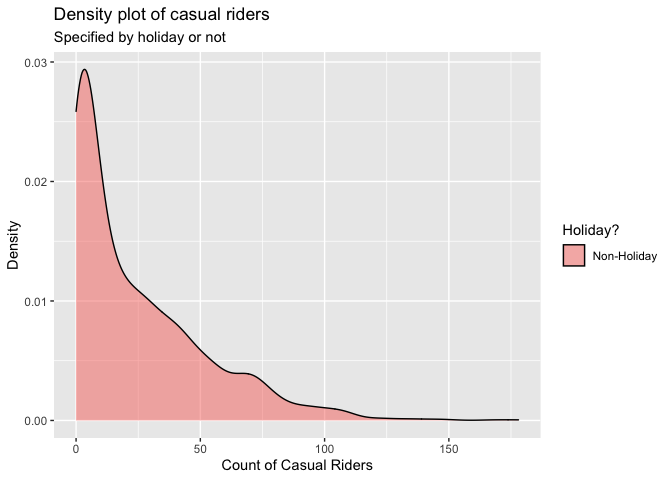

ST558 - Project 2
================
Group 5: Tyler Pollard & Lucy Yin

-   [Required Packages](#required-packages)
-   [Introduction](#introduction)
-   [Data](#data)
-   [Summarization](#summarization)
    -   [Contingency Tables](#contingency-tables)
        -   [Weather Situation](#weather-situation)
        -   [Year, Season and Count of
            Riders](#year-season-and-count-of-riders)
        -   [Working Day and Count of Casual
            Riders](#working-day-and-count-of-casual-riders)
    -   [Summary Tables](#summary-tables)
        -   [Feeling Temperature](#feeling-temperature)
        -   [Humidity](#humidity)
        -   [Wind Speed](#wind-speed)
    -   [Histograms](#histograms)
        -   [Humidity and Windspeed
            Distributions](#humidity-and-windspeed-distributions)
    -   [Density Plot](#density-plot)
        -   [Casual Riders and Weather
            Situation](#casual-riders-and-weather-situation)
        -   [Registered Riders and Weather
            Situation](#registered-riders-and-weather-situation)
        -   [Total Riders and Weather
            Situation](#total-riders-and-weather-situation)
        -   [Casual Riders and Holiday](#casual-riders-and-holiday)
        -   [Registered Riders and
            Holiday](#registered-riders-and-holiday)
        -   [Total Riders and Holiday](#total-riders-and-holiday)
    -   [Boxplots](#boxplots)
        -   [Feeling Temperature Over the
            Year](#feeling-temperature-over-the-year)
        -   [Riders of Every Hour and Weather
            Situation](#riders-of-every-hour-and-weather-situation)
    -   [Scatter Plots](#scatter-plots)
        -   [Count vs Casual by Season](#count-vs-casual-by-season)
        -   [Riders vs Temperature](#riders-vs-temperature)
        -   [Riders vs. Hour vs. Month vs. Working
            Day](#riders-vs-hour-vs-month-vs-working-day)
    -   [Correlation Plot](#correlation-plot)
        -   [Correlation between temp, atemp, hum,
            windspeed](#correlation-between-temp-atemp-hum-windspeed)
    -   [Plots with GGally](#plots-with-ggally)
        -   [Using Day Data](#using-day-data)
        -   [Using Hour Data](#using-hour-data)
-   [Modeling](#modeling)
    -   [Linear Regression Model](#linear-regression-model)
        -   [What is Linear Regression
            Model](#what-is-linear-regression-model)
        -   [Picking predictors using
            AIC](#picking-predictors-using-aic)
        -   [Modeling using AIC picked
            predictor](#modeling-using-aic-picked-predictor)
    -   [Ensemble Tree Model](#ensemble-tree-model)
        -   [Random Forest Model](#random-forest-model)
        -   [Boosted Tree Model](#boosted-tree-model)
-   [Comparison](#comparison)

# Required Packages

# Introduction

For this report we will be using 6 models (4 linear regression, 1 random
forest model, 1 boosted tree model) to make predictions on the total
count of bike riders using data from the Bike Sharing Dataset (dataset
can be found
[here](https://archive.ics.uci.edu/ml/datasets/Bike+Sharing+Dataset)).
This dataset contains hourly and daily count of registered, casual, and
total sum of riders in the Capital bikeshare system, contributing
variables include:

-   season (winter, spring, summer, fall)  
-   year (2011, 2012)  
-   month of the year
-   hour of the day  
-   holiday (yes, no)  
-   day of the week  
-   working day (yes or no)  
-   weather situation (mostly clear, mist, light precipitation, heavy
    precipitation)  
-   temperature  
-   feeling temperature  
-   humidity  
-   wind speed

There are 3 different types of response variables in the dataset:

-   registered: registered riders who uses this bikeshare service
    regularly  
-   casual: un-registered riders who use this service casually or on
    occasions  
-   total: combined count of registered and casual riders

For our analysis, we will be working with almost all of the variables as
predictors, and our response variable will be the total count of bike
riders.

We will be selecting predictors using the `step()` function which
chooses a model by AIC in a stepwise algorithm. As a result, which
predictors we incorporate in our linear regression models and ensemble
tree (specifically random forest and boosted tree) models may differ
depending on which day of the week we look at. We’ll randomly split the
data into training and test sets and fit the 6 models on the training
set. Ultimately we will fit the 6 models on the test set and decide on
which model produced the best prediction, which we judge by the smallest
root mean squared error value.

# Data

First we will read in both the `hours.csv` and `day.csv` data.

``` r
# read in data
hour.data <- read_csv("data/hour.csv") %>% as_tibble()
day.data <- read_csv("data/day.csv") %>% as_tibble()
```

We will make corrections on variable types, specifically we’re making
sure categorical variables will be appropriately classified as factors
with clear levels.

``` r
# correct the variable types
hour.data$season <- factor(hour.data$season)
levels(hour.data$season) <- list(winter = 1, spring = 2, summer = 3, fall = 4)

hour.data$yr <- factor(hour.data$yr)
levels(hour.data$yr) <- list("2011" = 0, "2012" = 1)

hour.data$weekday <- factor(hour.data$weekday)
levels(hour.data$weekday) <- list(monday = 1, tuesday = 2, wednesday = 3, thursday = 4, friday = 5, saturday = 6, sunday = 0)

hour.data$mnth <- factor(hour.data$mnth)
hour.data$hr <- factor(hour.data$hr)
hour.data$holiday <- factor(hour.data$holiday)
hour.data$workingday <- factor(hour.data$workingday)
hour.data$weathersit <- factor(hour.data$weathersit)

day.data$season <- factor(day.data$season)
levels(day.data$season) <- list(winter = 1, spring = 2, summer = 3, fall = 4)

day.data$yr <- factor(day.data$yr)
levels(day.data$yr) <- list("2011" = 0, "2012" = 1)

day.data$weekday <- factor(day.data$weekday)
levels(day.data$weekday) <- list(monday = 1, tuesday = 2, wednesday = 3, thursday = 4, friday = 5, saturday = 6, sunday = 0)

day.data$mnth <- factor(day.data$mnth)
day.data$holiday <- factor(day.data$holiday)
day.data$workingday <- factor(day.data$workingday)
day.data$weathersit <- factor(day.data$weathersit)
```

Because the variables temperature, feeling temperature, humidity and
windspeed are normalized according to different measures, we will
un-normalize them and save the raw values as separate columns in the
dataset.

``` r
# Temp Unnormal
temp.tmin = -8
temp.tmax = 39
hour.data$temp.unnormal <- hour.data$temp*(temp.tmax - temp.tmin) + temp.tmin # Unnormalize temp
hour.data$temp.F <- hour.data$temp.unnormal*(9/5) + 32 # Convert to Fahrenheit
day.data$temp.unnormal <- hour.data %>% group_by(dteday) %>% summarise(mean = mean(temp.unnormal)) %>% select(mean)
day.data$temp.unnormal <- day.data$temp.unnormal[[1]]
day.data$temp.F <- hour.data %>% group_by(dteday) %>% summarise(mean = mean(temp.F)) %>% select(mean)
day.data$temp.F <- day.data$temp.F[[1]]

# Atemp Unnormal
atemp.tmin = -16
atemp.tmax = 50
hour.data$atemp.unnormal <- hour.data$atemp*(atemp.tmax - atemp.tmin) + atemp.tmin # Unnormalize atemps
hour.data$atemp.F <- hour.data$atemp.unnormal*(9/5) + 32 # Convert to Fahrenheit
day.data$atemp.unnormal <- hour.data %>% group_by(dteday) %>% summarise(mean = mean(atemp.unnormal)) %>% select(mean)
day.data$atemp.unnormal <- day.data$atemp.unnormal[[1]]
day.data$atemp.F <- hour.data %>% group_by(dteday) %>% summarise(mean = mean(atemp.F)) %>% select(mean)
day.data$atemp.F <- day.data$atemp.F[[1]]

# Humidity Unnormal
day.data$hum.unnormal <- day.data$hum * 100
hour.data$hum.unnormal <- hour.data$hum * 100

# Windspeed Unnormal
day.data$windspeed.unnormal <- day.data$windspeed * 67
hour.data$windspeed.unnormal <- hour.data$windspeed * 67
```

Because hour and day data are stored separately, we create a
`total.data` table with all the information combined just in case we
need to access this in later steps.

``` r
# add in a new variable before merging
hour.data <- mutate(hour.data, type = "hour")
day.data <- mutate(day.data, type = "day", hr = NA) %>% select(instant, dteday, season, yr, mnth, hr, everything())

# merge to create complete list of hour/day data
total.data <- rbind(hour.data, day.data)
```

We will filter to only include data from one specific day of the week at
a time.

``` r
# filter out to one specific day of the week
hour.data <- hour.data %>% filter(weekday == params$weekday)
day.data <- day.data %>% filter(weekday == params$weekday)
total.data <- total.data %>% filter(weekday == params$weekday)
```

We randomly sample from the filtered data to form a training set (with
70% of data) and test set (with the remaining 30% of data). Here we
randomly sampled from the day dataset and split it into training and
test sets, then we split the corresponding data from the hours dataset
according to which days are in the training set and which days are in
the test set. We will be using the hours dataset for our modeling, but
we wanted to make sure our day and hour datasets had matching training
and test splits.

``` r
# splitting data into training & test sets
set.seed(7)
train <- sample(1:nrow(day.data), size = nrow(day.data)*0.7)
test <- dplyr::setdiff(1:nrow(day.data), train)
day.training.data <- day.data[train, ]
day.test.data <- day.data[test, ]

hour.training.data <- hour.data[hour.data$dteday %in% day.training.data$dteday,]
hour.test.data <- hour.data[hour.data$dteday %in% day.test.data$dteday,]
```

# Summarization

We have some basic summary statistics and plots about our training data.

## Contingency Tables

### Weather Situation

Below is a contingency table that shows the count of days that fall into
the different categories of weather situation. This table will help
justify the total count of riders because it can be expected that the
number of casual riders, which influences the total count of riders,
will be higher on nicer days that fall into the first two categories of
Mostly clear and Mist.

``` r
levels(day.training.data$weathersit) <- list(
  "Mostly clear" = "1",
  "Mist" = "2",
  "Light precipitation" = "3",
  "Heavy precipitation" = "4")
kable(t(table(day.training.data$weathersit)))
```

| Mostly clear | Mist | Light precipitation | Heavy precipitation |
|-------------:|-----:|--------------------:|--------------------:|
|           42 |   27 |                   3 |                   0 |

### Year, Season and Count of Riders

These contingency tables show what count range of riders utilized the
bikeshare service for a given season or for a given year. This table can
help us see if the number of riders increased/decreased from 2011 to
2012, or if season has an effect on how many riders used the bikeshare
service.

``` r
kable(table(day.training.data$season, cut(day.training.data$cnt, breaks = 2, dig.lab = 10)), caption = "Occurrences of # Range of Riders of a given Season")
```

|        | (675.916,4225\] | (4225,7774.084\] |
|:-------|----------------:|-----------------:|
| winter |              12 |                1 |
| spring |               5 |               13 |
| summer |               3 |               18 |
| fall   |               8 |               12 |

Occurrences of # Range of Riders of a given Season

``` r
kable(table(day.training.data$yr, cut(day.training.data$cnt, breaks = 2, dig.lab = 10)), caption = "Occurrences of # Range of Riders of a given Year")
```

|      | (675.916,4225\] | (4225,7774.084\] |
|:-----|----------------:|-----------------:|
| 2011 |              21 |               15 |
| 2012 |               7 |               29 |

Occurrences of # Range of Riders of a given Year

### Working Day and Count of Casual Riders

This contingency table show what count range of casual riders utilized
the bikeshare service on working day versus non-working day. Intuitively
we’d suspect that there would more casual riders on non-working day than
working day, this table can show us whether it’s true or not.

``` r
levels(day.training.data$workingday) <- list("workday" = 1, "non-workday" = 0)
kable(table(day.training.data$workingday, cut(day.training.data$casual, breaks = 2, dig.lab = 10)), caption = "Occurrences of # Range of Casual Riders of Workday vs. non-Workday")
```

|             | (7.661,678.5\] | (678.5,1349.339\] |
|:------------|---------------:|------------------:|
| workday     |             45 |                27 |
| non-workday |              0 |                 0 |

Occurrences of # Range of Casual Riders of Workday vs. non-Workday

## Summary Tables

### Feeling Temperature

The summary tables of feeling temperature show the 5 number summary
along with the mean and standard deviation of what the temperature
actually felt like over the different years. The summary table for both
the normalized and raw feeling temperatures are provided. These tables
give insight to the range of feeling temperatures felt by the riders for
the different years.

``` r
# Normalized feeling temperature
atemp.summary <- hour.training.data %>% group_by(yr) %>% summarise(Min. = min(atemp), `1st Qu.` = quantile(atemp,0.25), Median = median(atemp), Mean = mean(atemp), `3rd Qu.` = quantile(atemp, 0.75), Max. = max(atemp), `St. Dev.` = sd(atemp))
kable(atemp.summary, digits = 2, caption = "Summary of feeling temperatures by year")
```

| yr   | Min. | 1st Qu. | Median | Mean | 3rd Qu. | Max. | St. Dev. |
|:-----|-----:|--------:|-------:|-----:|--------:|-----:|---------:|
| 2011 | 0.11 |    0.39 |   0.52 | 0.49 |    0.62 | 0.85 |     0.17 |
| 2012 | 0.08 |    0.35 |   0.52 | 0.50 |    0.64 | 0.83 |     0.17 |

Summary of feeling temperatures by year

``` r
# Raw feeling temperature in Fahrenheit
atemp.summary.unnormal <- hour.training.data %>% group_by(yr) %>% summarise(Min. = min(atemp.F), `1st Qu.` = quantile(atemp.F,0.25), Median = median(atemp.F), Mean = mean(atemp.F), `3rd Qu.` = quantile(atemp.F, 0.75), Max. = max(atemp.F), `St. Dev.` = sd(atemp.F))
kable(atemp.summary.unnormal, digits = 2, caption = "Summary of raw feeling temperatures by year")
```

| yr   |  Min. | 1st Qu. | Median |  Mean | 3rd Qu. |  Max. | St. Dev. |
|:-----|------:|--------:|-------:|------:|--------:|------:|---------:|
| 2011 | 15.80 |    50.0 |  64.41 | 61.73 |    77.0 | 104.0 |    20.68 |
| 2012 | 12.21 |    44.6 |  64.41 | 62.51 |    78.8 | 102.2 |    19.97 |

Summary of raw feeling temperatures by year

### Humidity

These summary tables show the spread of normalized and raw humidity
values. The table includes the 5 number summary along with mean and
standard deviation, which gives insight to the range of humidity levels
riders experienced.

``` r
kable(t(c(summary(day.training.data$hum), St.Dev. = sd(day.training.data$hum))), digits = 2, caption = "Summary of Normalized Humidity")
```

| Min. | 1st Qu. | Median | Mean | 3rd Qu. | Max. | St.Dev. |
|-----:|--------:|-------:|-----:|--------:|-----:|--------:|
| 0.29 |    0.55 |   0.66 | 0.64 |    0.74 | 0.96 |    0.14 |

Summary of Normalized Humidity

``` r
kable(t(c(summary(day.training.data$hum.unnormal), St.Dev. = sd(day.training.data$hum.unnormal))), digits = 2, caption = "Summary of Raw Humidity")  
```

| Min. | 1st Qu. | Median |  Mean | 3rd Qu. |  Max. | St.Dev. |
|-----:|--------:|-------:|------:|--------:|------:|--------:|
|   29 |    55.4 |  65.53 | 64.28 |   73.51 | 96.25 |   14.22 |

Summary of Raw Humidity

### Wind Speed

These summary tables show the spread of normalized and raw wind speeds.
The table includes the 5 number summary along with mean and standard
deviation, which gives insight to the range of wind speeds riders
experienced.

``` r
kable(t(c(summary(day.training.data$windspeed), St.Dev. = sd(day.training.data$windspeed))), digits = 2, caption = "Summary of Normalized Wind Speed")
```

| Min. | 1st Qu. | Median | Mean | 3rd Qu. | Max. | St.Dev. |
|-----:|--------:|-------:|-----:|--------:|-----:|--------:|
| 0.05 |    0.13 |   0.18 | 0.19 |    0.24 | 0.37 |    0.08 |

Summary of Normalized Wind Speed

``` r
kable(t(c(summary(day.training.data$windspeed.unnormal), St.Dev. = sd(day.training.data$windspeed.unnormal))), digits = 2, caption = "Summary of Raw Wind Speed ")
```

| Min. | 1st Qu. | Median |  Mean | 3rd Qu. | Max. | St.Dev. |
|-----:|--------:|-------:|------:|--------:|-----:|--------:|
| 3.57 |    8.74 |  11.94 | 12.67 |   15.83 | 24.5 |    5.21 |

Summary of Raw Wind Speed

## Histograms

### Humidity and Windspeed Distributions

The following density plots show the distribution of the weather effects
for raw humidity and raw wind speed over the span of the biker data.
These distributions provide insight on what values for each weather
effect can be expected and how the combination of each effect may drive
the different weather situations and in turn the expected count of
riders.

``` r
hum.histogram <- ggplot(data = day.training.data, aes(x = hum.unnormal)) + 
  geom_histogram(aes(y = ..density..), bins = 30) + 
  geom_density(color = "red", size = 2) + 
  labs(title = "Humidity Distribution", x = "Raw Humidity", y = "Density")
windspeed.histogram <- ggplot(data = day.training.data, aes(x = windspeed.unnormal)) + 
  geom_histogram(aes(y = ..density..), bins = 30) + 
  geom_density(color = "red", size = 2) + 
  labs(title = "Windspeed Distribution", x = "Raw Windspeed", y = "Density")
grid.arrange(hum.histogram, windspeed.histogram, ncol = 2, top = "Density Distribution of Weather Effects")
```

<!-- -->

## Density Plot

### Casual Riders and Weather Situation

This density plot shows the amount of casual riders in a given weather
situation. Intuitively we suspect that there would more casual riders in
better weather conditions. This density plot can show us whether or not
this is true.

``` r
ggplot(hour.training.data, aes(x = casual)) + 
  geom_density(alpha = 0.5, position = "stack", aes(fill = weathersit)) + 
  labs(title = "Density plot of casual riders",
       subtitle = "Specified by weather situation",
       x = "Count of Casual Riders",
       y = "Density") + 
  scale_fill_discrete(name = "Weather Situation", labels = c("Mostly Clear", "Mist", "Light Precip.", "Heavy Precip."))  
```

<!-- -->

### Registered Riders and Weather Situation

This density plot shows the amount of registered riders in a given
weather situation. We suspect that the amount of registered riders
wouldn’t be as affected by weather situation as the amount of casual
riders would. This density plot can show us whether or not this is true.

``` r
ggplot(hour.training.data, aes(x = registered)) + 
  geom_density(alpha = 0.5, position = "stack", aes(fill = weathersit)) + 
  labs(title = "Density plot of casual riders",
       subtitle = "Specified by weather situation",
       x = "Count of Registered Riders",
       y = "Density") + 
  scale_fill_discrete(name = "Weather Situation", labels = c("Mostly Clear", "Mist", "Light Precip.", "Heavy Precip."))  
```

<!-- -->

### Total Riders and Weather Situation

This density plot shows the total count of riders in a given weather
situation. We may see a relationship between how many riders there are
and what type of weather condition it is.

``` r
ggplot(hour.training.data, aes(x = cnt)) + 
  geom_density(alpha = 0.5, position = "stack", aes(fill = weathersit)) + 
  labs(title = "Density plot of casual riders",
       subtitle = "Specified by weather situation",
       x = "Total Count of Riders",
       y = "Density") + 
  scale_fill_discrete(name = "Weather Situation", labels = c("Mostly Clear", "Mist", "Light Precip.", "Heavy Precip."))  
```

<!-- -->

### Casual Riders and Holiday

This density plot shows the amount of casual riders depending on whether
it is a holiday or non-holiday. We suspect there would be more casual
riders on holidays, especially at larger counts. This density plot can
show us whether that is true.

``` r
ggplot(hour.training.data, aes(x = casual)) + 
  geom_density(alpha = 0.5, position = "stack", aes(fill = holiday)) +
  labs(title = "Density plot of casual riders",
       subtitle = "Specified by holiday or not",
       x = "Count of Casual Riders",
       y = "Density") +
  scale_fill_discrete(name = "Holiday?", labels = c("Non-Holiday", "Holiday"))    
```

<!-- -->

### Registered Riders and Holiday

This density plot shows the amount of registered riders depending on
whether it is a holiday or non-holiday. We suspect there would be more
registered riders on non-holidays, especially at larger counts. This
density plot can show us whether that is true.

``` r
ggplot(hour.training.data, aes(x = registered)) + 
  geom_density(alpha = 0.5, position = "stack", aes(fill = holiday)) +
  labs(title = "Density plot of casual riders",
       subtitle = "Specified by holiday or not",
       x = "Count of Registered Riders",
       y = "Density") +
  scale_fill_discrete(name = "Holiday?", labels = c("Non-Holiday", "Holiday"))    
```

<!-- -->

### Total Riders and Holiday

This density plot shows the total count of riders depending on whether
it is a holiday or non-holiday. This plot could show a relationship
between the amount of riders versus whether it’s a holiday or
non-holiday.

``` r
ggplot(hour.training.data, aes(x = cnt)) + 
  geom_density(alpha = 0.5, position = "stack", aes(fill = holiday)) +
  labs(title = "Density plot of casual riders",
       subtitle = "Specified by holiday or not",
       x = "Total Count of Riders",
       y = "Density") +
  scale_fill_discrete(name = "Holiday?", labels = c("Non-Holiday", "Holiday"))    
```

<!-- -->

## Boxplots

### Feeling Temperature Over the Year

To get a better understanding of the feeling temperature spreads over
the year, boxplots of the feeling temperature are plotted by month with
the data points for each day used to create them plotted overtop.
Intuitively, it can be expected that the feeling temperature rises from
the beginning of the year into the middle of summer and then drops back
down over the fall and winter months. These boxplots provide insight
into the possible number of rider fluctuation over the different months
of the year.

``` r
atemp.boxplot.df <- day.training.data
levels(atemp.boxplot.df$mnth) <- list(January = 1, February = 2, March = 3, April = 4, May = 5, June = 6, July = 7, August = 8, September = 9, October = 10, November = 11, December = 12)
ggplot(data = atemp.boxplot.df, aes(x = mnth, y = atemp.F)) + 
  geom_boxplot() + 
  geom_point(position = "jitter", color = "blue") + 
  labs(title = "Feeling temperature distribution per month", x = "Month", y = "Feeling Temperature (F)")
```

<!-- -->

### Riders of Every Hour and Weather Situation

This boxplot shows the 5 number summary (in boxplot form with occasional
outliers) of the amount of riders for each hour of the day. The colored
lines should the mean number of riders for each given weather situation.
We expect that the highest amount of riders should appear around the
morning and afternoon commute time given it’s not on a holiday or on the
weekends. This boxplot can show if that’s true.

``` r
ggplot(hour.training.data, aes(x = hr, y = cnt)) + 
  geom_boxplot() + 
  stat_summary(fun = mean, geom = "line", lwd = 0.8, aes(group = weathersit, col = weathersit)) + 
  labs(title = "Count of riders for every hr",
       subtitle = "Mean values based on weather situation",
       x = "Hour of the Day",
       y = "Count of Riders") + 
  scale_color_discrete(name = "Weather Situation", labels = c("Mostly Clear", "Mist", "Light Precip.", "Heavy Precip."))
```

<!-- -->

## Scatter Plots

### Count vs Casual by Season

These four scatter plots show the relation between the total number of
riders and casual riders by day with linear models plotted overtop
parsed by season. These plots show how the number of casual riders
contribute to the total count of riders for each season. The greater the
slope of the linear model correlates to a greater number of causal
riders contributing to the total count of riders.

``` r
ggplot(data = day.training.data, aes(x = cnt, y = casual)) +
  geom_point() +
  geom_smooth(method = "lm") +
  facet_grid(cols = vars(season)) + 
  labs(title = "Casual Riders Influence on Total Count", x = "Count", y = "Casual Riders")
```

<!-- -->

### Riders vs Temperature

Below is a scattered plot of the number of causal riders vs the raw
temperature for each day in the span of the data parsed by workingday
with a local polynomial regression line fit overtop. This plot provides
insight on how many people spontaneous chose to ride based on the raw
temperature of that day.

``` r
day.training.data$temp.indicator <- ifelse(day.training.data$temp < mean(day.training.data$temp), 0, 1)
day.training.data$temp.indicator <- as_factor(day.training.data$temp.indicator)
levels(day.training.data$temp.indicator) <- list("Low Temperature" = 0, "High Temperature" = 1)
ggplot(data = day.training.data, aes(x = temp.F, y = casual, color = workingday)) + 
  geom_point() + 
  geom_smooth() + 
  labs(title = "Casual Riders Based on Temperature", x = "Raw Temperature", y = "Number of Casual Riders")
```

<!-- -->

### Riders vs. Hour vs. Month vs. Working Day

This boxplot below shows the count of riders for every month and every
hour of the day. The color of the points indicate whether it was on a
working day (1) or non-working day (0). We suspect for working days,
there would be an obvious uptick around the morning and afternoon
commute time. But for non-working days, the amount of riders shouldn’t
have an obvious pattern around those time frames. This plot shows us
whether that’s true or not.

``` r
count.df <- hour.training.data
levels(count.df$mnth) <- list(January = 1, February = 2, March = 3, April = 4, May = 5, June = 6, July = 7, August = 8, September = 9, October = 10, November = 11, December = 12)
ggplot(count.df, aes(x = hr, y = cnt)) +
  geom_point(aes(col = workingday)) +
  facet_wrap(vars(mnth)) + 
  labs(title = "Count of riders for every hour of every month",
       subtitle = "Specified by workday or non-workday",
       x = "Hour of the Day",
       y = "Count of Riders") +
  scale_color_discrete(name = "Working Day")
```

<!-- -->

## Correlation Plot

### Correlation between temp, atemp, hum, windspeed

This correlation plots show the correlation (positive or negative)
between the 4 quantitative variables temperature, feeling temperature,
humidity and wind speed. We suspect that there likely would be a high
correlation between temperature and feeling temperature, and humidity
might be inverse correlated with wind speed. This correlation can show
us whether this is true.

``` r
cor.variables <- hour.training.data %>% select(temp, atemp, hum, windspeed)
correlation <- cor(cor.variables, method = "spearman")
corrplot(correlation)
```

<!-- -->

## Plots with GGally

The two GGally plots below will show whether there’s any relationship
between each of the variables. We run this plot on both the day and hour
data.

### Using Day Data

``` r
subset.data.day <- data_frame(weathersit=day.training.data$weathersit, temp=day.training.data$temp, atemp=day.training.data$atemp,humidity=day.training.data$hum, windspeed=day.training.data$windspeed, casual=day.training.data$casual, registered=day.training.data$registered, total=day.training.data$cnt)
GGally::ggpairs(subset.data.day)
```

<!-- -->

### Using Hour Data

``` r
subset.data.hr <- data_frame(weathersit=hour.training.data$weathersit, temp=hour.training.data$temp, atemp=hour.training.data$atemp,humidity=hour.training.data$hum, windspeed=hour.training.data$windspeed, casual=hour.training.data$casual, registered=hour.training.data$registered, total=hour.training.data$cnt)
GGally::ggpairs(subset.data.hr)
```

<!-- -->

# Modeling

## Linear Regression Model

### What is Linear Regression Model

Linear regression is a type of modeling used to predict a response based
on explanatory variables by fitting a linear equation to observed data.
For simple linear regression using a single explanatory variable to
predict a response variable the equation is
*Y*<sub>*i*</sub> = *β*<sub>0</sub> + *β*<sub>1</sub>*x*<sub>*i*</sub> + *E*<sub>*i*</sub>
where *Y*<sub>*i*</sub> is the response for the *i*<sup>*t**h*</sup>
observation, *x*<sub>*i*</sub> is the value of the explanatory variable
for the *i*<sup>*t**h*</sup> observation, *β*<sub>0</sub> is the
y-intercept, *β*<sub>1</sub> is the slope, and *E*<sub>*i*</sub> is the
error for the *i*<sup>*t**h*</sup> observation. Fitting a linear model
to the observed dataset requires estimating the coefficients *β* such
that the error term
*E*<sub>*i*</sub> = *Y*<sub>*i*</sub> − *β*<sub>0</sub> − *β*<sub>1</sub>*x*<sub>*i*</sub>
is minimized. The most common way to minimize this term is through
least-squares where we minimize the sum of squared residuals through
$min\_{\\beta\_{0},\\beta\_{1}}\\sum\_{i=1}^n ({y}\_{i} - \\beta\_{0} - \\beta\_{1}{x}\_{i})$.
Simple linear regression can be extended in many ways to include:

-   higher order terms:
    *Y*<sub>*i*</sub> = *β*<sub>0</sub> + *β*<sub>1</sub>*x*<sub>*i*</sub> + *β*<sub>2</sub>*x*<sub>*i*</sub><sup>2</sup> + *E*<sub>*i*</sub>  
-   more explanatory variables:
    *Y*<sub>*i*</sub> = *β*<sub>0</sub> + *β*<sub>1</sub>*x*<sub>1*i*</sub> + *β*<sub>2</sub>*x*<sub>2*i*</sub> + *β*<sub>3</sub>*x*<sub>1*i*</sub>*x*<sub>2*i*</sub> + *E*<sub>*i*</sub>  
-   more explanatory variables and higher order terms:
    *Y*<sub>*i*</sub> = *β*<sub>0</sub> + *β*<sub>1</sub>*x*<sub>1*i*</sub> + *β*<sub>2</sub>*x*<sub>2*i*</sub> + *β*<sub>3</sub>*x*<sub>1*i*</sub>*x*<sub>2*i*</sub> + *β*<sub>4</sub>*x*<sub>1*i*</sub><sup>2</sup> + *β*<sub>5</sub>*x*<sub>2*i*</sub><sup>2</sup> + *E*<sub>*i*</sub>

In each of these linear regressions the model is still fit by minimizing
the sum of squared errors. As the number of explanatory variables
increase these regression models can become quite large, so it is best
to compare different candidate models to see which provides the best fit
of the data. Usually you would have some sort of subject matter
knowledge to help select these candidate models by understanding which
variables are related and which variables scientifically should be put
in the model. Without subject matter knowledge you might select multiple
candidate models and compare them using fit criteria such as AIC, BIC,
AICc, Adjusted R-squared or Variance Inflation Factor (VIF).
Alternatively, you may compare prediction error by splitting the data
into a training and test set with a 80/20 split and fit the candidate
models on the training set to predict the response of the test set. The
model with the lowest RMSE should be considered to be the best fit as it
minimized the error the best.

### Picking predictors using AIC

First we want to select only the variables that we will use in our
models, as variables such as record index, date are not useful to us. We
will be using the un-normalized versions of temperature, feeling
temperature, humidity and wind speed (instead of the normalized
versions) because we want to standardize all numerical variables when
running our models.  
Because on some days of the week holiday and working day both become 1
leveled factor variables and can cause issues in our modeling, so we
will omit these 2 variables for those days of the week.

``` r
# keep only variables that are relevant to modeling
if.weekday <- hour.training.data %>% filter(weekday == params$weekday) %>% select(workingday) %>% unique() %>% nrow()
if.holiday <- hour.training.data %>% filter(weekday == params$weekday) %>% select(holiday) %>% unique() %>% nrow()

# use function to decide if a weekday has 1 factored levels
# if so we will not use these factors in the model 
get.data <- function(weekday, ...){
  if (if.weekday == 1 & if.holiday == 1) {
    hour.training.data2 <- hour.training.data %>% select(season, yr, mnth, hr, weathersit, temp.F, atemp.F, hum.unnormal, windspeed.unnormal, cnt)
  }
  else {
    hour.training.data2 <- hour.training.data %>% select(season, yr, mnth, hr, holiday, workingday, weathersit, temp.F, atemp.F, hum.unnormal, windspeed.unnormal, cnt)
  }
  hour.training.data2
}
hour.training.data2 <- get.data(params$weekday)
```

We will let the `step()` function to pick our models using the stepwise
algorithm. We provide the `step()` function with 3 different linear
models, first with just first order variables, second with squared terms
and interactions, and third with first ordered variables and
interactions.

``` r
# aic using only 1st ordered terms
fit.aic <- step((lm(cnt ~ ., data = hour.training.data2, verbose = FALSE)), direction = "both")

# aic including squared terms and interactions
fit.aic2 <- step((lm(cnt ~ .^2 + I(temp.F^2) + I(atemp.F^2) + I(hum.unnormal^2) + I(windspeed.unnormal^2), data = hour.training.data2, verbose = FALSE)), direction = "both")

# aic using 1st order and interactions
fit.aic3 <- step((lm(cnt ~.^2, data = hour.training.data2, verbose = FALSE)), direction = "both")
```

### Modeling using AIC picked predictor

For the first linear regression model we run, we will pick predictors
based on our intuition. We expect the feeling temperature would be
highly correlated with the actual temperature, and because wind speed
and humidity could also be correlated with feeling temperature, so we
only kept temperature as a predictor in the model and will not include
feeling temperature. We also did not include holiday in the model
because it has some redundant information to the working day variable.

``` r
# use all predictors except atemp and holiday
set.seed(7)
fit.mlr0 <- train(cnt ~ season + yr + mnth + hr + workingday + weathersit + temp.F + hum.unnormal + windspeed.unnormal,
                  data = hour.training.data,
                  method = "lm",
                  preProcess = c("center", "scale"),
                  trControl = trainControl(method = "cv", number = 10))
fit.mlr0
```

    ## Linear Regression 
    ## 
    ## 1703 samples
    ##    9 predictor
    ## 
    ## Pre-processing: centered (45), scaled (45) 
    ## Resampling: Cross-Validated (10 fold) 
    ## Summary of sample sizes: 1532, 1532, 1532, 1532, 1532, 1534, ... 
    ## Resampling results:
    ## 
    ##   RMSE      Rsquared  MAE     
    ##   74.72557  0.848889  52.78131
    ## 
    ## Tuning parameter 'intercept' was held constant at a value of TRUE

``` r
# Examine performance of this multiple linear regression model on the test data after prediction
predict.mlr0 <- postResample(predict(fit.mlr0, newdata = hour.test.data), obs = hour.test.data$cnt)
```

The next three linear regression models are fit using the predictors
picked by the three step functions. These models include different
number of predictors in different complexity, so we will see which
models will produce the best prediction in the end.

``` r
# use aic predictors (1st ordered terms)
set.seed(7)
fit.mlr1 <- train(fit.aic$terms,
                  data = hour.training.data2,
                  method = "lm",
                  preProcess = c("center", "scale"),
                  trControl = trainControl(method = "cv", number = 10))
fit.mlr1
```

    ## Linear Regression 
    ## 
    ## 1703 samples
    ##    8 predictor
    ## 
    ## Pre-processing: centered (42), scaled (42) 
    ## Resampling: Cross-Validated (10 fold) 
    ## Summary of sample sizes: 1532, 1532, 1532, 1532, 1532, 1534, ... 
    ## Resampling results:
    ## 
    ##   RMSE      Rsquared   MAE     
    ##   74.33315  0.8506088  52.54417
    ## 
    ## Tuning parameter 'intercept' was held constant at a value of TRUE

``` r
# variables used in fit
fit.aic
```

    ## 
    ## Call:
    ## lm(formula = cnt ~ yr + mnth + hr + weathersit + temp.F + atemp.F + 
    ##     hum.unnormal + windspeed.unnormal, data = hour.training.data2, 
    ##     verbose = FALSE)
    ## 
    ## Coefficients:
    ##        (Intercept)              yr2012               mnth2               mnth3               mnth4               mnth5  
    ##           -50.9883             89.6798              2.5776             10.8076             41.7058             61.3024  
    ##              mnth6               mnth7               mnth8               mnth9              mnth10              mnth11  
    ##            71.8843             53.7540             74.2888             76.7101             94.6946             64.1714  
    ##             mnth12                 hr1                 hr2                 hr3                 hr4                 hr5  
    ##            72.7298            -12.7038            -12.8281            -19.1999            -16.4341             10.9934  
    ##                hr6                 hr7                 hr8                 hr9                hr10                hr11  
    ##            96.5538            295.9412            466.7994            213.1725             99.7436            105.9390  
    ##               hr12                hr13                hr14                hr15                hr16                hr17  
    ##           140.8760            141.2486            126.5597            143.7563            243.1766            512.4895  
    ##               hr18                hr19                hr20                hr21                hr22                hr23  
    ##           488.0451            323.1468            226.6851            159.6103            108.0430             57.6852  
    ##        weathersit2         weathersit3              temp.F             atemp.F        hum.unnormal  windspeed.unnormal  
    ##           -11.2050            -54.4654             -2.6323              3.5618             -0.9405             -0.5782

``` r
# Examine performance of this multiple linear regression model on the test data after prediction
predict.mlr1 <- postResample(predict(fit.mlr1, newdata = hour.test.data), obs = hour.test.data$cnt)
```

``` r
# use aic predictors (2nd ordered terms and interactions)
set.seed(7)
fit.mlr2 <- train(fit.aic2$terms,
                  data = hour.training.data2,
                  method = "lm",
                  preProcess = c("center", "scale"),
                  trControl = trainControl(method = "cv", number = 10))
fit.mlr2
```

    ## Linear Regression 
    ## 
    ## 1703 samples
    ##    9 predictor
    ## 
    ## Pre-processing: centered (287), scaled (287) 
    ## Resampling: Cross-Validated (10 fold) 
    ## Summary of sample sizes: 1532, 1532, 1532, 1532, 1532, 1534, ... 
    ## Resampling results:
    ## 
    ##   RMSE      Rsquared   MAE     
    ##   46.41857  0.9415467  30.70593
    ## 
    ## Tuning parameter 'intercept' was held constant at a value of TRUE

``` r
# variables used in fit
fit.aic2
```

    ## 
    ## Call:
    ## lm(formula = cnt ~ season + yr + mnth + hr + weathersit + temp.F + 
    ##     atemp.F + hum.unnormal + windspeed.unnormal + season:yr + 
    ##     season:hr + season:weathersit + season:temp.F + season:atemp.F + 
    ##     yr:mnth + yr:hr + yr:weathersit + yr:temp.F + yr:atemp.F + 
    ##     mnth:hum.unnormal + hr:weathersit + hr:atemp.F + weathersit:temp.F + 
    ##     weathersit:atemp.F + weathersit:hum.unnormal + temp.F:atemp.F + 
    ##     temp.F:hum.unnormal + atemp.F:hum.unnormal + hum.unnormal:windspeed.unnormal, 
    ##     data = hour.training.data2, verbose = FALSE)
    ## 
    ## Coefficients:
    ##                     (Intercept)                     seasonspring                     seasonsummer  
    ##                      -105.47073                       -252.74265                       -307.26754  
    ##                      seasonfall                           yr2012                            mnth2  
    ##                      -238.09288                        -31.57035                         33.34019  
    ##                           mnth3                            mnth4                            mnth5  
    ##                        49.26892                        136.60954                        178.50361  
    ##                           mnth6                            mnth7                            mnth8  
    ##                       226.46283                        180.41921                        267.64351  
    ##                           mnth9                           mnth10                           mnth11  
    ##                       307.40860                        269.74873                        198.34234  
    ##                          mnth12                              hr1                              hr2  
    ##                       138.14954                         -0.16387                          0.32477  
    ##                             hr3                              hr4                              hr5  
    ##                         3.48818                          9.65499                         -2.15146  
    ##                             hr6                              hr7                              hr8  
    ##                         6.72739                         56.54840                        235.90070  
    ##                             hr9                             hr10                             hr11  
    ##                       104.06102                         20.91919                          7.37305  
    ##                            hr12                             hr13                             hr14  
    ##                         9.47387                         12.39576                         28.63317  
    ##                            hr15                             hr16                             hr17  
    ##                         4.73230                        -34.03966                        -38.41860  
    ##                            hr18                             hr19                             hr20  
    ##                       -41.15261                        -12.01746                        -37.16092  
    ##                            hr21                             hr22                             hr23  
    ##                       -25.23899                        -16.80381                        -11.74998  
    ##                     weathersit2                      weathersit3                           temp.F  
    ##                        62.90250                        336.98485                          8.37104  
    ##                         atemp.F                     hum.unnormal               windspeed.unnormal  
    ##                        -4.11227                          0.69625                         -1.18806  
    ##             seasonspring:yr2012              seasonsummer:yr2012                seasonfall:yr2012  
    ##                        44.41683                        -75.44166                        -16.79329  
    ##                seasonspring:hr1                 seasonsummer:hr1                   seasonfall:hr1  
    ##                        14.36450                         18.78856                         13.73160  
    ##                seasonspring:hr2                 seasonsummer:hr2                   seasonfall:hr2  
    ##                        14.54619                         16.12842                         11.25599  
    ##                seasonspring:hr3                 seasonsummer:hr3                   seasonfall:hr3  
    ##                        35.79975                         46.81738                         30.79039  
    ##                seasonspring:hr4                 seasonsummer:hr4                   seasonfall:hr4  
    ##                        22.39281                         32.01344                         17.35346  
    ##                seasonspring:hr5                 seasonsummer:hr5                   seasonfall:hr5  
    ##                        16.73918                         17.64303                         19.10333  
    ##                seasonspring:hr6                 seasonsummer:hr6                   seasonfall:hr6  
    ##                        24.69990                         44.92778                         46.36814  
    ##                seasonspring:hr7                 seasonsummer:hr7                   seasonfall:hr7  
    ##                        59.09026                        110.05186                        129.74873  
    ##                seasonspring:hr8                 seasonsummer:hr8                   seasonfall:hr8  
    ##                       153.43085                        183.97282                        180.58626  
    ##                seasonspring:hr9                 seasonsummer:hr9                   seasonfall:hr9  
    ##                        73.72391                         63.46319                         83.39492  
    ##               seasonspring:hr10                seasonsummer:hr10                  seasonfall:hr10  
    ##                        42.40582                         42.15685                         38.44066  
    ##               seasonspring:hr11                seasonsummer:hr11                  seasonfall:hr11  
    ##                         7.38452                        -13.08205                         21.88450  
    ##               seasonspring:hr12                seasonsummer:hr12                  seasonfall:hr12  
    ##                        10.08088                        -19.45417                         35.10459  
    ##               seasonspring:hr13                seasonsummer:hr13                  seasonfall:hr13  
    ##                        -3.16434                        -35.14337                         20.04383  
    ##               seasonspring:hr14                seasonsummer:hr14                  seasonfall:hr14  
    ##                        10.53928                         26.70422                         40.93520  
    ##               seasonspring:hr15                seasonsummer:hr15                  seasonfall:hr15  
    ##                         2.87655                         15.66658                         48.11012  
    ##               seasonspring:hr16                seasonsummer:hr16                  seasonfall:hr16  
    ##                       -23.67738                        -21.36411                         53.40007  
    ##               seasonspring:hr17                seasonsummer:hr17                  seasonfall:hr17  
    ##                         4.15234                        -12.98407                        126.90770  
    ##               seasonspring:hr18                seasonsummer:hr18                  seasonfall:hr18  
    ##                        28.63906                          4.14821                        111.59448  
    ##               seasonspring:hr19                seasonsummer:hr19                  seasonfall:hr19  
    ##                        22.42598                         37.35184                         57.19055  
    ##               seasonspring:hr20                seasonsummer:hr20                  seasonfall:hr20  
    ##                        -2.69831                         17.77188                         35.51870  
    ##               seasonspring:hr21                seasonsummer:hr21                  seasonfall:hr21  
    ##                         7.09231                         23.59888                         41.62398  
    ##               seasonspring:hr22                seasonsummer:hr22                  seasonfall:hr22  
    ##                        -1.92755                         21.28338                         32.74818  
    ##               seasonspring:hr23                seasonsummer:hr23                  seasonfall:hr23  
    ##                        11.31758                         39.45461                         32.64010  
    ##        seasonspring:weathersit2         seasonsummer:weathersit2           seasonfall:weathersit2  
    ##                       -41.58899                        -56.06982                        -18.32548  
    ##        seasonspring:weathersit3         seasonsummer:weathersit3           seasonfall:weathersit3  
    ##                       -86.92765                       -104.44509                        -91.33905  
    ##             seasonspring:temp.F              seasonsummer:temp.F                seasonfall:temp.F  
    ##                         3.10914                          2.40140                          6.29237  
    ##            seasonspring:atemp.F             seasonsummer:atemp.F               seasonfall:atemp.F  
    ##                         2.29765                          3.58591                         -2.06750  
    ##                    yr2012:mnth2                     yr2012:mnth3                     yr2012:mnth4  
    ##                        -6.82200                         -0.59410                        -46.24962  
    ##                    yr2012:mnth5                     yr2012:mnth6                     yr2012:mnth7  
    ##                      -124.80427                         36.72835                         25.95364  
    ##                    yr2012:mnth8                     yr2012:mnth9                    yr2012:mnth10  
    ##                        33.08521                               NA                         -7.32343  
    ##                   yr2012:mnth11                    yr2012:mnth12                       yr2012:hr1  
    ##                        -7.65608                               NA                         -2.32755  
    ##                      yr2012:hr2                       yr2012:hr3                       yr2012:hr4  
    ##                        -3.87084                         -2.57968                         -1.67647  
    ##                      yr2012:hr5                       yr2012:hr6                       yr2012:hr7  
    ##                        15.86431                         55.00301                        130.82835  
    ##                      yr2012:hr8                       yr2012:hr9                      yr2012:hr10  
    ##                       207.56732                        107.89658                         45.84463  
    ##                     yr2012:hr11                      yr2012:hr12                      yr2012:hr13  
    ##                        64.17209                         71.40618                         72.18351  
    ##                     yr2012:hr14                      yr2012:hr15                      yr2012:hr16  
    ##                        53.80195                         55.86131                        125.68861  
    ##                     yr2012:hr17                      yr2012:hr18                      yr2012:hr19  
    ##                       251.69866                        219.15343                        154.58892  
    ##                     yr2012:hr20                      yr2012:hr21                      yr2012:hr22  
    ##                        96.79851                         52.97397                         29.34563  
    ##                     yr2012:hr23               yr2012:weathersit2               yr2012:weathersit3  
    ##                        34.18875                          0.79250                        -31.85217  
    ##                   yr2012:temp.F                   yr2012:atemp.F               mnth2:hum.unnormal  
    ##                        -1.89479                          3.07017                         -0.54204  
    ##              mnth3:hum.unnormal               mnth4:hum.unnormal               mnth5:hum.unnormal  
    ##                        -0.49531                         -1.65746                         -1.61893  
    ##              mnth6:hum.unnormal               mnth7:hum.unnormal               mnth8:hum.unnormal  
    ##                        -2.23221                         -1.49993                         -2.82596  
    ##              mnth9:hum.unnormal              mnth10:hum.unnormal              mnth11:hum.unnormal  
    ##                        -2.95032                         -2.41472                         -1.63531  
    ##             mnth12:hum.unnormal                  hr1:weathersit2                  hr2:weathersit2  
    ##                        -0.94505                         12.72556                         10.36630  
    ##                 hr3:weathersit2                  hr4:weathersit2                  hr5:weathersit2  
    ##                        20.77930                         22.00890                         12.93684  
    ##                 hr6:weathersit2                  hr7:weathersit2                  hr8:weathersit2  
    ##                        -2.38024                        -54.76794                        -19.17098  
    ##                 hr9:weathersit2                 hr10:weathersit2                 hr11:weathersit2  
    ##                         2.65127                         -3.56745                        -26.06504  
    ##                hr12:weathersit2                 hr13:weathersit2                 hr14:weathersit2  
    ##                       -33.41223                        -39.09956                        -46.13357  
    ##                hr15:weathersit2                 hr16:weathersit2                 hr17:weathersit2  
    ##                       -20.17669                        -10.92178                        -44.63378  
    ##                hr18:weathersit2                 hr19:weathersit2                 hr20:weathersit2  
    ##                       -54.33428                        -28.39887                        -26.76312  
    ##                hr21:weathersit2                 hr22:weathersit2                 hr23:weathersit2  
    ##                       -30.51807                        -15.24044                          2.88844  
    ##                 hr1:weathersit3                  hr2:weathersit3                  hr3:weathersit3  
    ##                         9.74988                          9.87586                         -9.07201  
    ##                 hr4:weathersit3                  hr5:weathersit3                  hr6:weathersit3  
    ##                        11.45371                        -20.17788                        -78.59516  
    ##                 hr7:weathersit3                  hr8:weathersit3                  hr9:weathersit3  
    ##                      -176.41392                       -245.46929                       -144.34991  
    ##                hr10:weathersit3                 hr11:weathersit3                 hr12:weathersit3  
    ##                       -94.77482                        -94.18588                       -119.10269  
    ##                hr13:weathersit3                 hr14:weathersit3                 hr15:weathersit3  
    ##                      -132.91187                        -96.24636                       -135.43264  
    ##                hr16:weathersit3                 hr17:weathersit3                 hr18:weathersit3  
    ##                      -126.06416                       -170.58423                       -137.62751  
    ##                hr19:weathersit3                 hr20:weathersit3                 hr21:weathersit3  
    ##                      -124.58100                       -150.43110                       -133.50827  
    ##                hr22:weathersit3                 hr23:weathersit3                      hr1:atemp.F  
    ##                       -58.12201                        -52.21296                         -0.54898  
    ##                     hr2:atemp.F                      hr3:atemp.F                      hr4:atemp.F  
    ##                        -0.59597                         -1.14788                         -0.99490  
    ##                     hr5:atemp.F                      hr6:atemp.F                      hr7:atemp.F  
    ##                        -0.42839                          0.44962                          2.04005  
    ##                     hr8:atemp.F                      hr9:atemp.F                     hr10:atemp.F  
    ##                         0.16941                          0.07036                          0.54820  
    ##                    hr11:atemp.F                     hr12:atemp.F                     hr13:atemp.F  
    ##                         1.41904                          1.89624                          2.10182  
    ##                    hr14:atemp.F                     hr15:atemp.F                     hr16:atemp.F  
    ##                         1.45434                          1.98859                          3.75689  
    ##                    hr17:atemp.F                     hr18:atemp.F                     hr19:atemp.F  
    ##                         6.53357                          6.38270                          3.94653  
    ##                    hr20:atemp.F                     hr21:atemp.F                     hr22:atemp.F  
    ##                         3.56140                          2.53438                          1.66247  
    ##                    hr23:atemp.F               weathersit2:temp.F               weathersit3:temp.F  
    ##                         0.38652                         -2.96915                          2.72462  
    ##             weathersit2:atemp.F              weathersit3:atemp.F         weathersit2:hum.unnormal  
    ##                         3.35542                         -1.11940                         -0.79441  
    ##        weathersit3:hum.unnormal                   temp.F:atemp.F              temp.F:hum.unnormal  
    ##                        -3.59638                         -0.08352                         -0.05757  
    ##            atemp.F:hum.unnormal  hum.unnormal:windspeed.unnormal  
    ##                         0.06524                          0.01065

``` r
# Examine performance of this multiple linear regression model on the test data after prediction
predict.mlr2 <- postResample(predict(fit.mlr2, newdata = hour.test.data), obs = hour.test.data$cnt)
```

``` r
# use aic predictors (1st order and interactions)
set.seed(7)
fit.mlr3 <- train(fit.aic3$terms,
                  data = hour.training.data2,
                  method = "lm",
                  preProcess = c("center", "scale"),
                  trControl = trainControl(method = "cv", number = 10))
fit.mlr3
```

    ## Linear Regression 
    ## 
    ## 1703 samples
    ##    9 predictor
    ## 
    ## Pre-processing: centered (285), scaled (285) 
    ## Resampling: Cross-Validated (10 fold) 
    ## Summary of sample sizes: 1532, 1532, 1532, 1532, 1532, 1534, ... 
    ## Resampling results:
    ## 
    ##   RMSE     Rsquared   MAE     
    ##   46.3243  0.9417153  30.54715
    ## 
    ## Tuning parameter 'intercept' was held constant at a value of TRUE

``` r
# variables used in fit
fit.aic3
```

    ## 
    ## Call:
    ## lm(formula = cnt ~ season + yr + mnth + hr + weathersit + temp.F + 
    ##     atemp.F + hum.unnormal + windspeed.unnormal + season:yr + 
    ##     season:hr + season:weathersit + season:atemp.F + season:hum.unnormal + 
    ##     yr:mnth + yr:hr + yr:weathersit + yr:atemp.F + mnth:hum.unnormal + 
    ##     hr:weathersit + hr:atemp.F + weathersit:temp.F + weathersit:atemp.F + 
    ##     weathersit:hum.unnormal + temp.F:atemp.F + temp.F:windspeed.unnormal + 
    ##     atemp.F:hum.unnormal, data = hour.training.data2, verbose = FALSE)
    ## 
    ## Coefficients:
    ##               (Intercept)               seasonspring               seasonsummer                 seasonfall  
    ##                 -76.22533                 -199.98005                 -165.53391                 -177.16869  
    ##                    yr2012                      mnth2                      mnth3                      mnth4  
    ##                 -59.99053                   33.68715                   53.78005                  153.49983  
    ##                     mnth5                      mnth6                      mnth7                      mnth8  
    ##                 195.24055                  220.25019                  140.26312                  229.85539  
    ##                     mnth9                     mnth10                     mnth11                     mnth12  
    ##                 292.83790                  309.96976                  242.84529                  176.99643  
    ##                       hr1                        hr2                        hr3                        hr4  
    ##                   1.11984                    1.28281                    4.24459                   13.81946  
    ##                       hr5                        hr6                        hr7                        hr8  
    ##                   1.30062                   12.56955                   63.55959                  241.18645  
    ##                       hr9                       hr10                       hr11                       hr12  
    ##                 109.38863                   24.96604                   13.91538                   16.17428  
    ##                      hr13                       hr14                       hr15                       hr16  
    ##                  16.49453                   31.65050                    8.61167                  -30.22648  
    ##                      hr17                       hr18                       hr19                       hr20  
    ##                 -35.03087                  -36.89939                   -6.86725                  -30.54849  
    ##                      hr21                       hr22                       hr23                weathersit2  
    ##                 -19.16429                   -9.05210                   -4.62809                   72.16460  
    ##               weathersit3                     temp.F                    atemp.F               hum.unnormal  
    ##                 373.81020                    6.83995                   -3.58753                   -0.15555  
    ##        windspeed.unnormal        seasonspring:yr2012        seasonsummer:yr2012          seasonfall:yr2012  
    ##                  -1.61536                   48.71392                  -85.74220                   -6.67711  
    ##          seasonspring:hr1           seasonsummer:hr1             seasonfall:hr1           seasonspring:hr2  
    ##                  15.69476                   20.65210                   15.43397                   17.64082  
    ##          seasonsummer:hr2             seasonfall:hr2           seasonspring:hr3           seasonsummer:hr3  
    ##                  22.40381                   14.13475                   38.03925                   50.27889  
    ##            seasonfall:hr3           seasonspring:hr4           seasonsummer:hr4             seasonfall:hr4  
    ##                  31.86235                   24.24508                   37.11182                   19.26453  
    ##          seasonspring:hr5           seasonsummer:hr5             seasonfall:hr5           seasonspring:hr6  
    ##                  19.15767                   22.76761                   21.55924                   26.84928  
    ##          seasonsummer:hr6             seasonfall:hr6           seasonspring:hr7           seasonsummer:hr7  
    ##                  50.03694                   48.17038                   63.18495                  116.14929  
    ##            seasonfall:hr7           seasonspring:hr8           seasonsummer:hr8             seasonfall:hr8  
    ##                 133.71710                  155.65608                  185.60233                  181.93710  
    ##          seasonspring:hr9           seasonsummer:hr9             seasonfall:hr9          seasonspring:hr10  
    ##                  78.00885                   66.90337                   87.20977                   50.37865  
    ##         seasonsummer:hr10            seasonfall:hr10          seasonspring:hr11          seasonsummer:hr11  
    ##                  46.99403                   45.76147                   20.39945                   -3.52408  
    ##           seasonfall:hr11          seasonspring:hr12          seasonsummer:hr12            seasonfall:hr12  
    ##                  31.82640                   23.63025                   -9.43424                   46.29858  
    ##         seasonspring:hr13          seasonsummer:hr13            seasonfall:hr13          seasonspring:hr14  
    ##                   9.19845                  -30.33261                   29.52661                   21.59475  
    ##         seasonsummer:hr14            seasonfall:hr14          seasonspring:hr15          seasonsummer:hr15  
    ##                  27.61430                   48.92093                   16.70824                   21.34377  
    ##           seasonfall:hr15          seasonspring:hr16          seasonsummer:hr16            seasonfall:hr16  
    ##                  57.59710                   -9.15617                  -16.95572                   62.37451  
    ##         seasonspring:hr17          seasonsummer:hr17            seasonfall:hr17          seasonspring:hr18  
    ##                  17.96337                   -5.05266                  139.51794                   42.65078  
    ##         seasonsummer:hr18            seasonfall:hr18          seasonspring:hr19          seasonsummer:hr19  
    ##                  13.22474                  124.67111                   36.81818                   47.80681  
    ##           seasonfall:hr19          seasonspring:hr20          seasonsummer:hr20            seasonfall:hr20  
    ##                  69.14141                    8.90906                   26.39210                   44.87526  
    ##         seasonspring:hr21          seasonsummer:hr21            seasonfall:hr21          seasonspring:hr22  
    ##                  16.22181                   32.99509                   50.42747                    7.69481  
    ##         seasonsummer:hr22            seasonfall:hr22          seasonspring:hr23          seasonsummer:hr23  
    ##                  31.56034                   39.89194                   19.10436                   50.29403  
    ##           seasonfall:hr23   seasonspring:weathersit2   seasonsummer:weathersit2     seasonfall:weathersit2  
    ##                  39.49869                  -36.53894                  -49.02586                  -16.45769  
    ##  seasonspring:weathersit3   seasonsummer:weathersit3     seasonfall:weathersit3       seasonspring:atemp.F  
    ##                 -75.46515                  -88.75697                  -86.31261                    3.94435  
    ##      seasonsummer:atemp.F         seasonfall:atemp.F  seasonspring:hum.unnormal  seasonsummer:hum.unnormal  
    ##                   4.49499                    2.23100                    0.18512                   -1.18204  
    ##   seasonfall:hum.unnormal               yr2012:mnth2               yr2012:mnth3               yr2012:mnth4  
    ##                   0.22725                   -5.12866                    1.63924                  -47.02385  
    ##              yr2012:mnth5               yr2012:mnth6               yr2012:mnth7               yr2012:mnth8  
    ##                -131.55332                   23.98021                   33.70043                   44.48449  
    ##              yr2012:mnth9              yr2012:mnth10              yr2012:mnth11              yr2012:mnth12  
    ##                        NA                  -14.13832                  -12.27216                         NA  
    ##                yr2012:hr1                 yr2012:hr2                 yr2012:hr3                 yr2012:hr4  
    ##                  -2.13027                   -3.69615                   -3.16917                   -3.46726  
    ##                yr2012:hr5                 yr2012:hr6                 yr2012:hr7                 yr2012:hr8  
    ##                  15.38372                   54.35126                  129.65875                  206.49622  
    ##                yr2012:hr9                yr2012:hr10                yr2012:hr11                yr2012:hr12  
    ##                 107.64651                   45.04795                   60.34355                   67.96217  
    ##               yr2012:hr13                yr2012:hr14                yr2012:hr15                yr2012:hr16  
    ##                  67.26027                   49.90789                   52.51254                  122.87185  
    ##               yr2012:hr17                yr2012:hr18                yr2012:hr19                yr2012:hr20  
    ##                 249.49029                  217.68403                  152.38125                   95.99949  
    ##               yr2012:hr21                yr2012:hr22                yr2012:hr23         yr2012:weathersit2  
    ##                  51.91002                   27.34133                   32.49177                    1.93044  
    ##        yr2012:weathersit3             yr2012:atemp.F         mnth2:hum.unnormal         mnth3:hum.unnormal  
    ##                 -28.21431                    1.66596                   -0.53741                   -0.62207  
    ##        mnth4:hum.unnormal         mnth5:hum.unnormal         mnth6:hum.unnormal         mnth7:hum.unnormal  
    ##                  -1.97684                   -1.95904                   -2.11614                   -0.86340  
    ##        mnth8:hum.unnormal         mnth9:hum.unnormal        mnth10:hum.unnormal        mnth11:hum.unnormal  
    ##                  -2.24257                   -2.54846                   -2.79384                   -2.06170  
    ##       mnth12:hum.unnormal            hr1:weathersit2            hr2:weathersit2            hr3:weathersit2  
    ##                  -1.39002                   12.51936                   11.52491                   21.85615  
    ##           hr4:weathersit2            hr5:weathersit2            hr6:weathersit2            hr7:weathersit2  
    ##                  24.80550                   13.39822                   -1.28564                  -54.89782  
    ##           hr8:weathersit2            hr9:weathersit2           hr10:weathersit2           hr11:weathersit2  
    ##                 -18.70001                    3.24499                   -1.38071                  -25.56287  
    ##          hr12:weathersit2           hr13:weathersit2           hr14:weathersit2           hr15:weathersit2  
    ##                 -32.33859                  -38.82360                  -45.19755                  -18.43805  
    ##          hr16:weathersit2           hr17:weathersit2           hr18:weathersit2           hr19:weathersit2  
    ##                 -10.06530                  -41.74934                  -52.20210                  -27.88150  
    ##          hr20:weathersit2           hr21:weathersit2           hr22:weathersit2           hr23:weathersit2  
    ##                 -26.03418                  -29.66034                  -14.50048                    4.29613  
    ##           hr1:weathersit3            hr2:weathersit3            hr3:weathersit3            hr4:weathersit3  
    ##                   9.58385                   11.79869                   -7.65038                   11.53004  
    ##           hr5:weathersit3            hr6:weathersit3            hr7:weathersit3            hr8:weathersit3  
    ##                 -17.82642                  -77.95949                 -178.32236                 -246.17550  
    ##           hr9:weathersit3           hr10:weathersit3           hr11:weathersit3           hr12:weathersit3  
    ##                -143.38997                  -95.52083                  -95.37906                 -119.86787  
    ##          hr13:weathersit3           hr14:weathersit3           hr15:weathersit3           hr16:weathersit3  
    ##                -134.22578                  -94.79205                 -133.39404                 -123.19533  
    ##          hr17:weathersit3           hr18:weathersit3           hr19:weathersit3           hr20:weathersit3  
    ##                -172.62035                 -140.45153                 -124.58183                 -153.97129  
    ##          hr21:weathersit3           hr22:weathersit3           hr23:weathersit3                hr1:atemp.F  
    ##                -134.17545                  -58.15680                  -53.49381                   -0.59519  
    ##               hr2:atemp.F                hr3:atemp.F                hr4:atemp.F                hr5:atemp.F  
    ##                  -0.68992                   -1.20187                   -1.10204                   -0.53801  
    ##               hr6:atemp.F                hr7:atemp.F                hr8:atemp.F                hr9:atemp.F  
    ##                   0.31347                    1.88712                    0.08485                   -0.05954  
    ##              hr10:atemp.F               hr11:atemp.F               hr12:atemp.F               hr13:atemp.F  
    ##                   0.39463                    1.19869                    1.66110                    1.93906  
    ##              hr14:atemp.F               hr15:atemp.F               hr16:atemp.F               hr17:atemp.F  
    ##                   1.31978                    1.80033                    3.56965                    6.33491  
    ##              hr18:atemp.F               hr19:atemp.F               hr20:atemp.F               hr21:atemp.F  
    ##                   6.16004                    3.71025                    3.32962                    2.31512  
    ##              hr22:atemp.F               hr23:atemp.F         weathersit2:temp.F         weathersit3:temp.F  
    ##                   1.42711                    0.15828                   -3.33784                    1.55327  
    ##       weathersit2:atemp.F        weathersit3:atemp.F   weathersit2:hum.unnormal   weathersit3:hum.unnormal  
    ##                   3.51034                   -0.57943                   -0.80198                   -3.68832  
    ##            temp.F:atemp.F  temp.F:windspeed.unnormal       atemp.F:hum.unnormal  
    ##                  -0.07475                    0.01664                    0.02796

``` r
# Examine performance of this multiple linear regression model on the test data after prediction
predict.mlr3 <- postResample(predict(fit.mlr3, newdata = hour.test.data), obs = hour.test.data$cnt)
```

## Ensemble Tree Model

### Random Forest Model

#### What is Random Forest Model?

The random forest model is a type of tree based method where we create
multiple trees from bootstrap samples of the data and then average the
results. This process is done by first creating a bootstrap sample of
the data and then training a tree on this sample where we call the
prediction for a given set of *x* values *ŷ*<sup>\*1</sup>(*x*). This
process is then repeated a *B* number of times to obtain
*ŷ*<sup>\**j*</sup>(*x*), *j* = 1, ..., *B*. The final prediction is the
average of these predictions
$\\hat{y}(x) = \\frac{1}{B}\\sum\_{j=1}^{B}\\hat{y}^{\*j}(x)$. For each
of these bootstrap sample/tree fits a random subset of predictors is
chosen becasue if a really strong predictor exists, every bootstrap tree
will probably use it as the first split. By selecting a subset of
predictors, a good predictor or two won’t dominate the tree fits. The
number of predictors for a random forest regression tree is usually
*m* = *p*/3 where *m* is the random predictors chosen and *p* is the
full set of possible predictors. Cross-validation can also be used to
select these random predictors as we did in our random forest model.

We first fit a random forest model using default tuning parameters,
which produced a result with very large mtry values.

``` r
# Fit random forest model
set.seed(7)
fit.random.forest.trial <- train(fit.aic$terms,
                           data = hour.training.data2,
                           method = "rf",
                           preProcess = c("center", "scale"),
                           trControl = trainControl(method = "cv", number = 10),
                           verbose = FALSE)
fit.random.forest.trial
```

    ## Random Forest 
    ## 
    ## 1703 samples
    ##    8 predictor
    ## 
    ## Pre-processing: centered (42), scaled (42) 
    ## Resampling: Cross-Validated (10 fold) 
    ## Summary of sample sizes: 1532, 1532, 1532, 1532, 1532, 1534, ... 
    ## Resampling results across tuning parameters:
    ## 
    ##   mtry  RMSE       Rsquared   MAE     
    ##    2    117.05596  0.8269257  87.60560
    ##   22     58.91855  0.9083905  39.85931
    ##   42     60.26609  0.9018755  39.02864
    ## 
    ## RMSE was used to select the optimal model using the smallest value.
    ## The final value used for the model was mtry = 22.

We can manually tune our parameters to only include 1 to the number of
predictors. We will use the result from this model to do predictions.

``` r
set.seed(7)
fit.random.forest <- train(fit.aic$terms,
                           data = hour.training.data2,
                           method = "rf",
                           preProcess = c("center", "scale"),
                           trControl = trainControl(method = "cv", number = 10),
                           tuneGrid = data.frame(mtry = 1:(ncol(hour.training.data2) -1)))
fit.random.forest
```

    ## Random Forest 
    ## 
    ## 1703 samples
    ##    8 predictor
    ## 
    ## Pre-processing: centered (42), scaled (42) 
    ## Resampling: Cross-Validated (10 fold) 
    ## Summary of sample sizes: 1532, 1532, 1532, 1532, 1532, 1534, ... 
    ## Resampling results across tuning parameters:
    ## 
    ##   mtry  RMSE       Rsquared   MAE      
    ##   1     160.10344  0.7517044  121.55139
    ##   2     116.81602  0.8287379   87.37499
    ##   3      92.58355  0.8629354   68.41712
    ##   4      80.60301  0.8808526   59.03383
    ##   5      73.98287  0.8894838   53.69562
    ##   6      69.73334  0.8948914   50.10105
    ##   7      66.64624  0.8999156   47.67395
    ##   8      64.52507  0.9026113   45.94697
    ##   9      63.19893  0.9042296   44.70463
    ## 
    ## RMSE was used to select the optimal model using the smallest value.
    ## The final value used for the model was mtry = 9.

``` r
# Examine performance of random forest model on the test data after prediction
predict.rf <- postResample(predict(fit.random.forest, newdata = hour.test.data), obs = hour.test.data$cnt)
```

### Boosted Tree Model

#### What is Boosted Tree Model?

The boosted tree model is a type of tree based method where we grow our
trees in a sequential manner, each tree we create will be based off the
previous tree so we can update our prediction as we go. For example,
we’d fit our model and get a prediction, then create a new model based
off the previous, update the prediction on this new model, and we’d
repeat this process until we decide to stop. Boosted tree model slowly
trains the trees to ensure we don’t overfit to our training data. How
this is actually done is we create new residuals based off
`observed - new predictions`, fit a tree to those residuals to get new
predictions *ŷ*, then update our predictions again by a scaled down
version of the new predictions *λ**ŷ*<sup>*b*</sup> (here *λ* is the
growth rate tuning parameter, which keeps us from growing our
predictions too quickly). We repeat this process a total of `B` times.
We can use cross validation to select what *λ*, `d` and `B` should be.
Formula used to update predictions is *ŷ* = *ŷ* + *λ**ŷ*<sup>*b*</sup>.

For the boosted tree model, we first let the model pick default tuning
parameters, from the result we will further fine tune the parameters to
see if we can get even better results.

``` r
set.seed(7)
fit.boosted.trial <- train(fit.aic$terms,
                     data = hour.training.data2,
                     method = "gbm",
                     preProcess = c("center", "scale"),
                     trControl = trainControl(method = "cv", number = 10),
                     verbose = FALSE)
fit.boosted.trial
```

    ## Stochastic Gradient Boosting 
    ## 
    ## 1703 samples
    ##    8 predictor
    ## 
    ## Pre-processing: centered (42), scaled (42) 
    ## Resampling: Cross-Validated (10 fold) 
    ## Summary of sample sizes: 1532, 1532, 1532, 1532, 1532, 1534, ... 
    ## Resampling results across tuning parameters:
    ## 
    ##   interaction.depth  n.trees  RMSE       Rsquared   MAE      
    ##   1                   50      129.93337  0.6521195  101.88330
    ##   1                  100      106.23078  0.7515362   81.43409
    ##   1                  150       93.40785  0.7918891   69.71515
    ##   2                   50      104.48862  0.7722153   81.25054
    ##   2                  100       81.89984  0.8390899   61.07074
    ##   2                  150       73.27419  0.8610838   54.24435
    ##   3                   50       88.43091  0.8296921   68.06143
    ##   3                  100       70.74140  0.8724200   51.77525
    ##   3                  150       64.48786  0.8893996   46.80306
    ## 
    ## Tuning parameter 'shrinkage' was held constant at a value of 0.1
    ## Tuning parameter 'n.minobsinnode' was held constant at
    ##  a value of 10
    ## RMSE was used to select the optimal model using the smallest value.
    ## The final values used for the model were n.trees = 150, interaction.depth = 3, shrinkage = 0.1 and n.minobsinnode = 10.

``` r
set.seed(7)
fit.boosted <- train(fit.aic$terms,
                     data = hour.training.data2,
                     method = "gbm",
                     preProcess = c("center", "scale"),
                     trControl = trainControl(method = "cv", number = 10),
                     verbose = FALSE,
                     tuneGrid = expand.grid(interaction.depth = c(3:10),
                                            n.trees = (3:10)*50,
                                            shrinkage = 0.1,
                                            n.minobsinnode = 10))
fit.boosted
```

    ## Stochastic Gradient Boosting 
    ## 
    ## 1703 samples
    ##    8 predictor
    ## 
    ## Pre-processing: centered (42), scaled (42) 
    ## Resampling: Cross-Validated (10 fold) 
    ## Summary of sample sizes: 1532, 1532, 1532, 1532, 1532, 1534, ... 
    ## Resampling results across tuning parameters:
    ## 
    ##   interaction.depth  n.trees  RMSE      Rsquared   MAE     
    ##    3                 150      63.99169  0.8905297  46.42420
    ##    3                 200      61.25742  0.8983176  44.09856
    ##    3                 250      59.67052  0.9029984  42.58568
    ##    3                 300      58.36346  0.9070690  41.60141
    ##    3                 350      57.58130  0.9093760  40.92029
    ##    3                 400      56.54110  0.9125187  40.20747
    ##    3                 450      55.84380  0.9145411  39.60553
    ##    3                 500      55.38680  0.9159073  39.13120
    ##    4                 150      60.39010  0.9018420  43.13122
    ##    4                 200      57.93744  0.9092361  40.99089
    ##    4                 250      56.36078  0.9137445  39.87604
    ##    4                 300      55.50997  0.9163245  39.12136
    ##    4                 350      54.82103  0.9181050  38.57783
    ##    4                 400      54.29295  0.9196644  38.10400
    ##    4                 450      53.90755  0.9207595  37.80843
    ##    4                 500      53.69457  0.9212227  37.47444
    ##    5                 150      57.19877  0.9113028  40.26005
    ##    5                 200      55.22680  0.9172609  38.69948
    ##    5                 250      54.08523  0.9202444  37.76540
    ##    5                 300      53.28508  0.9224537  37.03079
    ##    5                 350      52.90546  0.9234811  36.66568
    ##    5                 400      52.66055  0.9241696  36.28622
    ##    5                 450      52.42952  0.9246471  36.12236
    ##    5                 500      52.13037  0.9254621  35.82378
    ##    6                 150      56.55691  0.9131765  39.71694
    ##    6                 200      55.11212  0.9172796  38.56940
    ##    6                 250      53.81789  0.9210704  37.48671
    ##    6                 300      53.13486  0.9228590  37.01750
    ##    6                 350      52.54558  0.9244438  36.42881
    ##    6                 400      52.38170  0.9248465  36.21132
    ##    6                 450      52.08907  0.9256178  35.96915
    ##    6                 500      51.89330  0.9262427  35.79184
    ##    7                 150      54.13574  0.9200972  37.78303
    ##    7                 200      53.21465  0.9225176  36.83812
    ##    7                 250      52.61196  0.9241340  36.42727
    ##    7                 300      52.08330  0.9256267  36.00340
    ##    7                 350      51.61784  0.9268720  35.53390
    ##    7                 400      51.44339  0.9272037  35.24794
    ##    7                 450      51.35208  0.9274062  35.11037
    ##    7                 500      50.92645  0.9287032  34.86620
    ##    8                 150      54.38764  0.9195236  37.53867
    ##    8                 200      53.27802  0.9223860  36.41594
    ##    8                 250      52.80496  0.9237972  35.90511
    ##    8                 300      52.05468  0.9258013  35.16241
    ##    8                 350      51.91944  0.9261098  34.90281
    ##    8                 400      51.72306  0.9266494  34.67563
    ##    8                 450      51.55501  0.9271306  34.49167
    ##    8                 500      51.24078  0.9280377  34.22809
    ##    9                 150      54.03190  0.9202040  37.22415
    ##    9                 200      52.85565  0.9233743  36.29264
    ##    9                 250      52.30668  0.9249563  35.82931
    ##    9                 300      52.03945  0.9256112  35.55200
    ##    9                 350      51.81263  0.9261771  35.28753
    ##    9                 400      51.27490  0.9276442  34.85828
    ##    9                 450      51.00720  0.9283991  34.64432
    ##    9                 500      51.05163  0.9283285  34.54401
    ##   10                 150      53.30930  0.9220107  36.23973
    ##   10                 200      52.41582  0.9243507  35.44027
    ##   10                 250      52.02943  0.9253066  35.00690
    ##   10                 300      51.62844  0.9264388  34.67936
    ##   10                 350      51.37072  0.9271526  34.47089
    ##   10                 400      51.27780  0.9275766  34.35039
    ##   10                 450      51.11670  0.9280054  34.10491
    ##   10                 500      51.18304  0.9278429  34.11206
    ## 
    ## Tuning parameter 'shrinkage' was held constant at a value of 0.1
    ## Tuning parameter 'n.minobsinnode' was held constant at
    ##  a value of 10
    ## RMSE was used to select the optimal model using the smallest value.
    ## The final values used for the model were n.trees = 500, interaction.depth = 7, shrinkage = 0.1 and n.minobsinnode = 10.

``` r
# Examine performance of boosted tree model on the test data after prediction
predict.boosted <- postResample(predict(fit.boosted, newdata = hour.test.data), obs = hour.test.data$cnt)
```

# Comparison

We compare all 6 models on the test set and see which model produced the
lowest root mean squared error value, which indicate that model out of
the 6 had the best prediction.

``` r
compare.rmse <- data.frame(predict.mlr0, 
                           predict.mlr1,
                           predict.mlr2,
                           predict.mlr3,
                           predict.rf,
                           predict.boosted)
colnames(compare.rmse) <- c("mlr manual", "mlr aic1", "mlr aic2", "mlr aic3", "random forest", "boosted tree")
compare.rmse
```

    ##          mlr manual  mlr aic1   mlr aic2   mlr aic3 random forest boosted tree
    ## RMSE     79.7184825 83.735482 81.6870894 82.2494462    66.2769173   65.1983567
    ## Rsquared  0.8091965  0.791377  0.8149803  0.8153164     0.8703356    0.8729112
    ## MAE      52.3943202 54.227255 53.9062262 53.8165143    44.1382732   40.3624827

``` r
min.compare.rmse <- min(compare.rmse["RMSE",])
min.test <- compare.rmse["RMSE",] == min.compare.rmse
paste0("After comparing all models on the test set, the model with the best prediction (lowest root MSE value) is the ", colnames(compare.rmse)[min.test], " model.")
```

    ## [1] "After comparing all models on the test set, the model with the best prediction (lowest root MSE value) is the boosted tree model."
