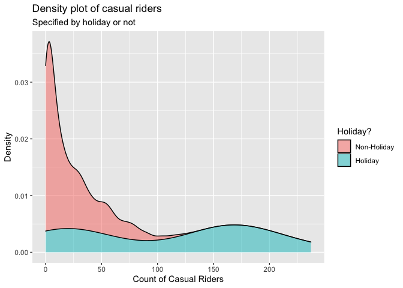

ST558 - Project 2
================
Group 5: Tyler Pollard & Lucy Yin

-   [Required Packages](#required-packages)
-   [Introduction](#introduction)
-   [Data](#data)
-   [Summarization](#summarization)
    -   [Contingency Tables](#contingency-tables)
        -   [Weather Situation](#weather-situation)
        -   [Year, Season and Count of
            Riders](#year-season-and-count-of-riders)
        -   [Working Day and Count of Casual
            Riders](#working-day-and-count-of-casual-riders)
    -   [Summary Tables](#summary-tables)
        -   [Feeling Temperature](#feeling-temperature)
        -   [Humidity](#humidity)
        -   [Wind Speed](#wind-speed)
    -   [Histograms](#histograms)
        -   [Humidity and Windspeed
            Distributions](#humidity-and-windspeed-distributions)
    -   [Density Plot](#density-plot)
        -   [Casual Riders and Weather
            Situation](#casual-riders-and-weather-situation)
        -   [Registered Riders and Weather
            Situation](#registered-riders-and-weather-situation)
        -   [Total Riders and Weather
            Situation](#total-riders-and-weather-situation)
        -   [Casual Riders and Holiday](#casual-riders-and-holiday)
        -   [Registered Riders and
            Holiday](#registered-riders-and-holiday)
        -   [Total Riders and Holiday](#total-riders-and-holiday)
    -   [Boxplots](#boxplots)
        -   [Feeling Temperature Over the
            Year](#feeling-temperature-over-the-year)
        -   [Riders of Every Hour and Weather
            Situation](#riders-of-every-hour-and-weather-situation)
    -   [Scatter Plots](#scatter-plots)
        -   [Count vs Casual by Season](#count-vs-casual-by-season)
        -   [Riders vs Temperature](#riders-vs-temperature)
        -   [Riders vs. Hour vs. Month vs. Working
            Day](#riders-vs-hour-vs-month-vs-working-day)
    -   [Correlation Plot](#correlation-plot)
        -   [Correlation between temp, atemp, hum,
            windspeed](#correlation-between-temp-atemp-hum-windspeed)
    -   [Plots with GGally](#plots-with-ggally)
        -   [Using Day Data](#using-day-data)
        -   [Using Hour Data](#using-hour-data)
-   [Modeling](#modeling)
    -   [Linear Regression Model](#linear-regression-model)
        -   [What is Linear Regression
            Model](#what-is-linear-regression-model)
        -   [Picking predictors using
            AIC](#picking-predictors-using-aic)
        -   [Modeling using AIC picked
            predictor](#modeling-using-aic-picked-predictor)
    -   [Ensemble Tree Model](#ensemble-tree-model)
        -   [Random Forest Model](#random-forest-model)
        -   [Boosted Tree Model](#boosted-tree-model)
-   [Comparison](#comparison)

# Required Packages

# Introduction

For this report we will be using 6 models (4 linear regression, 1 random
forest model, 1 boosted tree model) to make predictions on the total
count of bike riders using data from the Bike Sharing Dataset (dataset
can be found
[here](https://archive.ics.uci.edu/ml/datasets/Bike+Sharing+Dataset)).
This dataset contains hourly and daily count of registered, casual, and
total sum of riders in the Capital bikeshare system, contributing
variables include:

-   season (winter, spring, summer, fall)  
-   year (2011, 2012)  
-   month of the year
-   hour of the day  
-   holiday (yes, no)  
-   day of the week  
-   working day (yes or no)  
-   weather situation (mostly clear, mist, light precipitation, heavy
    precipitation)  
-   temperature  
-   feeling temperature  
-   humidity  
-   wind speed

There are 3 different types of response variables in the dataset:

-   registered: registered riders who uses this bikeshare service
    regularly  
-   casual: un-registered riders who use this service casually or on
    occasions  
-   total: combined count of registered and casual riders

For our analysis, we will be working with almost all of the variables as
predictors, and our response variable will be the total count of bike
riders.

We will be selecting predictors using the `step()` function which
chooses a model by AIC in a stepwise algorithm. As a result, which
predictors we incorporate in our linear regression models and ensemble
tree (specifically random forest and boosted tree) models may differ
depending on which day of the week we look at. We’ll randomly split the
data into training and test sets and fit the 6 models on the training
set. Ultimately we will fit the 6 models on the test set and decide on
which model produced the best prediction, which we judge by the smallest
root mean squared error value.

# Data

First we will read in both the `hours.csv` and `day.csv` data.

``` r
# read in data
hour.data <- read_csv("data/hour.csv") %>% as_tibble()
day.data <- read_csv("data/day.csv") %>% as_tibble()
```

We will make corrections on variable types, specifically we’re making
sure categorical variables will be appropriately classified as factors
with clear levels.

``` r
# correct the variable types
hour.data$season <- factor(hour.data$season)
levels(hour.data$season) <- list(winter = 1, spring = 2, summer = 3, fall = 4)

hour.data$yr <- factor(hour.data$yr)
levels(hour.data$yr) <- list("2011" = 0, "2012" = 1)

hour.data$weekday <- factor(hour.data$weekday)
levels(hour.data$weekday) <- list(monday = 1, tuesday = 2, wednesday = 3, thursday = 4, friday = 5, saturday = 6, sunday = 0)

hour.data$mnth <- factor(hour.data$mnth)
hour.data$hr <- factor(hour.data$hr)
hour.data$holiday <- factor(hour.data$holiday)
hour.data$workingday <- factor(hour.data$workingday)
hour.data$weathersit <- factor(hour.data$weathersit)

day.data$season <- factor(day.data$season)
levels(day.data$season) <- list(winter = 1, spring = 2, summer = 3, fall = 4)

day.data$yr <- factor(day.data$yr)
levels(day.data$yr) <- list("2011" = 0, "2012" = 1)

day.data$weekday <- factor(day.data$weekday)
levels(day.data$weekday) <- list(monday = 1, tuesday = 2, wednesday = 3, thursday = 4, friday = 5, saturday = 6, sunday = 0)

day.data$mnth <- factor(day.data$mnth)
day.data$holiday <- factor(day.data$holiday)
day.data$workingday <- factor(day.data$workingday)
day.data$weathersit <- factor(day.data$weathersit)
```

Because the variables temperature, feeling temperature, humidity and
windspeed are normalized according to different measures, we will
un-normalize them and save the raw values as separate columns in the
dataset.

``` r
# Temp Unnormal
temp.tmin = -8
temp.tmax = 39
hour.data$temp.unnormal <- hour.data$temp*(temp.tmax - temp.tmin) + temp.tmin # Unnormalize temp
hour.data$temp.F <- hour.data$temp.unnormal*(9/5) + 32 # Convert to Fahrenheit
day.data$temp.unnormal <- hour.data %>% group_by(dteday) %>% summarise(mean = mean(temp.unnormal)) %>% select(mean)
day.data$temp.unnormal <- day.data$temp.unnormal[[1]]
day.data$temp.F <- hour.data %>% group_by(dteday) %>% summarise(mean = mean(temp.F)) %>% select(mean)
day.data$temp.F <- day.data$temp.F[[1]]

# Atemp Unnormal
atemp.tmin = -16
atemp.tmax = 50
hour.data$atemp.unnormal <- hour.data$atemp*(atemp.tmax - atemp.tmin) + atemp.tmin # Unnormalize atemps
hour.data$atemp.F <- hour.data$atemp.unnormal*(9/5) + 32 # Convert to Fahrenheit
day.data$atemp.unnormal <- hour.data %>% group_by(dteday) %>% summarise(mean = mean(atemp.unnormal)) %>% select(mean)
day.data$atemp.unnormal <- day.data$atemp.unnormal[[1]]
day.data$atemp.F <- hour.data %>% group_by(dteday) %>% summarise(mean = mean(atemp.F)) %>% select(mean)
day.data$atemp.F <- day.data$atemp.F[[1]]

# Humidity Unnormal
day.data$hum.unnormal <- day.data$hum * 100
hour.data$hum.unnormal <- hour.data$hum * 100

# Windspeed Unnormal
day.data$windspeed.unnormal <- day.data$windspeed * 67
hour.data$windspeed.unnormal <- hour.data$windspeed * 67
```

Because hour and day data are stored separately, we create a
`total.data` table with all the information combined just in case we
need to access this in later steps.

``` r
# add in a new variable before merging
hour.data <- mutate(hour.data, type = "hour")
day.data <- mutate(day.data, type = "day", hr = NA) %>% select(instant, dteday, season, yr, mnth, hr, everything())

# merge to create complete list of hour/day data
total.data <- rbind(hour.data, day.data)
```

We will filter to only include data from one specific day of the week at
a time.

``` r
# filter out to one specific day of the week
hour.data <- hour.data %>% filter(weekday == params$weekday)
day.data <- day.data %>% filter(weekday == params$weekday)
total.data <- total.data %>% filter(weekday == params$weekday)
```

We randomly sample from the filtered data to form a training set (with
70% of data) and test set (with the remaining 30% of data). Here we
randomly sampled from the day dataset and split it into training and
test sets, then we split the corresponding data from the hours dataset
according to which days are in the training set and which days are in
the test set. We will be using the hours dataset for our modeling, but
we wanted to make sure our day and hour datasets had matching training
and test splits.

``` r
# splitting data into training & test sets
set.seed(7)
train <- sample(1:nrow(day.data), size = nrow(day.data)*0.7)
test <- dplyr::setdiff(1:nrow(day.data), train)
day.training.data <- day.data[train, ]
day.test.data <- day.data[test, ]

hour.training.data <- hour.data[hour.data$dteday %in% day.training.data$dteday,]
hour.test.data <- hour.data[hour.data$dteday %in% day.test.data$dteday,]
```

# Summarization

We have some basic summary statistics and plots about our training data.

## Contingency Tables

### Weather Situation

Below is a contingency table that shows the count of days that fall into
the different categories of weather situation. This table will help
justify the total count of riders because it can be expected that the
number of casual riders, which influences the total count of riders,
will be higher on nicer days that fall into the first two categories of
Mostly clear and Mist.

``` r
levels(day.training.data$weathersit) <- list(
  "Mostly clear" = "1",
  "Mist" = "2",
  "Light precipitation" = "3",
  "Heavy precipitation" = "4")
kable(t(table(day.training.data$weathersit)))
```

| Mostly clear | Mist | Light precipitation | Heavy precipitation |
|-------------:|-----:|--------------------:|--------------------:|
|           42 |   25 |                   5 |                   0 |

### Year, Season and Count of Riders

These contingency tables show what count range of riders utilized the
bikeshare service for a given season or for a given year. This table can
help us see if the number of riders increased/decreased from 2011 to
2012, or if season has an effect on how many riders used the bikeshare
service.

``` r
kable(table(day.training.data$season, cut(day.training.data$cnt, breaks = 2, dig.lab = 10)), caption = "Occurrences of # Range of Riders of a given Season")
```

|        | (498.333,4339.5\] | (4339.5,8180.667\] |
|:-------|------------------:|-------------------:|
| winter |                13 |                  1 |
| spring |                 6 |                 12 |
| summer |                 3 |                 18 |
| fall   |                 8 |                 11 |

Occurrences of # Range of Riders of a given Season

``` r
kable(table(day.training.data$yr, cut(day.training.data$cnt, breaks = 2, dig.lab = 10)), caption = "Occurrences of # Range of Riders of a given Year")
```

|      | (498.333,4339.5\] | (4339.5,8180.667\] |
|:-----|------------------:|-------------------:|
| 2011 |                26 |                 10 |
| 2012 |                 4 |                 32 |

Occurrences of # Range of Riders of a given Year

### Working Day and Count of Casual Riders

This contingency table show what count range of casual riders utilized
the bikeshare service on working day versus non-working day. Intuitively
we’d suspect that there would more casual riders on non-working day than
working day, this table can show us whether it’s true or not.

``` r
levels(day.training.data$workingday) <- list("workday" = 1, "non-workday" = 0)
kable(table(day.training.data$workingday, cut(day.training.data$casual, breaks = 2, dig.lab = 10)), caption = "Occurrences of # Range of Casual Riders of Workday vs. non-Workday")
```

|             | (22.463,1293.5\] | (1293.5,2564.537\] |
|:------------|-----------------:|-------------------:|
| workday     |               70 |                  1 |
| non-workday |                0 |                  1 |

Occurrences of # Range of Casual Riders of Workday vs. non-Workday

## Summary Tables

### Feeling Temperature

The summary tables of feeling temperature show the 5 number summary
along with the mean and standard deviation of what the temperature
actually felt like over the different years. The summary table for both
the normalized and raw feeling temperatures are provided. These tables
give insight to the range of feeling temperatures felt by the riders for
the different years.

``` r
# Normalized feeling temperature
atemp.summary <- hour.training.data %>% group_by(yr) %>% summarise(Min. = min(atemp), `1st Qu.` = quantile(atemp,0.25), Median = median(atemp), Mean = mean(atemp), `3rd Qu.` = quantile(atemp, 0.75), Max. = max(atemp), `St. Dev.` = sd(atemp))
kable(atemp.summary, digits = 2, caption = "Summary of feeling temperatures by year")
```

| yr   | Min. | 1st Qu. | Median | Mean | 3rd Qu. | Max. | St. Dev. |
|:-----|-----:|--------:|-------:|-----:|--------:|-----:|---------:|
| 2011 | 0.08 |    0.33 |   0.49 | 0.48 |    0.64 | 0.88 |     0.18 |
| 2012 | 0.02 |    0.33 |   0.53 | 0.50 |    0.64 | 0.88 |     0.17 |

Summary of feeling temperatures by year

``` r
# Raw feeling temperature in Fahrenheit
atemp.summary.unnormal <- hour.training.data %>% group_by(yr) %>% summarise(Min. = min(atemp.F), `1st Qu.` = quantile(atemp.F,0.25), Median = median(atemp.F), Mean = mean(atemp.F), `3rd Qu.` = quantile(atemp.F, 0.75), Max. = max(atemp.F), `St. Dev.` = sd(atemp.F))
kable(atemp.summary.unnormal, digits = 2, caption = "Summary of raw feeling temperatures by year")
```

| yr   |  Min. | 1st Qu. | Median |  Mean | 3rd Qu. |  Max. | St. Dev. |
|:-----|------:|--------:|-------:|------:|--------:|------:|---------:|
| 2011 | 12.21 |    42.8 |   61.7 | 60.28 |    78.8 | 107.6 |    20.89 |
| 2012 |  5.01 |    42.8 |   66.2 | 62.58 |    78.8 | 107.6 |    20.14 |

Summary of raw feeling temperatures by year

### Humidity

These summary tables show the spread of normalized and raw humidity
values. The table includes the 5 number summary along with mean and
standard deviation, which gives insight to the range of humidity levels
riders experienced.

``` r
kable(t(c(summary(day.training.data$hum), St.Dev. = sd(day.training.data$hum))), digits = 2, caption = "Summary of Normalized Humidity")
```

| Min. | 1st Qu. | Median | Mean | 3rd Qu. | Max. | St.Dev. |
|-----:|--------:|-------:|-----:|--------:|-----:|--------:|
| 0.36 |    0.54 |   0.64 | 0.65 |    0.76 | 0.93 |    0.14 |

Summary of Normalized Humidity

``` r
kable(t(c(summary(day.training.data$hum.unnormal), St.Dev. = sd(day.training.data$hum.unnormal))), digits = 2, caption = "Summary of Raw Humidity")  
```

| Min. | 1st Qu. | Median |  Mean | 3rd Qu. | Max. | St.Dev. |
|-----:|--------:|-------:|------:|--------:|-----:|--------:|
|   36 |   53.79 |  63.85 | 64.81 |    75.8 |   93 |   14.44 |

Summary of Raw Humidity

### Wind Speed

These summary tables show the spread of normalized and raw wind speeds.
The table includes the 5 number summary along with mean and standard
deviation, which gives insight to the range of wind speeds riders
experienced.

``` r
kable(t(c(summary(day.training.data$windspeed), St.Dev. = sd(day.training.data$windspeed))), digits = 2, caption = "Summary of Normalized Wind Speed")
```

| Min. | 1st Qu. | Median | Mean | 3rd Qu. | Max. | St.Dev. |
|-----:|--------:|-------:|-----:|--------:|-----:|--------:|
| 0.06 |    0.14 |   0.18 | 0.19 |    0.24 | 0.35 |    0.07 |

Summary of Normalized Wind Speed

``` r
kable(t(c(summary(day.training.data$windspeed.unnormal), St.Dev. = sd(day.training.data$windspeed.unnormal))), digits = 2, caption = "Summary of Raw Wind Speed ")
```

| Min. | 1st Qu. | Median |  Mean | 3rd Qu. |  Max. | St.Dev. |
|-----:|--------:|-------:|------:|--------:|------:|--------:|
| 4.08 |    9.15 |  12.23 | 12.58 |   16.23 | 23.17 |    4.75 |

Summary of Raw Wind Speed

## Histograms

### Humidity and Windspeed Distributions

The following density plots show the distribution of the weather effects
for raw humidity and raw wind speed over the span of the biker data.
These distributions provide insight on what values for each weather
effect can be expected and how the combination of each effect may drive
the different weather situations and in turn the expected count of
riders.

``` r
hum.histogram <- ggplot(data = day.training.data, aes(x = hum.unnormal)) + 
  geom_histogram(aes(y = ..density..), bins = 30) + 
  geom_density(color = "red", size = 2) + 
  labs(title = "Humidity Distribution", x = "Raw Humidity", y = "Density")
windspeed.histogram <- ggplot(data = day.training.data, aes(x = windspeed.unnormal)) + 
  geom_histogram(aes(y = ..density..), bins = 30) + 
  geom_density(color = "red", size = 2) + 
  labs(title = "Windspeed Distribution", x = "Raw Windspeed", y = "Density")
grid.arrange(hum.histogram, windspeed.histogram, ncol = 2, top = "Density Distribution of Weather Effects")
```

<!-- -->

## Density Plot

### Casual Riders and Weather Situation

This density plot shows the amount of casual riders in a given weather
situation. Intuitively we suspect that there would more casual riders in
better weather conditions. This density plot can show us whether or not
this is true.

``` r
ggplot(hour.training.data, aes(x = casual)) + 
  geom_density(alpha = 0.5, position = "stack", aes(fill = weathersit)) + 
  labs(title = "Density plot of casual riders",
       subtitle = "Specified by weather situation",
       x = "Count of Casual Riders",
       y = "Density") + 
  scale_fill_discrete(name = "Weather Situation", labels = c("Mostly Clear", "Mist", "Light Precip.", "Heavy Precip."))  
```

<!-- -->

### Registered Riders and Weather Situation

This density plot shows the amount of registered riders in a given
weather situation. We suspect that the amount of registered riders
wouldn’t be as affected by weather situation as the amount of casual
riders would. This density plot can show us whether or not this is true.

``` r
ggplot(hour.training.data, aes(x = registered)) + 
  geom_density(alpha = 0.5, position = "stack", aes(fill = weathersit)) + 
  labs(title = "Density plot of casual riders",
       subtitle = "Specified by weather situation",
       x = "Count of Registered Riders",
       y = "Density") + 
  scale_fill_discrete(name = "Weather Situation", labels = c("Mostly Clear", "Mist", "Light Precip.", "Heavy Precip."))  
```

<!-- -->

### Total Riders and Weather Situation

This density plot shows the total count of riders in a given weather
situation. We may see a relationship between how many riders there are
and what type of weather condition it is.

``` r
ggplot(hour.training.data, aes(x = cnt)) + 
  geom_density(alpha = 0.5, position = "stack", aes(fill = weathersit)) + 
  labs(title = "Density plot of casual riders",
       subtitle = "Specified by weather situation",
       x = "Total Count of Riders",
       y = "Density") + 
  scale_fill_discrete(name = "Weather Situation", labels = c("Mostly Clear", "Mist", "Light Precip.", "Heavy Precip."))  
```

<!-- -->

### Casual Riders and Holiday

This density plot shows the amount of casual riders depending on whether
it is a holiday or non-holiday. We suspect there would be more casual
riders on holidays, especially at larger counts. This density plot can
show us whether that is true.

``` r
ggplot(hour.training.data, aes(x = casual)) + 
  geom_density(alpha = 0.5, position = "stack", aes(fill = holiday)) +
  labs(title = "Density plot of casual riders",
       subtitle = "Specified by holiday or not",
       x = "Count of Casual Riders",
       y = "Density") +
  scale_fill_discrete(name = "Holiday?", labels = c("Non-Holiday", "Holiday"))    
```

<!-- -->

### Registered Riders and Holiday

This density plot shows the amount of registered riders depending on
whether it is a holiday or non-holiday. We suspect there would be more
registered riders on non-holidays, especially at larger counts. This
density plot can show us whether that is true.

``` r
ggplot(hour.training.data, aes(x = registered)) + 
  geom_density(alpha = 0.5, position = "stack", aes(fill = holiday)) +
  labs(title = "Density plot of casual riders",
       subtitle = "Specified by holiday or not",
       x = "Count of Registered Riders",
       y = "Density") +
  scale_fill_discrete(name = "Holiday?", labels = c("Non-Holiday", "Holiday"))    
```

<!-- -->

### Total Riders and Holiday

This density plot shows the total count of riders depending on whether
it is a holiday or non-holiday. This plot could show a relationship
between the amount of riders versus whether it’s a holiday or
non-holiday.

``` r
ggplot(hour.training.data, aes(x = cnt)) + 
  geom_density(alpha = 0.5, position = "stack", aes(fill = holiday)) +
  labs(title = "Density plot of casual riders",
       subtitle = "Specified by holiday or not",
       x = "Total Count of Riders",
       y = "Density") +
  scale_fill_discrete(name = "Holiday?", labels = c("Non-Holiday", "Holiday"))    
```

<!-- -->

## Boxplots

### Feeling Temperature Over the Year

To get a better understanding of the feeling temperature spreads over
the year, boxplots of the feeling temperature are plotted by month with
the data points for each day used to create them plotted overtop.
Intuitively, it can be expected that the feeling temperature rises from
the beginning of the year into the middle of summer and then drops back
down over the fall and winter months. These boxplots provide insight
into the possible number of rider fluctuation over the different months
of the year.

``` r
atemp.boxplot.df <- day.training.data
levels(atemp.boxplot.df$mnth) <- list(January = 1, February = 2, March = 3, April = 4, May = 5, June = 6, July = 7, August = 8, September = 9, October = 10, November = 11, December = 12)
ggplot(data = atemp.boxplot.df, aes(x = mnth, y = atemp.F)) + 
  geom_boxplot() + 
  geom_point(position = "jitter", color = "blue") + 
  labs(title = "Feeling temperature distribution per month", x = "Month", y = "Feeling Temperature (F)")
```

<!-- -->

### Riders of Every Hour and Weather Situation

This boxplot shows the 5 number summary (in boxplot form with occasional
outliers) of the amount of riders for each hour of the day. The colored
lines should the mean number of riders for each given weather situation.
We expect that the highest amount of riders should appear around the
morning and afternoon commute time given it’s not on a holiday or on the
weekends. This boxplot can show if that’s true.

``` r
ggplot(hour.training.data, aes(x = hr, y = cnt)) + 
  geom_boxplot() + 
  stat_summary(fun = mean, geom = "line", lwd = 0.8, aes(group = weathersit, col = weathersit)) + 
  labs(title = "Count of riders for every hr",
       subtitle = "Mean values based on weather situation",
       x = "Hour of the Day",
       y = "Count of Riders") + 
  scale_color_discrete(name = "Weather Situation", labels = c("Mostly Clear", "Mist", "Light Precip.", "Heavy Precip."))
```

<!-- -->

## Scatter Plots

### Count vs Casual by Season

These four scatter plots show the relation between the total number of
riders and casual riders by day with linear models plotted overtop
parsed by season. These plots show how the number of casual riders
contribute to the total count of riders for each season. The greater the
slope of the linear model correlates to a greater number of causal
riders contributing to the total count of riders.

``` r
ggplot(data = day.training.data, aes(x = cnt, y = casual)) +
  geom_point() +
  geom_smooth(method = "lm") +
  facet_grid(cols = vars(season)) + 
  labs(title = "Casual Riders Influence on Total Count", x = "Count", y = "Casual Riders")
```

<!-- -->

### Riders vs Temperature

Below is a scattered plot of the number of causal riders vs the raw
temperature for each day in the span of the data parsed by workingday
with a local polynomial regression line fit overtop. This plot provides
insight on how many people spontaneous chose to ride based on the raw
temperature of that day.

``` r
day.training.data$temp.indicator <- ifelse(day.training.data$temp < mean(day.training.data$temp), 0, 1)
day.training.data$temp.indicator <- as_factor(day.training.data$temp.indicator)
levels(day.training.data$temp.indicator) <- list("Low Temperature" = 0, "High Temperature" = 1)
ggplot(data = day.training.data, aes(x = temp.F, y = casual, color = workingday)) + 
  geom_point() + 
  geom_smooth() + 
  labs(title = "Casual Riders Based on Temperature", x = "Raw Temperature", y = "Number of Casual Riders")
```

<!-- -->

### Riders vs. Hour vs. Month vs. Working Day

This boxplot below shows the count of riders for every month and every
hour of the day. The color of the points indicate whether it was on a
working day (1) or non-working day (0). We suspect for working days,
there would be an obvious uptick around the morning and afternoon
commute time. But for non-working days, the amount of riders shouldn’t
have an obvious pattern around those time frames. This plot shows us
whether that’s true or not.

``` r
count.df <- hour.training.data
levels(count.df$mnth) <- list(January = 1, February = 2, March = 3, April = 4, May = 5, June = 6, July = 7, August = 8, September = 9, October = 10, November = 11, December = 12)
ggplot(count.df, aes(x = hr, y = cnt)) +
  geom_point(aes(col = workingday)) +
  facet_wrap(vars(mnth)) + 
  labs(title = "Count of riders for every hour of every month",
       subtitle = "Specified by workday or non-workday",
       x = "Hour of the Day",
       y = "Count of Riders") +
  scale_color_discrete(name = "Working Day")
```

<!-- -->

## Correlation Plot

### Correlation between temp, atemp, hum, windspeed

This correlation plots show the correlation (positive or negative)
between the 4 quantitative variables temperature, feeling temperature,
humidity and wind speed. We suspect that there likely would be a high
correlation between temperature and feeling temperature, and humidity
might be inverse correlated with wind speed. This correlation can show
us whether this is true.

``` r
cor.variables <- hour.training.data %>% select(temp, atemp, hum, windspeed)
correlation <- cor(cor.variables, method = "spearman")
corrplot(correlation)
```

<!-- -->

## Plots with GGally

The two GGally plots below will show whether there’s any relationship
between each of the variables. We run this plot on both the day and hour
data.

### Using Day Data

``` r
subset.data.day <- data_frame(weathersit=day.training.data$weathersit, temp=day.training.data$temp, atemp=day.training.data$atemp,humidity=day.training.data$hum, windspeed=day.training.data$windspeed, casual=day.training.data$casual, registered=day.training.data$registered, total=day.training.data$cnt)
GGally::ggpairs(subset.data.day)
```

<!-- -->

### Using Hour Data

``` r
subset.data.hr <- data_frame(weathersit=hour.training.data$weathersit, temp=hour.training.data$temp, atemp=hour.training.data$atemp,humidity=hour.training.data$hum, windspeed=hour.training.data$windspeed, casual=hour.training.data$casual, registered=hour.training.data$registered, total=hour.training.data$cnt)
GGally::ggpairs(subset.data.hr)
```

<!-- -->

# Modeling

## Linear Regression Model

### What is Linear Regression Model

Linear regression is a type of modeling used to predict a response based
on explanatory variables by fitting a linear equation to observed data.
For simple linear regression using a single explanatory variable to
predict a response variable the equation is
*Y*<sub>*i*</sub> = *β*<sub>0</sub> + *β*<sub>1</sub>*x*<sub>*i*</sub> + *E*<sub>*i*</sub>
where *Y*<sub>*i*</sub> is the response for the *i*<sup>*t**h*</sup>
observation, *x*<sub>*i*</sub> is the value of the explanatory variable
for the *i*<sup>*t**h*</sup> observation, *β*<sub>0</sub> is the
y-intercept, *β*<sub>1</sub> is the slope, and *E*<sub>*i*</sub> is the
error for the *i*<sup>*t**h*</sup> observation. Fitting a linear model
to the observed dataset requires estimating the coefficients *β* such
that the error term
*E*<sub>*i*</sub> = *Y*<sub>*i*</sub> − *β*<sub>0</sub> − *β*<sub>1</sub>*x*<sub>*i*</sub>
is minimized. The most common way to minimize this term is through
least-squares where we minimize the sum of squared residuals through
$min\_{\\beta\_{0},\\beta\_{1}}\\sum\_{i=1}^n ({y}\_{i} - \\beta\_{0} - \\beta\_{1}{x}\_{i})$.
Simple linear regression can be extended in many ways to include:

-   higher order terms:
    *Y*<sub>*i*</sub> = *β*<sub>0</sub> + *β*<sub>1</sub>*x*<sub>*i*</sub> + *β*<sub>2</sub>*x*<sub>*i*</sub><sup>2</sup> + *E*<sub>*i*</sub>  
-   more explanatory variables:
    *Y*<sub>*i*</sub> = *β*<sub>0</sub> + *β*<sub>1</sub>*x*<sub>1*i*</sub> + *β*<sub>2</sub>*x*<sub>2*i*</sub> + *β*<sub>3</sub>*x*<sub>1*i*</sub>*x*<sub>2*i*</sub> + *E*<sub>*i*</sub>  
-   more explanatory variables and higher order terms:
    *Y*<sub>*i*</sub> = *β*<sub>0</sub> + *β*<sub>1</sub>*x*<sub>1*i*</sub> + *β*<sub>2</sub>*x*<sub>2*i*</sub> + *β*<sub>3</sub>*x*<sub>1*i*</sub>*x*<sub>2*i*</sub> + *β*<sub>4</sub>*x*<sub>1*i*</sub><sup>2</sup> + *β*<sub>5</sub>*x*<sub>2*i*</sub><sup>2</sup> + *E*<sub>*i*</sub>

In each of these linear regressions the model is still fit by minimizing
the sum of squared errors. As the number of explanatory variables
increase these regression models can become quite large, so it is best
to compare different candidate models to see which provides the best fit
of the data. Usually you would have some sort of subject matter
knowledge to help select these candidate models by understanding which
variables are related and which variables scientifically should be put
in the model. Without subject matter knowledge you might select multiple
candidate models and compare them using fit criteria such as AIC, BIC,
AICc, Adjusted R-squared or Variance Inflation Factor (VIF).
Alternatively, you may compare prediction error by splitting the data
into a training and test set with a 80/20 split and fit the candidate
models on the training set to predict the response of the test set. The
model with the lowest RMSE should be considered to be the best fit as it
minimized the error the best.

### Picking predictors using AIC

First we want to select only the variables that we will use in our
models, as variables such as record index, date are not useful to us. We
will be using the un-normalized versions of temperature, feeling
temperature, humidity and wind speed (instead of the normalized
versions) because we want to standardize all numerical variables when
running our models.  
Because on some days of the week holiday and working day both become 1
leveled factor variables and can cause issues in our modeling, so we
will omit these 2 variables for those days of the week.

``` r
# keep only variables that are relevant to modeling
if.weekday <- hour.training.data %>% filter(weekday == params$weekday) %>% select(workingday) %>% unique() %>% nrow()
if.holiday <- hour.training.data %>% filter(weekday == params$weekday) %>% select(holiday) %>% unique() %>% nrow()

# use function to decide if a weekday has 1 factored levels
# if so we will not use these factors in the model 
get.data <- function(weekday, ...){
  if (if.weekday == 1 & if.holiday == 1) {
    hour.training.data2 <- hour.training.data %>% select(season, yr, mnth, hr, weathersit, temp.F, atemp.F, hum.unnormal, windspeed.unnormal, cnt)
  }
  else {
    hour.training.data2 <- hour.training.data %>% select(season, yr, mnth, hr, holiday, workingday, weathersit, temp.F, atemp.F, hum.unnormal, windspeed.unnormal, cnt)
  }
  hour.training.data2
}
hour.training.data2 <- get.data(params$weekday)
```

We will let the `step()` function to pick our models using the stepwise
algorithm. We provide the `step()` function with 3 different linear
models, first with just first order variables, second with squared terms
and interactions, and third with first ordered variables and
interactions.

``` r
# aic using only 1st ordered terms
fit.aic <- step((lm(cnt ~ ., data = hour.training.data2, verbose = FALSE)), direction = "both")

# aic including squared terms and interactions
fit.aic2 <- step((lm(cnt ~ .^2 + I(temp.F^2) + I(atemp.F^2) + I(hum.unnormal^2) + I(windspeed.unnormal^2), data = hour.training.data2, verbose = FALSE)), direction = "both")

# aic using 1st order and interactions
fit.aic3 <- step((lm(cnt ~.^2, data = hour.training.data2, verbose = FALSE)), direction = "both")
```

### Modeling using AIC picked predictor

For the first linear regression model we run, we will pick predictors
based on our intuition. We expect the feeling temperature would be
highly correlated with the actual temperature, and because wind speed
and humidity could also be correlated with feeling temperature, so we
only kept temperature as a predictor in the model and will not include
feeling temperature. We also did not include holiday in the model
because it has some redundant information to the working day variable.

``` r
# use all predictors except atemp and holiday
set.seed(7)
fit.mlr0 <- train(cnt ~ season + yr + mnth + hr + workingday + weathersit + temp.F + hum.unnormal + windspeed.unnormal,
                  data = hour.training.data,
                  method = "lm",
                  preProcess = c("center", "scale"),
                  trControl = trainControl(method = "cv", number = 10))
fit.mlr0
```

    ## Linear Regression 
    ## 
    ## 1711 samples
    ##    9 predictor
    ## 
    ## Pre-processing: centered (45), scaled (45) 
    ## Resampling: Cross-Validated (10 fold) 
    ## Summary of sample sizes: 1539, 1539, 1539, 1539, 1540, 1541, ... 
    ## Resampling results:
    ## 
    ##   RMSE      Rsquared   MAE     
    ##   83.27319  0.8196212  59.13526
    ## 
    ## Tuning parameter 'intercept' was held constant at a value of TRUE

``` r
# Examine performance of this multiple linear regression model on the test data after prediction
predict.mlr0 <- postResample(predict(fit.mlr0, newdata = hour.test.data), obs = hour.test.data$cnt)
```

The next three linear regression models are fit using the predictors
picked by the three step functions. These models include different
number of predictors in different complexity, so we will see which
models will produce the best prediction in the end.

``` r
# use aic predictors (1st ordered terms)
set.seed(7)
fit.mlr1 <- train(fit.aic$terms,
                  data = hour.training.data2,
                  method = "lm",
                  preProcess = c("center", "scale"),
                  trControl = trainControl(method = "cv", number = 10))
fit.mlr1
```

    ## Linear Regression 
    ## 
    ## 1711 samples
    ##    6 predictor
    ## 
    ## Pre-processing: centered (40), scaled (40) 
    ## Resampling: Cross-Validated (10 fold) 
    ## Summary of sample sizes: 1539, 1539, 1539, 1539, 1540, 1541, ... 
    ## Resampling results:
    ## 
    ##   RMSE      Rsquared   MAE     
    ##   82.98793  0.8207654  58.99365
    ## 
    ## Tuning parameter 'intercept' was held constant at a value of TRUE

``` r
# variables used in fit
fit.aic
```

    ## 
    ## Call:
    ## lm(formula = cnt ~ yr + mnth + hr + weathersit + atemp.F + hum.unnormal, 
    ##     data = hour.training.data2, verbose = FALSE)
    ## 
    ## Coefficients:
    ##  (Intercept)        yr2012         mnth2         mnth3         mnth4         mnth5         mnth6         mnth7  
    ##     -87.9947       98.7966       15.9414       39.3915       40.4417       78.3512       61.9321       54.6714  
    ##        mnth8         mnth9        mnth10        mnth11        mnth12           hr1           hr2           hr3  
    ##      79.5268       93.4760       98.0688       65.4061       63.3692      -19.2910      -25.0050      -32.8549  
    ##          hr4           hr5           hr6           hr7           hr8           hr9          hr10          hr11  
    ##     -31.7670       -0.8800       83.6365      283.8558      471.6320      204.3865       89.6691      100.2784  
    ##         hr12          hr13          hr14          hr15          hr16          hr17          hr18          hr19  
    ##     138.2235      126.3755      102.8581      117.2876      211.0669      461.4770      455.9831      316.6742  
    ##         hr20          hr21          hr22          hr23   weathersit2   weathersit3   weathersit4       atemp.F  
    ##     220.0537      151.9914      102.0886       43.2101      -15.4191      -53.6728      -48.2376        1.4719  
    ## hum.unnormal  
    ##      -0.8386

``` r
# Examine performance of this multiple linear regression model on the test data after prediction
predict.mlr1 <- postResample(predict(fit.mlr1, newdata = hour.test.data), obs = hour.test.data$cnt)
```

``` r
# use aic predictors (2nd ordered terms and interactions)
set.seed(7)
fit.mlr2 <- train(fit.aic2$terms,
                  data = hour.training.data2,
                  method = "lm",
                  preProcess = c("center", "scale"),
                  trControl = trainControl(method = "cv", number = 10))
fit.mlr2
```

    ## Linear Regression 
    ## 
    ## 1711 samples
    ##   10 predictor
    ## 
    ## Pre-processing: centered (557), scaled (557) 
    ## Resampling: Cross-Validated (10 fold) 
    ## Summary of sample sizes: 1539, 1539, 1539, 1539, 1540, 1541, ... 
    ## Resampling results:
    ## 
    ##   RMSE      Rsquared   MAE     
    ##   51.30332  0.9284052  31.86998
    ## 
    ## Tuning parameter 'intercept' was held constant at a value of TRUE

``` r
# variables used in fit
fit.aic2
```

    ## 
    ## Call:
    ## lm(formula = cnt ~ season + yr + mnth + hr + holiday + weathersit + 
    ##     temp.F + atemp.F + hum.unnormal + windspeed.unnormal + I(atemp.F^2) + 
    ##     I(hum.unnormal^2) + I(windspeed.unnormal^2) + season:hum.unnormal + 
    ##     yr:mnth + yr:hr + yr:temp.F + yr:atemp.F + yr:hum.unnormal + 
    ##     yr:windspeed.unnormal + mnth:hr + mnth:weathersit + mnth:temp.F + 
    ##     mnth:atemp.F + mnth:windspeed.unnormal + hr:holiday + hr:weathersit + 
    ##     hr:temp.F + hr:hum.unnormal + weathersit:hum.unnormal + weathersit:windspeed.unnormal + 
    ##     temp.F:atemp.F + temp.F:hum.unnormal + temp.F:windspeed.unnormal + 
    ##     atemp.F:hum.unnormal, data = hour.training.data2, verbose = FALSE)
    ## 
    ## Coefficients:
    ##                    (Intercept)                    seasonspring                    seasonsummer  
    ##                     -3.744e+02                       9.684e+01                       1.468e+02  
    ##                     seasonfall                          yr2012                           mnth2  
    ##                      1.384e+02                       3.647e+01                       1.626e+02  
    ##                          mnth3                           mnth4                           mnth5  
    ##                      5.507e+01                      -3.034e+02                      -4.000e+02  
    ##                          mnth6                           mnth7                           mnth8  
    ##                     -2.213e+02                      -2.716e+02                      -3.816e+02  
    ##                          mnth9                          mnth10                          mnth11  
    ##                     -3.288e+02                      -3.484e+02                      -1.700e+01  
    ##                         mnth12                             hr1                             hr2  
    ##                     -3.224e+02                      -1.914e+01                      -1.797e+01  
    ##                            hr3                             hr4                             hr5  
    ##                     -1.830e+01                      -2.836e+01                      -3.532e+00  
    ##                            hr6                             hr7                             hr8  
    ##                     -3.127e+01                      -1.005e+02                       3.352e+01  
    ##                            hr9                            hr10                            hr11  
    ##                      7.021e+01                       4.041e+00                      -6.347e+00  
    ##                           hr12                            hr13                            hr14  
    ##                      3.373e+01                       1.550e+01                      -4.014e-01  
    ##                           hr15                            hr16                            hr17  
    ##                      2.172e+01                       2.469e+01                       1.388e+02  
    ##                           hr18                            hr19                            hr20  
    ##                      1.406e+02                       5.635e+01                      -5.298e+01  
    ##                           hr21                            hr22                            hr23  
    ##                     -3.915e+00                      -4.826e+01                      -1.975e+01  
    ##                       holiday1                     weathersit2                     weathersit3  
    ##                      1.061e+02                       5.684e+00                      -5.368e+01  
    ##                    weathersit4                          temp.F                         atemp.F  
    ##                      1.226e+01                       1.309e+01                      -2.801e+00  
    ##                   hum.unnormal              windspeed.unnormal                    I(atemp.F^2)  
    ##                      5.198e+00                      -1.506e+00                       2.194e-01  
    ##              I(hum.unnormal^2)         I(windspeed.unnormal^2)       seasonspring:hum.unnormal  
    ##                     -2.488e-02                      -4.723e-02                      -9.826e-01  
    ##      seasonsummer:hum.unnormal         seasonfall:hum.unnormal                    yr2012:mnth2  
    ##                     -1.524e+00                      -1.320e+00                       2.565e+01  
    ##                   yr2012:mnth3                    yr2012:mnth4                    yr2012:mnth5  
    ##                     -4.047e+00                       7.644e+00                      -1.334e+00  
    ##                   yr2012:mnth6                    yr2012:mnth7                    yr2012:mnth8  
    ##                     -4.808e+01                      -1.996e+01                       2.110e+01  
    ##                   yr2012:mnth9                   yr2012:mnth10                   yr2012:mnth11  
    ##                     -4.298e+01                       4.597e+01                      -3.737e+01  
    ##                  yr2012:mnth12                      yr2012:hr1                      yr2012:hr2  
    ##                     -2.497e+01                      -1.625e+01                      -2.077e+01  
    ##                     yr2012:hr3                      yr2012:hr4                      yr2012:hr5  
    ##                     -1.910e+01                      -1.649e+01                      -3.832e+00  
    ##                     yr2012:hr6                      yr2012:hr7                      yr2012:hr8  
    ##                      4.229e+01                       1.808e+02                       2.618e+02  
    ##                     yr2012:hr9                     yr2012:hr10                     yr2012:hr11  
    ##                      9.385e+01                       3.068e+01                       3.452e+01  
    ##                    yr2012:hr12                     yr2012:hr13                     yr2012:hr14  
    ##                      4.919e+01                       4.212e+01                       1.872e+01  
    ##                    yr2012:hr15                     yr2012:hr16                     yr2012:hr17  
    ##                      4.330e+01                       8.275e+01                       1.715e+02  
    ##                    yr2012:hr18                     yr2012:hr19                     yr2012:hr20  
    ##                      2.197e+02                       1.439e+02                       8.675e+01  
    ##                    yr2012:hr21                     yr2012:hr22                     yr2012:hr23  
    ##                      6.324e+01                       4.362e+01                       1.187e+01  
    ##                  yr2012:temp.F                  yr2012:atemp.F             yr2012:hum.unnormal  
    ##                      4.472e+00                      -3.361e+00                      -1.040e+00  
    ##      yr2012:windspeed.unnormal                       mnth2:hr1                       mnth3:hr1  
    ##                     -4.343e-01                       3.430e+00                       7.271e+00  
    ##                      mnth4:hr1                       mnth5:hr1                       mnth6:hr1  
    ##                     -1.664e+01                      -2.137e+01                      -3.553e+01  
    ##                      mnth7:hr1                       mnth8:hr1                       mnth9:hr1  
    ##                     -4.745e+01                      -3.566e+01                      -1.440e+01  
    ##                     mnth10:hr1                      mnth11:hr1                      mnth12:hr1  
    ##                     -2.852e+01                      -3.754e+01                      -5.921e+00  
    ##                      mnth2:hr2                       mnth3:hr2                       mnth4:hr2  
    ##                     -6.102e+00                       6.704e+00                      -2.097e+01  
    ##                      mnth5:hr2                       mnth6:hr2                       mnth7:hr2  
    ##                     -4.150e+00                      -5.567e+01                      -4.910e+01  
    ##                      mnth8:hr2                       mnth9:hr2                      mnth10:hr2  
    ##                     -3.397e+01                      -1.799e+01                      -2.954e+01  
    ##                     mnth11:hr2                      mnth12:hr2                       mnth2:hr3  
    ##                     -4.507e+01                      -1.486e+01                      -2.338e+01  
    ##                      mnth3:hr3                       mnth4:hr3                       mnth5:hr3  
    ##                      1.598e+01                      -1.169e+01                      -1.575e+01  
    ##                      mnth6:hr3                       mnth7:hr3                       mnth8:hr3  
    ##                     -4.033e+01                      -2.424e+01                      -1.264e+01  
    ##                      mnth9:hr3                      mnth10:hr3                      mnth11:hr3  
    ##                     -1.536e+00                      -2.112e+01                      -5.483e+01  
    ##                     mnth12:hr3                       mnth2:hr4                       mnth3:hr4  
    ##                     -5.845e+00                      -2.854e+01                       6.777e+00  
    ##                      mnth4:hr4                       mnth5:hr4                       mnth6:hr4  
    ##                     -1.770e+01                      -1.333e+01                      -4.195e+01  
    ##                      mnth7:hr4                       mnth8:hr4                       mnth9:hr4  
    ##                     -4.658e+01                      -2.692e+01                      -7.986e+00  
    ##                     mnth10:hr4                      mnth11:hr4                      mnth12:hr4  
    ##                     -1.993e+01                      -5.266e+01                       6.326e+00  
    ##                      mnth2:hr5                       mnth3:hr5                       mnth4:hr5  
    ##                     -7.420e+00                       2.810e+01                       9.131e+00  
    ##                      mnth5:hr5                       mnth6:hr5                       mnth7:hr5  
    ##                      2.126e+01                      -6.130e+00                       1.175e+00  
    ##                      mnth8:hr5                       mnth9:hr5                      mnth10:hr5  
    ##                      2.005e+01                       3.478e+01                       1.946e+01  
    ##                     mnth11:hr5                      mnth12:hr5                       mnth2:hr6  
    ##                     -2.519e+01                       3.015e+01                       2.452e+01  
    ##                      mnth3:hr6                       mnth4:hr6                       mnth5:hr6  
    ##                      5.826e+01                       4.366e+01                       8.154e+01  
    ##                      mnth6:hr6                       mnth7:hr6                       mnth8:hr6  
    ##                      7.656e+01                       7.660e+01                       7.436e+01  
    ##                      mnth9:hr6                      mnth10:hr6                      mnth11:hr6  
    ##                      1.138e+02                       7.317e+01                       1.269e+01  
    ##                     mnth12:hr6                       mnth2:hr7                       mnth3:hr7  
    ##                      5.284e+01                       6.522e+01                       9.587e+01  
    ##                      mnth4:hr7                       mnth5:hr7                       mnth6:hr7  
    ##                      9.053e+01                       1.086e+02                       1.574e+02  
    ##                      mnth7:hr7                       mnth8:hr7                       mnth9:hr7  
    ##                      1.261e+02                       1.325e+02                       1.766e+02  
    ##                     mnth10:hr7                      mnth11:hr7                      mnth12:hr7  
    ##                      1.334e+02                       9.139e+01                       1.358e+02  
    ##                      mnth2:hr8                       mnth3:hr8                       mnth4:hr8  
    ##                      6.370e+01                       1.185e+02                       1.440e+02  
    ##                      mnth5:hr8                       mnth6:hr8                       mnth7:hr8  
    ##                      1.250e+02                       1.701e+02                       1.094e+02  
    ##                      mnth8:hr8                       mnth9:hr8                      mnth10:hr8  
    ##                      1.222e+02                       2.215e+02                       2.082e+02  
    ##                     mnth11:hr8                      mnth12:hr8                       mnth2:hr9  
    ##                      1.474e+02                       2.686e+02                       3.425e+01  
    ##                      mnth3:hr9                       mnth4:hr9                       mnth5:hr9  
    ##                      7.988e+01                       3.970e+01                       5.537e+01  
    ##                      mnth6:hr9                       mnth7:hr9                       mnth8:hr9  
    ##                      4.049e+01                       3.570e+01                       4.863e+01  
    ##                      mnth9:hr9                      mnth10:hr9                      mnth11:hr9  
    ##                      8.044e+01                       8.318e+01                       4.924e+01  
    ##                     mnth12:hr9                      mnth2:hr10                      mnth3:hr10  
    ##                      9.479e+01                       2.283e+01                       5.224e+01  
    ##                     mnth4:hr10                      mnth5:hr10                      mnth6:hr10  
    ##                      2.386e+00                       1.032e+01                      -8.336e-03  
    ##                     mnth7:hr10                      mnth8:hr10                      mnth9:hr10  
    ##                     -1.256e+01                       8.186e+00                       4.215e+01  
    ##                    mnth10:hr10                     mnth11:hr10                     mnth12:hr10  
    ##                      2.259e+01                      -8.537e+00                       2.705e+01  
    ##                     mnth2:hr11                      mnth3:hr11                      mnth4:hr11  
    ##                      2.073e+01                       4.761e+01                      -2.817e+01  
    ##                     mnth5:hr11                      mnth6:hr11                      mnth7:hr11  
    ##                     -3.683e+01                      -3.685e+01                      -4.907e+01  
    ##                     mnth8:hr11                      mnth9:hr11                     mnth10:hr11  
    ##                     -2.947e+01                      -4.710e+00                       4.813e+00  
    ##                    mnth11:hr11                     mnth12:hr11                      mnth2:hr12  
    ##                     -3.712e+01                      -1.700e-01                       2.089e+01  
    ##                     mnth3:hr12                      mnth4:hr12                      mnth5:hr12  
    ##                      5.308e+01                      -3.615e+01                      -3.952e+01  
    ##                     mnth6:hr12                      mnth7:hr12                      mnth8:hr12  
    ##                     -3.475e+01                      -9.353e+01                      -3.770e+01  
    ##                     mnth9:hr12                     mnth10:hr12                     mnth11:hr12  
    ##                      5.354e+00                       2.542e+01                      -2.163e+01  
    ##                    mnth12:hr12                      mnth2:hr13                      mnth3:hr13  
    ##                     -8.371e+00                       4.350e+01                       7.354e+01  
    ##                     mnth4:hr13                      mnth5:hr13                      mnth6:hr13  
    ##                     -6.152e+01                      -1.421e+01                      -4.273e+01  
    ##                     mnth7:hr13                      mnth8:hr13                      mnth9:hr13  
    ##                     -9.618e+01                      -4.840e+01                      -1.773e+01  
    ##                    mnth10:hr13                     mnth11:hr13                     mnth12:hr13  
    ##                     -1.613e+01                      -2.718e+01                      -1.604e+01  
    ##                     mnth2:hr14                      mnth3:hr14                      mnth4:hr14  
    ##                      5.056e+01                       6.487e+01                      -1.908e+01  
    ##                     mnth5:hr14                      mnth6:hr14                      mnth7:hr14  
    ##                     -4.146e+01                      -3.761e+01                      -9.364e+01  
    ##                     mnth8:hr14                      mnth9:hr14                     mnth10:hr14  
    ##                     -4.266e+01                      -9.617e+00                      -1.677e+01  
    ##                    mnth11:hr14                     mnth12:hr14                      mnth2:hr15  
    ##                     -8.469e+00                       3.364e+01                       7.022e+01  
    ##                     mnth3:hr15                      mnth4:hr15                      mnth5:hr15  
    ##                      7.142e+01                      -1.569e+01                      -1.568e+01  
    ##                     mnth6:hr15                      mnth7:hr15                      mnth8:hr15  
    ##                     -3.085e+01                      -7.550e+01                      -1.863e+01  
    ##                     mnth9:hr15                     mnth10:hr15                     mnth11:hr15  
    ##                      1.976e+01                       5.174e+00                       1.995e+00  
    ##                    mnth12:hr15                      mnth2:hr16                      mnth3:hr16  
    ##                      4.296e+01                       6.210e+01                       9.119e+01  
    ##                     mnth4:hr16                      mnth5:hr16                      mnth6:hr16  
    ##                      1.440e+01                       1.158e+01                       1.194e+00  
    ##                     mnth7:hr16                      mnth8:hr16                      mnth9:hr16  
    ##                     -5.299e+01                       1.517e+01                       7.372e+01  
    ##                    mnth10:hr16                     mnth11:hr16                     mnth12:hr16  
    ##                      7.709e+01                       3.695e+01                       7.379e+01  
    ##                     mnth2:hr17                      mnth3:hr17                      mnth4:hr17  
    ##                      5.936e+01                       1.343e+02                       8.720e+01  
    ##                     mnth5:hr17                      mnth6:hr17                      mnth7:hr17  
    ##                      1.498e+02                       1.084e+02                       4.108e+01  
    ##                     mnth8:hr17                      mnth9:hr17                     mnth10:hr17  
    ##                      1.819e+02                       2.987e+02                       2.390e+02  
    ##                    mnth11:hr17                     mnth12:hr17                      mnth2:hr18  
    ##                      8.463e+01                       1.491e+02                       1.225e+02  
    ##                     mnth3:hr18                      mnth4:hr18                      mnth5:hr18  
    ##                      2.220e+02                       2.184e+02                       2.323e+02  
    ##                     mnth6:hr18                      mnth7:hr18                      mnth8:hr18  
    ##                      2.870e+02                       2.452e+02                       3.817e+02  
    ##                     mnth9:hr18                     mnth10:hr18                     mnth11:hr18  
    ##                      3.871e+02                       2.914e+02                       1.103e+02  
    ##                    mnth12:hr18                      mnth2:hr19                      mnth3:hr19  
    ##                      2.202e+02                       5.491e+01                       1.097e+02  
    ##                     mnth4:hr19                      mnth5:hr19                      mnth6:hr19  
    ##                      8.031e+01                       1.357e+02                       1.299e+02  
    ##                     mnth7:hr19                      mnth8:hr19                      mnth9:hr19  
    ##                      1.323e+02                       1.957e+02                       2.102e+02  
    ##                    mnth10:hr19                     mnth11:hr19                     mnth12:hr19  
    ##                      1.286e+02                       3.148e+01                       1.160e+02  
    ##                     mnth2:hr20                      mnth3:hr20                      mnth4:hr20  
    ##                      6.032e+01                       6.313e+01                       1.017e+01  
    ##                     mnth5:hr20                      mnth6:hr20                      mnth7:hr20  
    ##                      7.252e+01                       3.277e+01                       4.241e+01  
    ##                     mnth8:hr20                      mnth9:hr20                     mnth10:hr20  
    ##                      4.338e+01                       9.662e+01                       7.007e+01  
    ##                    mnth11:hr20                     mnth12:hr20                      mnth2:hr21  
    ##                     -5.211e+00                       4.637e+01                       2.955e+01  
    ##                     mnth3:hr21                      mnth4:hr21                      mnth5:hr21  
    ##                      6.399e+01                       1.524e+01                       2.915e+01  
    ##                     mnth6:hr21                      mnth7:hr21                      mnth8:hr21  
    ##                      3.602e+01                       5.488e+01                       4.085e+01  
    ##                     mnth9:hr21                     mnth10:hr21                     mnth11:hr21  
    ##                      8.768e+01                       3.760e+01                      -1.959e+01  
    ##                    mnth12:hr21                      mnth2:hr22                      mnth3:hr22  
    ##                      2.243e+01                       2.880e+01                       4.942e+01  
    ##                     mnth4:hr22                      mnth5:hr22                      mnth6:hr22  
    ##                      4.300e+00                       1.642e+00                       1.921e+01  
    ##                     mnth7:hr22                      mnth8:hr22                      mnth9:hr22  
    ##                      2.205e+01                       1.632e+01                       5.099e+01  
    ##                    mnth10:hr22                     mnth11:hr22                     mnth12:hr22  
    ##                      2.084e+01                      -2.937e+01                      -7.782e+00  
    ##                     mnth2:hr23                      mnth3:hr23                      mnth4:hr23  
    ##                      1.324e+01                       2.679e+01                      -1.742e+01  
    ##                     mnth5:hr23                      mnth6:hr23                      mnth7:hr23  
    ##                     -1.941e+01                      -2.133e+01                      -1.014e+01  
    ##                     mnth8:hr23                      mnth9:hr23                     mnth10:hr23  
    ##                     -1.913e+01                       1.427e+01                       7.286e+00  
    ##                    mnth11:hr23                     mnth12:hr23               mnth2:weathersit2  
    ##                     -4.683e+01                      -4.849e+00                      -2.675e+00  
    ##              mnth3:weathersit2               mnth4:weathersit2               mnth5:weathersit2  
    ##                     -1.251e+01                       3.047e+01                       7.171e+00  
    ##              mnth6:weathersit2               mnth7:weathersit2               mnth8:weathersit2  
    ##                      1.477e+01                       2.222e+01                       1.680e+01  
    ##              mnth9:weathersit2              mnth10:weathersit2              mnth11:weathersit2  
    ##                      1.461e+01                       1.743e+01                       3.064e+01  
    ##             mnth12:weathersit2               mnth2:weathersit3               mnth3:weathersit3  
    ##                      2.838e+01                       1.459e+01                       4.916e+00  
    ##              mnth4:weathersit3               mnth5:weathersit3               mnth6:weathersit3  
    ##                      2.797e+01                      -7.625e+00                      -1.149e+01  
    ##              mnth7:weathersit3               mnth8:weathersit3               mnth9:weathersit3  
    ##                      3.262e+01                       6.830e+01                      -9.664e+00  
    ##             mnth10:weathersit3              mnth11:weathersit3              mnth12:weathersit3  
    ##                      6.208e+00                       3.171e+01                       6.752e+01  
    ##              mnth2:weathersit4               mnth3:weathersit4               mnth4:weathersit4  
    ##                             NA                              NA                              NA  
    ##              mnth5:weathersit4               mnth6:weathersit4               mnth7:weathersit4  
    ##                             NA                              NA                              NA  
    ##              mnth8:weathersit4               mnth9:weathersit4              mnth10:weathersit4  
    ##                             NA                              NA                              NA  
    ##             mnth11:weathersit4              mnth12:weathersit4                    mnth2:temp.F  
    ##                             NA                              NA                      -3.471e+00  
    ##                   mnth3:temp.F                    mnth4:temp.F                    mnth5:temp.F  
    ##                     -4.470e+00                       8.192e+00                       9.470e+00  
    ##                   mnth6:temp.F                    mnth7:temp.F                    mnth8:temp.F  
    ##                      1.505e+01                       1.835e+01                       8.926e+00  
    ##                   mnth9:temp.F                   mnth10:temp.F                   mnth11:temp.F  
    ##                      1.069e+01                       1.198e+01                       3.085e+00  
    ##                  mnth12:temp.F                   mnth2:atemp.F                   mnth3:atemp.F  
    ##                      1.514e+01                      -9.751e-01                       3.016e+00  
    ##                  mnth4:atemp.F                   mnth5:atemp.F                   mnth6:atemp.F  
    ##                     -2.463e+00                      -1.867e+00                      -9.224e+00  
    ##                  mnth7:atemp.F                   mnth8:atemp.F                   mnth9:atemp.F  
    ##                     -1.162e+01                      -1.886e+00                      -4.128e+00  
    ##                 mnth10:atemp.F                  mnth11:atemp.F                  mnth12:atemp.F  
    ##                     -5.345e+00                      -1.939e+00                      -8.209e+00  
    ##       mnth2:windspeed.unnormal        mnth3:windspeed.unnormal        mnth4:windspeed.unnormal  
    ##                     -8.950e-01                       1.574e-02                      -1.330e+00  
    ##       mnth5:windspeed.unnormal        mnth6:windspeed.unnormal        mnth7:windspeed.unnormal  
    ##                     -8.026e-01                      -3.182e+00                      -3.764e+00  
    ##       mnth8:windspeed.unnormal        mnth9:windspeed.unnormal       mnth10:windspeed.unnormal  
    ##                     -2.073e+00                      -9.607e-01                      -2.365e+00  
    ##      mnth11:windspeed.unnormal       mnth12:windspeed.unnormal                    hr1:holiday1  
    ##                     -2.013e+00                      -3.907e+00                      -1.079e+01  
    ##                   hr2:holiday1                    hr3:holiday1                    hr4:holiday1  
    ##                     -1.440e+01                      -7.550e+01                      -8.896e+01  
    ##                   hr5:holiday1                    hr6:holiday1                    hr7:holiday1  
    ##                     -1.535e+02                      -2.804e+02                      -5.860e+02  
    ##                   hr8:holiday1                    hr9:holiday1                   hr10:holiday1  
    ##                     -6.975e+02                      -1.623e+02                       1.464e+02  
    ##                  hr11:holiday1                   hr12:holiday1                   hr13:holiday1  
    ##                      1.587e+02                       1.452e+02                       1.458e+02  
    ##                  hr14:holiday1                   hr15:holiday1                   hr16:holiday1  
    ##                      2.457e+02                       1.474e+02                      -7.816e+01  
    ##                  hr17:holiday1                   hr18:holiday1                   hr19:holiday1  
    ##                     -4.129e+02                      -4.194e+02                      -2.497e+02  
    ##                  hr20:holiday1                   hr21:holiday1                   hr22:holiday1  
    ##                      2.798e+00                       1.585e+02                       1.743e+02  
    ##                  hr23:holiday1                 hr1:weathersit2                 hr2:weathersit2  
    ##                     -1.272e+02                      -4.593e+00                      -1.462e+01  
    ##                hr3:weathersit2                 hr4:weathersit2                 hr5:weathersit2  
    ##                     -1.513e+01                      -1.701e+01                      -1.493e+01  
    ##                hr6:weathersit2                 hr7:weathersit2                 hr8:weathersit2  
    ##                     -1.972e+01                      -5.653e+01                      -5.098e+01  
    ##                hr9:weathersit2                hr10:weathersit2                hr11:weathersit2  
    ##                     -5.056e+00                      -1.541e+01                      -3.293e+01  
    ##               hr12:weathersit2                hr13:weathersit2                hr14:weathersit2  
    ##                     -2.563e+01                      -2.377e+01                      -4.589e+01  
    ##               hr15:weathersit2                hr16:weathersit2                hr17:weathersit2  
    ##                     -3.395e+01                      -4.136e+01                      -7.996e+01  
    ##               hr18:weathersit2                hr19:weathersit2                hr20:weathersit2  
    ##                     -1.140e+02                      -5.562e+01                      -3.021e+01  
    ##               hr21:weathersit2                hr22:weathersit2                hr23:weathersit2  
    ##                     -5.678e+01                      -3.631e+01                      -1.874e+01  
    ##                hr1:weathersit3                 hr2:weathersit3                 hr3:weathersit3  
    ##                     -2.220e+01                      -2.240e+01                      -1.759e+01  
    ##                hr4:weathersit3                 hr5:weathersit3                 hr6:weathersit3  
    ##                     -2.021e+01                      -1.776e+01                      -6.413e+01  
    ##                hr7:weathersit3                 hr8:weathersit3                 hr9:weathersit3  
    ##                     -1.472e+02                      -2.022e+02                      -6.256e+01  
    ##               hr10:weathersit3                hr11:weathersit3                hr12:weathersit3  
    ##                     -5.769e+01                      -5.581e+01                      -7.801e+01  
    ##               hr13:weathersit3                hr14:weathersit3                hr15:weathersit3  
    ##                     -5.761e+01                      -5.378e+01                      -4.023e+01  
    ##               hr16:weathersit3                hr17:weathersit3                hr18:weathersit3  
    ##                     -6.882e+01                      -2.220e+02                      -2.250e+02  
    ##               hr19:weathersit3                hr20:weathersit3                hr21:weathersit3  
    ##                     -9.431e+01                      -1.170e+02                      -1.304e+02  
    ##               hr22:weathersit3                hr23:weathersit3                 hr1:weathersit4  
    ##                     -9.882e+01                      -5.553e+01                              NA  
    ##                hr2:weathersit4                 hr3:weathersit4                 hr4:weathersit4  
    ##                             NA                              NA                              NA  
    ##                hr5:weathersit4                 hr6:weathersit4                 hr7:weathersit4  
    ##                             NA                              NA                              NA  
    ##                hr8:weathersit4                 hr9:weathersit4                hr10:weathersit4  
    ##                             NA                              NA                              NA  
    ##               hr11:weathersit4                hr12:weathersit4                hr13:weathersit4  
    ##                             NA                              NA                              NA  
    ##               hr14:weathersit4                hr15:weathersit4                hr16:weathersit4  
    ##                             NA                              NA                              NA  
    ##               hr17:weathersit4                hr18:weathersit4                hr19:weathersit4  
    ##                             NA                              NA                              NA  
    ##               hr20:weathersit4                hr21:weathersit4                hr22:weathersit4  
    ##                             NA                              NA                              NA  
    ##               hr23:weathersit4                      hr1:temp.F                      hr2:temp.F  
    ##                             NA                       3.886e-01                       2.789e-01  
    ##                     hr3:temp.F                      hr4:temp.F                      hr5:temp.F  
    ##                     -4.511e-01                       1.171e-01                      -3.978e-01  
    ##                     hr6:temp.F                      hr7:temp.F                      hr8:temp.F  
    ##                     -2.534e-01                       2.403e+00                       2.628e+00  
    ##                     hr9:temp.F                     hr10:temp.F                     hr11:temp.F  
    ##                      7.497e-01                       9.590e-01                       2.119e+00  
    ##                    hr12:temp.F                     hr13:temp.F                     hr14:temp.F  
    ##                      2.716e+00                       3.087e+00                       2.815e+00  
    ##                    hr15:temp.F                     hr16:temp.F                     hr17:temp.F  
    ##                      2.552e+00                       3.738e+00                       4.636e+00  
    ##                    hr18:temp.F                     hr19:temp.F                     hr20:temp.F  
    ##                      1.856e+00                       3.022e+00                       4.029e+00  
    ##                    hr21:temp.F                     hr22:temp.F                     hr23:temp.F  
    ##                      2.014e+00                       1.786e+00                       1.375e+00  
    ##               hr1:hum.unnormal                hr2:hum.unnormal                hr3:hum.unnormal  
    ##                      1.281e-01                       1.773e-01                       5.916e-01  
    ##               hr4:hum.unnormal                hr5:hum.unnormal                hr6:hum.unnormal  
    ##                      3.805e-01                       2.098e-01                       7.236e-01  
    ##               hr7:hum.unnormal                hr8:hum.unnormal                hr9:hum.unnormal  
    ##                      1.142e+00                       8.523e-01                      -6.500e-03  
    ##              hr10:hum.unnormal               hr11:hum.unnormal               hr12:hum.unnormal  
    ##                      2.222e-01                       5.079e-03                      -7.552e-01  
    ##              hr13:hum.unnormal               hr14:hum.unnormal               hr15:hum.unnormal  
    ##                     -9.744e-01                      -5.637e-01                      -9.737e-01  
    ##              hr16:hum.unnormal               hr17:hum.unnormal               hr18:hum.unnormal  
    ##                     -1.584e+00                      -2.130e+00                      -1.024e+00  
    ##              hr19:hum.unnormal               hr20:hum.unnormal               hr21:hum.unnormal  
    ##                     -1.154e+00                      -4.749e-01                       4.929e-02  
    ##              hr22:hum.unnormal               hr23:hum.unnormal        weathersit2:hum.unnormal  
    ##                      5.101e-01                       5.788e-02                      -2.174e-01  
    ##       weathersit3:hum.unnormal        weathersit4:hum.unnormal  weathersit2:windspeed.unnormal  
    ##                      2.881e-01                              NA                       6.398e-01  
    ## weathersit3:windspeed.unnormal  weathersit4:windspeed.unnormal                  temp.F:atemp.F  
    ##                      2.813e+00                              NA                      -3.494e-01  
    ##            temp.F:hum.unnormal       temp.F:windspeed.unnormal            atemp.F:hum.unnormal  
    ##                     -5.596e-02                       6.495e-02                       3.702e-02

``` r
# Examine performance of this multiple linear regression model on the test data after prediction
predict.mlr2 <- postResample(predict(fit.mlr2, newdata = hour.test.data), obs = hour.test.data$cnt)
```

``` r
# use aic predictors (1st order and interactions)
set.seed(7)
fit.mlr3 <- train(fit.aic3$terms,
                  data = hour.training.data2,
                  method = "lm",
                  preProcess = c("center", "scale"),
                  trControl = trainControl(method = "cv", number = 10))
fit.mlr3
```

    ## Linear Regression 
    ## 
    ## 1711 samples
    ##   10 predictor
    ## 
    ## Pre-processing: centered (564), scaled (564) 
    ## Resampling: Cross-Validated (10 fold) 
    ## Summary of sample sizes: 1539, 1539, 1539, 1539, 1540, 1541, ... 
    ## Resampling results:
    ## 
    ##   RMSE      Rsquared   MAE     
    ##   51.65567  0.9277959  32.33339
    ## 
    ## Tuning parameter 'intercept' was held constant at a value of TRUE

``` r
# variables used in fit
fit.aic3
```

    ## 
    ## Call:
    ## lm(formula = cnt ~ season + yr + mnth + hr + holiday + weathersit + 
    ##     temp.F + atemp.F + hum.unnormal + windspeed.unnormal + season:weathersit + 
    ##     season:hum.unnormal + yr:mnth + yr:hr + yr:weathersit + yr:temp.F + 
    ##     yr:atemp.F + yr:hum.unnormal + mnth:hr + mnth:weathersit + 
    ##     mnth:temp.F + mnth:atemp.F + mnth:windspeed.unnormal + hr:holiday + 
    ##     hr:weathersit + hr:temp.F + hr:hum.unnormal + weathersit:hum.unnormal + 
    ##     weathersit:windspeed.unnormal + temp.F:atemp.F + temp.F:windspeed.unnormal + 
    ##     hum.unnormal:windspeed.unnormal, data = hour.training.data2, 
    ##     verbose = FALSE)
    ## 
    ## Coefficients:
    ##                     (Intercept)                     seasonspring                     seasonsummer  
    ##                      -5.204e+01                        1.034e+02                        1.757e+02  
    ##                      seasonfall                           yr2012                            mnth2  
    ##                       1.684e+02                       -2.330e+01                        1.557e+02  
    ##                           mnth3                            mnth4                            mnth5  
    ##                       1.890e+02                       -1.070e+02                       -2.019e+02  
    ##                           mnth6                            mnth7                            mnth8  
    ##                       9.581e+01                        1.497e+02                        3.083e+01  
    ##                           mnth9                           mnth10                           mnth11  
    ##                      -2.474e+01                       -7.876e+01                        9.908e+01  
    ##                          mnth12                              hr1                              hr2  
    ##                      -2.262e+02                       -1.739e+01                       -2.090e+01  
    ##                             hr3                              hr4                              hr5  
    ##                      -2.522e+01                       -3.955e+01                       -1.256e+01  
    ##                             hr6                              hr7                              hr8  
    ##                      -4.142e+01                       -1.040e+02                        2.886e+01  
    ##                             hr9                             hr10                             hr11  
    ##                       6.606e+01                       -1.543e+01                       -3.858e+01  
    ##                            hr12                             hr13                             hr14  
    ##                       1.997e+01                        8.038e+00                       -1.067e+01  
    ##                            hr15                             hr16                             hr17  
    ##                      -3.079e+00                        1.154e+01                        1.183e+02  
    ##                            hr18                             hr19                             hr20  
    ##                       1.265e+02                        3.473e+01                       -6.650e+01  
    ##                            hr21                             hr22                             hr23  
    ##                      -1.162e+01                       -5.574e+01                       -1.586e+01  
    ##                        holiday1                      weathersit2                      weathersit3  
    ##                       1.071e+02                        3.700e+01                        1.965e+01  
    ##                     weathersit4                           temp.F                          atemp.F  
    ##                      -1.938e+01                        1.155e+00                        1.040e+00  
    ##                    hum.unnormal               windspeed.unnormal         seasonspring:weathersit2  
    ##                       5.471e-01                       -3.148e+00                       -1.315e+01  
    ##        seasonsummer:weathersit2           seasonfall:weathersit2         seasonspring:weathersit3  
    ##                       3.804e-01                       -1.363e+01                       -6.668e+00  
    ##        seasonsummer:weathersit3           seasonfall:weathersit3         seasonspring:weathersit4  
    ##                      -1.163e+02                        3.110e+00                               NA  
    ##        seasonsummer:weathersit4           seasonfall:weathersit4        seasonspring:hum.unnormal  
    ##                              NA                               NA                       -9.623e-01  
    ##       seasonsummer:hum.unnormal          seasonfall:hum.unnormal                     yr2012:mnth2  
    ##                      -1.830e+00                       -1.650e+00                        4.679e+01  
    ##                    yr2012:mnth3                     yr2012:mnth4                     yr2012:mnth5  
    ##                       1.015e+01                        2.099e+01                        2.552e+00  
    ##                    yr2012:mnth6                     yr2012:mnth7                     yr2012:mnth8  
    ##                      -4.685e+01                       -1.363e+01                        2.994e+01  
    ##                    yr2012:mnth9                    yr2012:mnth10                    yr2012:mnth11  
    ##                      -4.218e+01                        4.528e+01                       -3.692e+01  
    ##                   yr2012:mnth12                       yr2012:hr1                       yr2012:hr2  
    ##                      -1.884e+01                       -1.572e+01                       -1.992e+01  
    ##                      yr2012:hr3                       yr2012:hr4                       yr2012:hr5  
    ##                      -1.887e+01                       -1.657e+01                       -4.874e+00  
    ##                      yr2012:hr6                       yr2012:hr7                       yr2012:hr8  
    ##                       4.205e+01                        1.788e+02                        2.608e+02  
    ##                      yr2012:hr9                      yr2012:hr10                      yr2012:hr11  
    ##                       9.432e+01                        3.470e+01                        3.934e+01  
    ##                     yr2012:hr12                      yr2012:hr13                      yr2012:hr14  
    ##                       5.515e+01                        4.827e+01                        2.590e+01  
    ##                     yr2012:hr15                      yr2012:hr16                      yr2012:hr17  
    ##                       5.058e+01                        8.704e+01                        1.745e+02  
    ##                     yr2012:hr18                      yr2012:hr19                      yr2012:hr20  
    ##                       2.262e+02                        1.468e+02                        8.967e+01  
    ##                     yr2012:hr21                      yr2012:hr22                      yr2012:hr23  
    ##                       6.290e+01                        4.287e+01                        9.997e+00  
    ##              yr2012:weathersit2               yr2012:weathersit3               yr2012:weathersit4  
    ##                      -1.328e+00                       -2.165e+01                               NA  
    ##                   yr2012:temp.F                   yr2012:atemp.F              yr2012:hum.unnormal  
    ##                       5.564e+00                       -4.154e+00                       -5.512e-01  
    ##                       mnth2:hr1                        mnth3:hr1                        mnth4:hr1  
    ##                       1.392e+00                        1.496e+01                       -6.902e+00  
    ##                       mnth5:hr1                        mnth6:hr1                        mnth7:hr1  
    ##                      -1.118e+01                       -1.994e+01                       -3.031e+01  
    ##                       mnth8:hr1                        mnth9:hr1                       mnth10:hr1  
    ##                      -1.975e+01                       -2.525e+00                       -2.172e+01  
    ##                      mnth11:hr1                       mnth12:hr1                        mnth2:hr2  
    ##                      -2.816e+01                        2.296e+00                       -2.935e+00  
    ##                       mnth3:hr2                        mnth4:hr2                        mnth5:hr2  
    ##                       1.382e+01                       -1.270e+01                        7.050e-01  
    ##                       mnth6:hr2                        mnth7:hr2                        mnth8:hr2  
    ##                      -4.073e+01                       -3.896e+01                       -2.313e+01  
    ##                       mnth9:hr2                       mnth10:hr2                       mnth11:hr2  
    ##                      -9.213e+00                       -2.448e+01                       -3.584e+01  
    ##                      mnth12:hr2                        mnth2:hr3                        mnth3:hr3  
    ##                      -6.437e+00                       -2.198e+01                        1.346e+01  
    ##                       mnth4:hr3                        mnth5:hr3                        mnth6:hr3  
    ##                      -1.314e+01                       -2.765e+01                       -4.952e+01  
    ##                       mnth7:hr3                        mnth8:hr3                        mnth9:hr3  
    ##                      -3.583e+01                       -2.210e+01                       -5.151e+00  
    ##                      mnth10:hr3                       mnth11:hr3                       mnth12:hr3  
    ##                      -3.051e+01                       -5.515e+01                       -9.543e+00  
    ##                       mnth2:hr4                        mnth3:hr4                        mnth4:hr4  
    ##                      -2.890e+01                        1.063e+01                       -1.167e+01  
    ##                       mnth5:hr4                        mnth6:hr4                        mnth7:hr4  
    ##                      -1.525e+01                       -3.638e+01                       -4.196e+01  
    ##                       mnth8:hr4                        mnth9:hr4                       mnth10:hr4  
    ##                      -2.139e+01                       -3.867e+00                       -2.007e+01  
    ##                      mnth11:hr4                       mnth12:hr4                        mnth2:hr5  
    ##                      -4.548e+01                        1.008e+01                       -1.128e+01  
    ##                       mnth3:hr5                        mnth4:hr5                        mnth5:hr5  
    ##                       2.907e+01                        1.307e+01                        2.159e+01  
    ##                       mnth6:hr5                        mnth7:hr5                        mnth8:hr5  
    ##                      -1.613e+00                        5.734e+00                        2.483e+01  
    ##                       mnth9:hr5                       mnth10:hr5                       mnth11:hr5  
    ##                       3.724e+01                        1.567e+01                       -2.178e+01  
    ##                      mnth12:hr5                        mnth2:hr6                        mnth3:hr6  
    ##                       3.799e+01                        1.914e+01                        5.793e+01  
    ##                       mnth4:hr6                        mnth5:hr6                        mnth6:hr6  
    ##                       4.822e+01                        8.518e+01                        8.518e+01  
    ##                       mnth7:hr6                        mnth8:hr6                        mnth9:hr6  
    ##                       8.404e+01                        8.069e+01                        1.198e+02  
    ##                      mnth10:hr6                       mnth11:hr6                       mnth12:hr6  
    ##                       7.435e+01                        1.881e+01                        5.961e+01  
    ##                       mnth2:hr7                        mnth3:hr7                        mnth4:hr7  
    ##                       5.833e+01                        9.797e+01                        9.761e+01  
    ##                       mnth5:hr7                        mnth6:hr7                        mnth7:hr7  
    ##                       1.212e+02                        1.698e+02                        1.362e+02  
    ##                       mnth8:hr7                        mnth9:hr7                       mnth10:hr7  
    ##                       1.452e+02                        1.875e+02                        1.358e+02  
    ##                      mnth11:hr7                       mnth12:hr7                        mnth2:hr8  
    ##                       9.568e+01                        1.435e+02                        5.776e+01  
    ##                       mnth3:hr8                        mnth4:hr8                        mnth5:hr8  
    ##                       1.192e+02                        1.558e+02                        1.367e+02  
    ##                       mnth6:hr8                        mnth7:hr8                        mnth8:hr8  
    ##                       1.834e+02                        1.210e+02                        1.378e+02  
    ##                       mnth9:hr8                       mnth10:hr8                       mnth11:hr8  
    ##                       2.341e+02                        2.102e+02                        1.535e+02  
    ##                      mnth12:hr8                        mnth2:hr9                        mnth3:hr9  
    ##                       2.764e+02                        2.883e+01                        7.989e+01  
    ##                       mnth4:hr9                        mnth5:hr9                        mnth6:hr9  
    ##                       5.323e+01                        6.508e+01                        5.108e+01  
    ##                       mnth7:hr9                        mnth8:hr9                        mnth9:hr9  
    ##                       4.782e+01                        6.692e+01                        9.491e+01  
    ##                      mnth10:hr9                       mnth11:hr9                       mnth12:hr9  
    ##                       8.638e+01                        5.094e+01                        1.009e+02  
    ##                      mnth2:hr10                       mnth3:hr10                       mnth4:hr10  
    ##                       1.755e+01                        6.606e+01                        3.080e+01  
    ##                      mnth5:hr10                       mnth6:hr10                       mnth7:hr10  
    ##                       2.995e+01                        3.234e+01                        1.699e+01  
    ##                      mnth8:hr10                       mnth9:hr10                      mnth10:hr10  
    ##                       4.112e+01                        6.953e+01                        3.841e+01  
    ##                     mnth11:hr10                      mnth12:hr10                       mnth2:hr11  
    ##                       4.284e+00                        4.035e+01                        1.486e+01  
    ##                      mnth3:hr11                       mnth4:hr11                       mnth5:hr11  
    ##                       5.381e+01                       -9.556e+00                       -3.225e+01  
    ##                      mnth6:hr11                       mnth7:hr11                       mnth8:hr11  
    ##                      -2.351e+01                       -3.639e+01                       -9.392e+00  
    ##                      mnth9:hr11                      mnth10:hr11                      mnth11:hr11  
    ##                       1.192e+01                        1.181e+01                       -2.839e+01  
    ##                     mnth12:hr11                       mnth2:hr12                       mnth3:hr12  
    ##                       9.045e+00                        8.614e+00                        5.843e+01  
    ##                      mnth4:hr12                       mnth5:hr12                       mnth6:hr12  
    ##                      -1.456e+01                       -3.207e+01                       -1.653e+01  
    ##                      mnth7:hr12                       mnth8:hr12                       mnth9:hr12  
    ##                      -7.252e+01                       -1.280e+01                        2.528e+01  
    ##                     mnth10:hr12                      mnth11:hr12                      mnth12:hr12  
    ##                       3.594e+01                       -1.872e+01                       -5.391e-01  
    ##                      mnth2:hr13                       mnth3:hr13                       mnth4:hr13  
    ##                       3.322e+01                        8.293e+01                       -3.241e+01  
    ##                      mnth5:hr13                       mnth6:hr13                       mnth7:hr13  
    ##                       4.506e+00                       -1.487e+01                       -6.044e+01  
    ##                      mnth8:hr13                       mnth9:hr13                      mnth10:hr13  
    ##                      -5.737e+00                        1.401e+01                        8.776e-01  
    ##                     mnth11:hr13                      mnth12:hr13                       mnth2:hr14  
    ##                      -1.911e+01                       -4.415e+00                        4.044e+01  
    ##                      mnth3:hr14                       mnth4:hr14                       mnth5:hr14  
    ##                       7.509e+01                        4.663e+00                       -2.055e+01  
    ##                      mnth6:hr14                       mnth7:hr14                       mnth8:hr14  
    ##                      -1.477e+01                       -6.208e+01                       -6.442e+00  
    ##                      mnth9:hr14                      mnth10:hr14                      mnth11:hr14  
    ##                       1.612e+01                       -2.335e+00                       -5.627e+00  
    ##                     mnth12:hr14                       mnth2:hr15                       mnth3:hr15  
    ##                       3.898e+01                        6.509e+01                        8.811e+01  
    ##                      mnth4:hr15                       mnth5:hr15                       mnth6:hr15  
    ##                       1.516e+01                        5.821e+00                       -3.704e+00  
    ##                      mnth7:hr15                       mnth8:hr15                       mnth9:hr15  
    ##                      -3.090e+01                        2.154e+01                        5.001e+01  
    ##                     mnth10:hr15                      mnth11:hr15                      mnth12:hr15  
    ##                       2.657e+01                        1.423e+01                        5.790e+01  
    ##                      mnth2:hr16                       mnth3:hr16                       mnth4:hr16  
    ##                       5.068e+01                        1.079e+02                        3.805e+01  
    ##                      mnth5:hr16                       mnth6:hr16                       mnth7:hr16  
    ##                       3.781e+01                        3.027e+01                       -1.663e+01  
    ##                      mnth8:hr16                       mnth9:hr16                      mnth10:hr16  
    ##                       5.448e+01                        9.775e+01                        9.905e+01  
    ##                     mnth11:hr16                      mnth12:hr16                       mnth2:hr17  
    ##                       4.765e+01                        8.830e+01                        4.425e+01  
    ##                      mnth3:hr17                       mnth4:hr17                       mnth5:hr17  
    ##                       1.476e+02                        1.050e+02                        1.699e+02  
    ##                      mnth6:hr17                       mnth7:hr17                       mnth8:hr17  
    ##                       1.249e+02                        6.914e+01                        2.151e+02  
    ##                      mnth9:hr17                      mnth10:hr17                      mnth11:hr17  
    ##                       3.228e+02                        2.563e+02                        9.512e+01  
    ##                     mnth12:hr17                       mnth2:hr18                       mnth3:hr18  
    ##                       1.617e+02                        1.147e+02                        2.370e+02  
    ##                      mnth4:hr18                       mnth5:hr18                       mnth6:hr18  
    ##                       2.385e+02                        2.575e+02                        3.129e+02  
    ##                      mnth7:hr18                       mnth8:hr18                       mnth9:hr18  
    ##                       2.814e+02                        4.213e+02                        4.150e+02  
    ##                     mnth10:hr18                      mnth11:hr18                      mnth12:hr18  
    ##                       3.089e+02                        1.210e+02                        2.309e+02  
    ##                      mnth2:hr19                       mnth3:hr19                       mnth4:hr19  
    ##                       5.294e+01                        1.267e+02                        9.779e+01  
    ##                      mnth5:hr19                       mnth6:hr19                       mnth7:hr19  
    ##                       1.503e+02                        1.585e+02                        1.637e+02  
    ##                      mnth8:hr19                       mnth9:hr19                      mnth10:hr19  
    ##                       2.217e+02                        2.309e+02                        1.374e+02  
    ##                     mnth11:hr19                      mnth12:hr19                       mnth2:hr20  
    ##                       4.223e+01                        1.282e+02                        5.972e+01  
    ##                      mnth3:hr20                       mnth4:hr20                       mnth5:hr20  
    ##                       7.059e+01                        2.379e+01                        8.723e+01  
    ##                      mnth6:hr20                       mnth7:hr20                       mnth8:hr20  
    ##                       5.790e+01                        7.176e+01                        6.572e+01  
    ##                      mnth9:hr20                      mnth10:hr20                      mnth11:hr20  
    ##                       1.156e+02                        7.746e+01                       -5.841e-02  
    ##                     mnth12:hr20                       mnth2:hr21                       mnth3:hr21  
    ##                       5.229e+01                        3.297e+01                        6.466e+01  
    ##                      mnth4:hr21                       mnth5:hr21                       mnth6:hr21  
    ##                       3.492e+01                        4.640e+01                        6.169e+01  
    ##                      mnth7:hr21                       mnth8:hr21                       mnth9:hr21  
    ##                       8.225e+01                        6.493e+01                        1.088e+02  
    ##                     mnth10:hr21                      mnth11:hr21                      mnth12:hr21  
    ##                       4.569e+01                       -1.411e+01                        3.121e+01  
    ##                      mnth2:hr22                       mnth3:hr22                       mnth4:hr22  
    ##                       2.902e+01                        5.063e+01                        2.475e+01  
    ##                      mnth5:hr22                       mnth6:hr22                       mnth7:hr22  
    ##                       1.438e+01                        4.361e+01                        4.494e+01  
    ##                      mnth8:hr22                       mnth9:hr22                      mnth10:hr22  
    ##                       3.942e+01                        5.530e+01                        2.283e+01  
    ##                     mnth11:hr22                      mnth12:hr22                       mnth2:hr23  
    ##                      -2.292e+01                       -2.689e+00                        1.639e+01  
    ##                      mnth3:hr23                       mnth4:hr23                       mnth5:hr23  
    ##                       3.333e+01                        3.822e+00                        2.882e+00  
    ##                      mnth6:hr23                       mnth7:hr23                       mnth8:hr23  
    ##                       6.474e+00                        1.413e+01                        9.297e+00  
    ##                      mnth9:hr23                      mnth10:hr23                      mnth11:hr23  
    ##                       3.778e+01                        1.609e+01                       -3.767e+01  
    ##                     mnth12:hr23                mnth2:weathersit2                mnth3:weathersit2  
    ##                       4.743e+00                        1.153e+01                        8.155e-01  
    ##               mnth4:weathersit2                mnth5:weathersit2                mnth6:weathersit2  
    ##                       4.174e+01                        2.810e+01                        3.254e+01  
    ##               mnth7:weathersit2                mnth8:weathersit2                mnth9:weathersit2  
    ##                       2.567e+01                        1.690e+01                        1.593e+01  
    ##              mnth10:weathersit2               mnth11:weathersit2               mnth12:weathersit2  
    ##                       3.571e+01                        4.707e+01                        3.983e+01  
    ##               mnth2:weathersit3                mnth3:weathersit3                mnth4:weathersit3  
    ##                       3.031e+01                        7.227e+00                        3.559e+01  
    ##               mnth5:weathersit3                mnth6:weathersit3                mnth7:weathersit3  
    ##                       1.275e+01                        8.492e+00                        1.408e+02  
    ##               mnth8:weathersit3                mnth9:weathersit3               mnth10:weathersit3  
    ##                       1.842e+02                        9.870e+01                        5.568e+00  
    ##              mnth11:weathersit3               mnth12:weathersit3                mnth2:weathersit4  
    ##                       3.317e+01                        7.536e+01                               NA  
    ##               mnth3:weathersit4                mnth4:weathersit4                mnth5:weathersit4  
    ##                              NA                               NA                               NA  
    ##               mnth6:weathersit4                mnth7:weathersit4                mnth8:weathersit4  
    ##                              NA                               NA                               NA  
    ##               mnth9:weathersit4               mnth10:weathersit4               mnth11:weathersit4  
    ##                              NA                               NA                               NA  
    ##              mnth12:weathersit4                     mnth2:temp.F                     mnth3:temp.F  
    ##                              NA                       -4.737e+00                       -1.270e+01  
    ##                    mnth4:temp.F                     mnth5:temp.F                     mnth6:temp.F  
    ##                      -4.538e+00                       -4.747e+00                       -1.851e+00  
    ##                    mnth7:temp.F                     mnth8:temp.F                     mnth9:temp.F  
    ##                      -2.275e+00                       -9.970e+00                       -4.310e+00  
    ##                   mnth10:temp.F                    mnth11:temp.F                    mnth12:temp.F  
    ##                      -3.126e+00                       -3.504e+00                        1.004e+01  
    ##                   mnth2:atemp.F                    mnth3:atemp.F                    mnth4:atemp.F  
    ##                      -9.257e-02                        7.985e+00                        5.497e+00  
    ##                   mnth5:atemp.F                    mnth6:atemp.F                    mnth7:atemp.F  
    ##                       7.436e+00                        9.483e-01                        7.414e-01  
    ##                   mnth8:atemp.F                    mnth9:atemp.F                   mnth10:atemp.F  
    ##                       8.913e+00                        4.524e+00                        4.003e+00  
    ##                  mnth11:atemp.F                   mnth12:atemp.F         mnth2:windspeed.unnormal  
    ##                       1.635e+00                       -5.753e+00                        3.488e-03  
    ##        mnth3:windspeed.unnormal         mnth4:windspeed.unnormal         mnth5:windspeed.unnormal  
    ##                       7.763e-01                       -1.576e-01                        7.068e-01  
    ##        mnth6:windspeed.unnormal         mnth7:windspeed.unnormal         mnth8:windspeed.unnormal  
    ##                      -1.365e+00                       -1.410e+00                        8.941e-02  
    ##        mnth9:windspeed.unnormal        mnth10:windspeed.unnormal        mnth11:windspeed.unnormal  
    ##                       6.659e-01                       -1.113e+00                       -1.157e+00  
    ##       mnth12:windspeed.unnormal                     hr1:holiday1                     hr2:holiday1  
    ##                      -3.323e+00                       -8.749e+00                       -1.886e+01  
    ##                    hr3:holiday1                     hr4:holiday1                     hr5:holiday1  
    ##                      -7.981e+01                       -9.515e+01                       -1.491e+02  
    ##                    hr6:holiday1                     hr7:holiday1                     hr8:holiday1  
    ##                      -2.751e+02                       -5.780e+02                       -6.903e+02  
    ##                    hr9:holiday1                    hr10:holiday1                    hr11:holiday1  
    ##                      -1.585e+02                        1.459e+02                        1.597e+02  
    ##                   hr12:holiday1                    hr13:holiday1                    hr14:holiday1  
    ##                       1.411e+02                        1.297e+02                        2.365e+02  
    ##                   hr15:holiday1                    hr16:holiday1                    hr17:holiday1  
    ##                       1.302e+02                       -8.832e+01                       -4.255e+02  
    ##                   hr18:holiday1                    hr19:holiday1                    hr20:holiday1  
    ##                      -4.249e+02                       -2.573e+02                       -7.264e+00  
    ##                   hr21:holiday1                    hr22:holiday1                    hr23:holiday1  
    ##                       1.574e+02                        1.787e+02                       -1.331e+02  
    ##                 hr1:weathersit2                  hr2:weathersit2                  hr3:weathersit2  
    ##                      -3.121e+00                       -1.327e+01                       -1.670e+01  
    ##                 hr4:weathersit2                  hr5:weathersit2                  hr6:weathersit2  
    ##                      -1.816e+01                       -1.491e+01                       -1.696e+01  
    ##                 hr7:weathersit2                  hr8:weathersit2                  hr9:weathersit2  
    ##                      -5.644e+01                       -5.003e+01                       -6.200e+00  
    ##                hr10:weathersit2                 hr11:weathersit2                 hr12:weathersit2  
    ##                      -1.774e+01                       -3.783e+01                       -3.345e+01  
    ##                hr13:weathersit2                 hr14:weathersit2                 hr15:weathersit2  
    ##                      -3.391e+01                       -5.228e+01                       -4.358e+01  
    ##                hr16:weathersit2                 hr17:weathersit2                 hr18:weathersit2  
    ##                      -4.898e+01                       -8.363e+01                       -1.206e+02  
    ##                hr19:weathersit2                 hr20:weathersit2                 hr21:weathersit2  
    ##                      -6.508e+01                       -3.469e+01                       -6.054e+01  
    ##                hr22:weathersit2                 hr23:weathersit2                  hr1:weathersit3  
    ##                      -4.253e+01                       -1.681e+01                       -1.799e+01  
    ##                 hr2:weathersit3                  hr3:weathersit3                  hr4:weathersit3  
    ##                      -1.975e+01                       -1.873e+01                       -1.679e+01  
    ##                 hr5:weathersit3                  hr6:weathersit3                  hr7:weathersit3  
    ##                      -1.235e+01                       -5.771e+01                       -1.431e+02  
    ##                 hr8:weathersit3                  hr9:weathersit3                 hr10:weathersit3  
    ##                      -2.036e+02                       -6.389e+01                       -6.513e+01  
    ##                hr11:weathersit3                 hr12:weathersit3                 hr13:weathersit3  
    ##                      -6.371e+01                       -8.899e+01                       -7.255e+01  
    ##                hr14:weathersit3                 hr15:weathersit3                 hr16:weathersit3  
    ##                      -6.593e+01                       -5.863e+01                       -7.981e+01  
    ##                hr17:weathersit3                 hr18:weathersit3                 hr19:weathersit3  
    ##                      -2.280e+02                       -2.320e+02                       -1.051e+02  
    ##                hr20:weathersit3                 hr21:weathersit3                 hr22:weathersit3  
    ##                      -1.227e+02                       -1.334e+02                       -1.106e+02  
    ##                hr23:weathersit3                  hr1:weathersit4                  hr2:weathersit4  
    ##                      -5.342e+01                               NA                               NA  
    ##                 hr3:weathersit4                  hr4:weathersit4                  hr5:weathersit4  
    ##                              NA                               NA                               NA  
    ##                 hr6:weathersit4                  hr7:weathersit4                  hr8:weathersit4  
    ##                              NA                               NA                               NA  
    ##                 hr9:weathersit4                 hr10:weathersit4                 hr11:weathersit4  
    ##                              NA                               NA                               NA  
    ##                hr12:weathersit4                 hr13:weathersit4                 hr14:weathersit4  
    ##                              NA                               NA                               NA  
    ##                hr15:weathersit4                 hr16:weathersit4                 hr17:weathersit4  
    ##                              NA                               NA                               NA  
    ##                hr18:weathersit4                 hr19:weathersit4                 hr20:weathersit4  
    ##                              NA                               NA                               NA  
    ##                hr21:weathersit4                 hr22:weathersit4                 hr23:weathersit4  
    ##                              NA                               NA                               NA  
    ##                      hr1:temp.F                       hr2:temp.F                       hr3:temp.F  
    ##                       2.039e-01                        2.669e-01                       -7.732e-02  
    ##                      hr4:temp.F                       hr5:temp.F                       hr6:temp.F  
    ##                       2.330e-01                       -3.103e-01                       -2.091e-01  
    ##                      hr7:temp.F                       hr8:temp.F                       hr9:temp.F  
    ##                       2.310e+00                        2.515e+00                        5.581e-01  
    ##                     hr10:temp.F                      hr11:temp.F                      hr12:temp.F  
    ##                       5.553e-01                        1.996e+00                        2.288e+00  
    ##                     hr13:temp.F                      hr14:temp.F                      hr15:temp.F  
    ##                       2.335e+00                        2.185e+00                        1.942e+00  
    ##                     hr16:temp.F                      hr17:temp.F                      hr18:temp.F  
    ##                       3.137e+00                        4.245e+00                        1.274e+00  
    ##                     hr19:temp.F                      hr20:temp.F                      hr21:temp.F  
    ##                       2.625e+00                        3.670e+00                        1.650e+00  
    ##                     hr22:temp.F                      hr23:temp.F                 hr1:hum.unnormal  
    ##                       1.289e+00                        9.181e-01                        9.964e-02  
    ##                hr2:hum.unnormal                 hr3:hum.unnormal                 hr4:hum.unnormal  
    ##                       1.086e-01                        4.817e-01                        3.709e-01  
    ##                hr5:hum.unnormal                 hr6:hum.unnormal                 hr7:hum.unnormal  
    ##                       2.311e-01                        7.417e-01                        1.177e+00  
    ##                hr8:hum.unnormal                 hr9:hum.unnormal                hr10:hum.unnormal  
    ##                       9.072e-01                        1.211e-01                        5.890e-01  
    ##               hr11:hum.unnormal                hr12:hum.unnormal                hr13:hum.unnormal  
    ##                       4.608e-01                       -3.052e-01                       -3.869e-01  
    ##               hr14:hum.unnormal                hr15:hum.unnormal                hr16:hum.unnormal  
    ##                      -3.236e-02                       -2.926e-01                       -1.114e+00  
    ##               hr17:hum.unnormal                hr18:hum.unnormal                hr19:hum.unnormal  
    ##                      -1.703e+00                       -5.606e-01                       -6.547e-01  
    ##               hr20:hum.unnormal                hr21:hum.unnormal                hr22:hum.unnormal  
    ##                      -1.252e-01                        3.155e-01                        9.400e-01  
    ##               hr23:hum.unnormal         weathersit2:hum.unnormal         weathersit3:hum.unnormal  
    ##                       1.887e-01                       -6.623e-01                       -5.225e-01  
    ##        weathersit4:hum.unnormal   weathersit2:windspeed.unnormal   weathersit3:windspeed.unnormal  
    ##                              NA                        4.514e-01                        2.041e+00  
    ##  weathersit4:windspeed.unnormal                   temp.F:atemp.F        temp.F:windspeed.unnormal  
    ##                              NA                       -3.077e-02                        3.055e-02  
    ## hum.unnormal:windspeed.unnormal  
    ##                       1.956e-02

``` r
# Examine performance of this multiple linear regression model on the test data after prediction
predict.mlr3 <- postResample(predict(fit.mlr3, newdata = hour.test.data), obs = hour.test.data$cnt)
```

## Ensemble Tree Model

### Random Forest Model

#### What is Random Forest Model?

The random forest model is a type of tree based method where we create
multiple trees from bootstrap samples of the data and then average the
results. This process is done by first creating a bootstrap sample of
the data and then training a tree on this sample where we call the
prediction for a given set of *x* values *ŷ*<sup>\*1</sup>(*x*). This
process is then repeated a *B* number of times to obtain
*ŷ*<sup>\**j*</sup>(*x*), *j* = 1, ..., *B*. The final prediction is the
average of these predictions
$\\hat{y}(x) = \\frac{1}{B}\\sum\_{j=1}^{B}\\hat{y}^{\*j}(x)$. For each
of these bootstrap sample/tree fits a random subset of predictors is
chosen becasue if a really strong predictor exists, every bootstrap tree
will probably use it as the first split. By selecting a subset of
predictors, a good predictor or two won’t dominate the tree fits. The
number of predictors for a random forest regression tree is usually
*m* = *p*/3 where *m* is the random predictors chosen and *p* is the
full set of possible predictors. Cross-validation can also be used to
select these random predictors as we did in our random forest model.

We first fit a random forest model using default tuning parameters,
which produced a result with very large mtry values.

``` r
# Fit random forest model
set.seed(7)
fit.random.forest.trial <- train(fit.aic$terms,
                           data = hour.training.data2,
                           method = "rf",
                           preProcess = c("center", "scale"),
                           trControl = trainControl(method = "cv", number = 10),
                           verbose = FALSE)
fit.random.forest.trial
```

    ## Random Forest 
    ## 
    ## 1711 samples
    ##    6 predictor
    ## 
    ## Pre-processing: centered (40), scaled (40) 
    ## Resampling: Cross-Validated (10 fold) 
    ## Summary of sample sizes: 1539, 1539, 1539, 1539, 1540, 1541, ... 
    ## Resampling results across tuning parameters:
    ## 
    ##   mtry  RMSE       Rsquared   MAE     
    ##    2    120.52869  0.8244022  88.84298
    ##   21     64.89983  0.8880171  42.05397
    ##   40     67.41400  0.8784095  42.40732
    ## 
    ## RMSE was used to select the optimal model using the smallest value.
    ## The final value used for the model was mtry = 21.

We can manually tune our parameters to only include 1 to the number of
predictors. We will use the result from this model to do predictions.

``` r
set.seed(7)
fit.random.forest <- train(fit.aic$terms,
                           data = hour.training.data2,
                           method = "rf",
                           preProcess = c("center", "scale"),
                           trControl = trainControl(method = "cv", number = 10),
                           tuneGrid = data.frame(mtry = 1:(ncol(hour.training.data2) -1)))
fit.random.forest
```

    ## Random Forest 
    ## 
    ## 1711 samples
    ##    6 predictor
    ## 
    ## Pre-processing: centered (40), scaled (40) 
    ## Resampling: Cross-Validated (10 fold) 
    ## Summary of sample sizes: 1539, 1539, 1539, 1539, 1540, 1541, ... 
    ## Resampling results across tuning parameters:
    ## 
    ##   mtry  RMSE       Rsquared   MAE      
    ##    1    163.66259  0.7603253  123.43628
    ##    2    121.10755  0.8229119   89.24366
    ##    3     95.06024  0.8579503   68.95269
    ##    4     82.05583  0.8709899   58.30989
    ##    5     74.97373  0.8806345   52.41248
    ##    6     70.81297  0.8862953   48.87223
    ##    7     68.43309  0.8886963   46.52460
    ##    8     67.04411  0.8901556   45.20388
    ##    9     65.73059  0.8920197   43.99409
    ##   10     65.17140  0.8919994   43.22336
    ##   11     64.92468  0.8915127   42.98460
    ## 
    ## RMSE was used to select the optimal model using the smallest value.
    ## The final value used for the model was mtry = 11.

``` r
# Examine performance of random forest model on the test data after prediction
predict.rf <- postResample(predict(fit.random.forest, newdata = hour.test.data), obs = hour.test.data$cnt)
```

### Boosted Tree Model

#### What is Boosted Tree Model?

The boosted tree model is a type of tree based method where we grow our
trees in a sequential manner, each tree we create will be based off the
previous tree so we can update our prediction as we go. For example,
we’d fit our model and get a prediction, then create a new model based
off the previous, update the prediction on this new model, and we’d
repeat this process until we decide to stop. Boosted tree model slowly
trains the trees to ensure we don’t overfit to our training data. How
this is actually done is we create new residuals based off
`observed - new predictions`, fit a tree to those residuals to get new
predictions *ŷ*, then update our predictions again by a scaled down
version of the new predictions *λ**ŷ*<sup>*b*</sup> (here *λ* is the
growth rate tuning parameter, which keeps us from growing our
predictions too quickly). We repeat this process a total of `B` times.
We can use cross validation to select what *λ*, `d` and `B` should be.
Formula used to update predictions is *ŷ* = *ŷ* + *λ**ŷ*<sup>*b*</sup>.

For the boosted tree model, we first let the model pick default tuning
parameters, from the result we will further fine tune the parameters to
see if we can get even better results.

``` r
set.seed(7)
fit.boosted.trial <- train(fit.aic$terms,
                     data = hour.training.data2,
                     method = "gbm",
                     preProcess = c("center", "scale"),
                     trControl = trainControl(method = "cv", number = 10),
                     verbose = FALSE)
fit.boosted.trial
```

    ## Stochastic Gradient Boosting 
    ## 
    ## 1711 samples
    ##    6 predictor
    ## 
    ## Pre-processing: centered (40), scaled (40) 
    ## Resampling: Cross-Validated (10 fold) 
    ## Summary of sample sizes: 1539, 1539, 1539, 1539, 1540, 1541, ... 
    ## Resampling results across tuning parameters:
    ## 
    ##   interaction.depth  n.trees  RMSE       Rsquared   MAE      
    ##   1                   50      133.57032  0.6334992  103.04293
    ##   1                  100      111.53303  0.7221076   83.34545
    ##   1                  150       99.85522  0.7628086   72.68718
    ##   2                   50      110.38171  0.7415789   84.47685
    ##   2                  100       88.23562  0.8137783   64.98871
    ##   2                  150       79.22466  0.8403936   58.00818
    ##   3                   50       93.78934  0.8106546   70.54858
    ##   3                  100       75.11582  0.8588525   54.51918
    ##   3                  150       69.41276  0.8752545   49.40458
    ## 
    ## Tuning parameter 'shrinkage' was held constant at a value of 0.1
    ## Tuning parameter 'n.minobsinnode' was held constant at
    ##  a value of 10
    ## RMSE was used to select the optimal model using the smallest value.
    ## The final values used for the model were n.trees = 150, interaction.depth = 3, shrinkage = 0.1 and n.minobsinnode = 10.

``` r
set.seed(7)
fit.boosted <- train(fit.aic$terms,
                     data = hour.training.data2,
                     method = "gbm",
                     preProcess = c("center", "scale"),
                     trControl = trainControl(method = "cv", number = 10),
                     verbose = FALSE,
                     tuneGrid = expand.grid(interaction.depth = c(3:10),
                                            n.trees = (3:10)*50,
                                            shrinkage = 0.1,
                                            n.minobsinnode = 10))
fit.boosted
```

    ## Stochastic Gradient Boosting 
    ## 
    ## 1711 samples
    ##    6 predictor
    ## 
    ## Pre-processing: centered (40), scaled (40) 
    ## Resampling: Cross-Validated (10 fold) 
    ## Summary of sample sizes: 1539, 1539, 1539, 1539, 1540, 1541, ... 
    ## Resampling results across tuning parameters:
    ## 
    ##   interaction.depth  n.trees  RMSE      Rsquared   MAE     
    ##    3                 150      69.40695  0.8743744  49.56713
    ##    3                 200      66.33797  0.8839291  46.82484
    ##    3                 250      64.67268  0.8891520  45.51020
    ##    3                 300      63.54236  0.8927830  44.46179
    ##    3                 350      62.82019  0.8948736  43.72699
    ##    3                 400      62.26919  0.8968261  43.14387
    ##    3                 450      61.58442  0.8988144  42.65427
    ##    3                 500      61.19168  0.9002184  42.33684
    ##    4                 150      64.86709  0.8896497  45.39219
    ##    4                 200      62.65881  0.8962544  43.16257
    ##    4                 250      61.59505  0.8995314  42.05572
    ##    4                 300      60.62969  0.9022216  41.28245
    ##    4                 350      60.24053  0.9035904  40.68449
    ##    4                 400      59.72243  0.9052546  40.01363
    ##    4                 450      59.21949  0.9067891  39.64361
    ##    4                 500      58.87907  0.9077261  39.22745
    ##    5                 150      61.93608  0.8986762  42.75223
    ##    5                 200      60.65092  0.9026403  41.29424
    ##    5                 250      59.38584  0.9060984  40.18418
    ##    5                 300      58.90167  0.9077177  39.53377
    ##    5                 350      58.58905  0.9084035  39.09676
    ##    5                 400      58.16295  0.9096845  38.70238
    ##    5                 450      57.61502  0.9114807  38.29330
    ##    5                 500      57.32481  0.9124854  37.95574
    ##    6                 150      60.33376  0.9038866  40.82721
    ##    6                 200      58.86058  0.9080242  39.45364
    ##    6                 250      58.31596  0.9098349  38.63530
    ##    6                 300      58.16452  0.9100883  38.45669
    ##    6                 350      57.65715  0.9115151  38.02437
    ##    6                 400      57.41651  0.9121986  37.63268
    ##    6                 450      57.33688  0.9123914  37.49903
    ##    6                 500      57.27658  0.9126903  37.25593
    ##    7                 150      58.17456  0.9102943  38.80613
    ##    7                 200      57.48874  0.9123092  37.71232
    ##    7                 250      56.72404  0.9144572  37.18278
    ##    7                 300      56.44549  0.9151787  36.76863
    ##    7                 350      56.49777  0.9148712  36.76516
    ##    7                 400      55.97455  0.9163198  36.54458
    ##    7                 450      55.75664  0.9169444  36.22624
    ##    7                 500      55.77246  0.9169443  36.13775
    ##    8                 150      58.20082  0.9098135  38.63392
    ##    8                 200      57.53374  0.9116240  37.59389
    ##    8                 250      56.95018  0.9133258  37.04732
    ##    8                 300      56.54278  0.9144876  36.69218
    ##    8                 350      56.61445  0.9144745  36.46238
    ##    8                 400      56.49103  0.9148187  36.34552
    ##    8                 450      56.39745  0.9151395  36.13073
    ##    8                 500      56.23730  0.9155803  36.07622
    ##    9                 150      57.44206  0.9118866  37.69735
    ##    9                 200      56.62467  0.9143128  36.87547
    ##    9                 250      56.17997  0.9155962  36.55599
    ##    9                 300      55.71507  0.9169209  36.21654
    ##    9                 350      55.80451  0.9165510  36.13915
    ##    9                 400      55.69919  0.9168051  36.00576
    ##    9                 450      55.59333  0.9170931  35.89294
    ##    9                 500      55.74911  0.9168204  35.88244
    ##   10                 150      57.09930  0.9131610  37.39518
    ##   10                 200      56.41187  0.9149325  36.73166
    ##   10                 250      55.95780  0.9162681  36.43369
    ##   10                 300      55.58085  0.9174643  36.07119
    ##   10                 350      55.49862  0.9176619  35.72313
    ##   10                 400      55.51792  0.9174987  35.65899
    ##   10                 450      55.50894  0.9174021  35.54252
    ##   10                 500      55.06429  0.9187126  35.34836
    ## 
    ## Tuning parameter 'shrinkage' was held constant at a value of 0.1
    ## Tuning parameter 'n.minobsinnode' was held constant at
    ##  a value of 10
    ## RMSE was used to select the optimal model using the smallest value.
    ## The final values used for the model were n.trees = 500, interaction.depth = 10, shrinkage = 0.1 and n.minobsinnode = 10.

``` r
# Examine performance of boosted tree model on the test data after prediction
predict.boosted <- postResample(predict(fit.boosted, newdata = hour.test.data), obs = hour.test.data$cnt)
```

# Comparison

We compare all 6 models on the test set and see which model produced the
lowest root mean squared error value, which indicate that model out of
the 6 had the best prediction.

``` r
compare.rmse <- data.frame(predict.mlr0, 
                           predict.mlr1,
                           predict.mlr2,
                           predict.mlr3,
                           predict.rf,
                           predict.boosted)
colnames(compare.rmse) <- c("mlr manual", "mlr aic1", "mlr aic2", "mlr aic3", "random forest", "boosted tree")
compare.rmse
```

    ##          mlr manual  mlr aic1   mlr aic2   mlr aic3 random forest boosted tree
    ## RMSE     84.5917129 85.398642 76.0307682 74.7723138    64.3289175   63.2756630
    ## Rsquared  0.7866594  0.783133  0.8325878  0.8371475     0.8763814    0.8833744
    ## MAE      56.4143086 57.070404 51.5227538 50.8842012    41.6810900   40.8484638

``` r
min.compare.rmse <- min(compare.rmse["RMSE",])
min.test <- compare.rmse["RMSE",] == min.compare.rmse
paste0("After comparing all models on the test set, the model with the best prediction (lowest root MSE value) is the ", colnames(compare.rmse)[min.test], " model.")
```

    ## [1] "After comparing all models on the test set, the model with the best prediction (lowest root MSE value) is the boosted tree model."
